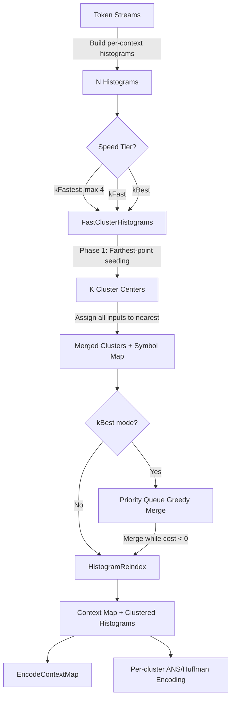
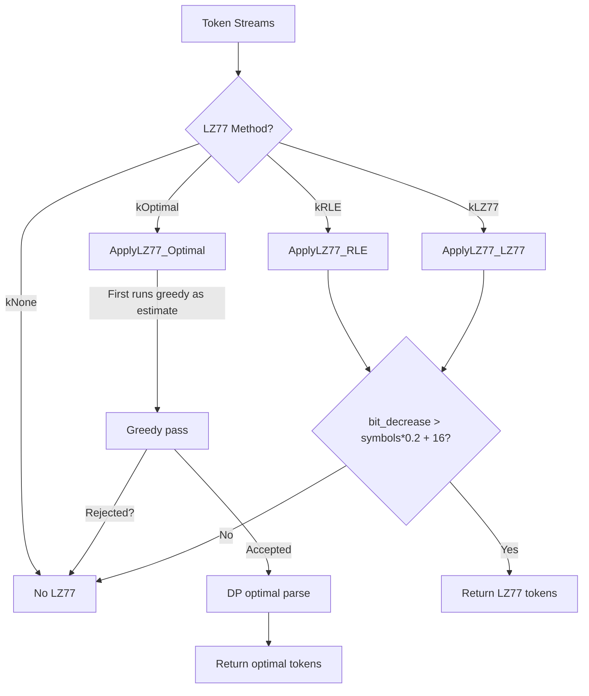
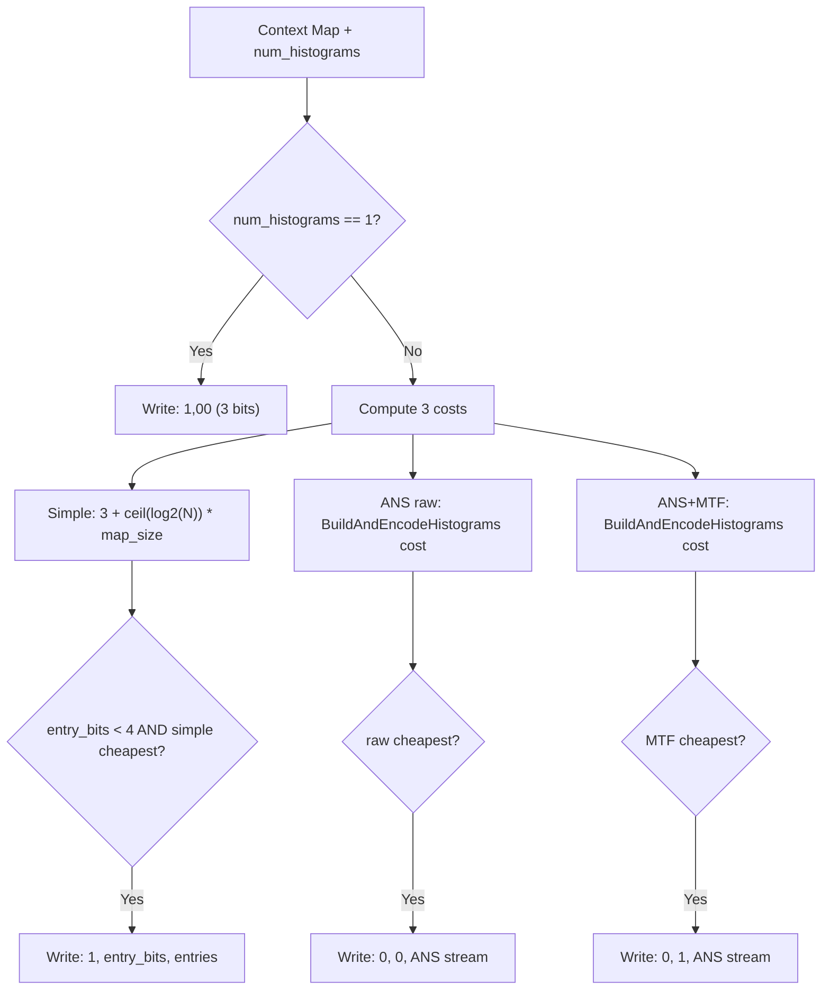

# Histogram Clustering, Context Maps, and LZ77

## Source Files

- `lib/jxl/enc_cluster.h` (27 lines) -- `ClusterHistograms()` public interface
- `lib/jxl/enc_cluster.cc` (372 lines) -- Two-phase clustering: fast k-means seed selection + greedy merge refinement. SIMD-accelerated entropy and distance computations via Highway.
- `lib/jxl/enc_context_map.h` (36 lines) -- `EncodeContextMap()` and `EncodeBlockCtxMap()` interfaces. Defines `kClustersLimit = 128`.
- `lib/jxl/enc_context_map.cc` (175 lines) -- Three-way encoding strategy for context maps: simple fixed-width, ANS-coded raw, ANS-coded with Move-to-Front transform. Compares costs and selects cheapest.
- `lib/jxl/dec_context_map.h` (30 lines) -- `DecodeContextMap()` interface
- `lib/jxl/dec_context_map.cc` (97 lines) -- Decode: simple fixed-width or ANS-coded with optional inverse MTF. Validates completeness.
- `lib/jxl/enc_lz77.h` (27 lines) -- `ApplyLZ77()` interface
- `lib/jxl/enc_lz77.cc` (713 lines) -- Three LZ77 strategies (RLE, greedy LZ77, optimal LZ77). Hash chain implementation with zero-run optimization. Two cost models: static table-based and entropy-estimated.
- `lib/jxl/entropy_coder.h` (49 lines) -- `PredictFromTopAndLeft`, DC/QF threshold distributions, `DecodeBlockCtxMap`
- `lib/jxl/entropy_coder.cc` (66 lines) -- `DecodeBlockCtxMap` implementation
- `lib/jxl/ac_context.h` (154 lines) -- `BlockCtxMap` struct, `ZeroDensityContext` function, pre-clustering tables `kCoeffFreqContext` and `kCoeffNumNonzeroContext`
- `lib/jxl/enc_ans_params.h` (185 lines) -- `HistogramParams` configuration, `Histogram` struct with `ANSPopulationCost()`, speed-tier defaults
- `lib/jxl/enc_ans.h` (161 lines) -- `Token` struct, `EntropyEncodingData`, `BuildAndEncodeHistograms` interface
- `lib/jxl/enc_ans.cc` (relevant sections) -- `BuildAndEncodeHistograms` orchestrator, `BuildAndStoreEntropyCodes` calling `ClusterHistograms` then `EncodeContextMap`

## Key Types

### `Histogram` (struct, `enc_ans_params.h:105`)

Core frequency-count container used throughout entropy coding.

**Fields:**
```cpp
std::vector<ANSHistBin> counts;   // per-symbol counts (ANSHistBin = int32_t)
size_t total_count = 0;           // sum of all counts
mutable float entropy = 0;        // cached Shannon entropy (NOT auto-updated)
static constexpr size_t kRounding = 8;  // counts.size() always multiple of 8 (SIMD alignment)
```

The `kRounding = 8` alignment allows Highway SIMD loads of 8x int32_t (256-bit AVX2 or equivalent) without tail handling. All `resize()` calls go through `DivCeil(n, kRounding) * kRounding`.

**Key methods:**
- `Add(symbol)` -- increment `counts[symbol]`, auto-resize with rounding
- `FastAdd(symbol)` -- no bounds check, caller must `EnsureCapacity()` first
- `Condition()` -- SIMD: compute `total_count` and trim trailing zeros (trims to last non-zero lane boundary)
- `ShannonEntropy()` -- SIMD: compute and cache `entropy` field
- `AddHistogram(other)` -- element-wise merge, resize if needed
- `ANSPopulationCost()` -- estimate actual encoding cost (header + data) via normalized ANS histogram with fast strategy

### `HistogramParams` (struct, `enc_ans_params.h:30`)

Configuration for the entire entropy coding pipeline. Set from speed tier:

| Speed Tier     | `clustering`   | `lz77_method` | `uint_method` | `ans_histogram_strategy` |
|----------------|----------------|---------------|---------------|--------------------------|
| > Falcon       | `kFastest` (max 4 clusters) | `kNone`  | `kNone`  | default (kPrecise) |
| Falcon..Tortoise | `kFast`     | `kRLE` (default) | `kNone` | `kApproximate` (>= Squirrel) |
| <= Tortoise    | `kBest`        | `kRLE` (default) | `kBest` | `kPrecise` |

**Important fields:**
- `max_histograms = ~0` (size_t max) -- overridden per call in `BuildAndStoreEntropyCodes` to `kClustersLimit = 128`
- `force_huffman = false` -- when true, symbol costs are ceil'd to integer bits
- `image_widths` -- per-stream image widths for LZ77 distance multiplier
- `streaming_mode`, `add_fixed_histograms`, `add_missing_symbols` -- special modes

### `Token` (struct, `enc_ans.h:82`)

A single symbol to be entropy-coded:
```cpp
uint32_t is_lz77_length : 1;  // if true, value is an LZ77 length
uint32_t context : 31;         // which context this symbol belongs to
uint32_t value;                // the symbol value (before hybrid-uint encoding)
```

### `BlockCtxMap` (struct, `ac_context.h:85`)

Maps (channel, transform order, quantization field, DC value) to a context ID for AC coefficient coding.

**Fields:**
```cpp
std::vector<int> dc_thresholds[3];    // per-channel DC thresholds (up to 15 each)
std::vector<uint32_t> qf_thresholds;  // quantization field thresholds (up to 15)
std::vector<uint8_t> ctx_map;         // the actual context map
size_t num_ctxs;                      // number of distinct context IDs
size_t num_dc_ctxs;                   // product of (dc_thresholds[c].size()+1) for c in 0..2
```

**Default context map** (`kDefaultCtxMap`, 39 entries = 3 channels x 13 orders):
```
Row 0 (Y):  0  1  2  2  3  3  4  5  6  6  6  6  6
Row 1 (X):  7  8  9  9 10 11 12 13 14 14 14 14 14
Row 2 (B):  7  8  9  9 10 11 12 13 14 14 14 14 14
```
15 distinct context IDs (0..14). X and B channels share the same mapping. Large transforms (orders 9-12, corresponding to 64x64+) are grouped into context 6 (Y) / 14 (X,B).

**Context computation** (`BlockCtxMap::Context`, `ac_context.h:101`):
```
idx = (c < 2 ? c ^ 1 : 2)                    // channel: swap Y/X, B stays 2
idx = idx * kNumOrders + ord                   // 13 transform orders
idx = idx * (qf_thresholds.size() + 1) + qf_idx  // QF bucket
idx = idx * num_dc_ctxs + dc_idx              // DC bucket
return ctx_map[idx]
```

Maximum `ctx_map` size = `3 * 13 * num_dc_ctxs * (qf_thresholds.size() + 1)`, capped at `num_dc_ctxs * (qf_thresholds+1) <= 64` and `num_ctxs <= 16`.

## Constants

### Clustering Thresholds

| Constant | Value | Location | Purpose |
|----------|-------|----------|---------|
| `kMinDistanceForDistinct` | `48.0f` | `enc_cluster.cc:174` | Minimum Jensen-Shannon distance to justify a new cluster center |
| `kClustersLimit` | `128` | `enc_context_map.h:24` | Max number of output histograms (clusters) |
| `kMaxClusters` | `256` | `dec_context_map.cc:25` | Decoder's max cluster count (uint8_t range) |
| `kInfinity` | `float::infinity()` | `enc_cluster.cc:106` | Cost for impossible KL-divergence (zero coding count for nonzero actual) |
| `ANS_LOG_TAB_SIZE` | `12` | `ans_params.h:18` | Used as max possible per-symbol cost in `SymbolCostEstimator` |
| `Histogram::kRounding` | `8` | `enc_ans_params.h:180` | SIMD lane count for histogram vectors |

### LZ77 Constants

| Constant | Value | Location | Purpose |
|----------|-------|----------|---------|
| `kWindowSize` | `1 << 20` (1M) | `dec_ans.h:122` | Maximum LZ77 back-reference distance |
| `kNumSpecialDistances` | `120` | `dec_ans.h:123` | Number of 2D special distance codes (from WebP lossless) |
| `maxchainlength` | `256` | `enc_lz77.cc:213` | Max hash chain walk length per position |
| `max_lazy_match_len` | `256` | `enc_lz77.cc:494` | Lazy matching threshold (greedy LZ77) |
| `hash_num_values_` | `32768` | `enc_lz77.cc:190` | Hash table size (2^15) |
| `hash_shift_` | `5` | `enc_lz77.cc:192` | Bits per value in hash computation |
| Acceptance threshold | `bit_decrease > total_symbols * 0.2 + 16` | `enc_lz77.cc:179,554` | LZ77 only accepted if saves >20% of symbols + 16 bits |
| `lz77.min_symbol` | `224` (ANS) or `512` (Huffman) | `enc_ans.cc:1090` | First symbol ID reserved for LZ77 lengths |

### AC Context Pre-Clustering Tables

`kCoeffFreqContext[64]` maps scan position `k` (1..63) to 31 frequency-context buckets:
- k=1: bucket 0, k=2: bucket 1, ..., k=15: bucket 14
- k=16..17: bucket 15, k=18..19: bucket 16, ...
- k=48..63: buckets 28..30 (groups of 4)

`kCoeffNumNonzeroContext[64]` maps remaining nonzeros count to offset:
- 1: offset 0, 2: offset 31, 3..4: offset 62, 5..8: offset 93, 9..12: offset 123, 13..20: offset 152, 21..32: offset 180, 33..63: offset 206

Combined context = `(kCoeffNumNonzeroContext[nz_left] + kCoeffFreqContext[k]) * 2 + prev`

where `prev` is 0 or 1 (previous coefficient nonzero flag), giving `kZeroDensityContextCount = 458` possible contexts for k+nz_left < 64 and `kZeroDensityContextLimit = 474` total.

### NonZero Context Mapping

`BlockCtxMap::NonZeroContext(non_zeros, block_ctx)` maps the number of nonzero coefficients in a block to a context:
```
if non_zeros >= 64: non_zeros = 64
if non_zeros < 8:   ctx = non_zeros         (8 buckets: 0,1,2,3,4,5,6,7)
else:               ctx = 4 + non_zeros/2   (from 8: 8,9,...,36)
return ctx * num_ctxs + block_ctx
```
Total nonzero buckets: `kNonZeroBuckets = 37`.

Total AC contexts per block context map: `num_ctxs * (kNonZeroBuckets + kZeroDensityContextCount)` = `num_ctxs * (37 + 458)` = `num_ctxs * 495` (with default 15 ctxs: 7425 total contexts).

## Cost Functions & Decision Trees

### Shannon Entropy (SIMD)

**`HistogramEntropy`** (`enc_cluster.cc:64`):
```
H(a) = -sum_i( count[i] * log2(count[i] / total) )
     = -sum_i( count[i] * log2(count[i] * inv_total) )
```
Uses `FastLog2f` (polynomial approximation via Highway SIMD). Special case: if `count[i] == total` (single-symbol alphabet), contribution is 0 (not `-total * log2(1)` which is also 0, but avoids the log call). Stored in `a.entropy`.

### Jensen-Shannon Distance

**`HistogramDistance`** (`enc_cluster.cc:83`):

This is the core merge-cost metric for clustering. It computes the cost increase from merging two histograms vs. coding them separately:

```
D(a, b) = H(a+b) - H(a) - H(b)
```

where `H(a+b)` is the Shannon entropy of the merged histogram. This is equivalent to the Jensen-Shannon divergence (scaled by total count).

**Properties:**
- Always >= 0 (merging never decreases entropy)
- Returns 0 if either histogram is empty
- Symmetric: `D(a,b) == D(b,a)`
- Computed as: iterate over `max(a.counts.size(), b.counts.size())`, sum `Entropy(a_i + b_i, 1/total_ab, total_ab)`, subtract pre-computed `a.entropy` and `b.entropy`

**SIMD implementation:** Processes 8 int32_t counts per iteration (256-bit), converts to float, computes `Entropy()` per lane, accumulates via `SumOfLanes`.

### KL Divergence (Asymmetric)

**`HistogramKLDivergence`** (`enc_cluster.cc:108`):

Cost of encoding data distributed as `actual` using the code designed for `coding`:

```
KL(actual || coding) = sum_i( actual[i] * log2(actual[i]/actual_total) )
                      - sum_i( actual[i] * log2(coding[i]/coding_total) )
                     = -H(actual) + sum_i( actual[i] * (-log2(coding[i]/coding_total)) )
```

Returned as `total_cross_entropy_cost - actual.entropy`.

**Special cases:**
- If `actual` is empty: return 0
- If `coding` is empty: return infinity
- If `coding[i] == 0` but `actual[i] != 0`: that term contributes `-infinity` cost (set via `Set(df, -kInfinity)`) making total cost infinite -- correctly penalizes impossible encodings
- If `actual[i] == 0`: that term contributes 0 regardless of `coding[i]`

**Usage:** Only used when assigning input histograms to pre-existing (fixed) cluster centers during the seed-selection phase. Pre-existing histograms (from `prev_histograms`) are treated as fixed coding distributions that cannot be merged into.

### ANS Population Cost

**`Histogram::ANSPopulationCost()`** (`enc_ans.cc:619`):

More accurate cost estimate than Shannon entropy. Computes `ANSEncodingHistogram::ComputeBest` with `kFast` strategy, then returns `normalized.Cost()`. This accounts for:
- Actual ANS table normalization to `ANS_TAB_SIZE = 4096`
- Rounding of fractional probabilities
- Header overhead for encoding the histogram itself

Used in the `kBest` clustering mode for merge decisions instead of Shannon entropy.

### SymbolCostEstimator (LZ77)

**`SymbolCostEstimator`** (`enc_lz77.cc:42`):

Estimates per-symbol encoding costs from existing histograms. Built from the un-LZ77'd token streams.

**Construction:**
1. Build histograms for each context from token streams (encoding values through `HybridUintConfig`)
2. For each context `i`, for each symbol `j`:
   - If `cnt != 0` and `cnt != total`: `cost = -FastLog2f(cnt * inv_total)` (bits to encode symbol)
   - If Huffman forced: `cost = ceil(cost)` (integer bit lengths)
   - If `cnt == 0`: `cost = ANS_LOG_TAB_SIZE` (12.0 bits -- worst case)
3. Store costs in flat 2D array `bits_[ctx * max_alphabet_size + sym]`
4. Compute per-context `add_symbol_cost_[i] = max(0, 6.0 - average_bits_per_symbol)`

The `add_symbol_cost_` penalizes inserting LZ77 references into low-entropy contexts. If a context averages 1 bit/symbol, the penalty is 5.0 bits. If it averages >= 6 bits/symbol, the penalty is 0. This prevents LZ77 from polluting compact distributions.

**Cost functions:**
- `Bits(ctx, sym)` -- direct table lookup
- `LenCost(ctx, len, lz77)` -- encode `len` through `lz77.length_uint_config`, return `nbits + Bits(ctx, tok + min_symbol)`
- `DistCost(dist, lz77)` -- encode distance through default `HybridUintConfig(4,2,0)`, look up in distance context

### Static LZ77 Cost Tables

For the greedy/optimal LZ77 modes, two hardcoded cost tables provide estimates without building histograms:

**`LenCost(len)`** (`enc_lz77.cc:378`): Uses `HybridUintConfig(1, 0, 0)` and a 17-entry table:
```
kCostTable = {2.80, 3.21, 2.57, 2.41, 2.83, 3.39, 4.03, 4.42, 4.51,
              9.21, 10.02, 11.86, 12.46, 11.71, 12.56, 13.78, 13.17}
```
Returns `kCostTable[min(tok, 16)] + nbits`. Short lengths (tokens 0-8) cost 2.4-4.5 bits; long lengths (tokens 9+) cost 9-14 bits.

**`DistCost(dist)`** (`enc_lz77.cc:396`): Uses `HybridUintConfig(7, 0, 0)` and a 131-entry table. Notable features:
- Very small distances (0-7) have variable costs 2.4-8.3 bits
- Special distances (last 11 entries, tokens 120-130) cost 2.4-9.7 bits -- much cheaper than regular distances
- Mid-range distances cost 10-12 bits
- The table does NOT account for distance multiplier usage (noted as TODO)

### LZ77 Acceptance Threshold

All three LZ77 modes (RLE, greedy, optimal) use the same acceptance test:

```cpp
if (bit_decrease > total_symbols * 0.2 + 16) {
    return tokens_lz77;  // accept LZ77
}
return {};  // reject -- no benefit
```

LZ77 is only accepted if it saves more than 0.2 bits per symbol on average, plus a 16-bit fixed overhead. If rejected, the original un-compressed tokens are used.

## Algorithm Details

### Phase 1: Fast Cluster Seeding (`FastClusterHistograms`)

A greedy farthest-point seeding algorithm (variant of k-means++ initialization):

```
1. Compute entropy for all input histograms
2. Find largest histogram by total_count -> first seed candidate

3. If prev_histograms > 0 (pre-existing fixed clusters):
   a. Compute KL-divergence from each input to nearest pre-existing cluster
   b. Pick input with maximum KL-divergence as first new seed

4. While num_clusters < max_histograms:
   a. Add current largest_idx as new cluster center
   b. For each unassigned input i:
      - dist[i] = min(dist[i], HistogramDistance(in[i], new_center))
      - Track which input has maximum distance
   c. If max_distance < kMinDistanceForDistinct (48.0): STOP (remaining are close enough)

5. Assign all remaining inputs to nearest cluster:
   - For pre-existing clusters: use KL-divergence (asymmetric -- they're fixed distributions)
   - For new clusters: use Jensen-Shannon distance (symmetric -- they can be modified)
   - If assigned to new cluster: merge input into it, recompute entropy
```

The `kMinDistanceForDistinct = 48.0` threshold in Jensen-Shannon distance bits corresponds roughly to 48 bits of wasted coding if two distributions were merged. This prevents creating clusters that are nearly identical.

### Phase 2: Greedy Merge Refinement (`ClusterHistograms`, kBest mode only)

After Phase 1, a priority-queue based greedy merge reduces cluster count further:

```
1. Compute ANSPopulationCost for each cluster (more accurate than Shannon)

2. For all pairs (i, j):
   a. Create merged histogram = cluster[i] + cluster[j]
   b. merge_cost = ANSPopulationCost(merged) - cluster[i].entropy - cluster[j].entropy
   c. If merge_cost < 0: push (merge_cost, i, j, version) onto priority queue

3. While priority queue non-empty:
   a. Pop lowest-cost pair (best merge)
   b. Validate version (skip if either cluster was modified/deleted since enqueue)
   c. Merge cluster[second] into cluster[first]
   d. Recompute ANSPopulationCost for cluster[first]
   e. Mark cluster[second] as dead (version = 0)
   f. Increment version for cluster[first]
   g. For all other live clusters j:
      - Compute potential merge cost with updated cluster[first]
      - If beneficial (cost < 0): push new pair

4. Compact: remove dead clusters, update symbol assignments via renumbering table
```

**Version tracking:** Each cluster has a version number. A pair `(i, j, v)` is valid only if `v == max(version[i], version[j])`. This lazy-deletion scheme avoids removing stale entries from the priority queue -- they're simply skipped when popped.

**Cost metric:** Uses `ANSPopulationCost()` instead of Shannon entropy. This accounts for the actual cost of encoding the histogram description itself (header bits for the probability table), not just the data bits. This makes the merge decision more accurate for small histograms where header overhead dominates.

### Phase 3: Reindexing (`HistogramReindex`)

After clustering, histogram indices in `histogram_symbols` may be sparse/unordered. Reindexing assigns consecutive indices starting from `prev_histograms`:

```
1. Pre-existing histograms keep indices 0..prev_histograms-1
2. Scan histogram_symbols left-to-right
3. First occurrence of each new symbol gets next consecutive index
4. All occurrences updated to new index
```

This ensures the context map uses contiguous indices, required by the bitstream format.

### Context Map Encoding (`EncodeContextMap`)

Three encoding strategies, cheapest wins:

**Strategy 1: Trivial (num_histograms == 1)**
- Write `1` bit (is_simple=1), then `00` (0 bits per entry)
- Total: 3 bits

**Strategy 2: Simple fixed-width**
- `entry_bits = ceil(log2(num_histograms))`
- Cost: `3 + entry_bits * context_map.size()` bits
- Only considered if `entry_bits < 4` (i.e., <= 8 histograms)

**Strategy 3: ANS-coded (with or without MTF)**

Both raw and Move-to-Front transformed versions are trial-encoded:
1. `MoveToFrontTransform(context_map)`: for each entry, output its index in an MTF list (recently-used symbols get small indices)
2. Build histograms and compute `BuildAndEncodeHistograms` cost for both raw and MTF versions
3. Use whichever is cheaper (or simple fixed-width if both are more expensive)

Signaling: bit 0 = is_simple. If is_simple=1: bits 1-2 = entry_bits, then `entry_bits` per entry. If is_simple=0: bit 1 = use_mtf, then ANS-coded stream.

### Block Context Map Encoding (`EncodeBlockCtxMap`)

Signals DC thresholds (per channel), QF thresholds, then the context map itself:

```
1. Write 1 bit: is_default
2. If default (matches kDefaultCtxMap exactly): done
3. Otherwise:
   a. For each channel c in {0,1,2}:
      - 4 bits: count of DC thresholds
      - For each threshold: U32-coded packed-signed value
   b. 4 bits: count of QF thresholds
   c. For each QF threshold: U32-coded (value - 1)
   d. EncodeContextMap(ctx_map, num_ctxs, ...)
```

### LZ77 Strategy: RLE (`ApplyLZ77_RLE`)

Simple run-length encoding of repeated values:

```
For each position i in stream:
  Count consecutive copies of in[i-1].value starting at in[i]
  If num_copies >= lz77.min_length:
    raw_cost = cumulative symbol cost over the run
    lz77_cost = CeilLog2Nonzero(lz77_len + 1) + 1  // simple estimate
    If lz77_cost < raw_cost:
      Emit LZ77 length token (in context of last symbol)
      Emit distance token (distance_symbol = 0 or 1)
      // 0 = raw distance 1, 1 = special distance 1 (if distance_multiplier != 0)
```

RLE cost model is crude: just `ceil(log2(len+1)) + 1` bits. No histogram-based estimation.

### LZ77 Strategy: Greedy (`ApplyLZ77_LZ77`)

Full backward-reference LZ77 with hash chains:

```
1. Build SymbolCostEstimator from original token streams
2. Compute cumulative bit costs per symbol position
3. For each position:
   a. Update hash chain
   b. FindMatch: walk hash chain (max 256 steps), find longest match
   c. If match found and len >= min_length:
      - Lazy matching: also try match at position i+1
        If longer match at i+1: emit literal for position i, use i+1's match
      - raw_cost = cumulative cost of symbols being replaced
      - lz77_cost = LenCost(lz77_len) + DistCost(dist_symbol) + AddSymbolCost(ctx)
      - If lz77_cost <= raw_cost: emit LZ77 reference
        Else: emit all literals
```

**Hash chain** (`HashChain` struct):
- Hash function: XOR of 3 consecutive values with shift=5: `data[pos] ^ (data[pos+1] << 5) ^ (data[pos+2] << 10)`, masked to 15 bits
- Separate zero chain: positions with N consecutive zeros are chained by zero-run length, enabling O(1) skipping of zero-heavy regions
- Window is power-of-two, up to `kWindowSize = 1M`
- `FindMatches` walks the chain, skipping entries where hash values don't match (stale chain entries) or where distance decreased (circular buffer wraparound)

**Match reporting:** `FindMatches` calls a callback for every match found with `len >= min_length && len + 2 >= best_len`. The `+2` slack allows slightly shorter matches with cheaper distance symbols to be reported.

**Special distances:** The 120 WebP lossless special distance codes encode 2D offsets relative to `distance_multiplier` (typically image width). `SpecialDistance(index, multiplier) = kSpecialDistances[index][0] + multiplier * kSpecialDistances[index][1]`. These encode small 2D displacements cheaply (e.g., "1 row up" = distance_multiplier, "1 row up, 1 left" = distance_multiplier - 1).

### LZ77 Strategy: Optimal (`ApplyLZ77_Optimal`)

Dynamic-programming optimal parsing:

```
1. First run greedy LZ77 as cost-estimation pass
   - If greedy LZ77 rejects (no benefit): skip optimal too
2. Build SymbolCostEstimator from greedy LZ77 output (num_contexts + 1)
3. DP: prefix_costs[i] = minimum cost to encode first i symbols
   For each position i:
     a. Literal: prefix_costs[i+1] = min(prefix_costs[i+1], prefix_costs[i] + literal_cost)
     b. For each match length j found at position i:
        - lz77_cost = sce.LenCost(ctx, j-min_length, lz77) + sce.DistCost(dist_symbol, lz77)
        - prefix_costs[i+j] = min(prefix_costs[i+j], prefix_costs[i] + lz77_cost)
     c. For each length, keep minimum distance symbol (pre-sweep backward to propagate best)
4. RLE skip optimization:
   - If current position is in a long RLE run (>= 8 positions, match > 9 symbols):
     Skip middle of run (only process first 8 and last 8 positions)
   - Prevents quadratic cost on long constant runs
5. Traceback: walk prefix_costs[] backward from end, reconstruct token sequence
   - Reverse output (built back-to-front)
```

The optimal parser uses the SymbolCostEstimator built from the greedy pass output, meaning it has more accurate cost estimates than the greedy pass (which uses static tables). However, the cost model is still approximate since it doesn't account for how LZ77 decisions change the histogram.

## Full Pipeline: BuildAndEncodeHistograms

The orchestration in `enc_ans.cc:1082` ties everything together:

```
BuildAndEncodeHistograms(params, num_contexts, tokens, codes, writer):
  1. Set LZ77 parameters:
     - nonserialized_distance_context = num_contexts (last context)
     - min_symbol = 224 (ANS) or 512 (Huffman)
  2. ApplyLZ77(params, num_contexts, tokens, lz77)
     - If beneficial: enable LZ77, replace tokens, num_contexts += 1
  3. Write LZ77 parameters to bitstream
  4. Build per-context histograms from token streams
     (applying HybridUintConfig encoding to values)
  5. Decide ANS vs Huffman:
     - Huffman if: force_huffman, < 100 tokens, kFastest clustering, or all singletons
  6. BuildAndStoreEntropyCodes:
     a. ClusterHistograms(params, builder, kClustersLimit, &clustered, &symbols)
     b. EncodeContextMap(context_map, num_clusters, writer)
     c. ChooseUintConfigs (per-cluster HybridUintConfig optimization)
     d. For each cluster: BuildAndStoreANSEncodingData or Huffman encoding
  7. Return total cost estimate
```

## Dependencies

- **Highway SIMD** (`hwy/highway.h`, `fast_math-inl.h`) -- `FastLog2f`, SIMD entropy computation, lane operations
- **ANS common** (`ans_common.h`, `ans_params.h`) -- `ANS_LOG_TAB_SIZE`, `ANS_TAB_SIZE`, `CreateFlatHistogram`
- **Hybrid integers** (`dec_ans.h: HybridUintConfig`) -- Token encoding (value -> tok + nbits + bits)
- **LZ77 params** (`dec_ans.h: LZ77Params`) -- Serialized LZ77 configuration (enabled, min_symbol, min_length)
- **Bit I/O** (`enc_bit_writer.h`, `dec_bit_reader.h`) -- Reading/writing context maps and histograms

## Mermaid Diagram Data

### Histogram Clustering Pipeline



### LZ77 Decision Flow



### Context Map Encoding Decision



## Open Questions

1. The `kMinDistanceForDistinct = 48.0` threshold in `FastClusterHistograms` -- how was this calibrated? It's in units of Jensen-Shannon divergence bits but the significance for compression quality is unclear.

2. The static `LenCost` and `DistCost` tables in `enc_lz77.cc` appear to be learned/tuned values. Where do these come from? They're not documented. The 131-entry distance cost table in particular has irregular patterns suggesting empirical training.

3. The `AddSymbolCost` penalty (`max(0, 6.0 - avg_bits)`) for LZ77 injection into low-entropy contexts: the threshold of 6.0 bits and the linear penalty shape seem ad-hoc. What's the justification?

4. `FastClusterHistograms` uses Jensen-Shannon distance for seeding but KL-divergence for pre-existing histograms. The asymmetry is intentional (pre-existing can't be modified), but the two metrics are not directly comparable -- could this cause suboptimal assignments near the boundary?

5. The optimal LZ77 parser uses greedy LZ77 output to build its cost model. This creates a chicken-and-egg problem: the cost model may be inaccurate for the decisions the optimal parser makes. An iterative approach (re-estimate costs from optimal output, re-parse) is not attempted.

6. The `ZeroDensityContext` pre-clustering comment (`ac_context.h:60-62`) notes that disabling pre-clustering makes entropy coding less dense, which is counterintuitive. The 458 pre-clustered contexts vs. the theoretical 2016 (64*63/2) -- what's the compression loss from this reduction?
