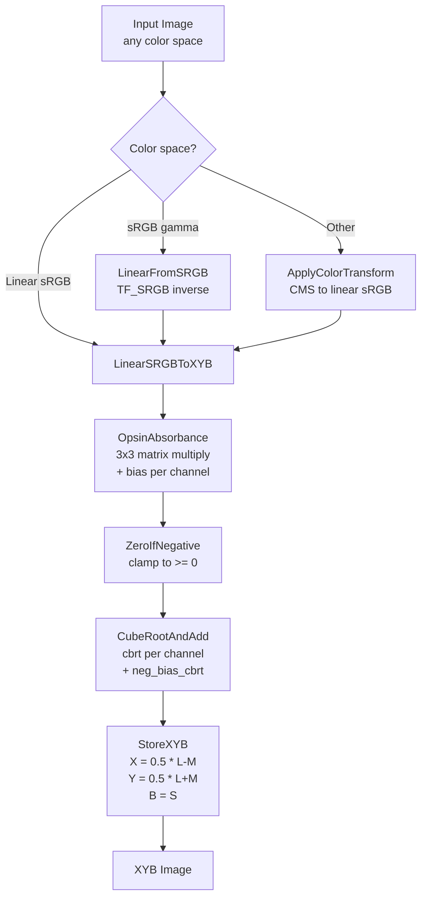
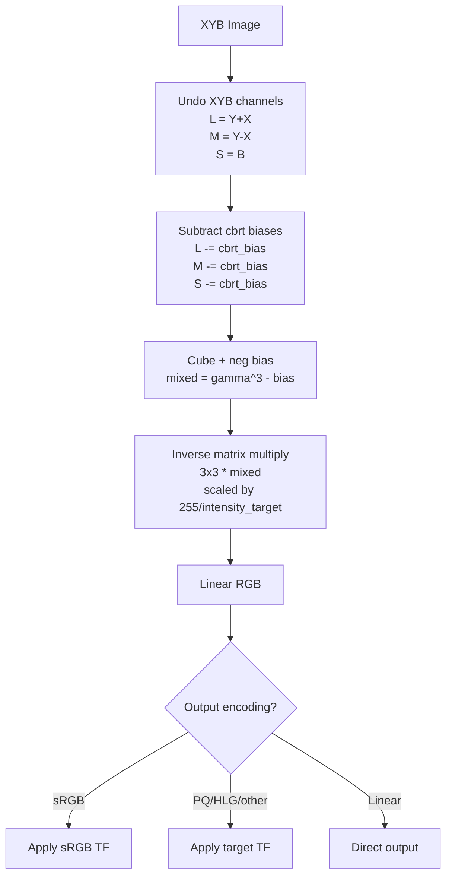
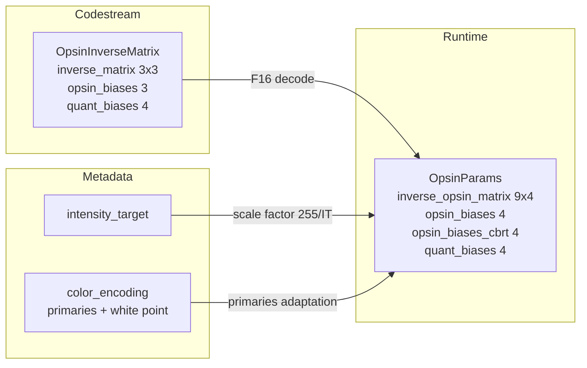

# XYB Color Space

## Source Files

- `lib/jxl/cms/opsin_params.h` (all) — all XYB constants: opsin absorbance matrix, bias values, inverse matrix, scaling/offset constants, color cube helpers
- `lib/jxl/opsin_params.h` (all) — public header exposing `GetOpsinAbsorbanceInverseMatrix()` and `InitSIMDInverseMatrix()`
- `lib/jxl/opsin_params.cc` (all) — implementation of inverse matrix retrieval and SIMD inverse matrix initialization
- `lib/jxl/enc_xyb.h` (all) — encoder-side XYB API: `ToXYB()`, `LinearRGBRowToXYB()`, `ComputePremulAbsorb()`, `ScaleXYB()`, `RgbToYcbcr()`
- `lib/jxl/enc_xyb.cc` (all) — encoder-side XYB implementation with Highway SIMD; opsin absorbance, cube root, XYB channel formation, sRGB/linear paths
- `lib/jxl/dec_xyb.h` (all) — decoder-side XYB API: `OpsinParams` struct, `OutputEncodingInfo` struct, `OpsinToLinear()`
- `lib/jxl/dec_xyb-inl.h` (all) — decoder-side XYB-to-RGB inverse transform (Highway inline); NEON fast path for XYB-to-sRGB8
- `lib/jxl/dec_xyb.cc` (all) — decoder-side implementation: `OpsinParams::Init()`, `OutputEncodingInfo::SetColorEncoding()`, fast path dispatch
- `lib/jxl/color_encoding_internal.h` (all) — `ColorEncoding` struct: color space metadata, transfer functions, primaries, white point, `ColorSpaceTransform`
- `lib/jxl/render_pipeline/stage_xyb.cc` (all) — render pipeline stage: applies `XybToRgb` or scaled XYB output per-row
- `lib/jxl/base/fast_math-inl.h` (lines 175-214) — `CubeRootAndAdd()`: fast SIMD cube root via Newton-Raphson
- `lib/jxl/quantizer.h` (lines 50-57) — `kDefaultQuantBias` values
- `lib/jxl/image_metadata.h` (lines 135-146) — `OpsinInverseMatrix` struct (serialized in codestream)
- `lib/jxl/image_metadata.cc` (lines 358-382) — `OpsinInverseMatrix::VisitFields()` serialization with F16 defaults
- `lib/jxl/base/common.h` (line 61) — `kDefaultIntensityTarget = 255`

## Key Types

### `OpsinParams` (dec_xyb.h:28-34)
Decoder-side parameters for XYB-to-linear-RGB conversion:
```cpp
struct OpsinParams {
  float inverse_opsin_matrix[9 * 4];  // 3x3 matrix, each entry broadcast to 4 lanes
  float opsin_biases[4];              // negative absorbance biases + 1.0 padding
  float opsin_biases_cbrt[4];         // cbrt of opsin_biases
  float quant_biases[4];              // quantization biases per channel + numerator
  void Init(float intensity_target);
};
```

### `OutputEncodingInfo` (dec_xyb.h:36-76)
Comprehensive decoder output configuration:
- `orig_color_encoding`, `orig_intensity_target`, `orig_inverse_matrix` — from image metadata
- `color_encoding`, `linear_color_encoding` — requested output encoding
- `opsin_params` — the actual inverse transform parameters, possibly adapted to non-sRGB output primaries
- `luminances` — primaries' luminance weights (default sRGB: {0.2126, 0.7152, 0.0722})
- `inverse_gamma` — for Gamma/DCI transfer functions

### `OpsinInverseMatrix` (image_metadata.h:135-146)
Serialized in the JPEG XL codestream (F16 encoded). Contains:
- `inverse_matrix` — 3x3 opsin absorbance inverse matrix
- `opsin_biases[3]` — the negative bias values
- `quant_biases[4]` — quantization biases

### `ColorEncoding` (color_encoding_internal.h:122-294)
Color space description: color space enum (RGB, Gray, XYB, Unknown), white point, primaries, transfer function, rendering intent, ICC profile.

### `ColorSpaceTransform` (color_encoding_internal.h:306-361)
Wraps `JxlCmsInterface` for arbitrary color space conversions between ICC profiles.

## Constants (EXACT values from source)

### Opsin Absorbance Matrix (`lib/jxl/cms/opsin_params.h`)

Individual coefficients:
```
kM00 = 0.30f
kM01 = 1.0f - kM02 - kM00   (= 0.622f)
kM02 = 0.078f

kM10 = 0.23f
kM11 = 1.0f - kM12 - kM10   (= 0.692f)
kM12 = 0.078f

kM20 = 0.24342268924547819f
kM21 = 0.20476744424496821f
kM22 = 1.0f - kM20 - kM21   (= 0.55180986650955765f)
```

As matrix:
```
kOpsinAbsorbanceMatrix = {
  {0.30,                  0.622,                 0.078               },
  {0.23,                  0.692,                 0.078               },
  {0.24342268924547819,   0.20476744424496821,   0.55180986650955765 }
}
```

Each row sums to 1.0. Row 0 and row 1 have identical blue coefficients (0.078). The matrix is described as "frozen" in the source.

### Opsin Absorbance Bias

```
kOpsinAbsorbanceBias0 = 0.0037930732552754493f
kOpsinAbsorbanceBias1 = kOpsinAbsorbanceBias0   (= 0.0037930732552754493f)
kOpsinAbsorbanceBias2 = kOpsinAbsorbanceBias0   (= 0.0037930732552754493f)
```

All three channels use the same bias value.

```
kNegOpsinAbsorbanceBiasRGB = {-0.0037930732552754493f, -0.0037930732552754493f, -0.0037930732552754493f, 1.0f}
```

### Default Inverse Opsin Absorbance Matrix

```
kDefaultInverseOpsinAbsorbanceMatrix = {
  { 11.031566901960783f,  -9.866943921568629f,   -0.16462299647058826f},
  { -3.254147380392157f,   4.418770392156863f,   -0.16462299647058826f},
  { -3.6588512862745097f,  2.7129230470588235f,   1.9459282392156863f }
}
```

### B-Channel Scaling Constants

```
kBScale = 1.0f
kYToBRatio = 1.0f    // comment: "works better with 0.50017729543783418"
kBToYRatio = 1.0f / kYToBRatio   (= 1.0f)
```

### Scaled XYB Offset and Scale (for [0,1] normalization)

```
kScaledXYBOffset = {0.015386134f, 0.0f, 0.27770459f}
kScaledXYBScale  = {22.995788804f, 1.183000077f, 1.502141333f}
```

### Derived XYB Offset and Scale

```
kXYBOffset0 = kScaledXYBOffset0 + kScaledXYBOffset1                                    (= 0.015386134f)
kXYBOffset1 = kScaledXYBOffset1 - kScaledXYBOffset0 + (1.0f / kScaledXYBScale0)        (= ~0.028104f)
kXYBOffset2 = kScaledXYBOffset1 + kScaledXYBOffset2                                    (= 0.27770459f)

kXYBScale0 = ReciprocialSum(kScaledXYBScale0, kScaledXYBScale1)  = (s0*s1)/(s0+s1)
kXYBScale1 = ReciprocialSum(kScaledXYBScale0, kScaledXYBScale1)  = same as kXYBScale0
kXYBScale2 = ReciprocialSum(kScaledXYBScale1, kScaledXYBScale2)  = (s1*s2)/(s1+s2)
```

### Default Intensity Target

```
kDefaultIntensityTarget = 255   (lib/jxl/base/common.h:61)
```

### Quantization Biases

```
kDefaultQuantBias = {
  1.0f - 0.05465007330715401f,    // X channel: 0.94534992669284599
  1.0f - 0.07005449891748593f,    // Y channel: 0.92994550108251407
  1.0f - 0.049935103337343655f,   // B channel: 0.950064896662656345
  0.145f                          // numerator (kBiasNumerator)
}
```

### NEON Fast Path Constants (dec_xyb-inl.h)

```
neg_bias16      = -124    // -0.0037930732552754493 in Q15 ≈ -124/32768
neg_bias_cbrt16 = -5110   // -cbrt(0.00379307...) ≈ -0.155954201 in Q15
neg_bias_half16 = -62     // neg_bias16 / 2
```

## Algorithm Details

### Forward Transform: Linear RGB to XYB

The forward transform proceeds in three stages:

**Stage 1: Opsin Absorbance (Linear Mixing)**

Input linear RGB values (in units of intensity_target/255) are multiplied by the 3x3 opsin absorbance matrix and biased:

```
mixed[c] = sum(kOpsinAbsorbanceMatrix[c][i] * rgb[i] * (intensity_target/255)) + kOpsinAbsorbanceBias[c]
```

The `premul_absorb` array pre-multiplies each matrix entry by `intensity_target / 255.0f` (line 217 of enc_xyb.cc). For SDR images with `intensity_target = 255`, the multiplier is 1.0.

The bias ensures `mixed[c] > 0` for in-gamut inputs, since the cube root in stage 2 requires non-negative inputs. After adding the bias, values are clamped to zero via `ZeroIfNegative()` for wide-gamut safety.

**Stage 2: Cube Root (Perceptual Nonlinearity)**

Each mixed channel undergoes a cube root:
```
gamma[c] = cbrt(mixed[c]) + neg_bias_cbrt[c]
```

where `neg_bias_cbrt[c] = -cbrt(kOpsinAbsorbanceBias[c])`.

The cube root serves as a perceptual transfer function approximating the ~1/3 power relationship of human vision. The addition of `neg_bias_cbrt` ensures that an input of zero (black) maps to zero after the cube root: `cbrt(bias) - cbrt(bias) = 0`.

The `CubeRootAndAdd()` function (fast_math-inl.h:179) computes `cbrt(x) + add` with 6 ulp max error using:
1. IEEE-754 float bit manipulation to get an initial approximation (multiply exponent by -1/3)
2. Three Newton-Raphson iterations for the reciprocal cube root: `r = (4/3)*r - (x/3)*r^4`
3. A final refinement iteration: `r = r + (1/3)*(r - x*r^4)`
4. Then computes `r^2 * x + add` (which equals `cbrt(x) + add` since `r ≈ x^(-1/3)`)

**Stage 3: XYB Channel Formation**

From the three gamma-corrected absorbance channels (L, M, S analogy):
```
X = 0.5 * (gamma[0] - gamma[1])
Y = 0.5 * (gamma[0] + gamma[1])
B = gamma[2]
```

X is a half-difference (opponent channel, roughly red-green), Y is a half-sum (luminance-like), and B is the third absorbance channel directly (blue-yellow-like). This is a lossless linear transform of the three gamma channels (given sufficient floating-point precision).

### ScaleXYB: Normalizing to [0,1]

For some uses (e.g., A2B table in ICC profiles), XYB values are affine-mapped to [0,1]:
```
scaled_b = (B - Y + kScaledXYBOffset[2]) * kScaledXYBScale[2]
scaled_x = (X + kScaledXYBOffset[0]) * kScaledXYBScale[0]
scaled_y = (Y + kScaledXYBOffset[1]) * kScaledXYBScale[1]
```

Note: B channel is first converted to `B - Y` before scaling (a further decorrelation step). The order matters: B is computed first because it depends on Y before Y is overwritten.

### Inverse Transform: XYB to Linear RGB

The inverse in `XybToRgb()` (dec_xyb-inl.h:39-86) reverses all three stages:

**Stage 1: Undo XYB channel formation**
```
gamma_r = opsin_y + opsin_x
gamma_g = opsin_y - opsin_x
gamma_b = opsin_b
```

Then subtract the cbrt bias:
```
gamma_r -= opsin_biases_cbrt[0]
gamma_g -= opsin_biases_cbrt[1]
gamma_b -= opsin_biases_cbrt[2]
```

**Stage 2: Undo cube root (cube the values)**
```
mixed_r = gamma_r^3 + opsin_biases[0]    (opsin_biases are negative: -kOpsinAbsorbanceBias)
mixed_g = gamma_g^3 + opsin_biases[1]
mixed_b = gamma_b^3 + opsin_biases[2]
```

Since `opsin_biases[c] = -kOpsinAbsorbanceBias[c]`, this exactly undoes the bias addition from the forward transform.

Implementation uses `MulAdd(gamma^2, gamma, neg_bias)` which computes `gamma^3 + neg_bias`.

**Stage 3: Undo opsin absorbance (matrix multiply)**

Multiply by the 3x3 inverse matrix:
```
linear_r = inv[0][0]*mixed_r + inv[0][1]*mixed_g + inv[0][2]*mixed_b
linear_g = inv[1][0]*mixed_r + inv[1][1]*mixed_g + inv[1][2]*mixed_b
linear_b = inv[2][0]*mixed_r + inv[2][1]*mixed_g + inv[2][2]*mixed_b
```

The inverse matrix entries are pre-multiplied by `255.0f / intensity_target` in `InitSIMDInverseMatrix()` (opsin_params.cc:38-44), undoing the intensity scaling from the forward path. Each entry is broadcast to 4 SIMD lanes for `LoadDup128`.

### Intensity Target Scaling

XYB internally operates in absolute luminance units. The encoder multiplies RGB by `intensity_target / 255.0` before the opsin transform, and the decoder's inverse matrix includes the reciprocal `255.0 / intensity_target`. For the default SDR case (`intensity_target = 255`), these factors are 1.0 and cancel. For HDR content (e.g., `intensity_target = 10000` for PQ), the scaling maps absolute nits into the opsin domain and back.

### Non-sRGB Output Primaries

When decoding to non-sRGB primaries (`OutputEncodingInfo::SetColorEncoding()`, dec_xyb.cc:180-249):
1. Compute the sRGB-to-XYZ-D50 matrix from sRGB primaries
2. Compute the desired-primaries-to-XYZ matrix
3. Through Bradford adaptation to D50, compute the sRGB-to-desired-primaries matrix
4. Multiply this conversion matrix with the opsin inverse matrix
5. The combined matrix is used as the inverse opsin matrix, producing linear values directly in the target primaries

For grayscale output, the inverse matrix rows are all set to luminance-weighted sums.

### NEON Fast Path (dec_xyb-inl.h:88-343)

A fixed-point NEON implementation for XYB-to-sRGB8 conversion when `JXL_HIGH_PRECISION` is not set. Key differences from the float path:
- Uses 15-bit and 13-bit fixed-point arithmetic
- X channel stored with 3 extra bits of precision (x8) because its range (-0.015 to 0.028) is small
- The cube/uncube arithmetic is reorganized to avoid overflow:
  - `mixed_rpg = ((y+bias_cbrt)^2 + 3*x^2_over_8) * (y+bias_cbrt) / 4 + bias/2`
  - `mixed_rmg = 24*x*y*(y+bias_cbrt)` (x^3 term dropped as negligible)
- Uses a modified inverse matrix operating on `(mixed_r-mixed_g, mixed_r+mixed_g, mixed_b)` to reduce cancellation error
- sRGB transfer function approximated via 3rd-degree polynomial + LUT-based power function

### Entry Point: `ToXYB()` (enc_xyb.cc:233-288)

Routes to the fastest path based on input color space:
1. **Linear sRGB input** -> `LinearSRGBToXYB()` directly (no transfer function decoding)
2. **sRGB input** -> `SRGBToXYB()` (applies `TF_SRGB().DisplayFromEncoded()` first, then opsin)
3. **sRGB input + want linear copy** -> `SRGBToXYBAndLinear()` (linearizes, stores copy, then opsin)
4. **Any other color space** -> `ApplyColorTransform()` via CMS to linear sRGB, then `LinearSRGBToXYB()`

## Cost Functions & Decision Trees

No explicit cost functions in the XYB transform itself. The transform is deterministic (no decisions per pixel). The only branching is the input color space dispatch in `ToXYB()`:
- `c_linear_srgb.SameColorEncoding(c_current)` -> skip linearization
- `c_current.IsSRGB()` -> use fast sRGB TF path
- else -> full CMS conversion through ICC profiles

The render pipeline stage (`stage_xyb.cc`) branches on whether the output is XYB (scaled) or RGB (inverse transform).

## Dependencies

### Internal Dependencies
- `lib/jxl/base/fast_math-inl.h` — `CubeRootAndAdd()` implementation
- `lib/jxl/base/matrix_ops.h` — `Matrix3x3`, `Vector3`, `Mul3x3Matrix()`, `Inv3x3Matrix()`
- `lib/jxl/base/common.h` — `kDefaultIntensityTarget`
- `lib/jxl/cms/transfer_functions-inl.h` — `TF_SRGB` for sRGB linearization
- `lib/jxl/cms/jxl_cms_internal.h` — `PrimariesToXYZD50()`, `PrimariesToXYZ()`, `AdaptToXYZD50()`
- `lib/jxl/image.h` — `Image3F`, `ImageF` planar image types
- `lib/jxl/image_metadata.h` — `OpsinInverseMatrix` serialized in codestream
- `lib/jxl/quantizer.h` — `kDefaultQuantBias`
- `lib/jxl/enc_image_bundle.h` — `ApplyColorTransform()` for non-sRGB inputs

### External Dependencies
- Highway (`hwy/highway.h`, `hwy/foreach_target.h`) — SIMD abstraction for all vectorized code
- `jxl/cms_interface.h` — CMS plugin interface for arbitrary color space conversions

### Consumers
- **Encoder**: `enc_xyb.cc` is called during encoding to convert pixel data to XYB before quantization
- **Decoder**: `dec_xyb.cc` and `stage_xyb.cc` convert decoded XYB data back to linear RGB during rendering
- **Butteraugli**: The opsin absorbance constants are shared with the butteraugli perceptual distance metric (the XYB space was designed around butteraugli's perceptual model)
- **Adaptive quantization**: `enc_adaptive_quantization.cc` uses the bias values for masking decisions

## Mermaid Diagram Data

### Forward Transform (Encoding)



### Inverse Transform (Decoding)



### Data Flow Through OpsinParams



## Open Questions

1. **Why are all three bias values identical?** The comment style and named constants (`kOpsinAbsorbanceBias0`, `1`, `2`) suggest they were once different or might become different, but currently `kOpsinAbsorbanceBias1 = kOpsinAbsorbanceBias0` and `kOpsinAbsorbanceBias2 = kOpsinAbsorbanceBias0`.

2. **The commented-out `kYToBRatio = 0.50017729543783418`** — the source says this "works better" but it is set to 1.0. This constant is never multiplied into any path. What was the intended use, and why was it abandoned?

3. **The NEON fast path drops the x^3 term** in the inverse cube expansion, commenting "Note that ignoring x2 in the formulas below (as x << y) results in errors of at least 3 in the final sRGB values." This means the NEON path has known precision loss versus the float path. The `JXL_HIGH_PRECISION` compile flag gates this.

4. **Opsin absorbance matrix is described as "frozen"** — does the codestream still carry the inverse matrix (via `OpsinInverseMatrix` fields) for forward compatibility, or only for the case where a non-default matrix is used? The `VisitFields` uses `AllDefault` to skip serialization when defaults are used, so it appears the matrix CAN be overridden per-codestream but defaults to the frozen constants.

5. **Row 0 and Row 1 of the absorbance matrix** both have the same blue coefficient (0.078) and their row sums are both 1.0 by construction. Row 2 has a different structure with larger blue weight (0.552). The L and M cone-like channels are very similar in their blue sensitivity, while the S-like channel emphasizes blue. This is loosely consistent with human cone fundamentals but clearly optimized for compression rather than colorimetric accuracy.

6. **The `ScaleXYB` function computes `B - Y` before scaling** the B channel. This further decorrelation (subtracting the luminance-like Y from the blue channel) presumably improves compression of the B plane by making it sparser. This `B-Y` subtraction is not part of the core XYB transform but is applied only for certain output/normalization contexts.
