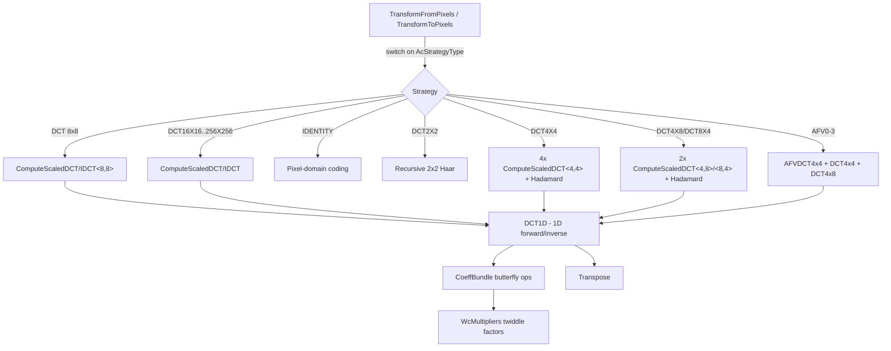
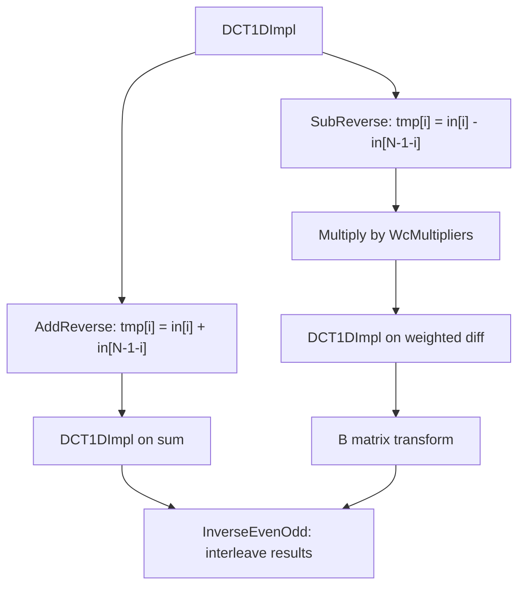
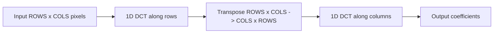

# DCT Transform Family

## Source Files

| File | Role |
|------|------|
| `lib/jxl/dct-inl.h` | Core 1D DCT-II and IDCT (DCT-III) SIMD implementation, plus 2D wrappers `ComputeScaledDCT` / `ComputeScaledIDCT` |
| `lib/jxl/dct_scales.h` | Compile-time constants: DCT resample scales (`DCTResampleScales`), twiddle factors (`WcMultipliers`) |
| `lib/jxl/dct_block-inl.h` | `DCTFrom` / `DCTTo` adapters that abstract strided memory access for DCT I/O |
| `lib/jxl/transpose-inl.h` | SIMD matrix transpose (8x8 via AVX2, 4x4 via SSE/NEON, scalar fallback) |
| `lib/jxl/enc_transforms-inl.h` | Forward transforms: `TransformFromPixels()`, `DCFromLowestFrequencies()`, plus special transforms (Identity, DCT2x2, DCT4x4, AFV) |
| `lib/jxl/dec_transforms-inl.h` | Inverse transforms: `TransformToPixels()`, `LowestFrequenciesFromDC()`, plus inverse special transforms |
| `lib/jxl/enc_transforms.cc` | Highway dispatch wrapper; `#include`s the `-inl.h` via `foreach_target.h` for multi-target compilation |
| `lib/jxl/dec_transforms_testonly.cc` | Same dispatch pattern for decoder transforms (test-only standalone; production decoder inlines directly in `dec_group.cc`) |
| `lib/jxl/ac_strategy.h` | `AcStrategyType` enum defining all 27 transform types |

## Key Types

### `DCTFrom` / `DCTTo` (dct_block-inl.h)

Thin adapters over `float*` + stride. Provide `LoadPart(D, row, col)` and `StorePart(D, vec, row, col)` methods that use `LoadU`/`StoreU` (unaligned, since DC data may not be aligned). The address computation is `data_ + row * stride_ + col`. The DCT core never accesses raw pointers directly; it always goes through these abstractions.

### `CoeffBundle<N, SZ>` (dct-inl.h)

The workhorse helper for the radix-2 DCT butterfly. Template parameters:
- `N` = number of coefficient groups (half the DCT size at each recursion level)
- `SZ` = SIMD lane count (how many floats to process in parallel)

Uses `HWY_CAPPED(float, SZ)` as its vector descriptor. Provides these operations:
- **`AddReverse` / `SubReverse`**: Butterfly sums/differences with reversed second half. For each `i` in `[0, N)`: `out[i] = in1[i] +/- in2[N-1-i]`.
- **`B` / `BTranspose`**: The "B matrix" operation from the Perera-Liu algorithm. `B` multiplies `coeff[0]` by sqrt(2) and adds `coeff[1]`, then cascades additions forward. `BTranspose` is the adjoint (reverse cascade, then sqrt(2) multiply).
- **`Multiply`**: Applies the `WcMultipliers<N>` twiddle factors to the upper half of the coefficient array.
- **`MultiplyAndAdd`**: Combined multiply and butterfly used in the IDCT: computes `mul*in2 + in1` and `-(mul*in2) + in1` in one pass, writing to positions `i` and `N-1-i`.
- **`ForwardEvenOdd` / `InverseEvenOdd`**: Deinterleave/interleave even and odd indexed elements between strided and contiguous layouts.
- **`LoadFromBlock` / `StoreToBlockAndScale`**: Transfer data between a `DCTFrom`/`DCTTo` block and the internal coefficient buffer, applying the `1/N` normalization on output.

### `DCT1DImpl<N, SZ>` / `IDCT1DImpl<N, SZ>` (dct-inl.h)

Recursive template structs implementing 1D DCT-II (forward) and DCT-III (inverse) via the self-recursive radix-2 decomposition. Base cases at `N=1` (no-op) and `N=2` (simple add/subtract).

### `ComputeScaledDCT<ROWS, COLS>` / `ComputeScaledIDCT<ROWS, COLS>` (dct-inl.h)

2D DCT/IDCT computed as two passes of 1D transforms with a transpose in between. The template parameters define the block size. The "scaled" means the output includes the `1/N` normalization factor (applied in `StoreToBlockAndScale`).

### `DCT1D<N, M>` / `IDCT1D<N, M>` (dct-inl.h)

Top-level 1D transform dispatcher that handles scalable vs. fixed-width SIMD. On scalable targets (SVE), uses a static function pointer resolved at first call based on `Lanes(HWY_FULL(float)())`. On fixed-width targets, directly calls `DCT1DCapped<N, M, kMaxLanes>`.

### `AcStrategyType` (ac_strategy.h)

Enum with 27 values covering all supported block transforms:
- **Standard DCTs**: DCT (8x8), DCT4X4, DCT4X8, DCT8X4, DCT16X8, DCT8X16, DCT16X16, DCT32X8, DCT8X32, DCT32X16, DCT16X32, DCT32X32, DCT64X32, DCT32X64, DCT64X64, DCT128X64, DCT64X128, DCT128X128, DCT256X128, DCT128X256, DCT256X256
- **Special transforms**: IDENTITY (pixel-domain), DCT2X2 (Haar-like), AFV0-AFV3 (Asymmetric Frequency Variant)

## Constants (normalization factors, exact DCT scale values)

### `kSqrt2` / `kSqrt0_5` (dct_scales.h)

```
kSqrt2 = 1.41421356237  (sqrt(2))
kSqrt0_5 = 0.70710678118 (1/sqrt(2))
```

Used in the `B` / `BTranspose` operations for the DC coefficient special case.

### `WcMultipliers<N>` (dct_scales.h)

Twiddle factors for the radix-2 DCT butterfly:

```
WcMultipliers<N>::kMultipliers[i] = 1 / (2 * cos((i + 0.5) * pi / N))
```

for `i` in `[0, N/2)`. These are the cosine constants in the recursive DCT decomposition. Defined for N = 4, 8, 16, 32, 64, 128, 256.

Example for N=4:
```
[0.541196100146197, 1.3065629648763764]
```

Example for N=8:
```
[0.5097955791041592, 0.6013448869350453, 0.8999762231364156, 2.5629154477415055]
```

### `DCTResampleScales<FROM, TO>` (dct_scales.h)

Scaling factors for converting between DCT sizes. When downsampling a DCT-N to a DCT-(N/2) by keeping only the lower-frequency coefficients, each coefficient k must be multiplied by:

```
cos(k / (2*N) * pi) * cos(k / N * pi) * cos(k / (N/2) * pi) * ...
```

The cascade of cosines accounts for the aliasing created by averaging adjacent pixels. These are precomputed for pairs: (8,1), (16,2), (32,4), (64,8), (128,16), (256,32) and their inverses.

Used by `ReinterpretingDCT` / `ReinterpretingIDCT` which convert between different DCT sizes for the multi-scale LF coefficient encoding.

## Algorithm Details

### Supported DCT Sizes

All power-of-2 sizes from 2x2 through 256x256, including rectangular variants:

| Size | AcStrategyType | 8x8 blocks covered |
|------|---------------|-------------------|
| 4x4 | DCT4X4 | 1 (4 sub-blocks within 8x8) |
| 4x8 / 8x4 | DCT4X8 / DCT8X4 | 1 (2 sub-blocks within 8x8) |
| 8x8 | DCT | 1 |
| 16x8 / 8x16 | DCT16X8 / DCT8X16 | 2 |
| 16x16 | DCT16X16 | 4 |
| 32x8 / 8x32 | DCT32X8 / DCT8X32 | 4 |
| 32x16 / 16x32 | DCT32X16 / DCT16X32 | 8 |
| 32x32 | DCT32X32 | 16 |
| 64x32 / 32x64 | DCT64X32 / DCT32X64 | 32 |
| 64x64 | DCT64X64 | 64 |
| 128x64 / 64x128 | DCT128X64 / DCT64X128 | 128 |
| 128x128 | DCT128X128 | 256 |
| 256x128 / 128x256 | DCT256X128 / DCT128X256 | 512 |
| 256x256 | DCT256X256 | 1024 |

The maximum block dimension is `kMaxCoeffBlocks * kBlockDim = 32 * 8 = 256` pixels.

### DCT-II (Forward Transform) Algorithm

The implementation follows "Lowest Complexity Self Recursive Radix-2 DCT II/III Algorithms" by Perera and Liu. This is a decimation-in-frequency recursive decomposition.

For a DCT of size N, `DCT1DImpl<N, SZ>::operator()` does:

```
1. AddReverse(first_half, second_half, tmp)          // Butterfly: tmp[i] = in[i] + in[N-1-i]
2. DCT1DImpl<N/2>(tmp)                               // Recursive DCT on sum (even part)
3. SubReverse(first_half, second_half, tmp+N/2)       // Butterfly: tmp[i] = in[i] - in[N-1-i]
4. Multiply(tmp)                                      // Apply WcMultipliers to difference part
5. DCT1DImpl<N/2>(tmp+N/2)                           // Recursive DCT on weighted difference (odd part)
6. B(tmp+N/2)                                         // B matrix transform
7. InverseEvenOdd(tmp, output)                        // Deinterleave even/odd results
```

The `B` matrix operation (step 6) is:
```
coeff[0] = sqrt(2) * coeff[0] + coeff[1]
coeff[i] = coeff[i] + coeff[i+1]    for i = 1..N-2
coeff[N-1] unchanged
```

Base cases:
- N=1: identity (no-op)
- N=2: `out[0] = in[0] + in[1]`, `out[1] = in[0] - in[1]`

After the 1D DCT, `StoreToBlockAndScale` applies the `1/N` normalization factor.

### DCT-III (IDCT, Inverse Transform) Algorithm

`IDCT1DImpl<N, SZ>::operator()` reverses the forward transform steps:

```
1. ForwardEvenOdd(input, tmp)           // Gather even/odd positioned coefficients
2. IDCT1DImpl<N/2>(tmp_even)            // Recursive IDCT on even part
3. BTranspose(tmp_odd)                  // Transpose B matrix
4. IDCT1DImpl<N/2>(tmp_odd)             // Recursive IDCT on odd part
5. MultiplyAndAdd(tmp, output)          // Combined: out[i] = mul*odd + even, out[N-1-i] = -mul*odd + even
```

The `BTranspose` operation (adjoint of `B`):
```
coeff[i] = coeff[i] + coeff[i-1]    for i = N-1..1 (reverse)
coeff[0] = sqrt(2) * coeff[0]
```

`MultiplyAndAdd` (step 5) reconstructs the spatial-domain values by combining the even and odd halves with the twiddle factors, writing both `output[i]` and `output[N-1-i]` simultaneously.

Note: The IDCT does NOT apply a 1/N normalization. The forward DCT's `StoreToBlockAndScale` already includes the normalization, so the pair is: forward scales by 1/N, inverse has no additional scale.

### 2D Transform Structure

The 2D DCT is computed as row-transform, transpose, column-transform. `ComputeScaledDCT<ROWS, COLS>`:

```
if ROWS < COLS:
    DCT1D rows   -> block
    Transpose    -> to
    DCT1D cols   -> block
    Transpose    -> to
else:
    DCT1D rows   -> to
    Transpose    -> block
    DCT1D cols   -> to
```

The extra transpose for ROWS < COLS ensures the data is always in the correct layout for the 1D transform to operate on contiguous memory. The IDCT (`ComputeScaledIDCT`) reverses these steps.

### SIMD Patterns (Highway Framework)

**Vector width adaptation**: The `SZ` template parameter in `CoeffBundle<N, SZ>` controls how many floats are processed per SIMD operation. `HWY_CAPPED(float, SZ)` clamps the vector width to at most `SZ` elements. This is critical: when transforming an 8-row block, the 1D DCT operates on `SZ` columns simultaneously. For an 8x8 block on AVX2 (8 floats/vector), the entire row fits in one vector.

**Scalable SIMD support** (SVE, RISC-V V): `DCT1D<N, M>` and `IDCT1D<N, M>` detect the runtime vector length and dispatch to the appropriate `DCT1DCapped<N, M, L>` instantiation via a static function pointer (computed once). Lane counts checked: 1, 2, 4, 8, 16, 32, 64, 128.

**Fixed-width path**: On non-scalable targets, `kMaxLanes = MaxLanes(HWY_FULL(float)())` is used directly at compile time.

**Transpose acceleration** (transpose-inl.h):
- **AVX2+ (8-wide)**: 8x8 float transpose via 3 rounds of interleave + concat operations (24 port-5 cycles). Processes 8x8 sub-blocks within larger transposes.
- **SSE/NEON (4-wide)**: 4x4 float transpose via 2 rounds of interleave operations.
- **Scalar fallback**: Element-by-element nested loop.

Large blocks (N*M >= 512) use `NoInlineWrapper` to prevent the compiler from over-inlining transposes, which can cause instruction cache pressure.

**Key SIMD operations used**:
- `Load` / `LoadU` / `Store` / `StoreU`: Aligned/unaligned vector memory operations
- `Add`, `Sub`, `Mul`: Arithmetic
- `MulAdd`, `NegMulAdd`: Fused multiply-add (`a*b+c`) and negated fused multiply-add (`-(a*b)+c`), mapping to FMA instructions where available
- `Set`: Broadcast scalar to all vector lanes
- `InterleaveLower`, `InterleaveUpper`, `ConcatLowerLower`, `ConcatUpperUpper`: Shuffle operations for transpose

### Non-Power-of-2 (Rectangular) DCT Sizes

Rectangular DCTs like 16x8, 32x16, etc. are handled natively by `ComputeScaledDCT<ROWS, COLS>` where ROWS != COLS. The 2D transform still decomposes into two 1D passes:

1. Apply 1D DCT of size ROWS along each column (processing COLS columns in parallel via SIMD)
2. Transpose the ROWS x COLS result to COLS x ROWS
3. Apply 1D DCT of size COLS along each (now) column
4. Possibly transpose back (depends on ROWS vs COLS ordering)

For the 8x8 base block, sub-block strategies like DCT4X8 and DCT8X4 split the 8x8 block into two 4x8 or 8x4 halves, transform each independently with `ComputeScaledDCT<4, 8>` or `ComputeScaledDCT<8, 4>`, then interleave the coefficients into the output and apply a 2-point Hadamard on the DC coefficients to correlate the two halves.

### Special Transforms

#### IDENTITY

No frequency-domain transform at all. Coefficients represent pixel differences from a reference pixel. Within each 4x4 sub-block:
- `coefficients[0]` holds the average (DC) of the 16 pixels (scaled by 1/16)
- All other positions hold `pixel[iy][ix] - pixel[1][1]` (difference from the (1,1) pixel)
- The four sub-block DCs undergo a 2x2 Hadamard to correlate them

This is ideal for areas where frequency-domain transforms would introduce ringing (e.g., sharp text or graphics).

#### DCT2X2 (Haar-like)

A recursive 2x2 transform applied at three scales:
1. `DCT2TopBlock<8>`: 2x2 butterfly on 4x4 groups of the 8x8 pixel block
2. `DCT2TopBlock<4>`: 2x2 butterfly on 2x2 groups of the previous result
3. `DCT2TopBlock<2>`: Final 2x2 butterfly on the DC corner

Each 2x2 butterfly computes:
```
r00 = (c00 + c01 + c10 + c11) * 0.25
r01 = (c00 + c01 - c10 - c11) * 0.25
r10 = (c00 - c01 + c10 - c11) * 0.25
r11 = (c00 - c01 - c10 + c11) * 0.25
```

This creates a multi-scale Haar-like decomposition without the computational cost of a full DCT. The inverse (`IDCT2TopBlock`) reverses the operations at each scale.

#### AFV (Asymmetric Frequency Variant, types 0-3)

The most complex special transform. Designed for blocks where one 4x4 quadrant has different characteristics than the rest (e.g., a corner with a sharp edge). The `afv_kind` parameter (0-3) selects which quadrant gets the special treatment.

The 8x8 block is decomposed into three parts:
1. **AFV quadrant** (4x4): Transformed using a custom 16-element basis (`k4x4AFVBasisTranspose`). The basis vectors are not a standard DCT -- they are designed to capture asymmetric features. The transform is a direct matrix-vector multiply of all 16 pixels against 16 basis functions.
2. **Opposite x-half** (4x4): Standard `ComputeScaledDCT<4, 4>()`
3. **Opposite y-half** (4x8): Standard `ComputeScaledDCT<4, 8>()`

The coefficients from these three parts are interleaved in a specific layout:
- (even_row, even_col): AFV coefficients
- (odd_row, even_col): DCT4x4 coefficients
- (any_row, odd_col): DCT4x8 coefficients

The three DC values are combined via a custom 3-point transform to decorrelate them.

The AFV basis is SIMD-accelerated: it uses `HWY_CAPPED(float, 16)` and processes the matrix-vector multiply in chunks of `Lanes(d)`, accumulating via `MulAdd`.

### ReinterpretingDCT / ReinterpretingIDCT

These functions bridge between DCT sizes for the multi-scale coefficient encoding. When a large block (e.g., 32x32) spans multiple 8x8 blocks, the DC values of those 8x8 blocks are themselves transformed with a smaller DCT, and the lowest-frequency result is stored as the "LLF" (lowest-low-frequency) coefficients.

`ReinterpretingDCT` computes a ROWS x COLS DCT, then scales each coefficient by `DCTTotalResampleScale<ROWS, DCT_ROWS>(y) * DCTTotalResampleScale<COLS, DCT_COLS>(x)` to account for the fact that these coefficients represent a subsampled version of the full DCT_ROWS x DCT_COLS block.

`ReinterpretingIDCT` does the reverse: it applies the inverse resample scaling and then the IDCT to reconstruct DC values from LLF coefficients.

## The -inl.h Pattern (Highway's Template Instantiation Mechanism)

The `-inl.h` files use Highway's multi-target compilation pattern. This is the core mechanism that enables runtime CPU feature detection with compile-time SIMD optimization.

### How It Works

1. **The toggle guard**: Each `-inl.h` file has this unique pattern instead of a normal include guard:
   ```cpp
   #if defined(LIB_JXL_DCT_INL_H_) == defined(HWY_TARGET_TOGGLE)
   #ifdef LIB_JXL_DCT_INL_H_
   #undef LIB_JXL_DCT_INL_H_
   #else
   #define LIB_JXL_DCT_INL_H_
   #endif
   ```
   This toggle ensures the file can be included multiple times -- once per target architecture. Each time `HWY_TARGET_TOGGLE` changes, the guard flips and the file is re-parsed.

2. **The `.cc` file**: A corresponding `.cc` file sets itself as the re-include target:
   ```cpp
   #undef HWY_TARGET_INCLUDE
   #define HWY_TARGET_INCLUDE "lib/jxl/enc_transforms.cc"
   #include <hwy/foreach_target.h>
   #include <hwy/highway.h>
   #include "lib/jxl/enc_transforms-inl.h"
   ```
   `foreach_target.h` re-includes the entire `.cc` file once per supported target (SSE4, AVX2, AVX-512, NEON, SVE, ...).

3. **Namespace scoping**: All SIMD code lives in `jxl::HWY_NAMESPACE`, where `HWY_NAMESPACE` is a macro that expands to a target-specific name (e.g., `N_SSE4`, `N_AVX2`). Each re-inclusion generates a different namespace.

4. **Dynamic dispatch**: `HWY_EXPORT(FunctionName)` creates a function pointer table, and `HWY_DYNAMIC_DISPATCH(FunctionName)` selects the best available target at runtime:
   ```cpp
   HWY_EXPORT(TransformFromPixels);
   void TransformFromPixels(...) {
     HWY_DYNAMIC_DISPATCH(TransformFromPixels)(...);
   }
   ```
   The `#if HWY_ONCE` guard ensures the dispatch wrapper is only emitted once.

5. **Inlining into callers**: Some files (like `dec_group.cc`) directly include the `-inl.h` and use the Highway functions inline, bypassing the dispatch wrapper for performance. The file sets itself as `HWY_TARGET_INCLUDE` and uses `foreach_target.h` to compile all targets.

### Why `-inl.h` Instead of Normal Headers

Normal headers with include guards can only be parsed once per translation unit. Highway needs the same template code compiled multiple times with different instruction set flags. The toggle guard is the mechanism that permits this repeated parsing, each time generating target-specific code in a different namespace.

## Dependencies

```
enc_transforms.cc / dec_transforms_testonly.cc / dec_group.cc
  |
  +-> enc_transforms-inl.h / dec_transforms-inl.h
      |
      +-> dct-inl.h (core DCT implementation)
      |   |
      |   +-> dct_block-inl.h (DCTFrom / DCTTo)
      |   +-> dct_scales.h (WcMultipliers, DCTResampleScales)
      |   +-> transpose-inl.h (matrix transpose)
      |       |
      |       +-> dct_block-inl.h
      |
      +-> dct_scales.h (DCTTotalResampleScale for ReinterpretingDCT)
      +-> ac_strategy.h (AcStrategyType enum)
      +-> frame_dimensions.h (kBlockDim = 8, kDCTBlockSize = 64)
```

External dependencies:
- `hwy/highway.h`: Highway SIMD library (vector types, operations, dispatch macros)
- `hwy/foreach_target.h`: Multi-target compilation driver

## Mermaid Diagram Data

### Transform Dispatch Flow



### Recursive DCT-II Decomposition (Forward)



### 2D DCT Flow



## Open Questions

1. **Normalization convention**: The forward DCT applies `1/N` per dimension (in `StoreToBlockAndScale`), while the IDCT applies no scale. This means the DC coefficient for an 8x8 block is the mean pixel value (sum/64). Is this convention consistent with the quantization tables, or is there an implicit scale absorbed into `quant_weights`?

2. **AFV basis origin**: The `k4x4AFVBasisTranspose` matrix contains 16 basis vectors that do not correspond to any standard transform. How were these basis functions derived? Were they optimized for compression efficiency on natural images, or do they have a closed-form mathematical definition? The first two basis vectors have clear structure (DC and a low-frequency mode with two nonzero entries), but basis vectors 2-15 appear to be numerically optimized.

3. **Performance of large DCTs**: The 256x256 DCT processes 65,536 floats with recursive decomposition down to size 2. At what block size does the recursive approach become memory-bound (due to the temporary buffer thrashing L1 cache)? The `NoInlineWrapper` for large transposes suggests this was a concern.

4. **Scalable SIMD code path**: The `DCT1D` / `IDCT1D` dispatchers use a static function pointer for scalable targets, initialized on first call. This adds a branch per transform invocation. Has this been measured against always using `HWY_FULL`?

5. **Why is `dec_transforms_testonly.cc` test-only?** The production decoder in `dec_group.cc` directly includes `dec_transforms-inl.h` and calls `TransformToPixels` inline within the Highway multi-target compilation. The "testonly" standalone version provides a non-inlined dispatch wrapper (`HWY_DYNAMIC_DISPATCH`) for tests that do not themselves use `foreach_target.h`. This is an architectural choice to keep the hot decoder path fully inlined.

6. **DCT2X2 vs Haar wavelet**: The recursive `DCT2TopBlock` applies 2x2 Hadamard transforms at three scales (8, 4, 2). How does this compare to a standard Haar DWT? The 0.25 scaling factor at each level differs from the standard Haar normalization of `1/sqrt(2)`.

7. **ReinterpretingDCT accuracy**: The resample scale factors are derived from the exact cosine formula for downsampling DCT coefficients. Are there accumulated floating-point errors in the cascade of these factors for very large blocks (256x256 -> 32x32 LLF), and does this affect reconstruction quality?
