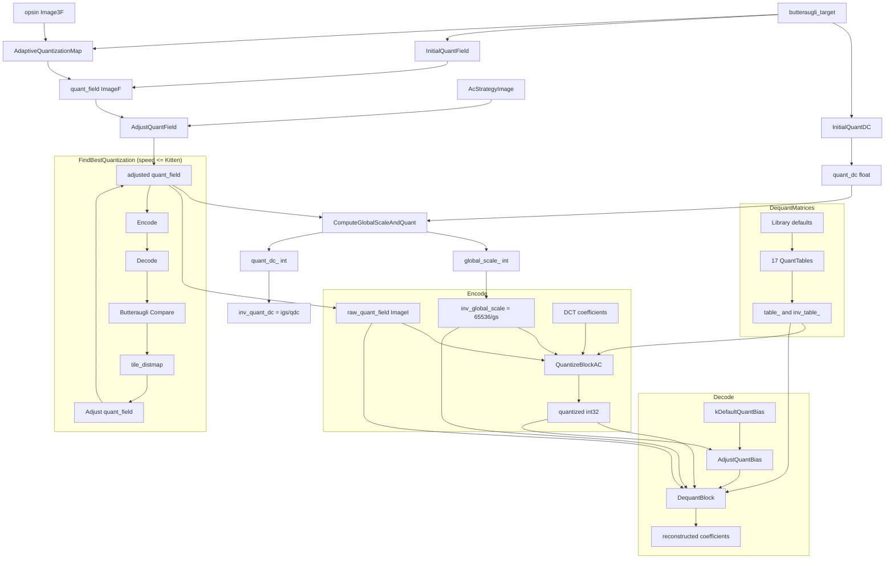

# Quantization System

## Source Files

| File | Role |
|------|------|
| `lib/jxl/quant_weights.h` | `DequantMatrices` type, `QuantEncoding`/`QuantEncodingInternal` types, DC quant constants, `QuantTable` enum, AC strategy to quant table map |
| `lib/jxl/quant_weights.cc` | Library default matrix definitions (all 17 tables), `ComputeQuantTable`, `GetQuantWeights` interpolation, decode path for quant matrices |
| `lib/jxl/quantizer.h` | `Quantizer` class, global_scale / quant_dc hierarchy, `AdjustQuantBias` constants, zero-bias defaults |
| `lib/jxl/quantizer.cc` | `ComputeGlobalScaleAndQuant`, `SetQuantField`, `SetQuant`, serialization via `QuantizerParams` |
| `lib/jxl/quantizer-inl.h` | `AdjustQuantBias` SIMD implementation (dequant bias correction) |
| `lib/jxl/enc_quant_weights.h` | Encoder-side quant weight encoding API |
| `lib/jxl/enc_quant_weights.cc` | Bitstream encoding of quant matrices, roundtrip encode/decode, custom DC/matrix setting |
| `lib/jxl/enc_adaptive_quantization.h` | `InitialQuantField`, `InitialQuantDC`, `AdjustQuantField`, `FindBestQuantizer` API |
| `lib/jxl/enc_adaptive_quantization.cc` | Adaptive quantization map computation, masking, butteraugli-driven optimization loop |
| `lib/jxl/enc_group.cc` | `QuantizeBlockAC` (encode-side integer quantization), `AdjustQuantBlockAC` |
| `lib/jxl/dec_group.cc` | `DequantBlock`, `DequantLane` (decode-side dequantization with bias correction) |

## Key Types

### QuantEncodingInternal / QuantEncoding

Represents how a single quantization table is defined. Has a `Mode` enum:

```
kQuantModeLibrary  = 0  // Use predefined table from library
kQuantModeID       = 1  // Identity transform weights
kQuantModeDCT2     = 2  // DCT2x2 weights
kQuantModeDCT4     = 3  // DCT4x4 weights (uses 4x4 GetQuantWeights + multipliers)
kQuantModeDCT4X8   = 4  // DCT4x8 weights
kQuantModeAFV      = 5  // AFV (Asymmetric Flip-based Variant) weights
kQuantModeDCT      = 6  // General DCT weights via distance band interpolation
kQuantModeRAW      = 7  // Explicit JPEG-style quantization table
```

Key data members by mode:
- **Library**: `predefined` (index into predefined tables, currently only 0)
- **ID**: `idweights[3][3]` -- 3 channels x {bulk_weight, edge_weight, corner_weight}
- **DCT2**: `dct2weights[3][6]` -- 3 channels x 6 hierarchical frequency-band weights
- **DCT4**: `dct_params` (4x4 distance bands) + `dct4multipliers[3][2]` (per-channel multipliers for coeff [0,1]/[1,0] and [1,1])
- **DCT4X8**: `dct_params` (4x8 distance bands) + `dct4x8multipliers[3]` (per-channel multiplier for coeff [1,0])
- **DCT**: `dct_params` only (general distance-band interpolation)
- **AFV**: `dct_params` (4x8), `dct_params_afv_4x4` (4x4), `afv_weights[3][9]`
- **RAW**: `qraw.qtable` (vector of int) + `qraw.qtable_den` (default `1/(8*255)`)

### DctQuantWeightParams

Parameterizes the distance-band interpolation for DCT-family modes:
- `num_distance_bands`: 1..17 (stored as 4-bit field + 1)
- `distance_bands[3][17]`: per-channel band values. Band 0 is the DC seed (multiplied by 64 on decode). Remaining bands are delta-coded via `Mult(v)`: if v > 0, multiply by (1+v); if v <= 0, multiply by 1/(1-v).

### DequantMatrices

Holds the full set of 17 quantization tables (one per `QuantTable` enum value), each with 3 channels. Stores both the forward table (`table_`) and inverse table (`inv_table_`).

Key sizes:
- `kNumQuantTables = 17`
- `kNumPredefinedTables = 1`
- `kTotalTableSize = kSumRequiredXy * kDCTBlockSize * 3 = 2056 * 64 * 3 = 394,752 floats`
- `required_size_x[17] = {1,1,1,1,2,4,1,1,2,1,1,8,4,16,8,32,16}`
- `required_size_y[17] = {1,1,1,1,2,4,2,4,4,1,1,8,8,16,16,32,32}`

### QuantTable Enum (17 entries)

```
DCT=0, IDENTITY=1, DCT2X2=2, DCT4X4=3, DCT16X16=4, DCT32X32=5,
DCT8X16=6, DCT8X32=7, DCT16X32=8, DCT4X8=9, AFV0=10,
DCT64X64=11, DCT32X64=12, DCT128X128=13, DCT64X128=14,
DCT256X256=15, DCT128X256=16
```

Multiple AC strategies may share the same QuantTable (e.g., DCT8X4 and DCT4X8 both use QuantTable::DCT4X8, all four AFV variants use QuantTable::AFV0).

### Quantizer

The central quantization controller. Serialized state: `global_scale_` (int) and `quant_dc_` (int). Derived values:
- `global_scale_float_ = global_scale_ / 65536.0`
- `inv_global_scale_ = 65536.0 / global_scale_`
- `inv_quant_dc_ = inv_global_scale_ / quant_dc_`

Per-block AC quantization is controlled by `raw_quant_field` (ImageI), where each entry is `quant_ac` for that block (integer, 1..256).

## Constants

### DC Quantization Constants

```c++
const float kInvDCQuant[3] = { 4096.0f, 512.0f, 256.0f };  // X, Y, B
const float kDCQuant[3]    = { 1/4096, 1/512, 1/256 };

// Meaning: channel Y gets 8x finer DC quantization than B, 2x finer than X.
// Channel X gets 16x finer quantization than B.
```

DC quantization step for channel c:
```
dc_step[c] = inv_quant_dc_ * DCQuant(c) = (inv_global_scale_ / quant_dc_) * (1/kInvDCQuant[c])
```

### Global Scale Constants

```c++
kGlobalScaleDenom    = 1 << 16 = 65536
kGlobalScaleNumerator = 4096
kDefaultQuant        = 64
// Default constructor: global_scale_ = 65536/64 = 1024, quant_dc_ = 64
```

Serialization ranges for QuantizerParams:
- `global_scale`: U32 with distributions BitsOffset(11,1), BitsOffset(11,2049), BitsOffset(12,4097), BitsOffset(16,8193); default 1
- `quant_dc`: U32 with Val(16), BitsOffset(5,1), BitsOffset(8,1), BitsOffset(16,1); default 1

### Quantizer Bias Constants

```c++
static constexpr float kZeroBiasDefault[3] = {0.5f, 0.5f, 0.5f};
static constexpr float kBiasNumerator = 0.145f;

static constexpr float kDefaultQuantBias[4] = {
    1.0f - 0.05465007330715401f,   // X channel, |q|==1: 0.9453499...
    1.0f - 0.07005449891748593f,   // Y channel, |q|==1: 0.9299455...
    1.0f - 0.049935103337343655f,  // B channel, |q|==1: 0.9500649...
    0.145f,                         // |q|>=2: bias numerator
};
```

The bias correction during dequantization works as:
```
if quant == 0:  output = 0
if |quant| == 1: output = sign(quant) * kDefaultQuantBias[c]
if |quant| >= 2: output = quant - kDefaultQuantBias[3] / quant
```

This corrects for the non-uniform distribution of quantization residuals, which approximates 1/(1+x^2).

### Adaptive Quantization Constants

```c++
const float kDcQuantPow = 0.83f;
const float kDcQuant    = 1.095924047623553f;
const float kAcQuant    = 0.765f;
```

### Default Quantization Thresholds (zero-bias for encode-side rounding)

In `QuantizeBlockAC`, the encode-side rounding thresholds are:
```c++
// Y channel:
thres_y[4] = {0.575, 0.6, 0.6, 0.6}  // quadrants [top-left, top-right, bottom-left, bottom-right]
// ... adjusted to {0.56, 0.56, 0.56, 0.62} for 8x8 or higher

// X and B channels:
thres[4] = {0.58, 0.62, 0.62, 0.62}
// For blocks >= 4 coefficients (non-8x8):
//   thresholds[i] -= 0.00744 * xsize * ysize, min 0.5
```

### Chromacity (X/B QM scale) Multipliers

Frame header fields `x_qm_scale` and `b_qm_scale` (default 2, range varies):
```
Encoder x_qm_multiplier = 1.25^(x_qm_scale - 2)
Decoder x_dm_multiplier = (1/1.25)^(x_qm_scale - 2) = 1 / x_qm_multiplier

x_qm_scale steps based on distance:
  distance > 2.5 -> x_qm_scale >= 4
  distance > 5.5 -> x_qm_scale >= 5
  distance > 9.5 -> x_qm_scale >= 6
```

This means at higher target distances, X and B channels are quantized more coarsely relative to Y.

## Library Default Quantization Matrices

All 17 default tables are defined in `DequantMatricesLibraryDef`. The distance band seed values (band[0]) are the most critical -- they set the base weight for the DC-adjacent coefficients, with higher values meaning finer quantization (more bits).

### DCT 8x8 (QuantTable::DCT = 0)
```
Mode: kQuantModeDCT, 6 distance bands
Channel X: bands = {3150.0, 0.0, -0.4, -0.4, -0.4, -2.0}
Channel Y: bands = {560.0,  0.0, -0.3, -0.3, -0.3, -0.3}
Channel B: bands = {512.0, -2.0, -1.0,  0.0, -1.0, -2.0}
```

### Identity (QuantTable::IDENTITY = 1)
```
Mode: kQuantModeID
Channel X: weights = {280.0, 3160.0, 3160.0}  -- {bulk, edge(01/10), corner(11)}
Channel Y: weights = {60.0,  864.0,  864.0}
Channel B: weights = {18.0,  200.0,  200.0}
```

### DCT2x2 (QuantTable::DCT2X2 = 2)
```
Mode: kQuantModeDCT2, 6 weights per channel (hierarchical subdivision)
Channel X: {3840, 2560, 1280, 640, 480, 300}
Channel Y: {960,  640,  320,  180, 140, 120}
Channel B: {640,  320,  128,  64,  32,  16}
```

### DCT4x4 (QuantTable::DCT4X4 = 3)
```
Mode: kQuantModeDCT4, 4 distance bands, multipliers all 1.0
Channel X: bands = {2200.0, 0.0, 0.0, 0.0}
Channel Y: bands = {392.0,  0.0, 0.0, 0.0}     (flat -- all bands equal)
Channel B: bands = {112.0, -0.25, -0.25, -0.5}
```

### DCT16x16 (QuantTable::DCT16X16 = 4)
```
Mode: kQuantModeDCT, 7 distance bands
Channel X: seed = 8996.87..., bands decaying to -1.616
Channel Y: seed = 3191.48..., bands decaying to -0.376
Channel B: seed = 1157.50..., bands decaying to -4.921
```

### DCT32x32 (QuantTable::DCT32X32 = 5)
```
Mode: kQuantModeDCT, 8 distance bands
Channel X: seed = 15718.41...
Channel Y: seed = 7305.76...
Channel B: seed = 3803.53...
```

### DCT8x16 / DCT16x8 (QuantTable::DCT8X16 = 6)
```
Mode: kQuantModeDCT, 7 distance bands
Channel X: seed = 7240.77...
Channel Y: seed = 1448.15...
Channel B: seed = 506.85...
```

### DCT8x32 / DCT32x8 (QuantTable::DCT8X32 = 7)
```
Mode: kQuantModeDCT, 8 distance bands
Channel X: seed = 16283.25...
Channel Y: seed = 5089.16...
Channel B: seed = 3397.78...
```

### DCT16x32 / DCT32x16 (QuantTable::DCT16X32 = 8)
```
Mode: kQuantModeDCT, 8 distance bands
Channel X: seed = 13844.97...
Channel Y: seed = 4798.96...
Channel B: seed = 1807.24...
```

### DCT4x8 / DCT8x4 (QuantTable::DCT4X8 = 9)
```
Mode: kQuantModeDCT4X8, 4 distance bands, multipliers all 1.0
Channel X: seed = 2198.05...
Channel Y: seed = 764.37...
Channel B: seed = 527.11...
```

### AFV (QuantTable::AFV0 = 10)
```
Mode: kQuantModeAFV
Uses DCT4X8 params for 4x8 sub-block, DCT4X4 params for 4x4 sub-block
Channel X: DC tendency = {3072, 3072}, corner = {256, 256, 256}, HF seed = 414
Channel Y: DC tendency = {1024, 1024}, corner = {50, 50, 50}, HF seed = 58
Channel B: DC tendency = {384, 384},   corner = {12, 12, 12},  HF seed = 22
```

### DCT64x64 (QuantTable::DCT64X64 = 11)
```
Mode: kQuantModeDCT, 8 distance bands
Channel X: seed = 0.9 * 26629.07... = 23966.17...
Channel Y: seed = 0.9 * 9311.32...  = 8380.19...
Channel B: seed = 0.9 * 4992.25...  = 4493.02...
```

### DCT32x64 / DCT64x32 (QuantTable::DCT32X64 = 12)
```
Channel X: seed = 0.65 * 23629.07... = 15358.90...
Channel Y: seed = 0.65 * 8611.32...  = 5597.36...
Channel B: seed = 0.65 * 4492.25...  = 2919.96...
```

### DCT128x128 (QuantTable::DCT128X128 = 13)
```
Channel X: seed = 1.8 * 26629.07... = 47932.33...
Channel Y: seed = 1.8 * 9311.32...  = 16760.38...
Channel B: seed = 1.8 * 4992.25...  = 8986.05...
```

### DCT64x128 (QuantTable::DCT64X128 = 14)
```
Channel X: seed = 1.3 * 23629.07... = 30717.80...
Channel Y: seed = 1.3 * 8611.32...  = 11194.72...
Channel B: seed = 1.3 * 4492.25...  = 5839.92...
```

### DCT256x256 (QuantTable::DCT256X256 = 15)
```
Channel X: seed = 3.6 * 26629.07... = 95864.67...
Channel Y: seed = 3.6 * 9311.32...  = 33520.76...
Channel B: seed = 3.6 * 4992.25...  = 17972.09...
```

### DCT128x256 (QuantTable::DCT128X256 = 16)
```
Channel X: seed = 2.6 * 23629.07... = 61435.59...
Channel Y: seed = 2.6 * 8611.32...  = 22389.44...
Channel B: seed = 2.6 * 4492.25...  = 11679.84...
```

**Pattern**: Larger transforms get proportionally larger seed values (more bits at low frequencies). The scaling factors relative to a base are:
- 64x64: 0.9x
- 128x128: 1.8x (2x of 64x64)
- 256x256: 3.6x (2x of 128x128)
- Rectangular: ~0.65x..1.3x of parent square

## Cost Functions & Decision Trees

### InitialQuantDC: butteraugli_target -> quant_dc

```c++
float InitialQuantDC(float butteraugli_target) {
    const float kDcMul = 0.3;
    const float kDcQuantPow = 0.83;
    const float kDcQuant = 1.095924047623553;

    // Non-linear compression: at low distances, DC quant grows slowly
    float butteraugli_target_dc = max(
        0.5 * butteraugli_target,
        min(butteraugli_target,
            kDcMul * pow((1/kDcMul) * butteraugli_target, kDcQuantPow))
    );
    // kDcMul * pow((1/kDcMul) * t, 0.83) = 0.3 * (3.333*t)^0.83
    // For t=1.0: 0.3 * 3.333^0.83 = 0.3 * 2.75 = 0.825
    // This crosses butteraugli_target at t = kDcMul = 0.3

    return min(kDcQuant / butteraugli_target_dc, 50.0);
}
```

Example values:
| butteraugli_target | butteraugli_target_dc | quant_dc |
|---|---|---|
| 0.5 | 0.25 (clamped to 0.5*t) | 4.384 |
| 1.0 | 0.825 | 1.328 |
| 2.0 | 1.477 | 0.742 |
| 5.0 | 3.235 | 0.339 |
| 10.0 | 5.786 | 0.189 |

### InitialQuantField: butteraugli_target -> per-block AC quant

```c++
StatusOr<ImageF> InitialQuantField(float butteraugli_target,
                                    const Image3F& opsin, ...) {
    const float quant_ac = kAcQuant / butteraugli_target;  // kAcQuant = 0.765
    // quant_ac is the base scale passed into AdaptiveQuantizationMap
    return AdaptiveQuantizationMap(butteraugli_target, opsin, rect,
                                   quant_ac * rescale, pool, mask, mask1x1);
}
```

The `quant_ac = 0.765 / butteraugli_target` is then modulated per-block by the adaptive quantization map.

### Adaptive Quantization Map (per-block modulation)

The AQ map is computed from the opsin Y channel through these steps:

1. **Laplacian + gamma correction**: For each pixel, compute `diff = gammac * (pixel - avg_4_neighbors)`, where `gammac = RatioOfDerivativesOfCubicRootToSimpleGamma(pixel + 0.019)`. This converts from opsin cubic-root space to butteraugli's log-gamma space.

2. **Squared diff + masking sqrt**: `diff = diff^2`, clamped to 0.2, then `MaskingSqrt(diff) = 0.25 * sqrt(211.67e8 * diff * sqrt(diff) + 27.506)` (approximation).

3. **4x4 downsample**: Average the masking values in 4x4 blocks.

4. **Fuzzy erosion**: Take weighted min-4 of 3x3 neighborhood. Weights adapt with butteraugli_target (at target < 2.0, emphasize the minimum more strongly).

5. **Per-block modulations** (applied to the exponent, then exponentiated):
   - **ComputeMask**: `base=-0.765 + weighted combination of 1/(v+offset) terms`
   - **GammaModulation**: Ratio of derivatives correction, ~0.1 * log2(ratio)
   - **HfModulation**: High-frequency content measure, -0.38 * sum_of_diffs + 0.42
   - **BlueModulation**: Boost for blocks with significant blue content (capped at kMaxLimit)

6. **Final**: `row_out[ix] = exp2(out_val * 1.4427) * mul + add`

   Where `mul = scale * dampen` and `add = (1-dampen) * base_level`:
   - `base_level = 0.48 * scale`
   - `dampen = 1.0` below butteraugli_target 2.0, linearly decreasing to 0 at 14.0
   - At high distances, the modulation approaches a flat `base_level` (less spatial adaptation)

### AdjustQuantField: AC strategy aware smoothing

For multi-block AC strategies (covering > 1 block), the quant field is unified:
- At low distances: take `max` of constituent blocks
- At high distances (> 1.54): interpolate toward `mean`
- Mixing factor: `mean_max_mixer = max(0, 1 - (target - 1.54138) * 0.56391)`

### ComputeGlobalScaleAndQuant: quant_dc + quant_field -> global_scale_ + quant_dc_

```c++
void ComputeGlobalScaleAndQuant(float quant_dc, float quant_median,
                                 float quant_median_absd) {
    const float kQuantFieldTarget = 5;
    float scale = kGlobalScaleDenom * (quant_median - quant_median_absd) / kQuantFieldTarget;
    // = 65536 * (median - MAD) / 5

    // Clamp to [1, 32768]
    // Also clamp so quant_dc_ >= ~10:
    //   scale <= quant_dc * kGlobalScaleNumerator * 1.6
    //          = quant_dc * 4096 * 1.6 = quant_dc * 6553.6
    global_scale_ = clamp(scale);

    // Then: quant_dc_ = round(quant_dc * inv_global_scale_ + 0.5)
    //                  = round(quant_dc * 65536 / global_scale_ + 0.5)
}
```

The global scale is chosen so the median of the raw quant field (integer) is around 5. The MAD (median absolute deviation) subtraction gives more resolution to spatially varying quant fields.

### FindBestQuantization: iterative butteraugli optimization

For speed_tier <= kKitten, runs 2-4 iterations of:
1. Quantize with current quant_field
2. Roundtrip encode/decode
3. Compute butteraugli diff map
4. Create tile_distmap (16th-norm over each block, scaled by 1.2)
5. Adjust quant_field:
   - Iteration 0-1: where tile_dist > target, `quant *= diff^0.2` (undershoot) or `quant *= diff` (overshoot)
   - Later iterations: only increase quant where overshooting
6. After iteration 1: blend quant_field with initial (60% original + 40% initial) to prevent oscillation

## Algorithm Details

### Distance Band Interpolation (GetQuantWeights)

For a ROWS x COLS DCT transform with `num_bands` distance bands:

1. **Band computation**: Starting from `bands[0]` (the seed), each subsequent band is `bands[i] = bands[i-1] * Mult(distance_bands[c][i])`:
   ```
   Mult(v) = (1 + v) if v > 0
           = 1 / (1 - v) if v <= 0
   ```
   This means negative `distance_bands` values compress the range (make high frequencies closer to low).

2. **Distance computation**: For coefficient at position (x, y):
   ```
   scale = (num_bands - 1) / (sqrt(2) + 1e-6)
   dx = x * scale / (COLS - 1)
   dy = y * scale / (ROWS - 1)
   distance = sqrt(dx^2 + dy^2)
   ```
   The maximum distance (at corner) is approximately `sqrt(2) * scale / (N-1) * (N-1) = num_bands - 1`.

3. **Interpolation**: `weight = Interpolate(distance, bands)`:
   ```
   Interpolate: weight = a * (b/a)^frac
   ```
   where `a = bands[floor(distance)]`, `b = bands[ceil(distance)]`, `frac = distance - floor(distance)`. This is **geometric interpolation** (log-linear), not linear interpolation.

4. **Result**: `weights[c * ROWS*COLS + y*COLS + x] = interpolated_value`

The weight value represents the **dequantization weight** (inverse of quantization step). Higher weight = finer quantization = more bits.

### Table Storage Layout

The `table_` and `inv_table_` arrays store all 17 tables contiguously. For each table:
- Layout is `[c=0 block, c=1 block, c=2 block]`
- Each block is `(required_size_x * 8) * (required_size_y * 8)` floats
- `table_[offset + c*num + y*cols + x]` = `1.0 / weight` (quantization step)
- `inv_table_[offset + c*num + y*cols + x]` = `weight` (dequantization weight)

The lowest-frequency coefficients in `inv_table_` are zeroed out (set to 0) after computation. This does not affect codec correctness but simplifies AC strategy selection code.

### Quantization (Encode Side)

In `QuantizeBlockAC`:

```
qac = global_scale_float_ * quant_ac_for_block     // = (global_scale / 65536) * raw_quant_field[block]
inv_qm = InvDequantMatrix(quant_kind, c)             // = 1/weight = quantization step from table

quantized[i] = round(block_in[i] * inv_qm[i] * qac * qm_multiplier)
               if |val| >= threshold, else 0
```

Where `threshold` varies by quadrant position (approximately 0.5-0.62) and `qm_multiplier` is `x_qm_multiplier` for X channel, `b_qm_multiplier` for B channel, 1.0 for Y channel.

The thresholding provides a form of dead-zone quantization: small coefficients below the threshold are zeroed out regardless of rounding.

### Dequantization (Decode Side)

In `DequantBlock` / `DequantLane`:

```
scaled_dequant = (1/global_scale_float_) / quant_ac_for_block
               = inv_global_scale / quant
               = 65536 / (global_scale * quant)

// Per-coefficient:
dequant_matrix = DequantMatrix(quant_kind, 0)  // weight values for all 3 channels

// For channel c:
bias_corrected = AdjustQuantBias(quantized_int)
dequant_value = bias_corrected * dequant_matrix[c*size + k] * scaled_dequant * dm_multiplier
```

Where `dm_multiplier` is `x_dm_multiplier = (1/1.25)^(x_qm_scale-2)` for X, `b_dm_multiplier` for B, 1.0 for Y.

The dequant matrix values here are the *forward* table values (`1.0 / weight`), which when multiplied by the scaled dequant factor gives the actual reconstruction step size. However, from the source: the `DequantMatrix(kind, 0)` returns `table_` entries which are `1/weight`, so the full dequant step is:

```
step = (1/weight) * (inv_global_scale / quant) * dm_multiplier
     = (inv_global_scale / (quant * weight)) * dm_multiplier
```

Larger `weight` (from the quant matrix) = smaller step = finer quantization.

### The global_scale / quant_dc / quant_ac Hierarchy

```
                 global_scale  (int, serialized)
                      |
          +-----------+-----------+
          |                       |
     quant_dc (int)         quant_ac[x,y] (int per block, serialized as ImageI)
          |                       |
   inv_quant_dc              inv_quant_ac
   = 65536/(gs*qdc)         = 65536/(gs*q)
          |                       |
   dc_step[c]               ac_step[c,k]
   = inv_quant_dc            = inv_quant_ac
     * kDCQuant[c]             * DequantMatrix[kind,c,k]
                                * dm_multiplier[c]
```

The multiplication chain for a single AC coefficient:

```
final_dequant_step = (kGlobalScaleDenom / global_scale_) / quant_ac
                     * DequantMatrix(kind, c)[k]
                     * channel_dm_multiplier
```

For DC:
```
dc_dequant_step = (kGlobalScaleDenom / global_scale_) / quant_dc_ * kDCQuant[c]
```

## Dependencies

```
frame_header.h       FrameHeader (x_qm_scale, b_qm_scale)
  |
  v
quantizer.h          Quantizer (global_scale_, quant_dc_, raw_quant_field)
  |
  v
quant_weights.h      DequantMatrices (per-transform per-channel weight tables)
  |
  v
ac_strategy.h        AcStrategy / AcStrategyImage (block transform decisions)
  |
  v
enc_adaptive_quantization.cc  Derives quant_dc and quant_field from butteraugli_target + opsin image
  |
  v
enc_group.cc         QuantizeBlockAC (applies quantization to DCT coefficients)

dec_group.cc         DequantBlock (reverses quantization with bias correction)
  |
  v
quantizer-inl.h      AdjustQuantBias (per-coefficient bias correction)
```

## Mermaid Diagram Data



## Open Questions

1. **Why geometric interpolation for distance bands?** The `Interpolate` function uses `a * (b/a)^frac` rather than linear `a + (b-a)*frac`. This means band ratios are interpolated linearly in log-space. The rationale is likely that human contrast sensitivity follows roughly a log curve with frequency, so log-linear interpolation in frequency domain better matches perceptual importance.

2. **Zero-bias vs threshold interaction**: The encode-side threshold (dead-zone, ~0.5-0.62) and the decode-side bias correction (AdjustQuantBias) implement different aspects of quantization optimization. The threshold aggressively zeros small coefficients (saves entropy), while the bias correction adjusts the reconstruction level of surviving coefficients. These were likely tuned jointly, but the tuning constants are spread across multiple files.

3. **Why are larger transform seeds scaled linearly?** The 128x128 table uses 1.8x the 64x64 seed, 256x256 uses 3.6x (doubling per size doubling). This means low-frequency coefficients in larger transforms get proportionally more precision. The shared decay bands (identical negative multipliers for all large transforms) suggest these were not individually optimized but rather extrapolated from the 64x64 table.

4. **Channel asymmetry in DC quant**: X gets 4096 (finest), Y gets 512, B gets 256. This is a 16:1 ratio between X and B. The X channel in XYB represents chrominance difference (approximate red-green), and the high DC precision suggests the encoder is very sensitive to DC color shifts even more than DC luminance shifts. This seems counterintuitive; it may be tuned for butteraugli's color sensitivity model.

5. **ComputeGlobalScaleAndQuant uses MAD subtraction**: `scale = 65536 * (median - MAD) / 5`. This effectively gives more integer resolution (more distinct quant levels) to images with high spatial variation in the quant field. For spatially uniform images, MAD is near zero and the median maps directly to ~5. For highly variable images, the global scale decreases, spreading the quant values across more of the 1-256 integer range.

6. **The 0.019 match_gamma_offset**: The comment explains "XYB gamma is 3.0 to be able to decode faster with two muls. Butteraugli's gamma is ~2.6. We approximate the difference by adding one cubic root." The offset 0.019 in the argument to `RatioOfDerivativesOfCubicRootToSimpleGamma` empirically bridges this gamma gap, giving a total effective gamma of ~2.667 for quantization purposes.

7. **kQuantMax = 256**: The per-block quant value is clamped to [1, 256], giving 256 distinct quantization levels. With global_scale providing a floating-point multiplier, the effective dynamic range is much larger, but the per-block spatial variation is limited to a 256:1 ratio.
