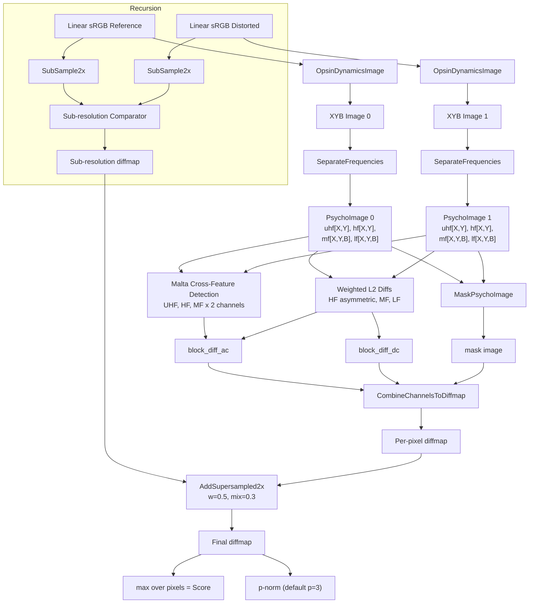
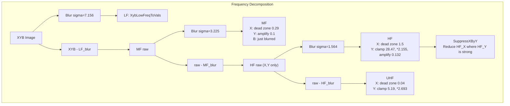

# Butteraugli Perceptual Distance

Butteraugli is a psychovisual image similarity metric designed by Jyrki
Alakuijala. It models human visual perception by decomposing images into
frequency bands in a perceptually-motivated color space, applying visual
masking, and aggregating per-pixel differences into a single distance score.

## Source Files

| File | Purpose |
|---|---|
| `lib/jxl/butteraugli/butteraugli.h` | Public API: `ButteraugliParams`, `ButteraugliComparator`, `PsychoImage`, `ButteraugliInterface()` |
| `lib/jxl/butteraugli/butteraugli.cc` | Full implementation (~2200 lines). Opsin model, frequency separation, Malta cross-feature detection, masking, diff accumulation, recursive multi-resolution |
| `tools/butteraugli_main.cc` | CLI tool. Decodes images to linear sRGB, calls `JxlButteraugliComparator`, prints max and p-norm scores |
| `lib/extras/metrics.cc` | `ComputeDistanceP()` -- p-norm aggregation over the diffmap |

## Key Types

### `ButteraugliParams`

```cpp
struct ButteraugliParams {
  float hf_asymmetry = 1.0f;     // Multiplier penalizing new HF artifacts vs blurring. 1.0 = neutral
  float xmul = 1.0f;             // Multiplier for X channel psychovisual difference
  float intensity_target = 80.0f; // Nits corresponding to 1.0 input value (SDR default = 80)
};
```

### `PsychoImage`

Four frequency bands per image, stored after decomposition:

```cpp
struct PsychoImage {
  ImageF uhf[2];  // Ultra-high frequency, X and Y channels only
  ImageF hf[2];   // High frequency, X and Y channels only
  Image3F mf;     // Medium frequency, all 3 XYB channels
  Image3F lf;     // Low frequency, all 3 XYB channels (converted to "vals" space)
};
```

Blue (B) channel is NOT tracked at UHF or HF -- only at MF and LF. This
reflects reduced human sensitivity to high-frequency chrominance changes in the
blue-yellow axis.

### `ButteraugliComparator`

Holds the reference image's PsychoImage decomposition plus a recursively
constructed sub-resolution comparator (2x downsampled). Created via the static
`Make()` factory. Key members:

- `pi0_`: PsychoImage of the reference
- `sub_`: `unique_ptr<ButteraugliComparator>` at half resolution (recursive)
- `blur_temp_`: reusable buffer for convolution transpose
- `temp_`: shared Image3F scratch space with atomic lock (`temp_in_use_`)

## Constants

These are the exact trained/tuned values from the source. They define the
perceptual model and are critical for faithful reproduction.

### Global Scale

```cpp
// std::log(80.0) / std::log(255.0);
constexpr float kIntensityTargetNormalizationHack = 0.79079917404f;
static const float kInternalGoodQualityThreshold = 17.83f * kIntensityTargetNormalizationHack;
// = 17.83 * 0.79079917404 = ~14.0999
static const float kGlobalScale = 1.0 / kInternalGoodQualityThreshold;
// = ~0.07092
```

### Opsin Absorbance Mixing Matrix

Models photopsin absorbance (cone response mixing). Linear RGB to 3-channel
cone-like response, then gamma-compressed. The matrix rows:

```
Channel 0 (L-like): 0.29956550340058319 * R + 0.63373087833825936 * G + 0.077705617820981968 * B + 1.7557483643287353
Channel 1 (M-like): 0.22158691104574774 * R + 0.69391388044116142 * G + 0.0987313588422 * B + 1.7557483643287353
Channel 2 (S-like): 0.02 * R + 0.02 * G + 0.20480129041026129 * B + 12.226454707163354
```

The bias terms (1.7557..., 12.2264...) serve as minimum clamp values after
sensitivity multiplication.

### Gamma Function

```cpp
// HDR-compatible gamma: Gamma(v) = 19.245... * ln(v + 9.9710...) + kRetAdd
// implemented as:
//   kRetMul = 19.245013259874995 * kInvLog2e  (to use FastLog2f)
//   kRetAdd = -23.16046239805755
//   biased = v + 9.9710635769299145
//   result = kRetMul * log2(biased) + kRetAdd
```

This is NOT a simple power-law gamma. It is a log-based function with an
additive bias, providing HDR headroom.

### XYB Color Space (from Opsin to XYB)

After opsin absorbance and gamma:
```
X = channel0 - channel1   (red-green opponent)
Y = channel0 + channel1   (luminance)
B = channel2              (blue, separate pathway)
```

### Frequency Separation Sigmas

```
kSigmaLf  = 7.15593339443   -- separates LF from MF
kSigmaHf  = 3.22489901262   -- separates MF from HF
kSigmaUhf = 1.56416327805   -- separates HF from UHF
kSigmaOpsinBlur = 1.2       -- pre-blur for opsin sensitivity computation
```

### Low-Frequency XYB-to-Vals Multipliers

Converts LF XYB to a "vals" space suitable for L2 comparison:

```
xmul_scalar = 33.832837186260
ymul_scalar = 14.458268100570
bmul_scalar = 49.87984651440
y_to_b_mul_scalar = -0.362267051518  (decorrelate B from Y before scaling)
```

### Malta Weights and Normalization

Malta is the oriented cross-feature detector used for structured difference
detection. Two variants: MaltaTag (HF, 9-sample lines) and MaltaTagLF (LF,
5-sample lines with stride 2).

#### UHF Malta (MaltaTag, used for uhf bands)
```
wUhfMalta  = 1.10039032555      norm1Uhf  = 71.7800275169
wUhfMaltaX = 173.5              norm1UhfX = 5.0
mulli (HF)  = 0.39905817637
len = 3.75
```

#### HF Malta (MaltaTagLF, used for hf bands)
```
wHfMalta   = 18.7237414387      norm1Hf   = 4498534.45232
wHfMaltaX  = 6923.99476109      norm1HfX  = 8051.15833247
mulli (LF) = 0.611612573796
len = 3.75
```

#### MF Malta (MaltaTagLF, used for mf bands)
```
wMfMalta   = 37.0819870399      norm1Mf   = 130262059.556
wMfMaltaX  = 8246.75321353      norm1MfX  = 1009002.70582
mulli (LF) = 0.611612573796
```

### L2 Diff Weights (`wmul[9]`)

Per-channel L2 weights for each frequency band:

```
wmul[0] = 400.0           -- HF X channel (asymmetric)
wmul[1] = 1.50815703118   -- HF Y channel (asymmetric)
wmul[2] = 0               -- (HF B unused)
wmul[3] = 2150.0          -- MF X channel
wmul[4] = 10.6195433239   -- MF Y channel
wmul[5] = 16.2176043152   -- MF B channel
wmul[6] = 29.2353797994   -- LF/DC X channel
wmul[7] = 0.844626970982  -- LF/DC Y channel
wmul[8] = 0.703646627719  -- LF/DC B channel
```

Note: HF X is 265x the weight of HF Y. The X (red-green) channel is extremely
sensitive at high frequencies.

### Masking Constants

#### SuppressXByY
```
suppress = 46.0      -- Y-channel activity that suppresses X
s = 0.653020556257   -- minimum suppression fraction (at infinite Y activity)
scaler = s + (1-s) * suppress / (Y*Y + suppress)
```

#### CombineChannelsForMasking
```
muls[0] = 2.5   (X channels, hf+uhf combined)
muls[1] = 0.4   (Y uhf)
muls[2] = 0.4   (Y hf)
mask = sqrt((x*2.5)^2 + (y_uhf*0.4 + y_hf*0.4)^2)
```

#### DiffPrecompute (mask preprocessing)
```
kMul = 6.19424080439
kBias = 12.61050594197
output = sqrt(kMul * |input| + kMul * kBias) - sqrt(kMul * kBias)
```

#### Mask Blur and Erosion
```
kRadius = 2.7               -- blur radius for mask
kMaskToErrorMul = 10.0      -- weight for mask-difference contribution to AC error
FuzzyErosion kStep = 3      -- step size for local minimum search
FuzzyErosion weights: 0.45 * min0 + 0.3 * min1 + 0.25 * min2
```

#### MaskY (AC masking from combined activity)
```
offset = 0.829591754942
scaler = 0.451936922203
mul = 2.5485944793
c = mul / (scaler * delta + offset)
return (kGlobalScale * (1 + c))^2
```

#### MaskDcY (DC masking)
```
offset = 0.20025578522
scaler = 3.87449418804
mul = 0.505054525019
c = mul / (scaler * delta + offset)
return (kGlobalScale * (1 + c))^2
```

Both masks return a squared multiplier. Higher activity (larger delta) reduces
the multiplier, meaning differences in textured regions are suppressed. This is
classic visual masking: noise hides in noise.

### Range Modification Constants

Applied during frequency separation to shape channel responses:

```
MF X: RemoveRangeAroundZero(kRemoveMfRange = 0.29)      -- dead zone
MF Y: AmplifyRangeAroundZero(kAddMfRange = 0.1)         -- boost near zero
HF X: RemoveRangeAroundZero(kRemoveHfRange = 1.5)
HF Y: MaximumClamp(kMaxclampHf = 28.4691806922), then *kMulYHf=2.155, then AmplifyRangeAroundZero(kAddHfRange = 0.132)
UHF X: RemoveRangeAroundZero(kRemoveUhfRange = 0.04)
UHF Y: MaximumClamp(kMaxclampUhf = 5.19175294647), then *kMulYUhf=2.69313763794
```

### MaximumClamp

Soft clamp that transitions to a linear slope beyond a threshold:
```
kMul = 0.724216145665
if v >= maxval: result = (v - maxval) * kMul + maxval
if v <= -maxval: result = (v + maxval) * kMul - maxval
```

### MaltaDiffMapT Asymmetry Thresholds

Within the per-pixel diff computation before Malta cross-detection:
```
kWeight0 = 0.5     (for symmetric/primary term)
kWeight1 = 0.33    (for asymmetric/secondary term)
too_small = 0.55 * |original_value|
too_big = 1.05 * |original_value|
```

### L2DiffAsymmetric Thresholds (HF bands)

```
too_small = 0.4 * |val0|   (40% of original absolute value)
too_big = 1.0 * |val0|     (100% of original absolute value)
weight scaling: * 0.8
```

### Multi-Resolution

```
kHeuristicMixingValue = 0.3   -- sub-resolution mixing weight
AddSupersampled2x weight = 0.5
result[x] *= (1 - 0.3 * 0.5) = 0.85, then += 0.5 * subresult
```

## Algorithm Details

### Step-by-Step Pipeline

#### 1. Input Validation and Small-Image Handling

Images smaller than 8x8 are border-extended to 8x8 by clamping coordinates,
processed normally, then cropped back. This is a workaround -- butteraugli
scores for very small images are described in the code as "non-sensical."

#### 2. Opsin Dynamics Image (RGB to XYB)

`OpsinDynamicsImage()` converts linear sRGB to XYB:

1. **Pre-blur** the input RGB with sigma=1.2 Gaussian
2. **Opsin absorbance**: apply the 3x3+bias mixing matrix to the blurred image
   (with clamping to bias minimums)
3. **Gamma**: apply the log-based gamma function to get cone-response signals
4. **Sensitivity**: divide gamma output by the pre-mixed opsin values to get
   local adaptation/sensitivity
5. **Apply to original**: multiply the opsin absorbance of the ORIGINAL (unblurred)
   pixels by the sensitivity from the blurred version
6. **Clamp**: force minimum values equal to the bias terms
7. **XYB transform**: X = ch0 - ch1, Y = ch0 + ch1, B = ch2

The sensitivity step is the "dynamics" part -- it models how the retina adapts
locally. The blur represents the spatial extent of this adaptation.

#### 3. Frequency Decomposition (`SeparateFrequencies`)

Three successive blur-and-subtract passes decompose the XYB image:

```
XYB image
  |
  |-- Blur(sigma=7.156) --> LF  (convert to "vals" space via XybLowFreqToVals)
  |-- Remainder ----------> MF_raw
                              |
                              |-- Blur(sigma=3.225) --> MF (with range modifications)
                              |-- Remainder ----------> HF_raw (X, Y only)
                                                         |
                                                         |-- Blur(sigma=1.564) --> HF (with range mods + clamping)
                                                         |-- Remainder ----------> UHF (X, Y only)
```

Range modifications applied during separation:
- **MF X**: dead zone of +/-0.29 removed (small values zeroed)
- **MF Y**: values near zero amplified by 2x up to +/-0.1
- **HF X**: dead zone of +/-1.5 removed
- **HF Y**: soft-clamped to +/-28.47, then scaled by 2.155, then near-zero amplified
- **UHF X**: dead zone of +/-0.04 removed
- **UHF Y**: soft-clamped to +/-5.19, then scaled by 2.693

After HF separation, `SuppressXByY()` reduces the HF X channel where HF Y has
high activity. This models the reduced sensitivity to chrominance detail in
luminance-active regions.

#### 4. Masking

`MaskPsychoImage()` builds a single-channel mask from the HF and UHF X/Y channels:

1. **CombineChannelsForMasking**: weighted norm of HF and UHF activity
   ```
   activity = sqrt((2.5*(uhf_x + hf_x))^2 + (0.4*uhf_y + 0.4*hf_y)^2)
   ```
2. **DiffPrecompute**: sqrt-compress the activity with bias
3. **Blur** the compressed activity (sigma=2.7)
4. **FuzzyErosion**: local minimum filter (step=3, weighted average of 3 smallest
   neighbors) -- reduces masking near smooth areas to prevent over-masking at
   texture boundaries
5. Also computes a **mask-difference** term: squared difference of the two
   images' blurred mask signals, scaled by 10.0, added to the AC diff

The mask value at each pixel determines how much to multiply the per-pixel error.
Smooth regions (low activity) get HIGH mask multipliers (errors are visible).
Textured regions (high activity) get LOW mask multipliers (errors are hidden).

#### 5. Difference Accumulation

Three categories of difference are accumulated separately:

##### DC/LF Differences (`block_diff_dc`)
Per-channel weighted L2 of the LF "vals" images:
```
block_diff_dc[c] = wmul[6+c] * (lf0[c] - lf1[c])^2
```

##### AC Differences (`block_diff_ac`)

Multiple sources sum into the AC diff image per XYB channel:

**a. Malta cross-feature detection** (6 calls total):
- MF Y and MF X (using MaltaDiffMapLF variant, 5-sample sparse lines)
- HF Y and HF X (using MaltaDiffMapLF variant)
- UHF Y and UHF X (using MaltaDiffMap variant, 9-sample dense lines)

The Malta detector:
1. Computes per-pixel scaled differences: `diff * norm / (norm + 0.5*(|a|+|b|))`
2. Adds secondary asymmetric penalties when the distorted image is "too small"
   (<55% of original) or "too big" (>105% of original)
3. Runs 16 oriented line kernels (horizontal, vertical, diagonal, and
   intermediate angles) across the difference image
4. Each kernel sums 5 or 9 samples along its line direction
5. Accumulates the sum-of-squares of all kernel responses

This is NOT a simple pixel-difference metric. Malta detects structured errors
along oriented features (edges, lines, textures). A single bright pixel
produces moderate Malta response, but a coherent line of errors produces
response proportional to the line length squared.

**b. Weighted L2** of the MF channels:
```
block_diff_ac[c] += wmul[3+c] * (mf0[c] - mf1[c])^2
```

**c. Asymmetric L2** of the HF X and Y channels (accounts for `hf_asymmetry`):
```
Primary: w * 0.8 * (val0 - val1)^2
Secondary: w_asym * 0.8 * penalty^2  where penalty depends on too_small/too_big thresholds
```

**d. Mask difference** (from step 4): adds squared difference of mask images to AC Y channel.

##### HF Asymmetry

The `hf_asymmetry` parameter scales weights differently for "new artifact" vs
"blurred away" comparisons:
- UHF Malta: `w_0gt1 = w * hf_asymmetry`, `w_0lt1 = w / hf_asymmetry`
- HF Malta: `w_0gt1 = w * sqrt(hf_asymmetry)`, `w_0lt1 = w / sqrt(hf_asymmetry)`
- HF L2: `w_0gt1 = w * hf_asymmetry`, `w_0lt1 = w / hf_asymmetry`

With `hf_asymmetry > 1.0`, new artifacts (original > distorted) are penalized
more than blurring (original < distorted).

#### 6. Combine Channels to Diffmap (`CombineChannelsToDiffmap`)

For each pixel:
1. Read the mask value
2. Compute `MaskY(val)` for AC and `MaskDcY(val)` for DC
3. Apply the X-channel multiplier (`xmul`) to channel 0
4. Sum: `dc_total = sum(diff_dc[c] * dc_maskval)` and `ac_total = sum(diff_ac[c] * maskval)`
5. Output: `diffmap[x,y] = sqrt(dc_total + ac_total)`

`MaskColor()` simply sums `color[c] * mask` for all 3 channels (same mask
value for all channels).

#### 7. Multi-Resolution Recursion

The `ButteraugliComparator::Make()` factory recursively creates sub-resolution
comparators:

1. Create comparator at full resolution, compute PsychoImage for reference
2. 2x downsample the reference RGB (box filter with edge correction)
3. Recursively call `Make()` on the downsampled image
4. Recursion stops when either dimension < 8

During `Diffmap()`:
1. Compute full-resolution diffmap
2. If sub-comparator exists and its dimensions >= 8:
   - 2x downsample the distorted image
   - Compute sub-resolution diffmap
   - Upsample and mix: `result *= 0.85; result += 0.5 * subresult`

The `ButteraugliDiffmapInPlace()` path (used by `ButteraugliInterfaceInPlace`)
does only ONE level of recursion (not fully recursive), checking `xsize >= 15 && ysize >= 15`.

### What the Recursion Captures

The multi-resolution recursion adds sensitivity to errors at scales larger than
the sigma-7.16 LF blur can resolve. Without it, large-scale structural
differences (like a global color shift visible at low resolution but distributed
over many pixels) would be under-weighted. The recursive 2x downsampling
effectively extends the frequency analysis to arbitrarily low frequencies.

## Score Aggregation

### Max Score (Default)

`ButteraugliScoreFromDiffmap()` returns the maximum value across all pixels
in the diffmap. This is the headline "butteraugli score."

### P-Norm Score

`ComputeDistanceP()` computes a multi-scale p-norm (default p=3):

For each pixel value `d`:
```
sum1[0] += d^p           (= d^3)
sum1[1] += d^(2p)        (= d^6)
sum1[2] += d^(4p)        (= d^12)
```

Then:
```
v  = (mean(sum1[0]))^(1/(p*1))    -- = mean^(1/3)
v += (mean(sum1[1]))^(1/(p*2))    -- = mean^(1/6)
v += (mean(sum1[2]))^(1/(p*4))    -- = mean^(1/12)
v /= 3
```

This produces a value between the mean and the max. Higher-order terms (d^6,
d^12) emphasize outliers more heavily. The three terms at different powers
provide a smooth approximation of the max norm that still accounts for the
spatial extent of errors.

Default p=3 in `butteraugli_main`. This p-norm is what gets printed as the
second line of output.

## Fuzzy Class Mapping

`ButteraugliFuzzyClass()` maps raw scores to a 0-2 quality scale:
- 2.0 = perfect match
- 1.0 = acceptable quality boundary
- 0.0 = bad quality

Uses a sigmoid: `m0 / (1 + exp((score - 1.0) * fuzzy_width))` with
`fuzzy_width_up = fuzzy_width_down = 4.8`, `m0 = 2.0`, `scaler = 0.7777`.

## Dependencies

- **Highway (hwy)**: SIMD abstraction layer. All inner loops use HWY vector
  types. Malta kernels, L2 diff, opsin dynamics, and masking are all vectorized.
- **`lib/jxl/convolve.h`**: `Separable5()` for fast 5x5 convolution (used when
  Gaussian kernel fits in 5 taps).
- **`lib/jxl/base/fast_math-inl.h`**: `FastLog2f()` for the gamma function.
- **`lib/jxl/image.h`**: `ImageF`, `Image3F` planar image storage.
- **`lib/extras/metrics.cc`**: `ComputeDistanceP()` for p-norm scoring.

No threading is used within butteraugli itself (all single-threaded). Threading
happens at the caller level (e.g., `butteraugli_main` creates a thread pool for
image I/O but the comparison is serial).

## Mermaid Diagram Data



```mermaid
flowchart TD
    subgraph "OpsinDynamicsImage (per-pixel)"
        R[R * intensity_target] --> BLUR[Gaussian Blur sigma=1.2]
        G[G * intensity_target] --> BLUR
        B[B * intensity_target] --> BLUR

        BLUR --> ABSBLUR[OpsinAbsorbance<br/>3x3+bias matrix<br/>clamped]
        ABSBLUR --> GAMMA[Gamma<br/>19.245 * ln(v + 9.971) - 23.16]
        GAMMA --> SENS["Sensitivity = Gamma(v) / v"]

        R --> ABS[OpsinAbsorbance<br/>3x3+bias matrix<br/>unclamped]
        G --> ABS
        B --> ABS
        ABS --> MUL["* Sensitivity"]
        SENS --> MUL
        MUL --> CLAMP[Clamp to minimums]
        CLAMP --> XYB["X = ch0 - ch1<br/>Y = ch0 + ch1<br/>B = ch2"]
    end
```



## Open Questions

1. **Why is Blue excluded from HF and UHF?** The code only computes HF and UHF
   for X and Y channels, never B. The comment "No blue channel error
   accumulated at HF" (line 1932) confirms this is intentional. This presumably
   reflects the sparse distribution of S-cones in the retina, making
   high-frequency blue sensitivity very low. But how much perceptual accuracy is
   lost for blue-channel artifacts at fine scales?

2. **Malta kernel orientation count discrepancy.** MaltaTagLF uses 16 oriented
   line kernels (5 samples each at stride 2). MaltaTag uses 16 kernels (9
   samples each at stride 1). Both include diagonal, near-diagonal, horizontal,
   and vertical orientations. The extra density of MaltaTag (9 vs 5 samples) at
   UHF presumably captures finer structural patterns. Are 16 orientations
   sufficient for isotropy?

3. **The `kHeuristicMixingValue = 0.3` in multi-resolution mixing.** The
   comment says "There will be less errors from the more averaged images" and
   the value is described as heuristic. The current formula
   `result *= (1 - 0.3*w)` then `result += w * subresult` does not preserve
   the energy norm. Is this a calibrated trade-off or an expedient
   approximation?

4. **`ButteraugliDiffmapInPlace` vs `ButteraugliComparator::Diffmap` recursion
   depth.** The in-place path does exactly one level of sub-resolution (checks
   `xsize >= 15`). The Comparator path recurses until a dimension drops below 8.
   For a 4096x4096 image, the Comparator creates ~9 levels of sub-resolution
   comparators. This is a significant behavioral difference between the two code
   paths.

5. **Why does `ButteraugliScoreFromDiffmap` use max (L-infinity norm)?** The
   max is extremely sensitive to single-pixel outliers. The p-norm (p=3) is also
   computed and printed by the CLI tool, but the "official" score is the max.
   For encoder optimization, the p-norm may be more useful since it is
   differentiable and reflects aggregate quality.

6. **Intensity target normalization.** The `kIntensityTargetNormalizationHack`
   = `log(80)/log(255)` appears to be a compatibility shim. The name "hack"
   suggests it was added to maintain score consistency when intensity_target
   support was introduced. What is the exact historical context?
