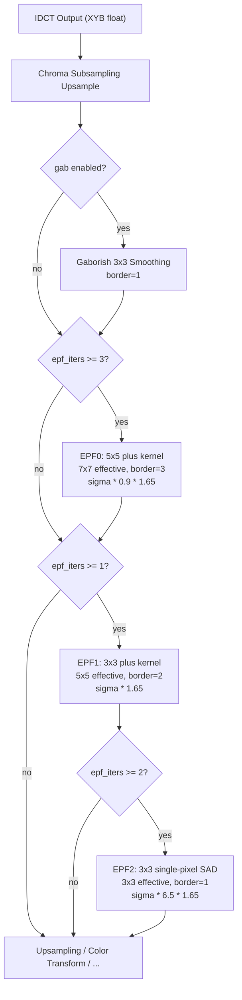
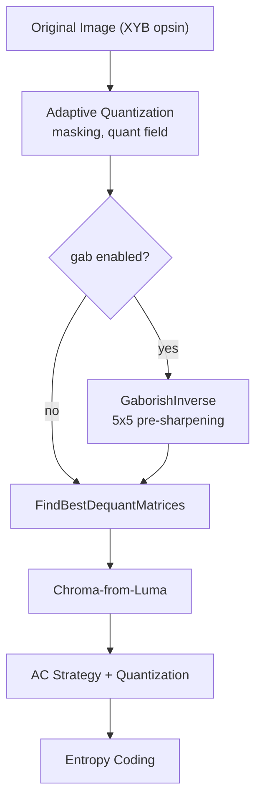
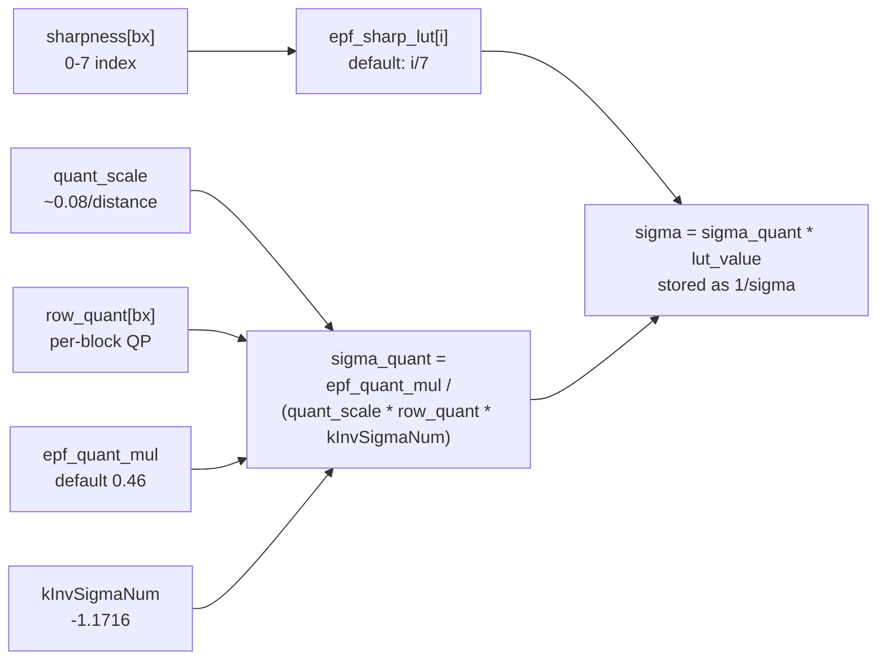

# Gaborish and Edge-Preserving Filter (EPF)

Two decoder-side filters applied in the render pipeline after IDCT: Gaborish (a
fixed 3x3 smoothing convolution) and EPF (an adaptive, nonlinear edge-preserving
filter with 1-3 stages). The encoder applies the *inverse* of these operations
before quantization so the decoder can recover the original signal more
faithfully.

## Source Files

| File | Role |
|------|------|
| `lib/jxl/enc_gaborish.h` | Encoder-side GaborishInverse declaration |
| `lib/jxl/enc_gaborish.cc` | Encoder-side inverse Gaborish (5x5 Symmetric convolution, butteraugli-tuned) |
| `lib/jxl/render_pipeline/stage_gaborish.h` | Decoder-side Gaborish render pipeline stage declaration |
| `lib/jxl/render_pipeline/stage_gaborish.cc` | Decoder-side Gaborish (3x3 convolution, SIMD via Highway) |
| `lib/jxl/epf.h` | ComputeSigma declaration + constants (kInvSigmaNum, kMinSigma) |
| `lib/jxl/epf.cc` | ComputeSigma: builds per-block sigma image from quant field + sharpness LUT |
| `lib/jxl/render_pipeline/stage_epf.h` | EPF stage declarations (EpfStage enum: Zero, One, Two) |
| `lib/jxl/render_pipeline/stage_epf.cc` | Three EPF stage implementations (EPF0, EPF1, EPF2), all SIMD via Highway |
| `lib/jxl/loop_filter.h` | LoopFilter struct: all Gaborish + EPF parameters, serialized per-frame |
| `lib/jxl/loop_filter.cc` | LoopFilter::VisitFields: default values + serialization |
| `lib/jxl/convolve.h` | WeightsSymmetric5 struct definition, Symmetric5() convolution |
| `lib/jxl/convolve_symmetric5.cc` | SIMD 5x5 symmetric convolution implementation |
| `lib/jxl/enc_frame.cc` | LoopFilterFromParams: decides gab on/off and epf_iters from CompressParams |
| `lib/jxl/enc_heuristics.cc` | Applies GaborishInverse in encoder; computes epf_sharpness per block |
| `lib/jxl/dec_cache.cc` | Wires Gaborish + EPF stages into the render pipeline (lines 148-167) |

## Key Types

### LoopFilter (loop_filter.h)

Serialized per-frame. Contains all filter configuration:

```cpp
struct LoopFilter : public Fields {
  bool gab;                     // Gaborish enabled (default: true)
  bool gab_custom;              // Custom weights (default: false)
  float gab_x_weight1;         // X channel: 4-connected neighbor weight
  float gab_x_weight2;         // X channel: diagonal neighbor weight
  float gab_y_weight1;         // Y channel: 4-connected neighbor weight
  float gab_y_weight2;         // Y channel: diagonal neighbor weight
  float gab_b_weight1;         // B channel: 4-connected neighbor weight
  float gab_b_weight2;         // B channel: diagonal neighbor weight

  uint32_t epf_iters;          // 0-3: number of EPF stages (2 bits, default 2)

  bool epf_sharp_custom;
  float epf_sharp_lut[8];      // Sharpness LUT (default: linear ramp 0..1)

  bool epf_weight_custom;
  float epf_channel_scale[3];  // Per-channel SAD weights (XYB)
  float epf_pass1_zeroflush;   // Min weight threshold, pass 1 (EPF0 + EPF1)
  float epf_pass2_zeroflush;   // Min weight threshold, pass 2 (EPF2)

  bool epf_sigma_custom;
  float epf_quant_mul;          // Sigma = this / (quant_scale * row_quant * kInvSigmaNum)
  float epf_pass0_sigma_scale;  // Extra sigma scaling for EPF0 (pass 0)
  float epf_pass2_sigma_scale;  // Extra sigma scaling for EPF2 (pass 2)
  float epf_border_sad_mul;     // Tighter filtering at 8x8 block borders

  float epf_sigma_for_modular;  // Fixed sigma for modular frames
};
```

### WeightsSymmetric5 (convolve.h)

5x5 symmetric kernel layout (lower-right quadrant only, each weight replicated
4x for SIMD):

```
D  L  R  L  D
L  d  r  d  L
R  r  c  r  R
L  d  r  d  L
D  L  R  L  D
```

```cpp
struct WeightsSymmetric5 {
  float c[4];  // center
  float r[4];  // 4-connected (distance 1)
  float R[4];  // axis-aligned distance 2
  float d[4];  // diagonal (distance sqrt(2))
  float D[4];  // corner (distance 2*sqrt(2))
  float L[4];  // knight's-move (distance sqrt(5))
};
```

### EpfStage (stage_epf.h)

```cpp
enum class EpfStage : uint8_t { Zero, One, Two };
```

## Constants (EXACT values)

### Gaborish Decoder Kernel (3x3)

Default weights per channel (unnormalized; divided by `1 + 4*(w1 + w2)` to
normalize):

```
w1 = 1.1 * 0.104699568 = 0.1151695248   (4-connected neighbors)
w2 = 1.1 * 0.055680538 = 0.0612485918   (diagonal neighbors)
w0 = 1.0                                 (center)
```

All three channels (X, Y, B) use the same default weights. The 3x3 kernel shape:

```
w2  w1  w2
w1  w0  w1
w2  w1  w2
```

Normalized (sum = 1 + 4*(0.1151695248 + 0.0612485918) = 1.7056724664):

```
center:   w0 / sum = 0.58628...
edge:     w1 / sum = 0.06752...
diagonal: w2 / sum = 0.03591...
```

Validation: the unnormalized kernel sums to
`1 + 4*(gab_x_weight1 + gab_x_weight2)`, and the code rejects configurations
where `|1 + 4*(w1 + w2)| < 1e-8`.

### Gaborish Encoder Inverse Kernel (5x5, approximate)

The encoder applies an approximate inverse via a 5x5 symmetric convolution,
NOT the true mathematical inverse. The five unique base coefficients were
optimized by butteraugli for rate-distortion (not algebraic inversion):

```cpp
static const float kGaborish[5] = {
    -0.09495815671340026,    // [0] 4-connected (distance 1)
    -0.041031725066768575,   // [1] diagonal (distance sqrt(2))
     0.013710004822696948,   // [2] axis-aligned distance 2
     0.006510206083837737,   // [3] knight's-move (distance sqrt(5))
    -0.0014789063378272242,  // [4] corner (distance 2*sqrt(2))
};
```

These map to WeightsSymmetric5 fields as:

```
weights.c = normalize            (center = 1.0 normalized)
weights.r = normalize_mul * kGaborish[0]   (4-connected)
weights.R = normalize_mul * kGaborish[2]   (distance 2 axis-aligned)
weights.d = normalize_mul * kGaborish[1]   (diagonal)
weights.D = normalize_mul * kGaborish[4]   (corner)
weights.L = normalize_mul * kGaborish[3]   (knight's-move)
```

Per-channel normalization factor:

```
sum = 1.0 + mul[i] * 4 * (kGaborish[0] + kGaborish[1] + kGaborish[2]
                          + kGaborish[4] + 2 * kGaborish[3])
normalize = 1.0 / sum
normalize_mul = mul[i] * normalize
```

With `mul[i] = 1.0` (VarDCT default):
`sum = 1 + 4*(-0.09496 + -0.04103 + 0.01371 + -0.00148 + 2*0.00651)`
`sum = 1 + 4*(-0.11124) = 1 + (-0.44497) = 0.55503`
`normalize = 1/0.55503 = 1.8018...`

For modular mode, `mul[i] = 0.9908511`, slightly different normalization.

Note: The negative center-sum means the inverse is a *sharpening* filter
(center coefficient > 1.0 after normalization, positive neighbors made
negative). This pre-sharpens to compensate for the decoder's blurring.

### EPF Constants

```cpp
static constexpr float kInvSigmaNum = -1.1715728752538099024f;
// = 4 * (sqrt(0.5) - 1), chosen so Weight(sigma) = 0.5

constexpr float kMinSigma = -3.90524291751269967465540850526868f;
// = kInvSigmaNum / 0.3

constexpr size_t kBlockDim = 8;
constexpr size_t kSigmaPadding = 2;
constexpr size_t kSigmaBorder = 1;
```

### EPF Default Parameters

From `loop_filter.cc` VisitFields (F16 = half-precision serialized):

| Parameter | Default | Purpose |
|-----------|---------|---------|
| `epf_iters` | 2 | Number of EPF stages (0-3) |
| `epf_channel_scale[0]` | 40.0 | X channel SAD weight |
| `epf_channel_scale[1]` | 5.0 | Y channel SAD weight |
| `epf_channel_scale[2]` | 3.5 | B channel SAD weight |
| `epf_pass1_zeroflush` | 0.45 | Weight threshold for EPF0/EPF1 |
| `epf_pass2_zeroflush` | 0.6 | Weight threshold for EPF2 |
| `epf_quant_mul` | 0.46 | Sigma-to-quant multiplier |
| `epf_pass0_sigma_scale` | 0.9 | Sigma scaling for EPF0 |
| `epf_pass2_sigma_scale` | 6.5 | Sigma scaling for EPF2 |
| `epf_border_sad_mul` | 2/3 (0.6667) | Inverse border SAD multiplier |

EPF sharpness LUT defaults (linear ramp, 8 entries):

```
epf_sharp_lut[i] = i / 7.0
[0] = 0.0000, [1] = 0.1429, [2] = 0.2857, [3] = 0.4286,
[4] = 0.5714, [5] = 0.7143, [6] = 0.8571, [7] = 1.0000
```

### EPF Iteration Thresholds (Encoder)

From `enc_frame.cc`, with `decoding_speed_tier < 3`:

```cpp
constexpr float kThresholds[3] = {0.7, 1.5, 4.0};
```

| butteraugli_distance | epf_iters |
|---------------------|-----------|
| < 0.7 | 0 |
| [0.7, 1.5) | 1 |
| [1.5, 4.0) | 2 |
| >= 4.0 | 3 |

For `decoding_speed_tier == 2`, the first threshold (0.7) is skipped, so EPF
starts at distance >= 1.5.

### Gaborish Activation Conditions (Encoder)

Gaborish is enabled when ALL of:
- `speed_tier <= SpeedTier::kHare`
- `encoding == FrameEncoding::kVarDCT`
- `decoding_speed_tier < 4`
- `butteraugli_distance > 0.5`
- `!disable_perceptual_optimizations`

## Algorithm Details

### Gaborish: Decoder-Side 3x3 Smoothing

**Purpose**: Mild deblocking/smoothing applied identically to all pixels in all
three XYB channels. Operates as a fixed 3x3 weighted average with per-channel
weights.

**Kernel shape**: 3x3, weights depend only on distance:
- Center pixel: `w0` (largest)
- 4-connected neighbors (up, down, left, right): `w1`
- 4 diagonal neighbors: `w2`

**Normalization**: `1 / (w0 + 4*w1 + 4*w2)` applied at construction time, so
the output is a true weighted average (kernel sums to 1).

**SIMD implementation** (`stage_gaborish.cc`):
- Render pipeline stage with border=1, shift=0
- Processes all 3 channels independently per row
- Uses `HWY_FULL(float)` vectors
- Loads 9 values per output pixel: center (aligned), 4 edge (LoadU offset
  +/-1), 4 corner (LoadU offset +/-1 from adjacent rows)
- Computes `w0*center + w1*(l+r+t+b) + w2*(tl+tr+bl+br)` via MulAdd chain
- Handles >= 512-bit vectors with LoadU everywhere to cope with non-aligned
  group data

### Gaborish: Encoder-Side Inverse (Pre-Sharpening)

**Purpose**: Pre-sharpen the image before quantization so that after the
decoder applies the smoothing Gaborish, the result is closer to the original.

**Implementation**: A 5x5 symmetric convolution via `Symmetric5()`. NOT an
exact inverse -- the 5x5 kernel was tuned by butteraugli-based optimization of
the full encode-decode system.

**Kernel properties**: The base coefficients are mostly negative (sharpening).
With `mul = 1.0`:
- Center weight after normalization: `1/0.555 = 1.802` (amplified)
- Neighbor weights are negative (subtract neighbors = sharpen)
- Knight's-move weight is the only positive non-center weight (0.00651)

**Memory optimization**: The 5x5 convolution cannot work in-place. To reduce
memory, the code reuses the planes of the input Image3F by processing in this
order:
1. Convolve plane 0 -> write to plane 2
2. Convolve plane 1 -> write to plane 0
3. Convolve temp (copy of original plane 2) -> write to plane 1
4. Swap planes to restore order (0,1,2)

The rect is extended by 3 pixels (`rect.Extend(3, ...)`) to provide border
data for the 5x5 kernel (radius 2 + extra for the SIMD implementation).

### EPF: Adaptive, Nonlinear Edge-Preserving Filter

**Purpose**: Selectively smooth quantization noise in flat/smooth regions while
preserving edges. Operates on all 3 XYB channels simultaneously.

**Sigma computation** (`epf.cc`):

Per-block sigma controls filter strength:

```
sigma_quant = epf_quant_mul / (quant_scale * row_quant[bx] * kInvSigmaNum)
sigma = sigma_quant * epf_sharp_lut[sharpness[bx]]
```

Where:
- `quant_scale` is roughly `0.08 / butteraugli_distance`
- `row_quant[bx]` is the per-block quantization multiplier
- `kInvSigmaNum = 4*(sqrt(0.5)-1) = -1.1716...` (calibrated so Weight(sigma)=0.5)
- `epf_sharp_lut` maps the per-block sharpness index (0-7) to a scaling factor

The stored sigma is `1.0 / sigma` (inverse), clamped to `<= -1e-4` to avoid
infinities. The sigma image has `kSigmaPadding=2` border with mirrored values.

**Weight function** (all EPF stages):

```cpp
Weight(sad, inv_sigma, threshold) {
    v = sad * inv_sigma + 1.0;
    return max(v, 0.0);  // ZeroIfNegative
}
```

This is a linearly decaying weight: at `sad = 0`, weight = 1.0; at
`sad = -1/inv_sigma = sigma`, weight = 0.0. Larger differences get zero weight.
The `threshold` parameter (zeroflush) is declared but NOT USED in the actual
Weight() function -- it is vestigial.

**Border handling**: Pixels at 8x8 block boundaries receive tighter filtering
(lower sigma) via `epf_border_sad_mul`:

```
// For interior pixels of a block:
sad_mul_center = {bsm, sm, sm, sm, sm, sm, sm, bsm}
// For pixels on block-boundary rows:
sad_mul_border = {bsm, bsm, bsm, bsm, bsm, bsm, bsm, bsm}
// where bsm = sm * epf_border_sad_mul (default 2/3)
```

The first and last pixel of each block row always use the border multiplier.

**Skip condition**: If `row_sigma[bx] < kMinSigma` (sigma too small = very
high quality), the block is passed through unfiltered.

### EPF Stage 0 (EPF0): 5x5 Plus-Shaped Kernel

- **Effective filter size**: 7x7 (5x5 kernel + 3x3 SAD patch)
- **Render pipeline border**: 3
- **SAD computation**: For each of 12 neighbor offsets (the plus-shaped
  cross at distance 1-2), compute 3x3-plus-shaped patch SAD across all 3
  channels with `epf_channel_scale` weighting
- **Neighbor offsets** (12 positions, plus pattern at radius 2):
  ```
  (-2,0), (-1,-1), (-1,0), (-1,1),
  (0,-2), (0,-1), (0,1), (0,2),
  (1,-1), (1,0), (1,1), (2,0)
  ```
- **SAD patch**: 5 pixels in plus shape: `(0,0), (-1,0), (0,-1), (1,0), (0,1)`
- **Sigma**: `row_sigma[bx] * epf_pass0_sigma_scale * 1.65`
  (default total: `sigma * 0.9 * 1.65 = sigma * 1.485`)
- **Weight threshold**: `epf_pass1_zeroflush` (0.45)
- **Output**: Weighted average of center pixel (weight=1) + 12 neighbors

### EPF Stage 1 (EPF1): 3x3 Plus-Shaped Kernel

- **Effective filter size**: 5x5 (3x3 kernel + 3x3 SAD patch)
- **Render pipeline border**: 2
- **SAD computation**: 4 neighbors (up, left, right, down), each with
  5-pixel plus-shaped patch SAD, optimized with extensive register reuse
- **Neighbor offsets**: `(-1,0), (0,-1), (0,+1), (+1,0)`
- **Sigma**: `row_sigma[bx] * 1.65` (no extra scaling)
- **Weight threshold**: `epf_pass1_zeroflush` (0.45)
- **Output**: Weighted average of center (weight=1) + 4 neighbors

### EPF Stage 2 (EPF2): 3x3 Plus, Single-Pixel SAD

- **Effective filter size**: 3x3
- **Render pipeline border**: 1
- **SAD computation**: Simple per-pixel L1 distance (no patch), weighted
  by `epf_channel_scale` across 3 channels
- **Neighbor offsets**: `(-1,0), (0,-1), (0,+1), (+1,0)`
- **Sigma**: `row_sigma[bx] * epf_pass2_sigma_scale * 1.65`
  (default total: `sigma * 6.5 * 1.65 = sigma * 10.725`)
- **Weight threshold**: `epf_pass2_zeroflush` (0.6)
- **Output**: Weighted average of center (weight=1) + 4 neighbors
- **Much stronger blur** (10.7x sigma vs 1.485x or 1.65x) but simpler
  similarity measure, serving as a final refinement pass

### EPF Stage Combinations

The `epf_iters` parameter controls which stages are applied:

| epf_iters | Stages applied (in order) | Total padding |
|-----------|---------------------------|---------------|
| 0 | None | 0 |
| 1 | EPF1 | 2 |
| 2 | EPF1, EPF2 | 3 |
| 3 | EPF0, EPF1, EPF2 | 6 |

From `dec_cache.cc`:
```cpp
if (lf.epf_iters >= 3) builder.AddStage(EPF0);
if (lf.epf_iters >= 1) builder.AddStage(EPF1);
if (lf.epf_iters >= 2) builder.AddStage(EPF2);
```

Total padding = sum of borders + gab border:
`padding_per_epf_iter[4] = {0, 2, 3, 6}` plus `+1` if gab is enabled.

### Precision Mode

All three EPF stages have a precision switch:
```cpp
#if JXL_HIGH_PRECISION
  auto inv_w = Div(Set(df, 1.0f), w);   // exact division
#else
  auto inv_w = ApproximateReciprocal(w); // ~12-bit accuracy
#endif
```

### Encoder-Side EPF Sharpness Optimization

When `butteraugli_distance >= 0.5` and `speed_tier <= kWombat`, the encoder
runs a multi-pass optimization to select per-block sharpness values
(`enc_heuristics.cc` lines 893-1014):

1. Define candidate sharpness steps: `{0, 2, 7}` (for distance <= 4.5) or
   `{0, 4}` (for distance > 4.5)
2. For each candidate, fill `epf_sharpness` uniformly, reconstruct the full
   decode (including EPF), and compute per-block L2 error vs original
3. First pass: pick the candidate with lowest error per block, with a bias
   toward sharpness=0 (`kFavorNoSmoothing = 0.99`)
4. Build context-dependent histograms (top_val x left_val contexts)
5. Second pass: apply context-dependent cost multipliers derived from the
   histograms, re-pick optimal sharpness per block

At `speed_tier > kWombat` or `distance < 0.5`, all blocks get sharpness=4
(the middle of the 0-7 range).

## Cost Functions & Decision Trees

### EPF Iteration Count Decision

```
if cparams.epf explicitly set:
    use cparams.epf
elif disable_perceptual_optimizations or modular:
    epf_iters = 0
elif decoding_speed_tier >= 3:
    epf_iters = 0
else:
    epf_iters = count(distance >= threshold for threshold in [0.7, 1.5, 4.0])
    // skip first threshold if decoding_speed_tier == 2
```

### Gaborish Enable Decision

```
gab = cparams.gaborish override
    OR (speed <= Hare
        AND VarDCT
        AND decoding_speed < 4
        AND distance > 0.5
        AND !disable_perceptual)
```

### EPF Weight Function (the filter's core decision)

For each neighbor pixel:
```
sad = sum_c(|patch_center_c - patch_neighbor_c| * channel_scale[c])
weight = max(0, sad * inv_sigma + 1)
```

This is a hard-thresholded linear decay: neighbors with SAD > sigma get
exactly zero weight (excluded from the average). The center pixel always has
weight 1.0. The result is `sum(weight_i * pixel_i) / sum(weight_i)`.

## Dependencies

- **Highway (hwy)**: SIMD dynamic dispatch for all filter stages
- **convolve.h / convolve_symmetric5.cc**: Symmetric5() for encoder inverse
- **image.h / image_ops.h**: Image3F, ImageF, ImageB, CopyImageTo, FillPlane
- **ac_strategy.h**: AcStrategy for covered_blocks_x/y in sigma computation
- **quantizer.h**: quant_scale (Scale()) for sigma computation
- **dec_cache.h**: PassesDecoderState (sigma image), kSigmaPadding/kSigmaBorder
- **render_pipeline**: RenderPipelineStage base class, pipeline builder

## Mermaid Diagram Data

### Render Pipeline Filter Order



### Encoder Inverse Gaborish Position



### Sigma Computation Flow



## Open Questions

1. **Vestigial threshold parameter**: The `Weight()` function in `stage_epf.cc`
   takes a `thres` parameter (`epf_pass1_zeroflush` / `epf_pass2_zeroflush`)
   but never uses it. The function just does `max(0, sad*inv_sigma + 1)`. The
   zeroflush values are serialized and stored but have no effect on the output.
   Was this once a soft-threshold parameter that got simplified?

2. **Why 5x5 for encoder inverse?**: The decoder Gaborish is 3x3, but the
   encoder inverse uses a 5x5 kernel. The comment says "One or even two 3x3,
   and rank-1 (separable) 5x5 are insufficient." The 5x5 inverse was found by
   butteraugli-based whole-system optimization rather than algebraic inversion.
   How close is this to the true mathematical inverse?

3. **Modular vs VarDCT inverse weight**: VarDCT uses `mul = 1.0`, modular uses
   `mul = 0.9908511`. Why the different strength? Presumably because modular
   frames have different error characteristics.

4. **EPF0 rarely used**: EPF0 (the 7x7 effective stage) only activates at
   `epf_iters == 3`, which requires `butteraugli_distance >= 4.0`. This is
   quite lossy -- at typical quality settings (distance 1-2), only EPF1+EPF2
   are used. The heavy 12-neighbor, patch-based SAD computation is reserved
   for low quality.

5. **SAD channel weighting ratio**: X:Y:B = 40:5:3.5. The X channel
   (roughly luma difference) dominates edge detection by ~8:1 over Y and
   ~11:1 over B. This reflects human visual sensitivity in the XYB space.

6. **Border SAD multiplier direction**: `epf_border_sad_mul = 2/3` is applied
   as `bsm = sm * border_sad_mul`, making the effective sigma *smaller* at
   block boundaries (tighter filtering, less blur). This counteracts visible
   blocking artifacts by being more conservative about smoothing across block
   edges.

7. **The 1.65 magic constant**: All three EPF stages multiply sigma by 1.65.
   This appears in the code as a literal (`1.65`, `1.65f`) without explanation.
   It may be a calibration factor relating the linear-decay weight function to
   a desired half-weight distance.
