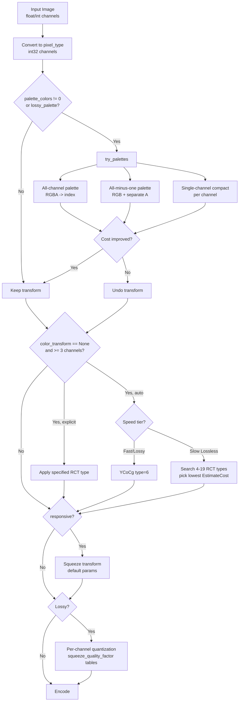
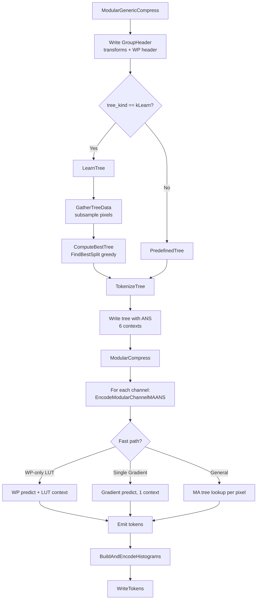
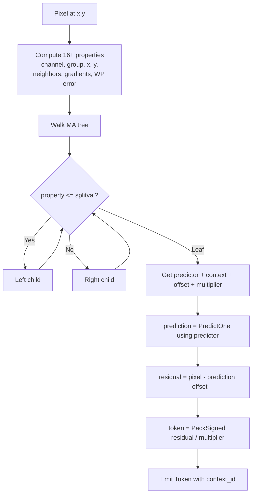

# Modular Encoding

The modular encoding subsystem is JPEG XL's lossless/near-lossless coding path.
It encodes integer-valued multichannel images using a pipeline of reversible
transforms followed by entropy-coded prediction residuals. In VarDCT mode it
still handles DC coefficients, AC metadata, and quantization tables; in full
modular mode it encodes the entire frame.

## Source Files

### Core types and options
| File | Role |
|---|---|
| `lib/jxl/modular/modular_image.h` | `Image` (modular image container) and `Channel` (single plane) |
| `lib/jxl/modular/options.h` | `ModularOptions`, `Predictor` enum (16 values), `StaticPropRange` |
| `lib/jxl/modular/transform/transform.h` | `Transform` class, `TransformId` enum (`kRCT`, `kPalette`, `kSqueeze`) |
| `lib/jxl/modular/transform/squeeze_params.h` | `SqueezeParams` fields struct |

### Transform implementations (encoder)
| File | Role |
|---|---|
| `lib/jxl/modular/transform/enc_transform.h/.cc` | `TransformForward()` dispatcher; `compute_minmax()` |
| `lib/jxl/modular/transform/enc_rct.h/.cc` | `FwdRct()` -- HWY-accelerated Reversible Color Transform |
| `lib/jxl/modular/transform/enc_squeeze.h/.cc` | `FwdSqueeze()` -- Haar-style multiresolution decomposition |
| `lib/jxl/modular/transform/enc_palette.h/.cc` | `FwdPalette()` -- explicit + implicit + lossy palette |
| `lib/jxl/modular/transform/squeeze.cc` | `DefaultSqueezeParameters()`, `MetaSqueeze()` (decode-side meta) |

### MA tree and context prediction
| File | Role |
|---|---|
| `lib/jxl/modular/encoding/context_predict.h` | All predictors (`PredictOne`), `weighted::State`, `MATreeLookup`, `FlatDecisionNode`, property computation |
| `lib/jxl/modular/encoding/dec_ma.h` | `PropertyDecisionNode`, `Tree` typedef, `DecodeTree()` |
| `lib/jxl/modular/encoding/enc_ma.h` | `TreeSamples`, `ComputeBestTree()`, `TokenizeTree()`, `CollectPixelSamples()` |
| `lib/jxl/modular/encoding/enc_ma.cc` | `FindBestSplit()` -- greedy top-down split search (HWY-dispatched) |
| `lib/jxl/modular/encoding/ma_common.h` | `MATreeContext` enum (6 tree-serialization contexts), `kMaxTreeSize` = 2^22 |

### Encoding entry points
| File | Role |
|---|---|
| `lib/jxl/modular/encoding/enc_encoding.h/.cc` | `ModularGenericCompress()`, `ModularCompress()`, `LearnTree()`, `PredefinedTree()`, `EncodeModularChannelMAANS()` |
| `lib/jxl/modular/encoding/encoding.h` | `GroupHeader`, `FilterTree()`, `TreeToLookupTable()`, `ModularGenericDecompress()` |

### Frame-level orchestration
| File | Role |
|---|---|
| `lib/jxl/enc_modular.cc` | `ModularFrameEncoder` -- transform selection, RCT search, palette heuristics, squeeze setup, quantization, per-group encoding |

## Key Types

### `Channel` (`modular_image.h`)

A single integer-valued plane. Core fields:

- `Plane<pixel_type> plane` -- the actual pixel data (`pixel_type` = `int32_t`)
- `size_t w, h` -- logical width/height
- `int hshift, vshift` -- subsampling factors (`w ~= image.w >> hshift`)
- `int component` -- which original component this derived from (-1 default)

Channels are move-only. The `hshift`/`vshift` mechanism allows squeeze residual
channels to live alongside downsampled versions with proper metadata.

### `Image` (`modular_image.h`)

The modular image container. Fields:

- `std::vector<Channel> channel` -- all channels (meta-channels first, then image channels)
- `std::vector<Transform> transform` -- transforms applied (decoder must undo them in reverse)
- `size_t w, h` -- image dimensions
- `int bitdepth` -- sample bit depth
- `size_t nb_meta_channels` -- palette/delta channels prepended by transforms

The `nb_meta_channels` field is critical: palette transforms insert a new
meta-channel at position 0, and subsequent logic must skip these when iterating
image channels.

### `Transform` (`transform.h`)

A serializable Fields struct. Key members:

- `TransformId id` -- one of `kRCT` (0), `kPalette` (1), `kSqueeze` (2)
- `uint32_t begin_c, num_c` -- which channels to transform
- `uint32_t rct_type` -- 0..41 for RCT (permutation * 7 + transform)
- `uint32_t nb_colors, nb_deltas` -- palette parameters
- `bool ordered_palette, lossy_palette`
- `Predictor predictor` -- serialized for palette (determines delta coding)
- `std::vector<SqueezeParams> squeezes` -- squeeze parameters (empty = default)

### `PropertyDecisionNode` / `Tree` (`dec_ma.h`)

The MA (meta-adaptive) tree is `std::vector<PropertyDecisionNode>`. Each node:

- `int16_t property` -- which property to test (-1 = leaf)
- `PropertyVal splitval` -- threshold for `property <= splitval`
- `uint32_t lchild, rchild` -- child indices
- `Predictor predictor` -- used at leaf nodes
- `int64_t predictor_offset` -- added to prediction at leaf
- `uint32_t multiplier` -- residual divisor at leaf

Leaves determine: which predictor to use, what context (for entropy coding), and
optional offset/multiplier for lossy quantization.

### `FlatDecisionNode` / `FlatTree` (`context_predict.h`)

Optimized decode-time representation. Stores a node and its two children packed
together, reducing branch mispredictions. The `MATreeLookup::Lookup()` method
traverses two levels per iteration using the `TRAVERSE_THE_TREE` macro.

### `Predictor` enum (`options.h`)

16 values (14 decoder-side, 2 encoder-only):

| Value | Name | Formula |
|---|---|---|
| 0 | Zero | 0 |
| 1 | Left | W |
| 2 | Top | N |
| 3 | Average0 | (W + N) / 2 |
| 4 | Select | JPEG-LS MED variant |
| 5 | Gradient | ClampedGradient(W, N, NW) |
| 6 | Weighted | 4-predictor weighted average (self-correcting) |
| 7 | TopRight | NE |
| 8 | TopLeft | NW |
| 9 | LeftLeft | WW |
| 10 | Average1 | (W + NW) / 2 |
| 11 | Average2 | (NW + N) / 2 |
| 12 | Average3 | (N + NE) / 2 |
| 13 | Average4 | (6N - 2NN + 7W + WW + NE2 + 3NE + 8) / 16 |
| 14 | Best | encoder-only: best of Gradient and Weighted |
| 15 | Variable | encoder-only: per-pixel optimal via MA tree learning |

## Constants

| Constant | Value | Location | Purpose |
|---|---|---|---|
| `kMaxTreeSize` | 2^22 (4M nodes) | `ma_common.h` | Max MA tree nodes |
| `kNumTreeContexts` | 6 | `ma_common.h` | ANS contexts for tree serialization |
| `kNumStaticProperties` | 2 | `options.h` | channel_id, group_id |
| `kNumNonrefProperties` | 16 | `context_predict.h` | 2 static + 13 spatial + 1 WP |
| `kExtraPropsPerChannel` | 4 | `context_predict.h` | Per-reference-channel properties |
| `kPropRangeFast` | 512 << 4 = 8192 | `encoding.h` | LUT range for fast WP/gradient paths |
| `kMaxFirstPreviewSize` | 8 | `squeeze.h` | Target size for smallest squeeze level |
| `kMaxPaletteLookupTableSize` | 2^16 | `palette.h` | Max lookup table before falling back to std::set |
| `kLargeCube` | 5 | `palette.h` | Implicit palette high-quality cube side |
| `kSmallCube` | 4 | `palette.h` | Implicit palette low-quality cube side |
| `kImplicitPaletteSize` | 4^3 + 5^3 = 189 | `palette.h` | Total implicit palette entries |
| `kMinImplicitPaletteIndex` | -(2 * 72 - 1) = -143 | `enc_palette.cc` | Lowest implicit palette index |
| `squeeze_quality_factor` | 0.35 | `enc_modular.cc` | Base lossy quantization factor for squeeze |
| `squeeze_luma_factor` | 1.1 | `enc_modular.cc` | Luma quality bias |

## Algorithm Details

### When Modular Mode Is Selected vs VarDCT

The frame header's `encoding` field chooses between `kVarDCT` and `kModular`.
In VarDCT mode, modular encoding still handles several side channels:

- DC coefficients (VarDCT DC)
- AC metadata (quantization field, adaptive coefficient strategy, EPF control)
- Quantization weight tables

In full modular mode (`cparams.modular_mode == true`), the entire frame is
encoded through the modular pipeline. The encoder selects modular mode when:

- Lossless encoding is requested
- `cparams.modular_mode` is explicitly set
- Low-effort lossy encoding uses modular with squeeze + quantization

### Transform Pipeline

Transforms are applied in a specific order during encoding. The decoder reverses
them. The encoder pipeline in `ModularFrameEncoder::ComputeEncodingData()` is:

```
1. Palette (global)
   - All-channel palette (e.g. RGBA -> palette index)
   - All-minus-one palette (e.g. RGB with separate alpha)
   - Single-channel compact (ChannelCompact)

2. RCT (global color transform)
   - YCoCg (type 6) for fast/lossy modes
   - Best-of-19 RCT search for slow lossless modes
   - Explicit colorspace override via cparams.colorspace

3. Squeeze (multiresolution)
   - Only when cparams.responsive is set
   - Default parameters: chroma 4:2:0 first, then alternating H/V to 8x8

4. Quantization (lossy only)
   - Per-channel quantization after squeeze
   - Quality tables differ for luma/chroma/XYB

5. Per-group transforms
   - Local palette (ChannelCompact) per group
   - Per-group RCT search (lossless, slow tiers)
```

### Reversible Color Transform (RCT)

The RCT has 42 possible configurations: 6 permutations x 7 transforms.

**Permutation** (of the 3 input channels):
- 0: RGB, 1: GBR, 2: BRG, 3: RBG, 4: GRB, 5: BGR

**Transform** (applied after permutation):
- 0: identity (no-op)
- 1: Second -= First (only)
- 2: Second -= (First + Third) / 2
- 3: Second -= First; Third -= First
- 4: Second -= (First + Third) / 2; Third -= First
- 5: Second -= First; Third -= (First + Second_original) / 2
- 6: YCoCg (special case with exact integer arithmetic)

The YCoCg transform (type 6):
```
Co = R - B
tmp = B + (Co >> 1)
Cg = G - tmp
Y  = tmp + (Cg >> 1)
Output: Y, Co, Cg
```

Implementation uses Highway SIMD for vectorized row processing.

### Squeeze (Haar-style Multiresolution)

Squeeze implements a modified Haar wavelet decomposition with a smoothness-aware
tendency correction.

**Horizontal squeeze** of a channel:
```
For each pair (A, B) at positions (2x, 2x+1):
  avg = AVERAGE(A, B)        // ceiling-biased average
  diff = A - B
  tendency = SmoothTendency(left_neighbor, avg, next_avg)
  residual = diff - tendency
```

The `SmoothTendency()` function applies a cubic interpolation correction to
remove predictable low-frequency content from the difference signal. It ensures
monotonicity constraints to avoid overshooting.

**Default squeeze parameters** (`DefaultSqueezeParameters`):
1. If >= 3 channels with same dimensions: squeeze channels 1-2 (chroma) H then V
   (yields 4:2:0 structure for preview decoding)
2. All channels together, alternating H/V until smallest dimension <= 8
3. Tall images get an extra V squeeze first

The in-place flag controls whether residual channels are inserted adjacent
(in_place=true) or appended (in_place=false). Chroma squeeze uses
in_place=false; the all-channel squeeze uses in_place=true.

### Palette Transform

Three distinct modes:

**1. Single-channel palette (ChannelCompact)**
When `num_c == 1`: counts distinct values, builds a sorted lookup table, and
replaces pixel values with palette indices. Falls back to `std::set` when the
value range exceeds `kMaxPaletteLookupTableSize` (65536). Sets predictor to Zero.

**2. Multi-channel explicit palette (lossless)**
Scans all pixels to collect distinct color tuples. If the count exceeds
`nb_colors`, the transform is rejected (returns false). Colors that also appear
in the implicit palette are tracked separately. If `ordered=true`, colors are
sorted by luminance (common colors first, then rare colors bright-to-dark).

The palette channel is prepended as a meta-channel with dimensions
`(nb_colors, nb_component_channels)` and shifts set to -1.

**3. Lossy palette**
A two-pass approach:

*Pass 1 (preprocessing)*: Identifies frequent colors (those forming a cross
pattern with frequency > 1% of pixels) and frequent color deltas (bucketed,
weighted by distance, top 128 kept if weighted frequency > 17). No pixel
replacement.

*Pass 2 (final)*: For each pixel, tries all explicit palette entries, all delta
entries (added to predictions), and implicit palette quantization (both low and
high quality cube). Uses error diffusion (14-tap kernel with 3-row buffer) with
direction-aware cancellation.

Index penalty structure (drives palette index selection):
- Index -1: penalty -124 (strongly preferred, "transparent" or "repeat")
- Index < 0: penalty -2 * index
- Delta entry: penalty 250
- Explicit palette: penalty 150
- Small-cube implicit: penalty 70
- Large-cube implicit: penalty 256

Color distance function weights: R=3, G=5, B=2, with brightness-adaptive
adjustments.

### MA Tree Context Prediction

The MA (meta-adaptive) tree is the core of modular entropy coding. It replaces
fixed context models with a learned decision tree that maps pixel properties to:
- A predictor to use
- An ANS context for the residual
- Optional offset and multiplier

**Properties** available at each pixel (total = 2 static + 13 spatial + 1 WP +
4 * max_properties reference):

| Index | Property |
|---|---|
| 0 | channel_id (static) |
| 1 | group_id (static) |
| 2 | y coordinate |
| 3 | x coordinate |
| 4 | abs(N) |
| 5 | abs(W) |
| 6 | N (signed) |
| 7 | W (signed) |
| 8 | W - prev_row_gradient (local gradient) |
| 9 | W + N - NW (gradient) |
| 10 | W - NW |
| 11 | NW - N |
| 12 | N - NE |
| 13 | N - NN |
| 14 | W - WW |
| 15 | WP error (weighted predictor property) |
| 16+ | Reference channel properties (abs, value, abs_residual, residual) x N |

**Tree learning** (`FindBestSplit` in `enc_ma.cc`):
- Greedy top-down splitting
- For each candidate node, tries all properties and all split values
- Computes entropy cost (Shannon entropy + extra bits) for left and right halves
- Picks the split that minimizes total cost below a threshold
- Supports forced splits for multiplier boundaries (lossy quantization)
- Penalty for changing predictors: `800 / (100 + threshold)` -- discourages
  predictor switches when sample count is low (noisy estimates)

**Sample collection** (`GatherTreeData`):
- Subsamples pixels using Xorshift128+ PRNG
- Fraction controlled by `nb_repeats` (default 0.5), with minimum 1024 pixels
- Samples are deduplicated with a hash table, counted by frequency
- Properties are pre-quantized to at most `max_property_values` distinct values
  (256 max, varies by speed tier)

### Encoding Flow

```
ModularGenericCompress(image, opts, writer)
  |
  +-> Write GroupHeader (transforms, WP header)
  |
  +-> Build tree:
  |     if kLearn: LearnTree() -> GatherTreeData() + ComputeBestTree()
  |     else: PredefinedTree() (fixed trees for DC, AC metadata, etc.)
  |
  +-> TokenizeTree() -> encode tree with ANS (6 contexts)
  |
  +-> ModularCompress(image, tree, tokens)
  |     for each channel:
  |       EncodeModularChannelMAANS()
  |         FilterTree() -> extract per-channel subtree
  |         Fast paths: WP-only LUT, single Gradient leaf, single Zero leaf,
  |                     single non-WP power-of-2 multiplier leaf
  |         General path: TreeWP or TreeNoWP per pixel
  |         Emit Token(context, PackSigned(residual / multiplier))
  |
  +-> BuildAndEncodeHistograms() for data tokens
  +-> WriteTokens()
```

The frame-level orchestration in `ModularFrameEncoder` handles:
1. Converting float/int pixel data to `pixel_type`
2. Applying global transforms (palette, RCT, squeeze, quantization)
3. Splitting into groups
4. Per-group transforms and RCT search
5. Learning a global tree across all groups (with tree splits by stream type)
6. Encoding each group with `ModularCompress()`

## Cost Functions and Decision Trees

### Transform Selection Heuristics

**Palette decision** (`try_palettes` in `enc_modular.cc`):

The palette heuristic uses `EstimateCost()` -- a Shannon entropy estimate using
the Gradient predictor with 34 contexts (based on gradient residual cutoffs).

1. *All-channel palette*: max colors =
   `min(cost_before * 0.0005 + nb_pixels/128 + 128, |palette_colors|)`.
   Rationale: small images need smaller palettes; low-entropy images (solid/
   gradient) benefit less from palettes.

2. *All-minus-one palette*: tried if all-channel fails and nb_chans > 3.

3. *Single-channel compact*: max colors =
   `min(nb_pixels/16, channel_colors_percent/100 * value_range)`.
   Applied per-channel. Worth it if < X% of the range is actually used.

At speed tiers <= Squirrel, transforms are evaluated by comparing estimated cost
before and after. If cost increases, the transform is undone. At faster tiers,
transforms are applied unconditionally.

**RCT selection** (per-group, in `EncodeModularGroupStream`):

For lossless mode with `colorspace < 0` (auto) and speed <= Hare:
- Try up to 19 RCT types in order of expected usefulness
- Number tried varies by speed tier: Hare=4, Wombat=5, Squirrel=7, Kitten=9,
  Tortoise=19
- Each candidate is evaluated with `EstimateCost()` against the identity baseline
- Best-cost RCT is applied

Order of RCT types tried:
```
{0, 6, 5, 10, 26, 40, 12, 19, 8, 4, 9, 15, 16, 17, 32, 33, 2, 1, 3}
```
Identity (0) and YCoCg (6) are tried first.

For fast/lossy modes with auto colorspace: YCoCg is used unconditionally.

**Squeeze decision** (`enc_modular.cc:930-958`):

Squeeze is applied when `cparams.responsive` is set AND there are spare bits
(max_bitdepth + 2 < level_max_bitdepth). The default squeeze parameters are
used unless the tile would squeeze channels to zero dimensions, in which case
the squeeze script is truncated.

The `responsive` flag defaults to:
- 0 (off) for lossless
- 1 (on) for lossy

**Predictor selection** (`enc_modular.cc:615-649`):

| Condition | Predictor |
|---|---|
| Lossless + not responsive + slow (<=Glacier) | Variable (best per-pixel via tree) |
| Responsive or lossy_palette | Zero |
| Lossy + not responsive | Gradient |
| Lossless + speed < Falcon | Best (Gradient or Weighted) |
| Falcon speed | Weighted |
| > Falcon speed | Gradient |

**WP mode search** (per-group):

For Tortoise: try 5 WP modes. For Kitten: try 2. Uses `EstimateWPCost()` which
evaluates the weighted predictor with different parameter presets (modes 0-4)
and picks the lowest-entropy one.

### Tree Learning Threshold

The splitting threshold for tree learning:
```
splitting_heuristics_node_threshold = 75 + 14 * speed_tier + 10 * decoding_speed_tier
```

This is scaled by sample fraction: `threshold * (pixel_fraction * 0.9 + 0.1)`.
Higher threshold = fewer splits = simpler tree = faster decode.

Speed tier also controls which properties are considered:
- Hare: 4 properties
- Wombat: 5
- Squirrel: 7
- Kitten: 10
- Tortoise: all 16

And max property quantization values:
- Hare: 24, Wombat: 32, Squirrel: 48, Kitten: 96, Tortoise: 256

### Predefined Trees

For non-learned tree kinds:

- `kTrivialTreeNoPredictor`: single Zero leaf (all-zero data)
- `kJpegTranscodeACMeta`: single Zero leaf
- `kFalconACMeta`: single Left leaf
- `kACMeta`: hand-built 27-node tree splitting on channel, y, and left/top values
- `kWPFixedDC`: binary tree on WP property with 33 cutoffs
- `kGradientFixedDC`: binary tree on gradient property with 33 cutoffs

Fixed trees are reduced for small images: when log2(pixels) < 14, a minimum gap
of `8 * (14 - log_px)` is enforced between cutoff indices.

## Dependencies

### Internal dependencies
- `lib/jxl/image.h` -- `Plane<T>` template (memory-aligned 2D array)
- `lib/jxl/enc_ans.h` -- ANS entropy coding (`BuildAndEncodeHistograms`, `Token`)
- `lib/jxl/pack_signed.h` -- `PackSigned()` for residual encoding
- `lib/jxl/fields.h` -- `Fields`/`Visitor` serialization framework
- `lib/jxl/enc_params.h` -- `CompressParams` (speed tier, quality settings)
- `lib/jxl/frame_header.h` -- `FrameHeader`, `FrameEncoding`
- Highway (`hwy/`) -- SIMD acceleration for RCT, FindBestSplit

### External dependencies
- `jxl/memory_manager.h` -- custom allocator interface

## Mermaid Diagram Data

### Transform Pipeline



### Encoding Flow



### MA Tree Decision



## Open Questions

1. **RCT search is per-group but palette is global**: The RCT search in
   `EncodeModularGroupStream` happens per-group, meaning different groups can
   have different RCTs. But the palette transform is only applied globally.
   Could per-group palettes improve compression for images with spatially
   varying color distributions?

2. **Predictor::Variable is restricted to Glacier/Tortoise**: The most powerful
   predictor selection (per-pixel via tree learning) is only used at the slowest
   speed tiers. The comment "TODO: Try adding 'Squeezed' predictor set" suggests
   variable prediction for squeeze residuals was considered but not implemented.

3. **Fixed trees for DC**: The kWPFixedDC and kGradientFixedDC trees use
   hardcoded cutoffs `{-500, -392, -255, ..., 500}`. These were presumably
   tuned for typical photographic content. Are they optimal for
   non-photographic content (screenshots, renders)?

4. **Lossy palette index penalties are hardcoded**: The penalty values (70, 150,
   250, 256) for different palette index types were "obtained by optimizing on
   jyrki31 corpus." These may not generalize to all content types.

5. **Squeeze tendency correction**: The `SmoothTendency` function uses a cubic
   interpolation model. The comment structure suggests this was carefully derived
   but the formula's optimality for natural images vs synthetic content is
   unclear.

6. **Tree learning parallelization**: The `FindBestSplit` function processes
   nodes sequentially with a TODO comment about parallelizing. For large images
   this is a bottleneck.

7. **EstimateCost uses Gradient only**: The cost estimation function always uses
   the Gradient predictor with 34 fixed contexts. For content where WP is
   significantly better, this could lead to suboptimal transform decisions.
   The estimation does not account for the actual predictor that will be used.

8. **max_property_values quantization**: Properties are quantized to at most 256
   distinct values (fewer at fast tiers). The quantization is done by clustering
   (`PreQuantizeProperties`). The tradeoff between tree accuracy and learning
   speed from this quantization is not well-documented.
