# Encoder Pipeline Overview

## Source Files

| File | Role |
|------|------|
| `lib/jxl/enc_frame.cc` | Main frame encoding: `EncodeFrame` entry point, frame header construction, encoding data orchestration, bitstream assembly, streaming mode |
| `lib/jxl/enc_frame.h` | Public API: `EncodeFrame` signatures, `FrameInfo` struct, `ParamsPostInit` |
| `lib/jxl/enc_params.h` | `CompressParams` struct, speed tier thresholds, tile dimensions |
| `lib/jxl/enc_heuristics.h` | `LossyFrameHeuristics` declaration (VarDCT heuristics dispatch) |
| `lib/jxl/enc_heuristics.cc` | Full heuristics implementation: splines, patches, Gaborish, initial quant field, AC strategy, CfL, quantizer refinement, block context model, AR heuristics |
| `lib/jxl/enc_cache.h` | `PassesEncoderState` struct (central encoder state), `InitializePassesEncoder` |
| `lib/jxl/enc_cache.cc` | `InitializePassesEncoder`: DCT coefficient computation, DC frame encoding, DC smoothing |
| `lib/jxl/enc_group.h` | `ComputeCoefficients`, `EncodeGroupTokenizedCoefficients` |
| `lib/jxl/enc_group.cc` | HWY-accelerated DCT, quantization, CfL unapplication, coefficient splitting per group |
| `lib/jxl/enc_adaptive_quantization.cc` | `FindBestQuantizer` (butteraugli RD loop), `InitialQuantField`, `AdjustQuantField` |
| `lib/jxl/common.h` | `SpeedTier` enum definition |
| `lib/jxl/frame_dimensions.h` | `FrameDimensions` struct, group/block dimension constants |

## Key Types

### CompressParams (`enc_params.h`)

Central configuration struct. Key fields:

- `butteraugli_distance` (float, default 1.0): Target perceptual quality. Lower = better quality.
- `speed_tier` (SpeedTier, default kSquirrel): Controls which encoder features are enabled.
- `modular_mode` (bool, default false): If true, use Modular encoding instead of VarDCT.
- `color_transform` (ColorTransform, default kXYB): XYB, YCbCr, or None.
- `resampling` / `ec_resampling`: Downsampling factor (1/2/4/8). Auto-set to 2 at distance >= 10.
- `progressive_mode` / `qprogressive_mode`: Progressive encoding overrides.
- `progressive_dc`: Number of progressive DC levels (0-2).
- `decoding_speed_tier` (0-4): Limits decoder complexity (reduces EPF iters, simplifies context model).
- `noise`, `dots`, `patches`, `gaborish`: Feature overrides (On/Off/Default).
- `epf` (-1 = auto, 0-3): Edge-preserving filter iterations.
- `modular_group_size_shift` (-1 = auto, 0-3): Group size for modular mode (128/256/512/1024).
- `options` (ModularOptions): Modular-specific settings (predictor, tree params, WP mode).
- `palette_colors`, `channel_colors_percent`, `lossy_palette`: Palette/channel color optimization.
- `photon_noise_iso`: Simulated photon noise.
- `quant_ac_rescale`: AC quantization rescale factor.
- `custom_fixed_tree`, `custom_splines`: Override internal heuristics.
- `use_full_image_heuristics`: Whether to use full image for heuristics (vs. streaming approximation).

### SpeedTier (`common.h`)

```
kTectonicPlate = -1  // Brute-force lossless: tries ~20+ parameter combinations at Glacier speed
kGlacier       =  0  // Global MA tree in Modular mode
kTortoise      =  1  // FindBestQuantizationHQ (max 5 butteraugli iters)
kKitten        =  2  // FindBestQuantization butteraugli loop (3 iters)
kSquirrel      =  3  // DEFAULT. Dots, patches, splines, full context clustering
kWombat        =  4  // Error diffusion, full AC strategy heuristics
kHare          =  5  // Simple AC strategy heuristics, initial quant field, non-default CfL, Gaborish
kCheetah       =  6  // Context clustering, coefficient reordering
kFalcon        =  7  // Most features off. Fixed tree with Weighted predictor (Modular)
kThunder       =  8  // Fastest VarDCT. Fixed tree with Gradient predictor (Modular)
kLightning     =  9  // Handled externally, falls back to kThunder inside EncodeFrame
```

### PassesEncoderState (`enc_cache.h`)

Central mutable encoder state, threaded through the entire pipeline:

- `shared` (PassesSharedState): Quantizer, AC strategy image, quant field, color correlation map, frame dimensions, block context map, image features (patches, splines, noise), DC storage, coefficient orders, reference frames.
- `coeffs` (vector of ACImage): Per-pass DCT coefficients, one row per group.
- `passes` (vector of PassData): Per-pass AC tokens, context map, entropy codes.
- `progressive_splitter` (ProgressiveSplitter): Splits coefficients across passes.
- `cparams` (CompressParams): Copy of compression parameters.
- `histogram_idx` (vector): Per-group histogram index for multi-histogram encoding.
- `streaming_mode`, `initialize_global_state`, `dc_group_index`: Streaming encoding state.
- `x_qm_multiplier`, `b_qm_multiplier`: Chrominance quantization matrix scaling.
- `initial_quant_masking1x1`: Pixel-level masking for AR heuristics.
- `used_acs` (uint32_t bitmask): Which AC strategy types were used.
- `used_orders` (vector): Which coefficient orders deviate from default.
- `special_frames` (vector of BitWriter): Encoded DC frames for progressive DC.

### FrameDimensions (`frame_dimensions.h`)

Derived from FrameHeader. Groups the image into a grid:

- `xsize`, `ysize`: Image size (after downsampling).
- `xsize_blocks`, `ysize_blocks`: In 8x8 blocks.
- `xsize_groups`, `ysize_groups`: In groups (default 256x256 pixels).
- `num_groups`, `num_dc_groups`: Total group counts.
- `group_dim`: Group size in pixels (128/256/512/1024 depending on shift).
- `dc_group_dim`: DC group size = group_dim * 8.

## Constants

### Speed Tier Thresholds (scattered across codebase)

| Feature | Enabled when speed_tier <= | Source |
|---------|---------------------------|--------|
| Spline detection | kSquirrel (3) | enc_heuristics.cc:1048 |
| Patch detection | kSquirrel (3) | enc_heuristics.cc:1059 |
| Pixel-based chromacity adjustment | kSquirrel (3) | enc_frame.cc:666 |
| Gaborish (default on) | kHare (5) | enc_frame.cc:278 |
| Initial quant field (butteraugli-based) | kHare (5) | enc_heuristics.cc:1097 |
| Non-default CfL map (2nd pass) | kHare (5) | enc_heuristics.cc:1190 |
| Pre-Gaborish CfL (1st pass) | kSquirrel (3) | enc_heuristics.cc:1169 |
| Error diffusion in quantization | kSquirrel (3) | enc_group.cc:421 |
| Quant block AC adjustment | kHare (5) | enc_group.cc:339 |
| FindBestQuantization (butteraugli RD loop) | kKitten (2) | enc_adaptive_quantization.cc:1282 |
| FindBestQuantizationHQ (more iters) | kTortoise (1) | enc_adaptive_quantization.cc:982 |
| AR (adaptive restoration) heuristics | kWombat (4) | enc_heuristics.cc:906 |
| Block entropy model optimization | < kFalcon (7) | enc_heuristics.cc:1256 |
| DC nonlinear smoothing | < kFalcon (7) | enc_cache.cc:234 |
| Linear image preserved for RD loop | kKitten (2) | enc_frame.cc:1573 |
| Streaming mode auto-enabled | >= kTortoise (1) | enc_frame.cc:1776 |

### Group and Block Sizes

| Constant | Value | Source |
|----------|-------|--------|
| `kBlockDim` | 8 pixels | frame_dimensions.h:21 |
| `kDCTBlockSize` | 64 (8x8) | frame_dimensions.h:23 |
| `kGroupDim` | 256 pixels | frame_dimensions.h:25 |
| `kGroupDimInBlocks` | 32 (256/8) | frame_dimensions.h:28 |
| `kEncTileDim` | 64 pixels | enc_params.h:205 |
| `kEncTileDimInBlocks` | 8 (64/8) | enc_params.h:206 |
| `kColorTileDim` | 64 pixels (= kEncTileDim) | Implicit in code |

### Distance Thresholds

| Constant | Value | Meaning |
|----------|-------|---------|
| `kMinButteraugliDistance` | 0.05 | Minimum accepted quality distance |
| `kMinButteraugliForDynamicAR` | 0.5 | Below this, skip AR heuristics |
| `kMinButteraugliForDots` | 3.0 | Dots detection threshold |
| `kMinButteraugliToSubtractOriginalPatches` | 3.0 | Patch subtraction threshold |
| `kMinButteraugliForNoise` | 99.0 | Noise synthesis (effectively always off) |
| EPF distance thresholds | 0.7, 1.5, 4.0 | EPF iterations: 1 at d>=0.7, 2 at d>=1.5, 3 at d>=4.0 |
| Auto 2x resampling | d >= 10 | Switches to 2x downsampling |

### Butteraugli RD Loop Iterations

| Speed | Iterations |
|-------|-----------|
| kTortoise or slower | 4+1 = 5 total |
| kKitten | 2+1 = 3 total |
| kSquirrel or faster | 0 (no RD loop) |

## The Main Pipeline

### Entry Point: `EncodeFrame` (enc_frame.cc:2397)

```
EncodeFrame(memory_manager, cparams_orig, frame_info, metadata,
            frame_data, cms, pool, output_processor, aux_out)
```

### Step-by-Step Flow

#### Phase 0: Parameter Initialization (EncodeFrame)

1. **Speed tier normalization**: TectonicPlate (lossy) -> Glacier. Lightning -> Thunder.
2. **TectonicPlate lossless brute force**: Tries 2 probe settings (palette=0 vs palette=70000), then branches into ~20 parameter combinations. Picks smallest output.
3. **ParamsPostInit**: Clamps butteraugli distance, sets auto-resampling (2x at d>=10), initializes original_butteraugli_distance.
4. **Validation**: Distance >= 0, progressive_dc sanity, resampling factors valid (1/2/4/8).
5. **JPEG override**: If input is JPEG, force gaborish=off, epf=0, modular_mode=false.
6. **Streaming vs OneShot decision**: `CanDoStreamingEncoding` checks size > 2048x2048, no JPEG, compatible params. Large images use streaming; small images use one-shot.

#### Phase 1: Frame Header Construction (MakeFrameHeader)

1. Sets `FrameEncoding::kModular` or `FrameEncoding::kVarDCT` based on `cparams.modular_mode`.
2. For modular: auto-selects group_size_shift based on image size (128-256 default for images up to 400px, 256 for larger).
3. For JPEG transcode: forces VarDCT, sets chroma subsampling from JPEG data.
4. Sets frame flags (noise, DC frame).
5. **LoopFilter setup**: Gaborish (on if speed <= kHare, VarDCT, d > 0.5), EPF iterations (0-3 based on distance thresholds), EPF sigma for modular mode.
6. Sets progressive passes via `SetProgressiveMode`.
7. Blending/animation info from frame_info.

#### Phase 2: Input Processing (ComputeEncodingData)

1. **Allocate shared state**: AC strategy image, raw quant field, EPF sharpness, color correlation map, DC storage.
2. **Copy input pixels**: `CopyColorChannels` + `CopyExtraChannels` from chunked input to Image3F. Handles interleaved alpha.
3. **Color transform**: If XYB mode, convert to XYB via `ToXYB`. At kKitten or slower, also store linear RGB for butteraugli RD loop.
4. **Simplify invisible pixels**: For non-lossless with alpha, replace alpha=0 pixels with smooth neighbors.
5. **Pad to block multiple**: Extend image to 8x8 block grid.
6. **Chromacity adjustments**: Distance-based x_qm_scale (3-6) and pixel-based chromacity analysis (at speed <= kSquirrel).
7. **Noise estimation**: Photon noise simulation, or GetNoiseParameter from opsin image.
8. **Downsampling**: If resampling > 1 and not already_downsampled, downsample with iterative (Glacier) or sharper (other) method.

#### Phase 3: VarDCT Encoding (if not modular)

##### 3a: Heuristics (LossyFrameHeuristics in enc_heuristics.cc)

The dependency graph within this function (quoted from source):

```
input image -> XYB
XYB -> initial quant field
XYB -> Gaborished XYB
Gaborished XYB -> CfL1
initial quant field, Gaborished XYB, CfL1 -> ACS (AC Strategy)
initial quant field, ACS, Gaborished XYB -> EPF control field
initial quant field -> adjusted initial quant field
adjusted initial quant field, ACS -> raw quant field
raw quant field, ACS, Gaborished XYB -> CfL2
```

Detailed steps:

1. **Spline detection** (speed <= kSquirrel, non-streaming): `FindSplines` on opsin, subtract from image.
2. **Patch detection** (speed <= kSquirrel, non-streaming): `FindBestPatchDictionary`, subtract patches from opsin.
3. **Initial quant field**:
   - Speed > kHare or disable_perceptual: flat field q = 0.79/distance.
   - Speed <= kHare: `InitialQuantField` with butteraugli masking. Produces quant_field, quant_masking, quant_masking1x1.
4. **Global scale**: `quantizer.ComputeGlobalScaleAndQuant(quant_dc, q, 0)`.
5. **Inverse Gaborish**: If gab enabled, apply `GaborishInverse` to opsin.
6. **Dequant matrices**: `FindBestDequantMatrices` (custom only for max_error_mode or disable_perceptual).
7. **Per-tile processing** (64x64 pixel tiles, parallelized):
   a. **CfL pass 1** (speed <= kSquirrel): Compute color-from-luma map without strategy info.
   b. **AC Strategy selection**: `acs_heuristics.ProcessRect` chooses block sizes (DCT8x8, DCT16x16, etc.) per tile.
   c. **Quant field adjustment**: `AdjustQuantField` adjusts initial quant based on AC strategy.
   d. **Set raw quant field**: `quantizer.SetQuantFieldRect`.
   e. **CfL pass 2** (speed <= kHare): Recompute CfL map with strategy and quant info.
8. **Finalize AC strategy**: `acs_heuristics.Finalize`.
9. **Quantizer refinement** (non-streaming, perceptual enabled): `FindBestQuantizer` runs the butteraugli RD loop (2-4 iterations at kKitten/kTortoise).
10. **Block context model** (speed < kFalcon): `FindBestBlockEntropyModel` clusters QF/strategy combinations into contexts (2-9 luma clusters, 1-5 chroma clusters).

##### 3b: Coefficient Computation (InitializePassesEncoder in enc_cache.cc)

1. Set x_qm_multiplier and b_qm_multiplier from frame header chromacity scales.
2. Allocate per-pass coefficient storage (ACImage, one row per group).
3. Scale dequant matrices by quant_ac_rescale.
4. **ComputeCoefficients** (per group, parallel): For each block in the group:
   a. Forward DCT (TransformFromPixels) for all 3 channels.
   b. Extract DC from lowest frequencies.
   c. **Roundtrip-quantize Y channel**: Quantize, dequantize with bias adjustment. At speed <= kHare, also adjusts quant per block via `AdjustQuantBlockAC`.
   d. **Unapply CfL**: Subtract Y contribution from X and B channels.
   e. **Quantize X and B channels**.
   f. **Split coefficients** across progressive passes.
5. **DC frame encoding** (if progressive_dc > 0): Recursively encode DC as a separate frame.
6. **DC to modular**: `AddVarDCTDC` stores DC coefficients in modular stream. Apply nonlinear DC smoothing (if speed < kFalcon).

##### 3c: AR Heuristics (ComputeARHeuristics in enc_heuristics.cc)

- Only at speed <= kWombat and distance >= 0.5 and EPF enabled.
- Reconstructs the image at different EPF sharpness values (0, 2, 7 or 0, 4).
- Per-block: computes masked L2 error vs original for each EPF value.
- Two-pass selection: first pass picks best per-block, second pass refines using context-dependent entropy cost.

##### 3d: Post-Heuristics

1. **AC metadata**: `ComputeACMetadata` stores AC strategy and quant field in modular streams.
2. **Coefficient orders**: `ComputeAllCoeffOrders` determines non-default scan orders per pass.
3. **Histogram allocation**: Set num_histograms = 1 (non-streaming), allocate histogram indices.
4. **Tokenization**: `TokenizeAllCoefficients` converts quantized coefficients to entropy tokens (per group, parallel).

#### Phase 4: Modular Encoding (if modular_mode or extra channels)

1. `enc_modular.ComputeEncodingData`: Palette transforms, channel correlation, modular stream creation for color (if modular_mode) and extra channels (always).
2. `enc_modular.ComputeTree`: Build MA (meta-adaptive) decision tree (unless lossless at speed >= kTortoise).
3. `enc_modular.ComputeTokens`: Tokenize modular data using the tree.

#### Phase 5: Bitstream Assembly (EncodeGroups)

The TOC (Table of Contents) has this structure:
```
[DC Global] [DC Group 0] ... [DC Group N-1] [AC Global] [AC Group 0 Pass 0] ... [AC Group N-1 Pass P-1]
```

For small images (1 group, 1 pass), everything goes in a single TOC entry.

1. **DC Global section**: Patches, splines, noise params, dequant matrices DC, global DC info (quantizer params, block context map, color correlation DC), modular global info + global stream.
2. **DC Groups** (parallel): VarDCT DC precision + stream, modular DC stream, AC metadata (strategy + quant field).
3. **AC Global section**: Full dequant matrices, num_histograms, coefficient orders per pass, entropy histograms per pass (built via `BuildAndEncodeHistograms`).
4. **AC Groups** (parallel, per pass): Histogram selector, tokenized AC coefficients via `EncodeGroupTokenizedCoefficients`, modular AC streams.
5. **Byte-align** each group.

#### Phase 6: Output Assembly

**One-shot mode** (`EncodeFrameOneShot`):
1. Prepend special frames (DC frames).
2. Write frame header.
3. Permute groups if center-first ordering.
4. Write TOC (group offsets).
5. Append all group bitstreams.

**Streaming mode** (`EncodeFrameStreaming`):
1. Compute streaming permutation: DC groups interleaved with their AC groups.
2. Reserve space for frame header + TOC + DC global.
3. Process DC groups sequentially, writing each group's bitstream immediately.
4. Write AC global last.
5. Seek back to write frame header, TOC, and DC global with correct padding.

## Decision Trees

### VarDCT vs Modular Mode Selection

Controlled by `cparams.modular_mode`:
- **VarDCT** (default): Used for lossy photographic encoding. Works in XYB color space with DCT transforms, adaptive quantization, and perceptual optimization.
- **Modular**: Used for lossless encoding or when explicitly requested. Works with integer transforms, MA trees, palette/channel correlation.
- **JPEG transcode**: Forces VarDCT regardless of settings.
- **Hybrid**: Even in VarDCT mode, DC coefficients and AC metadata are encoded via the modular subsystem. Extra channels always use modular encoding.

### Speed Tier Feature Gating

```
TectonicPlate (-1): Brute-force parameter search (lossless only)
  |
Glacier (0): Global MA tree, all modular features
  |
Tortoise (1): +FindBestQuantizationHQ (5 butteraugli iters)
  |
Kitten (2): +FindBestQuantization (3 iters), +linear image for RD
  |
Squirrel (3) [DEFAULT]: +splines, +patches, +dots, +full context clustering,
  |                      +pixel chromacity, +CfL pass 1, +error diffusion
Wombat (4): +AR heuristics (EPF sharpness optimization)
  |
Hare (5): +Gaborish, +initial quant field, +CfL pass 2, +quant adjustment,
  |         -butteraugli RD loop
Cheetah (6): +context clustering, +coeff reordering
  |
Falcon (7): -block entropy model, -DC smoothing. Fixed tree (Weighted predictor)
  |
Thunder (8): Fastest VarDCT. Fixed tree (Gradient predictor)
  |
Lightning (9): Handled externally, same as Thunder internally
```

### Progressive Encoding Decisions

Three progressive modes:
1. **progressive_mode**: DC -> VLF+LF -> full AC (3 passes: 2 coeffs, 3 coeffs, 8 coeffs)
2. **qprogressive_mode**: Quantized AC -> full AC (2 passes: 8 coeffs shift=1, 8 coeffs shift=0)
3. **progressive_dc** (0-2): Encode DC as separate frame(s) before the main frame.

Progressive DC recursion: Each DC level encodes at a reduced quality. Level 0 (smallest) uses modular mode at Tortoise speed.

### Streaming Mode Decision (`CanDoStreamingEncoding`)

Streaming is used when ALL of:
- Image > 2048x2048
- Not JPEG transcode
- No noise/patches forced on
- No progressive DC
- No progressive/qprogressive mode
- No resampling
- No lossy_palette or max_error_mode
- Modular part is lossless (or no modular content)
- Compatible color transform
- Speed >= kTortoise (auto), or buffering explicitly set

## Cost Functions

### Butteraugli RD Loop (FindBestQuantization, enc_adaptive_quantization.cc)

The primary rate-distortion optimization in the encoder. Only active at speed <= kKitten.

**Algorithm**:
1. Set reference image (linear RGB).
2. Initialize quant field from `InitialQuantField`.
3. For each iteration (3 or 5 total):
   a. Set quant field, requantize all coefficients.
   b. Reconstruct the image (full decode pipeline including EPF, Gaborish, noise).
   c. Compute butteraugli distortion map.
   d. Compare distortion per tile to target.
   e. Adjust per-tile quant field: increase quant where distortion is too low, decrease where too high.
   f. On the "original comparison round" (iteration 1), compare against original linear image.

**Key parameters**:
- `qf_lower` / `qf_higher`: Bounds for quant field values, derived from initial field range.
- Asymmetry factor (2.0): Allows more increase than decrease.
- Tile comparison at 64x64 granularity.

### Quant Block AC Adjustment (AdjustQuantBlockAC, enc_group.cc)

Per-block AC quantization refinement. Active at speed <= kHare.

- Analyzes non-zero coefficient counts in high-frequency quadrants.
- Increases quant for blocks with too few non-zeros (reduces 8x8 blockiness).
- Increases quant for blocks with high-frequency energy at borders (reduces ringing).
- Reduces quant in highly active areas (preserves texture).
- Adjusts dead-zone thresholds per quadrant.

### Block Context Model (FindBestBlockEntropyModel, enc_heuristics.cc)

- Counts occurrences of each (QF value, AC strategy order) pair.
- Splits QF range into 1-2 segments for large images.
- Merges lowest-count clusters until target count reached (2-9 for luma, 1-5 for chroma).
- Image size threshold: needs `(1 << 10) * distance` blocks to justify custom model.
- For decoding_speed_tier >= 1: simplified 2-context model (luma vs chroma).

## Group Encoding

### How Images Are Split into Groups

**VarDCT mode** (default group_size_shift = 1, group_dim = 256):
- Image padded to 8x8 block multiple.
- Divided into 256x256 pixel groups (32x32 blocks).
- DC groups contain 8x8 groups of AC groups (2048x2048 pixels of DC).
- Group count: `ceil(width/256) * ceil(height/256)`.

**Modular mode**: Group size varies (128-1024) based on group_size_shift.

### TOC Structure

For N groups and P passes, the TOC contains:
```
1 + num_dc_groups + 1 + num_groups * num_passes entries
[DC Global] [DC Group 0..N_dc-1] [AC Global] [AC Pass 0 Group 0..N_ac-1] ... [AC Pass P-1 Group 0..N_ac-1]
```

Special case: 1 group + 1 pass = single TOC entry.

### Parallel Encoding

Multiple RunOnPool calls for parallelism:
1. **Heuristics tile processing**: 64x64 tiles (CfL, AC strategy, quant field). Pool: "Enc Heuristics".
2. **Coefficient computation**: Per AC group. Pool: "Compute coeffs".
3. **DC coefficient computation**: Per DC group. Pool: "Compute DC coeffs".
4. **Tokenization**: Per AC group. Pool: "TokenizeGroup".
5. **DC group encoding**: Per DC group. Pool: "EncodeDCGroup".
6. **AC group encoding**: Per AC group. Pool: "EncodeGroupCoefficients".
7. **AR heuristics**: Image reconstruction per EPF setting (sequential), then per-block selection.

### Group Encoding Details (EncodeGroupTokenizedCoefficients)

Each AC group writes:
1. Histogram selector bits (log2 of num_histograms).
2. Token stream: entropy-coded AC coefficients using the pass's codes and context_offset.

Context offset = histogram_idx * NumACContexts, allowing different histograms for different spatial regions.

## Dependencies

### Build Dependencies (includes from enc_frame.cc)

The encoder frame pulls in nearly the entire encoder subsystem:
- AC: `enc_ac_strategy`, `enc_adaptive_quantization`, `enc_ans`, `enc_coeff_order`, `enc_context_map`, `enc_entropy_coder`
- Color: `enc_chroma_from_luma`, `enc_xyb`
- Features: `enc_noise`, `enc_patch_dictionary`, `enc_splines`, `enc_photon_noise`
- Modular: `enc_modular`
- Infrastructure: `enc_bit_writer`, `enc_cache`, `enc_group`, `enc_heuristics`, `enc_params`, `enc_progressive_split`, `enc_quant_weights`, `enc_toc`, `enc_fields`

### Data Flow Dependencies

```
CompressParams -----> FrameHeader -----> FrameDimensions
                          |
Input Pixels -----> XYB Conversion -----> Opsin Image
                          |                    |
                     Linear RGB           Gaborished Opsin
                    (for RD loop)              |
                          |              +-----------+
                          |              |           |
                    InitialQuantField  CfL Map   AC Strategy
                          |              |           |
                          +---> AdjustQuantField <---+
                                     |
                               Raw Quant Field
                                     |
                          +----------+-----------+
                          |          |           |
                     Quantize    DC Extract   CfL Unapply
                     Coeffs                      |
                          |                 Quantize X,B
                          |                      |
                     Split Passes          Split Passes
                          |                      |
                     Tokenize <------ Coeff Orders
                          |
                     Build Histograms
                          |
                     Encode Groups
                          |
                     Assemble Bitstream
```

## Mermaid Diagram Data

```mermaid
graph TD
    A[EncodeFrame] --> B{TectonicPlate?}
    B -->|Yes, lossless| C[Brute-force parameter search]
    C --> D[ParamsPostInit]
    B -->|No| D
    D --> E{Streaming eligible?}
    E -->|Yes >2048x2048| F[EncodeFrameStreaming]
    E -->|No| G[EncodeFrameOneShot]

    F --> H[MakeFrameHeader]
    G --> H
    H --> I[ComputeEncodingData]

    I --> J[Copy Input Pixels]
    J --> K{XYB mode?}
    K -->|Yes| L[ToXYB + optional Linear]
    K -->|No| M[Use as-is]
    L --> N[SimplifyInvisible]
    M --> N
    N --> O[Pad to Block Multiple]
    O --> P[Chromacity Adjustments]
    P --> Q[Noise Estimation]
    Q --> R[Downsampling]

    R --> S{VarDCT or Modular?}
    S -->|VarDCT| T[LossyFrameHeuristics]
    S -->|Modular| U[ModularFrameEncoder]

    T --> T1[Find/Subtract Splines]
    T1 --> T2[Find/Subtract Patches]
    T2 --> T3[Initial Quant Field]
    T3 --> T4[Gaborish Inverse]
    T4 --> T5[Per-tile: CfL + ACS + Quant]
    T5 --> T6[FindBestQuantizer RD Loop]
    T6 --> T7[Block Context Model]

    T7 --> V[InitializePassesEncoder]
    V --> V1[ComputeCoefficients per group]
    V1 --> V2[DC Frame if progressive_dc]
    V2 --> V3[DC to Modular]

    V3 --> W[ComputeARHeuristics]
    W --> X[ComputeACMetadata]
    X --> Y[ComputeAllCoeffOrders]
    Y --> Z[TokenizeAllCoefficients]

    Z --> AA[EncodeGroups]
    U --> AA
    AA --> AB[DC Global Section]
    AB --> AC[DC Groups parallel]
    AC --> AD[AC Global: histograms]
    AD --> AE[AC Groups parallel]

    AE --> AF{Streaming?}
    AF -->|Yes| AG[Write groups incrementally + backfill TOC]
    AF -->|No| AH[Permute groups + Write TOC + Append all]
```



## Open Questions

1. **Why is noise synthesis effectively disabled?** `kMinButteraugliForNoise = 99.0` means the noise feature is never auto-enabled. The only way to get noise is via `photon_noise_iso` or manual_noise. Was noise quality not good enough, or is this a temporary state?

2. **Streaming mode limitations**: Currently restricted to non-progressive, non-resampled, non-JPEG, non-lossy-palette images. The requirement for `ModularPartIsLossless()` when extra channels exist is particularly restrictive. Could streaming be extended to lossy extra channels?

3. **TectonicPlate brute force**: Tries ~20 parameter combinations at Glacier speed. Each combination is a full encode. For large images this is extremely slow. Is there a plan for smarter parameter search (e.g., encoding at reduced resolution first)?

4. **Single histogram in non-streaming mode**: `shared.num_histograms = 1` is hardcoded for non-streaming VarDCT. The streaming mode uses `dc_group_order.size()` histograms. Why not multiple histograms for large one-shot images?

5. **CfL two-pass approach**: At speed <= kSquirrel, CfL is computed twice (once without AC strategy info, once with). The first pass seems wasted if the second pass overwrites it. Is the first pass used as a seed for AC strategy selection?

6. **AR heuristics cost**: At speed <= kWombat, the encoder fully reconstructs the image 2-3 times (once per EPF sharpness value) just to optimize the EPF sharpness field. This is expensive. Is the quality gain worth the cost at kWombat speed?

7. **AdjustQuantBlockAC complexity**: The per-block quantization adjustment in enc_group.cc has many hand-tuned constants and heuristics (high-frequency analysis, quadrant splitting, activity-based reduction). How were these tuned, and how sensitive is quality to their exact values?

8. **Modular group size auto-selection**: The logic in MakeFrameHeader (lines 336-359) defaults to shift=1 (256px groups) for most images, but uses shift=0 (128px) for images <= 128px. The comment says density suffers with small groups. Has this been benchmarked against the default 256?

9. **Error diffusion gating**: Error diffusion in quantization is only active at speed <= kSquirrel, but the comment on kWombat says "Turns on error diffusion." This seems contradictory. Which is correct?

10. **Progressive DC recursion depth**: Limited to 2 levels (`dc_level > 2` fails). The implementation recursively calls `EncodeFrame` for each DC level. At level 0, it switches to modular mode. What quality/size tradeoff does progressive DC offer compared to progressive passes?
