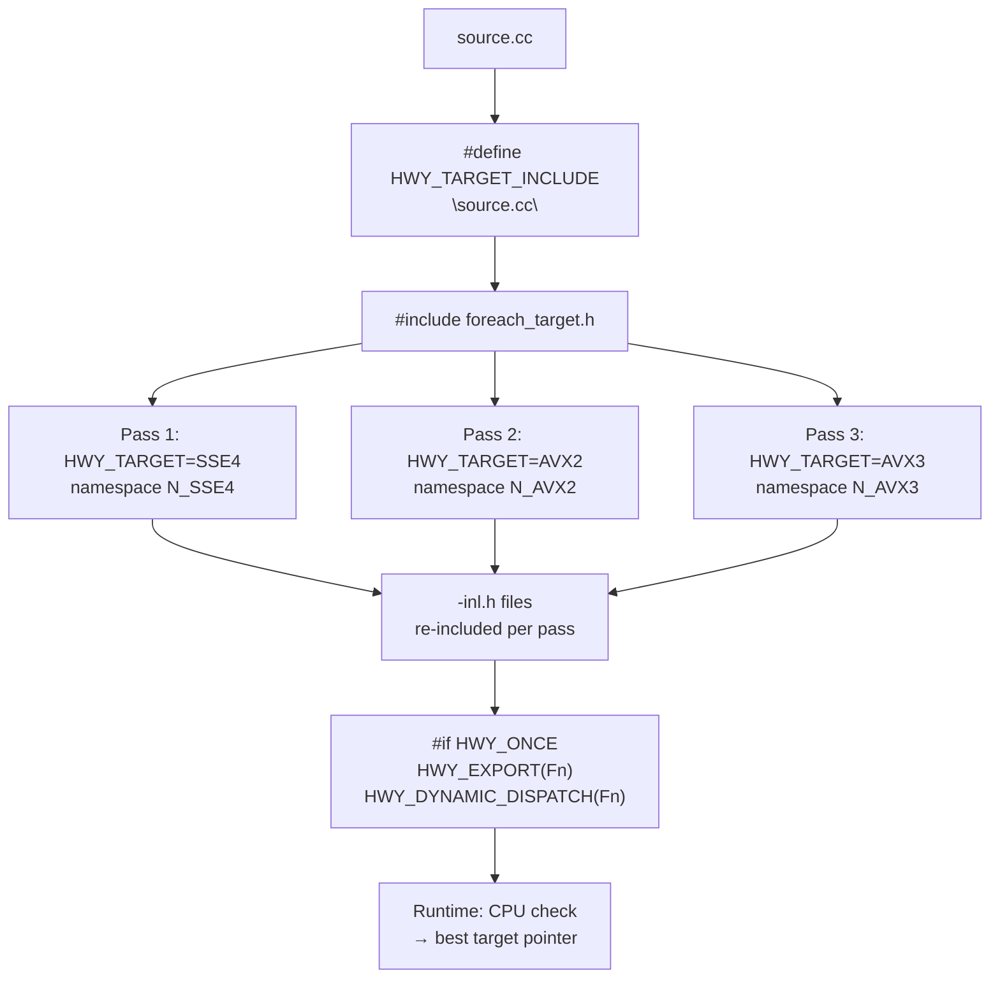

# Highway SIMD



libjxl uses Google's [Highway](https://github.com/google/highway) library for portable
SIMD. All vector operations are expressed through Highway's C++ API — no raw
intrinsics appear anywhere in libjxl source. A single source file is compiled
multiple times (once per instruction set target), and a runtime CPU check
dispatches to the best available implementation.

Source: [`base/fast_math-inl.h`](https://github.com/libjxl/libjxl/blob/main/lib/jxl/base/fast_math-inl.h), [`base/rational_polynomial-inl.h`](https://github.com/libjxl/libjxl/blob/main/lib/jxl/base/rational_polynomial-inl.h), [`simd_util.h`](https://github.com/libjxl/libjxl/blob/main/lib/jxl/simd_util.h),
Highway headers

## The `-inl.h` Mechanism

The `-inl.h` suffix denotes "inline headers" designed to be compiled multiple
times — once per SIMD target. This is the central build pattern throughout
libjxl.

### Toggling Include Guard

Standard include guards prevent re-inclusion. The `-inl.h` files use a
toggling guard that *allows* it. From [`fast_math-inl.h:10`](https://github.com/libjxl/libjxl/blob/main/lib/jxl/base/fast_math-inl.h#L10):

```cpp
#if defined(LIB_JXL_BASE_FAST_MATH_INL_H_) == defined(HWY_TARGET_TOGGLE)
#ifdef LIB_JXL_BASE_FAST_MATH_INL_H_
#undef LIB_JXL_BASE_FAST_MATH_INL_H_
#else
#define LIB_JXL_BASE_FAST_MATH_INL_H_
#endif
```

`HWY_TARGET_TOGGLE` is defined/undefined by Highway's `foreach_target.h` on
alternating passes. Each time the `.cc` file is re-included, the toggle flips,
the guard flips, and the body is processed again.

### Namespace Isolation

Each re-inclusion places code into a target-specific namespace:

```cpp
HWY_BEFORE_NAMESPACE();
namespace jxl {
namespace HWY_NAMESPACE {  // expands to N_SSE4, N_AVX2, N_AVX3, etc.
  // ... SIMD code ...
}  // namespace HWY_NAMESPACE
}  // namespace jxl
HWY_AFTER_NAMESPACE();
```

This prevents ODR violations — each target's functions live in their own
namespace (`N_SSE4`, `N_AVX2`, `N_AVX3`, `N_AVX3_ZEN4`).

### ADL Workaround

Highway SIMD operations live in `hwy::HWY_NAMESPACE` and are not found via
argument-dependent lookup. Every `-inl.h` file begins with `using` declarations:

```cpp
using hwy::HWY_NAMESPACE::Abs;
using hwy::HWY_NAMESPACE::Add;
using hwy::HWY_NAMESPACE::Mul;
using hwy::HWY_NAMESPACE::MulAdd;
// ...
```

### The `.cc` File Template

A `.cc` file using Highway follows a rigid structure. Using `stage_xyb.cc` as
a representative example:

```cpp
// (1) Regular includes (processed once)
#include "lib/jxl/render_pipeline/stage_xyb.h"

// (2) Set up re-include target
#undef HWY_TARGET_INCLUDE
#define HWY_TARGET_INCLUDE "lib/jxl/render_pipeline/stage_xyb.cc"
#include <hwy/foreach_target.h>   // triggers multiple re-includes
#include <hwy/highway.h>

// (3) -inl.h includes (re-processed per target)
#include "lib/jxl/dec_xyb-inl.h"

// (4) SIMD code in target-specific namespace
HWY_BEFORE_NAMESPACE();
namespace jxl {
namespace HWY_NAMESPACE {

class XYBStage : public RenderPipelineStage { /* SIMD ProcessRow */ };

std::unique_ptr<RenderPipelineStage> GetXYBStage(
    const OutputEncodingInfo& output_encoding_info) {
  return jxl::make_unique<XYBStage>(output_encoding_info);
}

}  // namespace HWY_NAMESPACE
}  // namespace jxl
HWY_AFTER_NAMESPACE();

// (5) One-time dispatch registration
#if HWY_ONCE
namespace jxl {
HWY_EXPORT(GetXYBStage);
std::unique_ptr<RenderPipelineStage> GetXYBStage(
    const OutputEncodingInfo& output_encoding_info) {
  return HWY_DYNAMIC_DISPATCH(GetXYBStage)(output_encoding_info);
}
}  // namespace jxl
#endif
```

Sections before `foreach_target.h` are processed once. Sections 3-4 are
processed once per target. Section 5 (`#if HWY_ONCE`) runs only on the final
pass.

## Dynamic Dispatch

`HWY_EXPORT(FunctionName)` creates a function pointer table with one entry per
target. `HWY_DYNAMIC_DISPATCH(FunctionName)` returns a pointer to the best
available implementation based on runtime CPU detection.

```cpp
#if HWY_ONCE
namespace jxl {
HWY_EXPORT(MaxVectorSize);
size_t MaxVectorSize() {
  return HWY_DYNAMIC_DISPATCH(MaxVectorSize)();
}
}  // namespace jxl
#endif
```

There is also `HWY_STATIC_DISPATCH` for scalar convenience wrappers —
`FastLog2f(float)` uses this to bypass runtime dispatch and call the
compile-time target's version with `HWY_CAPPED(float, 1)` operating on a
single lane.

### Render Pipeline Stage Pattern

Render pipeline stages define the entire class inside `HWY_NAMESPACE`. The
factory function (e.g., `GetXYBStage`) is what gets exported via `HWY_EXPORT`.
The returned `unique_ptr<RenderPipelineStage>` points to a target-specific
class whose `ProcessRow` virtual method contains SIMD code compiled for that
target. This lets the class body — including all SIMD loops — be specialized
per target without exposing the target-specific class name.

## Vector Width Adaptation

Highway vectors are not fixed-width. `HWY_FULL(float)` creates a descriptor
for the widest native float vector on the current target:

| Target | Vector Width | `Lanes(HWY_FULL(float))` |
|--------|-------------|--------------------------|
| SSE4 | 128-bit | 4 |
| AVX2 | 256-bit | 8 |
| AVX-512 | 512-bit | 16 |
| NEON | 128-bit | 4 |

Code loops in increments of `Lanes(d)`, automatically adapting from 4-wide to
16-wide processing:

```cpp
const HWY_FULL(float) d;
const size_t N = Lanes(d);
for (size_t i = 0; i < count; i += N) {
    auto v = LoadU(d, data + i);
    // ... process N floats at once ...
    StoreU(v, d, output + i);
}
```

## SIMD Math Utilities

`fast_math-inl.h` provides vectorized transcendental approximations used
throughout the encoder and decoder.

### FastLog2f

Base-2 logarithm via range reduction to [-1/3, 1/3] followed by a (2,2)
rational polynomial approximation. Extracts the IEEE 754 exponent via integer
bit manipulation (`ShiftRight<23>`) and evaluates the mantissa polynomial.
L1 error ~3.9e-6. Used pervasively in entropy coding cost estimation.

### FastPow2f

Base-2 exponentiation. Separates integer and fractional parts — the integer
part becomes the IEEE exponent directly via `ShiftLeft<23>`, the fractional
part is evaluated with a (3,3) Horner-form polynomial. Max relative
error ~3e-7.

### FastPowf

Computes `base^exponent` as `2^(log2(base) * exponent)`, composing FastLog2f
and FastPow2f. Max relative error ~3e-5.

### FastCosf

Range reduction to [0, pi/2], Taylor-like approximation scaled by 2^0.75,
then two angle-duplication steps to recover the full range. Sign correction
via bit manipulation. L1 error ~7e-5.

### FastErff

Error function approximation: `1 - 1/((((ax*a + b)*x + c)*x + d)*x + 1)^4`.
L1 error ~7e-4. Used for spline rendering Gaussian splatting.

### CubeRootAndAdd

Cube root via initial exponent estimate (multiply IEEE exponent by -1/3 in
integer domain) followed by 3 Newton-Raphson iterations plus a final
refinement. Returns `cbrt(x) + add`, fusing the addition to avoid a separate
pass. Based on Agner Fog's vectorclass. Used in L\*a\*b\* and related
perceptual color space transforms.

### EvalRationalPolynomial

From `rational_polynomial-inl.h`. Evaluates P(x)/Q(x) where P and Q are
polynomials stored as aligned coefficient arrays with `HWY_REP4` replication
(for `LoadDup128`). Uses Horner's scheme. Division uses hardware `vdivps`
on modern architectures where throughput is adequate.
