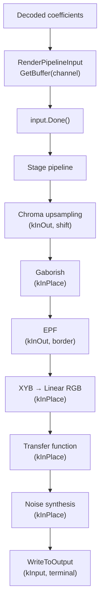

# Render Pipeline



The render pipeline is libjxl's processing framework for the decoder. It chains
a sequence of stages that transform decoded coefficient data into final pixel
output. While this is decoder infrastructure, understanding it is essential
for encoder development — the encoder's RD loops reconstruct through this
pipeline to compute distortion.

Source: [`render_pipeline/render_pipeline.h`](https://github.com/libjxl/libjxl/blob/main/lib/jxl/render_pipeline/render_pipeline.h), [`render_pipeline/render_pipeline_stage.h`](https://github.com/libjxl/libjxl/blob/main/lib/jxl/render_pipeline/render_pipeline_stage.h),
[`render_pipeline/simple_render_pipeline.cc`](https://github.com/libjxl/libjxl/blob/main/lib/jxl/render_pipeline/simple_render_pipeline.cc), [`render_pipeline/low_memory_render_pipeline.h`](https://github.com/libjxl/libjxl/blob/main/lib/jxl/render_pipeline/low_memory_render_pipeline.h)

## Pipeline Construction

A `RenderPipeline` is built via `RenderPipeline::Builder`:

1. Stages are added in order via `AddStage()`
2. `Finalize()` computes cumulative padding requirements and channel shift
   tables, then creates the pipeline implementation
3. `PrepareForThreads(num, use_group_ids)` allocates per-thread or per-group
   working buffers

The pipeline tracks `channel_shifts_` — at each stage, each channel may have a
different resolution (e.g., chroma subsampling means chroma channels are
half-size at early stages). Stages with `kInOut` channel mode produce output at
a potentially different resolution via `shift_x` / `shift_y` in their settings.

## Stage Types

From `RenderPipelineChannelMode`:

| Mode | Behavior |
|------|----------|
| `kIgnored` | Stage does not touch this channel |
| `kInPlace` | Modifies the channel buffer in-place (no extra border) |
| `kInOut` | Reads input with padding (`border_x`, `border_y`), writes to separate output buffer, potentially at different resolution |
| `kInput` | Read-only terminal mode for stages producing observable output |

## Key Stages

The stages form a pipeline from internal representation to output pixels:

### XYBStage ([`stage_xyb.cc`](https://github.com/libjxl/libjxl/blob/main/lib/jxl/render_pipeline/stage_xyb.cc))

Converts from XYB color space to linear RGB. Operates `kInPlace` on channels
0-2. The `ProcessRow` loop uses `HWY_FULL(float)`, processing `Lanes(d)` pixels
per iteration with `LoadU`/`StoreU` and fused multiply-add operations. The
entire class is defined inside `HWY_NAMESPACE` and dispatched via the
[Highway SIMD pattern](highway-simd.md).

### GaborishStage ([`stage_gaborish.cc`](https://github.com/libjxl/libjxl/blob/main/lib/jxl/render_pipeline/stage_gaborish.cc))

Edge-preserving smoothing filter. See [Gaborish](../perceptual/gaborish.md).

### UpsamplingStage ([`stage_upsampling.cc`](https://github.com/libjxl/libjxl/blob/main/lib/jxl/render_pipeline/stage_upsampling.cc))

2x/4x/8x upsampling with `kInOut` mode and shift. Used when the frame header
specifies downsampled encoding.

### NoiseStage ([`stage_noise.cc`](https://github.com/libjxl/libjxl/blob/main/lib/jxl/render_pipeline/stage_noise.cc))

Adds synthesized film grain noise. See [Noise](../features/noise.md).

### FromLinearStage / ToLinearStage

Transfer function application (linear ↔ display). See
[Transfer Functions](../color/transfer-functions.md).

### ToneMappingStage

HDR tone mapping for display adaptation. See
[Tone Mapping](../color/tone-mapping.md).

### WriteToOutputStage ([`stage_write.cc`](https://github.com/libjxl/libjxl/blob/main/lib/jxl/render_pipeline/stage_write.cc))

Terminal stage (`kInput`). Converts float planar data to interleaved integer
pixels:

- Ordered dithering with blue noise for 8-bit output
- `StoreInterleaved2/3/4` for channel interleaving (gray+alpha, RGB, RGBA)
- Per-thread temporary buffers avoid contention

## Two Implementations

### SimpleRenderPipeline

Allocates full-frame buffers for each channel. Processes all groups into these
buffers, then runs stages sequentially over the full frame. Uses
O(width x height) memory. Primarily used for testing and as a reference
implementation.

### LowMemoryRenderPipeline

The production implementation. Processes data group-by-group, only allocating
buffers sized for one group plus borders:

- `group_data_` indexed by `[thread][channel]` or `[group][channel]` depending
  on `use_group_ids_`
- Borders between adjacent groups saved to `borders_horizontal_` and
  `borders_vertical_` buffers, loaded back when a neighboring group is processed
  (`GroupBorderAssigner` manages this)
- `stage_data_` provides intermediate row buffers indexed by
  `[thread][channel][stage]`
- Processing is row-by-row within each group through `RenderRect`

Architecture-specific padding: `kRenderPipelineXOffset` is 16 for ARM, 32 for
x86 — ensures sufficient padding for the widest possible vector loads on each
architecture.

## Pipeline Input Flow

The caller fills decoded data through `RenderPipelineInput`:

```cpp
RenderPipelineInput input = pipeline->GetInputBuffers(group_id, thread_id);
// ... fill input.GetBuffer(channel) with decoded data ...
input.Done();  // triggers ProcessBuffers
```

`Done()` calls `InputReady()` which increments
`group_completed_passes_[group_id]` and triggers `ProcessBuffers` for that
group. This design allows concurrent filling of different groups from different
threads — each group's processing is independent once its input is complete.

## Encoder Usage

The encoder uses the render pipeline during RD optimization loops. When
[FindBestQuantizer](../encoder/vardct-path.md) needs to evaluate distortion,
it encodes, then decodes through the pipeline to reconstruct pixels, then
computes [butteraugli](../perceptual/butteraugli.md) distance against the
original. The pipeline ensures the reconstruction matches what a real decoder
would produce.
