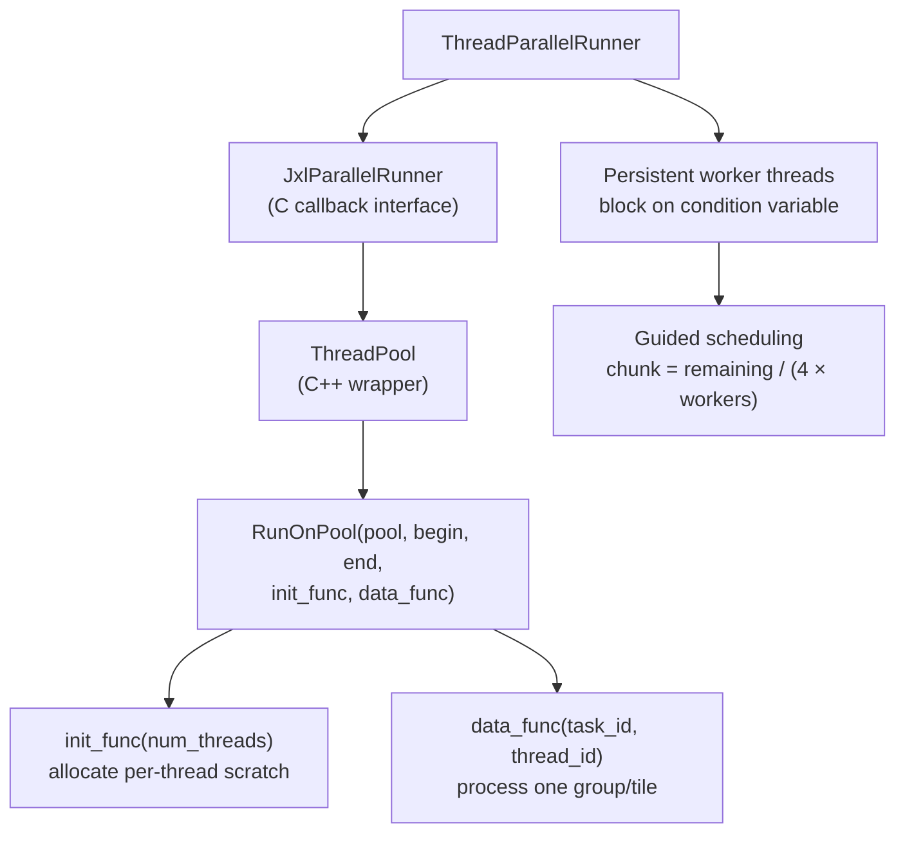

# Threading



libjxl uses a pluggable threading interface that separates threading policy from
the codec. The encoder and decoder express parallelism through a `RunOnPool`
pattern — specify a range of task IDs and a function to call per task.

Source: [`base/data_parallel.h`](https://github.com/libjxl/libjxl/blob/main/lib/jxl/base/data_parallel.h), [`include/jxl/parallel_runner.h`](https://github.com/libjxl/libjxl/blob/main/lib/include/jxl/parallel_runner.h),
[`threads/thread_parallel_runner_internal.h`](https://github.com/libjxl/libjxl/blob/main/lib/threads/thread_parallel_runner_internal.h)

## JxlParallelRunner Interface

The C API in `parallel_runner.h` defines the pluggable runner:

```c
typedef JxlParallelRetCode (*JxlParallelRunner)(
    void* runner_opaque,
    void* jpegxl_opaque,
    JxlParallelRunInit init,
    JxlParallelRunFunction func,
    uint32_t start_range,
    uint32_t end_range);
```

The runner must:
1. Call `init(jpegxl_opaque, num_threads)` once on the calling thread
2. Call `func(jpegxl_opaque, value, thread_id)` for each value in
   `[start_range, end_range)`, possibly from different threads

This lets applications provide their own thread pool — game engines, web
browsers, and server applications all have existing threading infrastructure.
If no runner is provided (null), everything runs sequentially on the calling
thread.

## ThreadPool Wrapper

`data_parallel.h` provides `ThreadPool`, a thin C++ wrapper:

```cpp
class ThreadPool {
  template <class InitFunc, class DataFunc>
  Status Run(uint32_t begin, uint32_t end,
             const InitFunc& init_func,
             const DataFunc& data_func,
             const char* caller);
};
```

The `RunCallState` inner class bridges C++ lambdas to the C callback interface,
with an `atomic<uint32_t> has_error_` for thread-safe error propagation. If any
task returns false, subsequent tasks see the error flag and return early.

## RunOnPool Pattern

The free function `RunOnPool` is the dominant parallelism idiom throughout
libjxl:

```cpp
template <class InitFunc, class DataFunc>
Status RunOnPool(ThreadPool* pool, uint32_t begin, uint32_t end,
                 const InitFunc& init_func,
                 const DataFunc& data_func,
                 const char* caller);
```

An overload accepts `ThreadPool::NoInit` when no per-thread initialization is
needed.

### Init/Data Split

The separation of init and data functions serves a specific purpose: allocation
is separated from processing. The init function runs once on the main thread
and allocates per-thread storage (e.g., resizing a `vector<BitWriter>` to
`num_threads` entries). The data function runs on worker threads and indexes
into that storage via `thread_id`. This avoids both allocation in the hot loop
and lock contention on shared data structures.

## Group-Level Parallelism

The image is divided into groups of `group_dim x group_dim` pixels (typically
256x256). From `FrameDimensions`:

```
group_dim = (kGroupDim >> 1) << group_size_shift   // typically 256
num_groups = ceil(xsize/group_dim) x ceil(ysize/group_dim)
num_dc_groups = ceil(xsize/dc_group_dim) x ceil(ysize/dc_group_dim)
```

Each group gets a linear index `group_id = gy * xsize_groups + gx`. Both
encoder and decoder parallelize at the group level.

### Encoder Parallelization Points

| Phase | Pool Label | Granularity |
|-------|------------|-------------|
| DC coefficient computation | `"Compute DC coeffs"` | Per DC group |
| AC coefficient computation | `"Compute coeffs"` | Per AC group |
| Tokenization | `"TokenizeGroup"` | Per AC group |
| DC group encoding | `"EncodeDCGroup"` | Per DC group |
| AC group encoding | `"EncodeGroupCoefficients"` | Per AC group |
| Heuristics tile processing | `"Enc Heuristics"` | 64x64 tiles |

```cpp
// DC groups in parallel
RunOnPool(pool, 0, frame_dim.num_dc_groups,
          ThreadPool::NoInit, compute_dc_coeffs, "Compute DC coeffs");

// Tokenize AC groups in parallel
RunOnPool(pool, 0, frame_dim.num_groups,
          tokenize_group_init, tokenize_group, "TokenizeGroup");

// Encode groups in parallel
RunOnPool(pool, 0, num_groups, resize_aux_outs,
          process_group, "EncodeGroupCoefficients");
```

### Decoder Parallelization

```cpp
// Decode DC groups in parallel
RunOnPool(pool_, 0, dc_group_sec.size(),
          ThreadPool::NoInit, process_section, "DecodeDCGroup");

// Decode AC groups in parallel
RunOnPool(pool_, 0, ac_group_sec.size(),
          prepare_storage, process_group, "DecodeGroup");
```

## ThreadParallelRunner

The default runner implementation ([`thread_parallel_runner_internal.cc`](https://github.com/libjxl/libjxl/blob/main/lib/threads/thread_parallel_runner_internal.cc)) uses a
fork-join model with persistent worker threads:

### Lifecycle

- Worker threads are created at construction and block on `worker_start_cv_`
- `Runner()` stores the function pointer and range, signals all workers via
  `StartWorkers()`
- After all tasks are consumed, workers signal readiness via `workers_ready_cv_`
  and block again
- Re-entrancy is explicitly detected and rejected via a `depth_` atomic counter

### Guided Scheduling

Workers use an adaptive scheduling strategy (adapted from OpenMP's "guided"
schedule):

```
chunk_size = max(1, remaining / (4 * num_workers))
```

Each thread atomically reserves `chunk_size` tasks at a time via
`num_reserved_.fetch_add()`. Large initial chunks reduce atomic contention on
the counter, while the decreasing chunk size ensures good load balancing as
work runs out.

False sharing is prevented with 64-byte padding around the `num_reserved_`
atomic counter.

### Scaling Properties

For a 4096x4096 image at default settings:
- 16x16 = 256 groups, 2x2 = 4 DC groups
- With 8 threads: ~32 groups per thread (good load balance)
- Guided scheduling ensures stragglers don't waste cores

The guided approach degrades gracefully for both small images (few groups,
sequential fallback) and large images (hundreds of groups, low contention).
