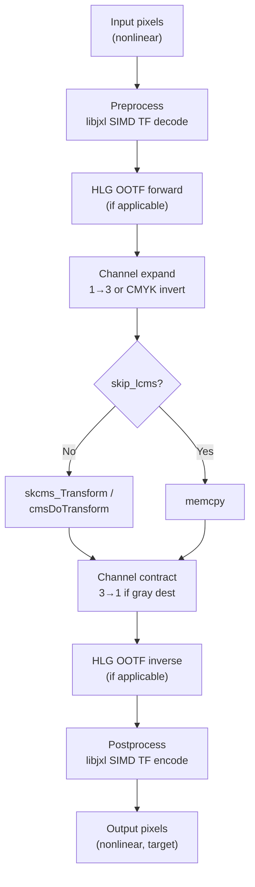

# Color Management



libjxl's color management system converts between arbitrary color spaces using
a pluggable CMS backend (skcms or LCMS2). The key optimization: transfer
functions that libjxl knows (sRGB, PQ, HLG) are handled by its own SIMD
implementations rather than the CMS backend, reducing the CMS to just chromatic
adaptation on linear data.

Source: `cms/jxl_cms.cc`, `cms/jxl_cms_internal.h`, `cms/color_encoding_cms.h`,
`color_encoding_internal.h`, `jxl/cms_interface.h`

## Pluggable CMS Interface

The public C API (`cms_interface.h`) defines a callback table:

```c
typedef struct {
    jpegxl_cms_set_fields_from_icc_func set_fields_from_icc;
    jpegxl_cms_init_func                init;
    jpegxl_cms_get_buffer_func          get_src_buf;
    jpegxl_cms_get_buffer_func          get_dst_buf;
    jpegxl_cms_run_func                 run;
    jpegxl_cms_destroy_func             destroy;
} JxlCmsInterface;
```

`JxlGetDefaultCms()` returns the built-in implementation that uses skcms
(or LCMS2 when `JPEGXL_ENABLE_SKCMS=0`).

## Color Encoding Types

### ColorSpace

```
kRGB     = 0    Trichromatic (also CMYK with kBlack extra channel)
kGray    = 1    Single-channel
kXYB     = 2    Fixed primaries, implies D65 white point
kUnknown = 3    Non-RGB/gray sensor data
```

### Primaries

CICP ColourPrimaries values:
```
kSRGB = 1     R=(0.640, 0.330)  G=(0.300, 0.600)  B=(0.150, 0.060)
k2100 = 9     R=(0.708, 0.292)  G=(0.170, 0.797)  B=(0.131, 0.046)
kP3   = 11    R=(0.680, 0.320)  G=(0.265, 0.690)  B=(0.150, 0.060)
```

Note: sRGB primaries use ICC 15-bit fixed-point quantized values, not the
standard spec values.

### TransferFunction

```
k709    = 1     BT.709
kLinear = 8     Identity (gamma 1.0)
kSRGB   = 13    sRGB
kPQ     = 16    Perceptual Quantizer (BT.2100)
kDCI    = 17    DCI (gamma 2.6)
kHLG    = 18    Hybrid Log-Gamma (BT.2100)
```

### RenderingIntent

```
kPerceptual = 0    Photos (requires LUT profile)
kRelative   = 1    Logos (default)
kSaturation = 2    CG graphics
kAbsolute   = 3    Proofing
```

## CMS Initialization

`JxlCmsInit` (`jxl_cms.cc:1105`) creates a color transform:

1. Parse both source and destination ICC profiles
2. If `c_src.SameColorEncoding(c_dst)` → set `skip_lcms = true`
3. Check if HLG OOTF needed: `apply_hlg_ootf = c_src.tf.IsHLG() != c_dst.tf.IsHLG()`
4. **ExtraTF optimization**: If source is PQ, HLG, or sRGB-to-linear, replace
   the CMS source profile with a linear version and set `preprocess` to handle
   the TF via libjxl's SIMD path. Same logic for destination with `postprocess`.
5. After substitution, re-check if profiles match → `skip_lcms = true`
6. Create skcms/LCMS transform from (possibly linearized) profiles
7. Allocate per-thread 128-byte-aligned float buffers

The ExtraTF optimization is the key design decision: libjxl's rational
polynomial TF implementations are faster than skcms/LCMS curve evaluation,
and by linearizing both sides, the CMS only handles a 3×3 matrix multiply for
chromatic adaptation.

## Transform Pipeline

`DoColorSpaceTransform` (`jxl_cms.cc:204`) processes each row through five
stages:

1. **Preprocess** (`BeforeTransform`): Apply inverse TF via SIMD
   (PQ→linear, HLG→linear, sRGB→linear). For HLG, also applies forward OOTF.
2. **Channel expansion**: Expand grayscale 1ch→3ch, or invert CMYK
   (`100 − 100×x`) for LCMS.
3. **CMS transform**: `skcms_Transform()` or `cmsDoTransform()`, or `memcpy`
   if `skip_lcms`.
4. **Channel contraction**: Contract 3ch→1ch for grayscale dest.
5. **Postprocess** (`AfterTransform`): Apply forward TF via SIMD
   (linear→PQ, linear→HLG, linear→sRGB). For HLG, applies inverse OOTF first.

## ICC Profile Parsing

`JxlCmsSetFieldsFromICC` (`jxl_cms.cc:954`) extracts structured fields from
an ICC profile:

1. Parse with skcms/LCMS
2. Extract rendering intent from bytes 60-63
3. Check for CICP tag → if recognized, use `ApplyCICP()` directly
4. Determine color space (RGB/Gray/CMYK)
5. Extract unadapted white point (undo chromatic adaptation if CHAD tag present)
6. Identify primaries by transforming unit RGB vectors to XYZ
7. Detect transfer function: try gamma match first, then iterate all known TF
   values comparing ICC profiles via `IsApproximatelyEqual()`

## ICC Profile Generation

`MaybeCreateProfile` (`jxl_cms_internal.h:1123`) creates ICC profiles from
structured color encoding fields:

- **Header**: ICC v4.4 with `"jxl "` CMM tag
- **CICP tag**: For interoperability with CICP-aware software
- **Chromatic adaptation**: Bradford transform to D50 PCS illuminant
- **Colorant tags**: rXYZ/gXYZ/bXYZ from primaries-to-XYZD50 matrix

Transfer function representation in ICC:
- **sRGB**: `para` type 3 with `{2.4, 1/1.055, 0.055/1.055, 1/12.92, 0.04045}`
- **BT.709**: `para` type 3 with `{1/0.45, 1/1.099, 0.099/1.099, 1/4.5, 0.081}`
- **Linear**: `para` type 3 with `{1.0, 1.0, 0.0, 1.0, 0.0}`
- **DCI**: `para` type 0 with `{2.6}`
- **PQ/HLG**: `curv` 64-entry table from `CreateTableCurve<64, ExtraTF::kPQ/kHLG>()`

### XYB ICC Profile

XYB gets a special `mAB` (A2B0) tag with:
- A curves: linear (no-op)
- CLUT: 2×2×2 grid encoding XYB cube corners
- M curves: parametric curve encoding the XYB-to-cone inverse
- Matrix: 3×3 from XYB intermediate to XYZ D50
- B curves: linear (no-op)

### HDR Tone-Mapped Profiles

For PQ/HLG content with known primaries, a 9×9×9 3D LUT (`mft1` tag) maps
to CIELAB PCS with integrated tone mapping and gamut mapping. Controlled by
`JXL_ENABLE_3D_ICC_TONEMAPPING` (default 1).

## Bitstream Signaling

Color encoding in the codestream can be:

1. **Structured fields**: ColorSpace, WhitePoint, Primaries, TransferFunction,
   RenderingIntent, plus optional custom xy coordinates and gamma. Compact
   enum-based.
2. **Raw ICC profile**: If the color space can't be represented by structured
   fields, the full ICC bytes are embedded.

`DecideIfWantICC`: if the ICC profile can be reconstructed from structured
fields, only fields are stored (more compact).

### CICP Mapping

JPEG XL uses CICP values directly:
- `TransferFunction` values match CICP TransferCharacteristics (1, 8, 13, 16, 17, 18)
- `Primaries` values match CICP ColourPrimaries (1, 9, 11)
- Special case: `kColorPrimariesP3_D65 = 12` (DCI-P3 primaries with D65 white)

## Key Constants

### Bradford Chromatic Adaptation

```
kBradford = {{ 0.8951,  0.2664, -0.1614},
             {-0.7502,  1.7135,  0.0367},
             { 0.0389, -0.0685,  1.0296}}
```

### D50 White Point (ICC PCS)

```
D50 XYZ = (0.96420288, 1.0, 0.82490540)    // skcms path
D50 XYZ = (0.96422,    1.0, 0.82521)       // Bradford adaptation target
```

### Default Intensity Target

```
kDefaultIntensityTarget = 255 cd/m²
```

The luminance at which linear 1.0 is displayed for non-PQ, non-HLG content.
