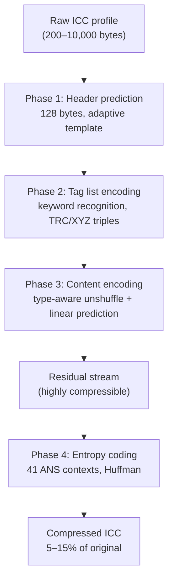

# ICC Profile Encoding



ICC profiles embedded in the codestream are compressed using the **PredictICC**
algorithm. Rather than storing the raw profile bytes, the encoder predicts each
byte from structure-aware models and entropy-codes only the residuals. This
exploits the rigid ICC specification structure — headers, tag directories, and
known tag types all have strong predictable patterns.

Source: `enc_icc_codec.cc`, `icc_codec.cc`, `icc_codec_common.cc`

## Bitstream Location

ICC data appears in the codestream header, after the color encoding fields and
before any frame data:

```
[File Header] [Color Encoding] [ICC Profile] [Preview?] [Frame Data...]
```

Written only when `color_encoding.WantICC()` is true — when the color space
cannot be represented by the frame header's parametric color encoding fields.

## Phase 1: Header Prediction

The first 128 bytes of any ICC profile follow the ICC v4 specification header.
The encoder predicts each byte from a hardcoded template that encodes the most
common field values:

```
Bytes 0-3:    00 00 00 00  (profile size — filled per-image)
Bytes 4-7:    04 00 00 00  (preferred CMM: "lcms")
Bytes 8-11:   "mntr"       (profile class: monitor)
Bytes 12-15:  "RGB "       (data color space)
Bytes 16-19:  "XYZ "       (PCS)
Bytes 84-87:  "acsp"       (magic number)
```

**Adaptive predictions** at specific positions:

| Position | Prediction Rule |
|----------|----------------|
| Bytes 8-11 | Copy from bytes 4-7 (manufacturer correlation) |
| Bytes 41-43 | `input[40]` = `'A'` → `"APPL"`, `'M'` → `"MSFT"`, etc. |

Residual for each byte: `residual[i] = icc[i] - predicted[i]`

Source: `icc_codec_common.cc:102-138`

## Phase 2: Tag List Encoding

The tag directory (12 bytes per entry: 4-byte keyword + 4-byte offset + 4-byte
size) is encoded with structure-aware prediction.

### Tag Recognition

17 common RGB/Gray monitor profile tags are recognized by keyword:

```
cprt, wtpt, bkpt, rXYZ, gXYZ, bXYZ, kXYZ, rTRC, gTRC, bTRC, kTRC,
chad, desc, chrm, dmnd, dmdd, lumi
```

Known tags encode as a 6-bit command code (no keyword bytes needed). Unknown
tags emit `kCommandTagUnknown` (1) followed by the 4-byte keyword.

### Tag Deduplication

Two common patterns are detected and collapsed:

**TRC Triple** (`rTRC`, `gTRC`, `bTRC`): If all three appear consecutively with
identical offset and size, emit a single `kCommandTagTRC` (2) code and generate
all three entries in the decoder.

**XYZ Triple** (`rXYZ`, `gXYZ`, `bXYZ`): If present with offsets 20 bytes apart
and equal sizes of 20, emit `kCommandTagXYZ` (3).

### Offset and Size Prediction

```
predicted_offset = previous_offset + previous_size
predicted_size = previous_size  (or 20 for known-size XYZ tags)

if offset differs: set kFlagBitOffset (0x40), emit Varint(actual_offset)
if size differs:   set kFlagBitSize   (0x80), emit Varint(actual_size)
```

Correctly predicted values cost zero bits. End of tag list: `0x00` byte.

Source: `enc_icc_codec.cc:153-243`

## Phase 3: Content Encoding

Tag data is processed with type-aware prediction. The encoder recognizes 8
common ICC tag types (`XYZ`, `desc`, `text`, `mluc`, `para`, `curv`, `sf32`,
`gbd`) and applies specialized strategies.

### Unshuffle Transformation

Multi-byte values are de-interleaved for better correlation:

```
Unshuffle(data, size, width=2):
    Input:  A₁B₁ A₂B₂ A₃B₃ ...   (interleaved high/low bytes)
    Output: A₁A₂A₃... B₁B₂B₃...  (grouped by byte position)
```

Applied to `mluc` (UTF-16 text, width=2) and `curv` (16-bit LUT, width=2).

### Linear Predictive Coding

Each byte is predicted from previous values at a fixed stride:

```
order 0: predicted = p[i - stride]                           (constant)
order 1: predicted = 2×p[i - stride] - p[i - 2×stride]      (linear)
order 2: predicted = 3×p[i-s] - 3×p[i-2s] + p[i-3s]        (quadratic)
```

**Stride** is the distance between successive values (e.g., 2 for 16-bit
entries in a curve LUT). Constraint: `stride × 4 ≤ current position`.

### Tag Type Handlers

**Curve** (`curv`): width=2, stride=2, order=1. 16-bit LUT values predicted
linearly. Typical for transfer function tables (256–4096 entries).

**mAB/mBA** (matrix LUTs): Detects embedded curve subtags and CLUTs. CLUT data
uses stride = width × num_output_channels for prediction along the table's
natural axis.

**gbd** (gamut boundary): width=4, order=0 (no prediction, just unshuffle).
The 32-bit floats benefit from byte separation alone.

**XYZ**: 12 bytes output verbatim (3 × 4-byte fixed-point XYZ values).

**Fallback**: Unrecognized data emits `kCommandInsert` with a varint byte count
and the raw bytes.

Source: `enc_icc_codec.cc:247-442`

## Phase 4: Entropy Coding

The residual stream is entropy-coded with 41 context-dependent histograms.

### Context Assignment

```cpp
// icc_codec_common.cc:171
size_t ICCANSContext(size_t i, size_t b1, size_t b2) {
    if (i <= 128) return 0;              // header bytes: all context 0
    return 1 + ByteKind1(b1) + ByteKind2(b2) * 8;  // 1..40
}
```

**ByteKind1** (8 categories from previous byte):

| Category | Values |
|----------|--------|
| 0 | Alphabetic (a-z, A-Z) |
| 1 | Numeric/punctuation (0-9, `.`, `,`) |
| 2 | Null (0x00) |
| 3 | One (0x01) |
| 4 | Small (2-15) |
| 5 | Large (241-254) |
| 6 | Max (0xFF) |
| 7 | Other (16-240 minus above) |

**ByteKind2** (5 categories from byte before previous): Alphabetic, numeric,
small, large, other. Total: 1 + 8 × 5 = 41 contexts.

### Coding Parameters

- Always uses Huffman (not secondary ANS)
- LZ77: optimal if size < 16 KB, greedy otherwise
- Output is written to the codestream header section

### Varint Encoding

Variable-length integers (sizes, offsets) use 7-bit groups with continuation:

```
while value > 127:
    emit (value & 0x7F) | 0x80    // 7 data bits + more-to-come flag
    value >>= 7
emit value & 0x7F                 // final group, no flag
```

## Compression Results

- **Input**: Raw ICC profiles (typically 200–10,000 bytes)
- **After PredictICC**: Similar size but much more compressible (~2–20% entropy
  of original)
- **After entropy coding**: Typically 5–15% of original ICC size
- **Profile size limit**: 2³⁰ bytes (theoretical)
