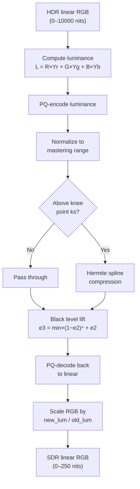

# Tone Mapping



Tone mapping compresses the dynamic range of HDR content to fit within an SDR
display's capabilities. libjxl implements the Rec. 2408 tone mapper for PQ
content and the HLG OOTF for scene-to-display conversion.

Source: `cms/tone_mapping.h`, `cms/tone_mapping-inl.h`, `cms/jxl_cms.cc`,
`cms/jxl_cms_internal.h`

## Rec. 2408 Tone Mapper

Based on ITU-R BT.2408, this maps PQ content from a source mastering range
(e.g., 0–10000 nits) to a target display range (e.g., 0–250 nits).

### Setup

Given `source_range = [src_min, src_max]` and `target_range = [tgt_min, tgt_max]`:

```
pq_mastering_min = PQ_encode(src_min)
pq_mastering_max = PQ_encode(src_max)
pq_mastering_range = pq_mastering_max − pq_mastering_min

min_lum = (PQ_encode(tgt_min) − pq_mastering_min) / pq_mastering_range
max_lum = (PQ_encode(tgt_max) − pq_mastering_min) / pq_mastering_range

ks = 1.5 × max_lum − 0.5       // knee-start point
normalizer = src_max / tgt_max
inv_target_peak = 1 / tgt_max
```

### Per-Pixel Algorithm

```
1. Compute luminance:
   L = src_max × (Yr×R + Yg×G + Yb×B)

2. Normalize to PQ mastering range:
   normalized_pq = min(1, (PQ_encode(L) − pq_mastering_min) / pq_mastering_range)

3. Hermite spline compression (if above knee):
   if normalized_pq < ks:
       e2 = normalized_pq       // linear passthrough
   else:
       t = (normalized_pq − ks) / (1 − ks)
       e2 = (2t³ − 3t² + 1)×ks + (t³ − 2t² + t)×(1 − ks) + (−2t³ + 3t²)×max_lum

4. Black level lift:
   e3 = min_lum × (1 − e2)⁴ + e2

5. Convert back to display light:
   e4 = e3 × pq_mastering_range + pq_mastering_min
   new_luminance = clamp(PQ_decode(e4, intensity=1.0), 0, tgt_max)

6. Scale RGB channels:
   if luminance ≤ 1e-6:
       channel = new_luminance × inv_target_peak
   else:
       channel *= (new_luminance / luminance) × normalizer
```

The Hermite spline ensures C1 continuity at the knee point — the transition
from linear passthrough to compressed highlights is smooth with no visible
boundary. The `(1 − e2)⁴` black lift term primarily affects darks without
disturbing mid-tones.

Typical usage for ICC profile generation: source [0, 10000] nits, target
[0, 250] nits.

## HLG OOTF

The Opto-Optical Transfer Function converts HLG scene light to display light
with a display-luminance-dependent gamma.

### Gamma Computation

```
FromSceneLight:
    gamma = 1.2 × pow(1.111, log2(display_luminance / 1000))

ToSceneLight (inverse):
    gamma = (1/1.2) × pow(1.111, −log2(display_luminance / 1000))
```

At 300 nits: `gamma ≈ 1.0` (identity). At 1000 nits: `gamma = 1.2`.

### Application

```
luminance = Yr×R + Yg×G + Yb×B
ratio = min(pow(luminance, gamma − 1), 1e9)
R *= ratio; G *= ratio; B *= ratio
```

The OOTF is skipped when `|exponent| < 0.01` (gamma very close to 1.0).

### Integration with CMS Pipeline

In `ApplyHlgOotf` (`jxl_cms.cc:857`), the OOTF is skipped entirely when
`intensity_target` is in [295, 305], since gamma ≈ 1.0 at ~300 nits.

When crossing between HLG and non-HLG color spaces
(`c_src.tf.IsHLG() != c_dst.tf.IsHLG()`), the OOTF is applied:
- **Forward** (scene→display): before the CMS chromatic adaptation
- **Inverse** (display→scene): after the CMS chromatic adaptation

## Gamut Mapping

`GamutMap` (`tone_mapping-inl.h:138`) desaturates out-of-gamut pixels by
mixing with gray at the same luminance:

```
1. Compute luminance from primaries luminances

2. For each channel:
   gray_mix_saturation = minimum gray to make all components ≥ 0
   gray_mix_luminance  = minimum gray to make all components ≤ 1

3. Blend:
   gray_mix = clamp(preserve_saturation × (gray_mix_saturation − gray_mix_luminance)
                    + gray_mix_luminance, 0, 1)

4. Mix: val = gray_mix × (luminance − val) + val

5. Normalize: divide all channels by max(1, max_channel)
```

`preserve_saturation` controls the tradeoff:
- `0.1` — default in the SIMD pipeline (favor accuracy)
- `0.3` — used in ICC tone mapping LUT generation (favor saturation)

## ICC 3D LUT Tone Mapping

For HDR profiles embedded in ICC, `ToneMapPixel` (`jxl_cms_internal.h:128`)
performs per-pixel tone mapping for the 9×9×9 3D LUT:

1. Convert encoded to linear via PQ (at 10000 nits) or HLG EOTF
2. PQ: apply Rec.2408 from [0, 10000] to [0, 250] nits
   HLG: apply OOTF from 300 nit source to 80 nit target
3. Apply gamut mapping with `preserve_saturation = 0.3`
4. Convert to XYZ D50 via Bradford chromatic adaptation
5. Convert XYZ to CIELAB, encode as uint8

CIELAB constants for D50:
```
kXn = 0.964212
kYn = 1.0
kZn = 0.825188
kDelta = 6/29    // linearization threshold
```
