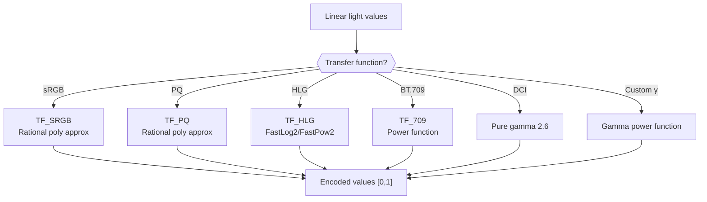

# Transfer Functions



Transfer functions convert between linear light values and nonlinear encoded
values. libjxl implements all standard transfer functions with both exact scalar
formulas and fast SIMD approximations using rational polynomials via Highway.

Source: [`cms/transfer_functions.h`](https://github.com/libjxl/libjxl/blob/main/lib/jxl/cms/transfer_functions.h), [`cms/transfer_functions-inl.h`](https://github.com/libjxl/libjxl/blob/main/lib/jxl/cms/transfer_functions-inl.h)

## sRGB

The most common transfer function. A two-piece curve with a linear toe segment:

**Linear → Encoded (OETF):**
```
if linear ≤ 0.0031308:
    encoded = 12.92 × linear
else:
    encoded = 1.055 × linear^(1/2.4) − 0.055
```

**Encoded → Linear (EOTF):**
```
if encoded ≤ 0.04045:
    linear = encoded / 12.92
else:
    linear = ((encoded + 0.055) / 1.055)^2.4
```

### SIMD Implementation

The SIMD path (`TF_SRGB` in [`transfer_functions-inl.h:215`](https://github.com/libjxl/libjxl/blob/main/lib/jxl/cms/transfer_functions-inl.h#L215)) replaces the
expensive `pow()` with 4/4-degree rational polynomial approximations evaluated
via `EvalRationalPolynomial`.

**`DisplayFromEncoded(x)`** — for `x > 0.04045`, evaluates a rational poly on `x`:
```
p = {2.200248328e-04, 1.043637593e-02, 1.624820318e-01,
     7.961564959e-01, 8.210152774e-01}
q = {2.631846970e-01, 1.076976492e+00, 4.987528350e-01,
     -5.512498495e-02, 6.521209011e-03}
```

**`EncodedFromDisplay(x)`** — for `x > 0.0031308`, evaluates a rational poly
on `sqrt(x)` (the square root maps the domain closer to [0,1] for better
polynomial fit):
```
p = {-5.135152395e-04, 5.287254571e-03, 3.903842876e-01,
      1.474205315e+00, 7.352629620e-01}
q = {1.004519624e-02, 3.036675394e-01, 1.340816930e+00,
     9.258482155e-01, 2.424867759e-02}
```

Both paths use copysign mirroring for negative inputs to support unbounded CMM.

### Fast Approximation

`FastLinearToSRGB` ([`transfer_functions-inl.h:279`](https://github.com/libjxl/libjxl/blob/main/lib/jxl/cms/transfer_functions-inl.h#L279)) provides a faster path with
max error 1.2e-4. It reconstructs `v^(1/2.4)` by decomposing the IEEE 754
float into mantissa and exponent:

1. A 3rd-degree polynomial approximates `mantissa^(1/2.4)` in [0.25, 0.5]
2. A lookup table of `2^(5/12)` powers handles the exponent part
3. The identity `v^(1/2.4) = mantissa^(1/2.4) × 2^(exp/2.4)` reconstructs
   the full curve

Below `0.0031308`, it falls back to `12.92 × v`.

## Perceptual Quantizer (PQ / ST 2084)

The HDR transfer function from BT.2100, mapping absolute luminance in cd/m²
to a [0,1] signal range with 10,000 nits peak.

### Constants

From BT.2100-2 / SMPTE ST 2084:
```
kM1 = 2610 / 16384             = 0.1593017578125
kM2 = (2523 / 4096) × 128      = 78.84375
kC1 = 3424 / 4096              = 0.8359375
kC2 = (2413 / 4096) × 32       = 18.8515625
kC3 = (2392 / 4096) × 32       = 18.6875
```

### Scalar Formulas

**Encoded → Linear** (`TF_PQ_Base::DisplayFromEncoded`):
```
x' = |e|^(1/kM2)
num = max(x' − kC1, 0)
den = kC2 − kC3 × x'
d = (num / den)^(1/kM1) × (10000 / intensity_target)
return copysign(d, e)
```

**Linear → Encoded** (`TF_PQ_Base::EncodedFromDisplay`):
```
x' = (|d| × intensity_target / 10000)^kM1
num = kC1 + x' × kC2
den = 1 + x' × kC3
e = (num / den)^kM2
return copysign(e, d)
```

The `intensity_target` parameter (default 255 for SDR, 10000 for PQ) scales
between the codec's internal luminance range and absolute nits.

### SIMD Implementation

The SIMD `TF_PQ` constructor precomputes scaling factors:
```
display_scaling_factor_to_10000 = intensity_target / 10000
display_scaling_factor_from_10000 = 10000 / intensity_target
```

**`DisplayFromEncoded`**: 4/4-degree rational polynomial on `x + x²`:
```
p = {2.62975656e-04, -6.23553089e-03, 7.38602301e-01,
     2.64553172e+00, 5.50034862e-01}
q = {4.21350107e+02, -4.28736818e+02, 1.74364667e+02,
     -3.39078883e+01, 2.67718770e+00}
```
Max error: 3e-6.

**`EncodedFromDisplay`**: Two 4/4-degree rational polynomials on `x^0.25`,
split at `x = 1e-4` for accuracy in both bright and dark regions. The high
range polynomial achieves max error 7e-7.

## Hybrid Log-Gamma (HLG)

The broadcast HDR transfer function from BT.2100. Scene-referred (no absolute
luminance), with a two-piece curve: square root for darks, logarithmic for
brights.

### Constants

```
kA     = 0.17883277
kRA    = 1 / kA               = 5.591816...
kB     = 1 − 4 × kA           = 0.28466892
kC     = 0.5599107295
kInv12 = 1/12                  = 0.08333...
```

### Scalar OETF

```
if scene ≤ 1/12:
    encoded = sqrt(3 × scene)
else:
    encoded = 0.17883277 × ln(12×scene − 0.28466892) + 0.5599107295
```

### Scalar Inverse OETF

```
if encoded ≤ 0.5:
    scene = encoded² / 3
else:
    scene = (exp((encoded − 0.5599107295) / 0.17883277) + 0.28466892) / 12
```

### HLG OOTF

The Opto-Optical Transfer Function adjusts gamma based on display luminance:

```
gamma = 1.2 × pow(1.111, log2(display_luminance / 1000))
```

At 300 nits, gamma ≈ 1.0 (identity). The OOTF is skipped when
`intensity_target` is in [295, 305].

For display adaptation:
```
luminance = R × red_Y + G × green_Y + B × blue_Y
ratio = pow(luminance, gamma − 1)
R *= ratio; G *= ratio; B *= ratio
```

### SIMD Implementation

**`EncodedFromDisplay`**: For `|x| > 1/12`, uses `FastLog2` with derived
constants `kHiPow = kRA × log2(e)` and `kHiMul = exp(−kC×kRA)/12`.

**`DisplayFromEncoded`**: For `|x| > 0.5`, uses `FastPow2` with the same
constants. Max error: 5e-7.

## BT.709

The HDTV transfer function. Similar structure to sRGB but with different
constants:

```
Linear → Encoded:
    if linear < 0.018:    encoded = 4.5 × linear
    else:                 encoded = 1.099 × linear^0.45 − 0.099

Encoded → Linear:
    if encoded < 0.081:   linear = encoded / 4.5
    else:                 linear = ((encoded + 0.099) / 1.099)^(1/0.45)
```

SIMD max error: 1e-6.

## DCI (Gamma 2.6)

Pure power function with no linear segment:

```
EncodedFromDisplay(d) = d^(1/2.6)
DisplayFromEncoded(e) = e^2.6
```

Represented as `TransferFunction::kDCI`. In ICC profiles: `para` type 0 with
gamma = 2.6.

## Custom Gamma

`CustomTransferFunction` stores gamma as a fixed-point value:
```
gamma_stored = gamma × kGammaMul    (kGammaMul = 10,000,000)
```

Valid range: `(1/8192, 1.0]` (kMaxGamma = 8192). Auto-detection maps gamma
≈1.0 to `kLinear` and gamma ≈1/2.6 to `kDCI`.

## Unbounded Color Management

All transfer functions use copysign mirroring: `f(−x) = −f(x)`. This follows
the "Unbounded CMM" approach where inputs can be negative or above 1.0 due to
chromatic adaptation between different gamuts. Functions are extended naturally
above 1.0 (no clamping) to preserve round-trip accuracy across color space
conversions.
