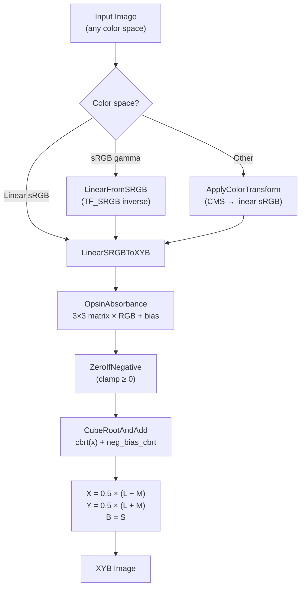
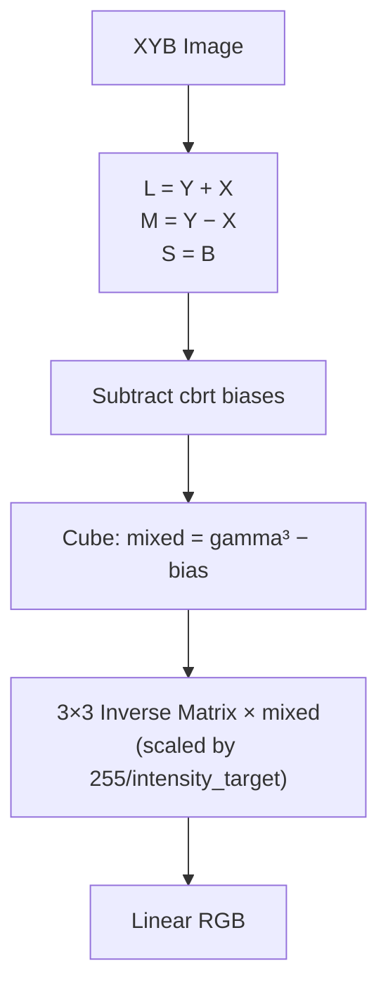

# XYB Color Space



XYB is JPEG XL's internal color representation, designed around the butteraugli
perceptual model. It converts linear RGB into a space that approximately
decorrelates along human cone response axes, applies a cube-root perceptual
nonlinearity, then forms opponent channels. The result: quantization noise in
XYB maps roughly uniformly to perceptual distortion.

Source: `enc_xyb.cc`, `dec_xyb.cc`, `dec_xyb-inl.h`, `cms/opsin_params.h`

## Forward Transform: Linear RGB → XYB

### Stage 1: Opsin Absorbance (Linear Mixing)

A 3×3 matrix models cone photopigment absorbance, mixing RGB into three
cone-like channels. Each row sums to 1.0:

```
         R         G         B
L:  [ 0.300,    0.622,    0.078  ]
M:  [ 0.230,    0.692,    0.078  ]
S:  [ 0.243,    0.205,    0.552  ]
```

L and M are very similar (both dominated by green, identical blue coefficient),
reflecting the overlapping spectral sensitivity of human L and M cones. S has
a strong blue component (0.552), reflecting the S-cone pathway.

After matrix multiply, a bias is added:

```
kOpsinAbsorbanceBias = 0.003793073    // all three channels identical
mixed[c] = sum(matrix[c][i] × rgb[i] × intensity_target/255) + bias
```

The bias ensures `mixed[c] > 0` for in-gamut inputs (the cube root needs
non-negative values). For wide-gamut content, `ZeroIfNegative()` clamps to zero.

For SDR (`intensity_target = 255`), the `intensity_target/255` factor is 1.0
and cancels. For HDR (e.g., `intensity_target = 10000` for PQ), it scales
absolute nits into the opsin domain.

### Stage 2: Cube Root (Perceptual Nonlinearity)

```
gamma[c] = cbrt(mixed[c]) + neg_bias_cbrt[c]
```

where `neg_bias_cbrt[c] = -cbrt(0.003793) ≈ -0.15595`. This ensures black
(input = 0) maps to zero: `cbrt(bias) - cbrt(bias) = 0`.

The cube root (γ = 1/3) approximates the ~0.38–0.43 power law of human
contrast perception. XYB uses 1/3 specifically because cubing is fast on the
decoder side — just two multiplies — while the perceptual accuracy is acceptable.

The SIMD implementation (`CubeRootAndAdd`, `fast_math-inl.h:179`) uses:
1. IEEE-754 float bit trick for initial approximation (multiply exponent by -1/3)
2. Three Newton-Raphson iterations: `r = (4/3)r - (x/3)r⁴`
3. Final refinement: `r = r + (1/3)(r - xr⁴)`
4. Compute `r² × x + add` (= `cbrt(x) + add`)

Maximum error: 6 ULP.

### Stage 3: XYB Channel Formation

```
X = 0.5 × (gamma[0] - gamma[1])    // half-difference (red-green opponent)
Y = 0.5 × (gamma[0] + gamma[1])    // half-sum (luminance-like)
B = gamma[2]                         // S-cone channel directly
```

X is a chromatic opponent channel. Y carries luminance. B is the blue-yellow
pathway. This is a lossless linear transform of the gamma channels.

## Inverse Transform: XYB → Linear RGB



The inverse matrix:

```
        mixed_L      mixed_M      mixed_S
R:  [ 11.032,    -9.867,    -0.165  ]
G:  [ -3.254,     4.419,    -0.165  ]
B:  [ -3.659,     2.713,     1.946  ]
```

Each entry is pre-multiplied by `255/intensity_target` in `InitSIMDInverseMatrix()`,
broadcast to 4 SIMD lanes for `LoadDup128`.

### Non-sRGB Output

When decoding to non-sRGB primaries:
1. Compute sRGB-to-XYZ-D50 matrix
2. Compute target-primaries-to-XYZ matrix via Bradford adaptation
3. Multiply the conversion matrix with the opsin inverse matrix
4. The combined matrix produces linear values directly in the target primaries

## Key Constants

| Constant | Value | Purpose |
|----------|-------|---------|
| Absorbance bias | 0.003793 | Ensure positive inputs to cbrt |
| `kDefaultIntensityTarget` | 255 | SDR nits for 1.0 input |
| `kDefaultQuantBias` X | 0.9453 | Dequant bias correction, X channel |
| `kDefaultQuantBias` Y | 0.9299 | Dequant bias correction, Y channel |
| `kDefaultQuantBias` B | 0.9501 | Dequant bias correction, B channel |
| `kBiasNumerator` | 0.145 | Dequant bias for `|q| ≥ 2` |
| `kBScale` | 1.0 | B-channel scaling (tuning vestige) |

## The OpsinInverseMatrix in the Bitstream

The codestream can carry a custom inverse matrix via `OpsinInverseMatrix`
(serialized as F16 half-precision floats). When the matrix matches the frozen
defaults, `AllDefault` skips serialization entirely. This provides forward
compatibility — future codecs could tune the absorbance model while remaining
decodable by current implementations.

## Why XYB?

XYB was co-designed with butteraugli. The absorbance matrix, cube root, and
opponent channel formation were jointly optimized so that equal-magnitude
perturbations in XYB space produce roughly equal perceptual distortion as
measured by butteraugli. This means a simple uniform quantizer in XYB space
achieves near-optimal perceptual rate-distortion without needing complex
perceptual weighting at the coefficient level.

The shared color model between the codec and the quality metric is a key
architectural advantage of JPEG XL over formats that use generic color spaces
(YCbCr, YUV) with separate perceptual tuning.
