# Decoder Pipeline Diagram

Complete data flow from JPEG XL bitstream to decoded output, covering container parsing, entropy decoding, VarDCT and Modular decode paths, the render pipeline stages, and output color management.



<details>
<summary>Mermaid source</summary>

```
{{#include ../../jxl-decoder.mmd}}
```

</details>
