# Encoder Pipeline Diagram

Complete data flow from input image to JPEG XL bitstream, covering JPEG reencoding, color management, both VarDCT and Modular encoding paths, entropy coding, and bitstream assembly.



<details>
<summary>Mermaid source</summary>

```
{{#include ../../jxl-encoder.mmd}}
```

</details>
