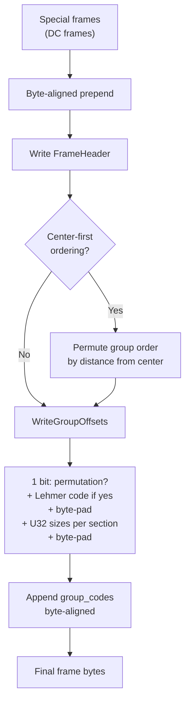

# Bitstream Assembly



The final stage of encoding assembles all encoded sections into the JPEG XL
codestream format. Two modes exist: one-shot (entire frame in memory) and
streaming (sections written incrementally).

Source: [`enc_frame.cc`](https://github.com/libjxl/libjxl/blob/main/lib/jxl/enc_frame.cc), [`enc_toc.h`](https://github.com/libjxl/libjxl/blob/main/lib/jxl/enc_toc.h), [`enc_toc.cc`](https://github.com/libjxl/libjxl/blob/main/lib/jxl/enc_toc.cc), [`toc.h`](https://github.com/libjxl/libjxl/blob/main/lib/jxl/toc.h)

## TOC (Table of Contents)

The TOC precedes all group data and stores the byte size of each section.

### Size Distribution

```cpp
constexpr U32Enc kTocDist(
    Bits(10),                // 0..1023        (12 bits total)
    BitsOffset(14, 1024),    // 1024..17407    (16 bits total)
    BitsOffset(22, 17408),   // 17408..4211711 (24 bits total)
    BitsOffset(30, 4211712)  // 4211712+       (32 bits total)
);
```

Four size buckets with progressive offsets — small sections are cheap to signal.

### TOC Format

```
[1 bit: permutation present?]
[if permutation: Lehmer code encoding]
[byte padding to alignment]
[per-section U32 size using kTocDist]
[byte padding to alignment]
```

## One-Shot Assembly

`EncodeFrameOneShot` ([`enc_frame.cc:2152`](https://github.com/libjxl/libjxl/blob/main/lib/jxl/enc_frame.cc#L2152)):

1. Prepend special frames (DC frames for progressive DC)
2. Write frame header via `WriteFrameHeader`
3. Optionally permute groups for center-first ordering
4. Write TOC via `WriteGroupOffsets`
5. Append all `group_codes[]` byte-aligned

## Group Permutation (Center-First)

When `cparams.centerfirst` is set, `PermuteGroups` ([`enc_frame.cc:1688`](https://github.com/libjxl/libjxl/blob/main/lib/jxl/enc_frame.cc#L1688))
reorders AC groups by distance from image center (or specified coordinates):

- DC global and DC groups: unchanged (identity permutation)
- AC groups per pass: sorted by concentric-square distance from center,
  with clockwise angular sort within each distance ring

This causes the center of the image to decode first, which is useful for
progressive rendering of photographs where the subject is typically centered.

## Streaming Assembly

`EncodeFrameStreaming` ([`enc_frame.cc:2031`](https://github.com/libjxl/libjxl/blob/main/lib/jxl/enc_frame.cc#L2031)) processes one DC group at a time:

### Permutation

`ComputePermutationForStreaming` creates an interleaved ordering:

```
[DC Global]
For each DC group (y, x) in raster order:
    [DC group]
    For each pass:
        For each AC group in this DC group:
            [AC group (pass, group)]
[AC Global]  // last
```

This allows streaming decoders to process DC groups and their corresponding
AC groups incrementally.

### Assembly Steps

1. **Pre-compute permutation** and estimate group data offset
2. **Seek past header area** (write group data forward-only)
3. **Per DC group** (sequential):
   - First iteration: encode frame header, write DC global, compute offset
   - `ComputeEncodingData()` for this DC group's region
   - `OutputGroups()`: write DC group + its AC groups
4. **AC Global**: written last (histograms need all token data)
   - `OutputAcGlobal()`: dequant matrices (1 bit = default), num_histograms,
     coeff orders, cleaned-up histograms
5. **Seek back**: write frame header + TOC + DC global at reserved space

### TOC Padding

The streaming TOC padding ensures the header occupies exactly the pre-computed
size:

```cpp
ComputeGroupDataOffset(frame_header_size, dc_global_size, num_sections,
                       min_dc_global_size, group_data_offset);
padding_size = group_data_offset − actual_offset;
```

The DC global section is padded so that group data starts at a predictable
offset, even though the exact TOC size depends on group sizes not yet known.
