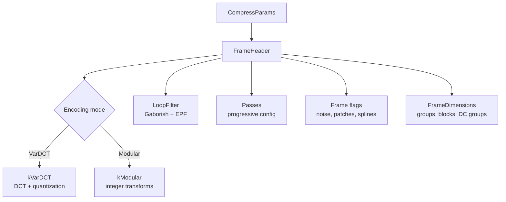

# Frame Setup



Frame setup creates the `FrameHeader` and `FrameDimensions` from compression
parameters. These structures control every downstream encoding decision.

Source: `frame_header.h`, `frame_dimensions.h`, `enc_frame.cc`,
`enc_params.h`

## FrameHeader

Key fields serialized to the bitstream:

| Field | Type | Purpose |
|-------|------|---------|
| `encoding` | `FrameEncoding` | kVarDCT or kModular |
| `frame_type` | `FrameType` | Regular, DC frame, reference-only, skip-progressive |
| `flags` | uint64 | kNoise=1, kPatches=2, kSplines=16, kUseDcFrame=32 |
| `color_transform` | `ColorTransform` | kXYB, kNone, kYCbCr |
| `group_size_shift` | uint32 | Modular only: 0-3 (128-1024 pixel groups) |
| `x_qm_scale` | uint32 | X-channel quant matrix scaling (3-6) |
| `b_qm_scale` | uint32 | B-channel quant matrix scaling |
| `passes` | `Passes` | Progressive pass definitions |
| `loop_filter` | `LoopFilter` | Gaborish + EPF parameters |
| `upsampling` | uint32 | 1/2/4/8× upsampling factor |
| `is_last` | bool | Final frame in image |

## CompressParams

Central configuration from the public API:

| Parameter | Default | Range | Effect |
|-----------|---------|-------|--------|
| `butteraugli_distance` | 1.0 | 0.05+ | Target quality |
| `speed_tier` | kSquirrel (3) | −1 to 9 | Feature gating |
| `modular_mode` | false | — | Force modular encoding |
| `resampling` | 1 | 1/2/4/8 | Downsampling factor |
| `progressive_dc` | 0 | 0-2 | DC progressive levels |
| `decoding_speed_tier` | 0 | 0-4 | Decoder complexity limit |
| `epf` | −1 (auto) | −1 to 3 | EPF iteration override |

## FrameDimensions

Derived from the frame header via `ToFrameDimensions()`:

```
kBlockDim         = 8 pixels
kDCTBlockSize     = 64 (8×8)
kGroupDim         = 256 pixels (default)
kGroupDimInBlocks = 32

group_dim = (kGroupDim >> 1) << group_size_shift
dc_group_dim = group_dim × kBlockDim

num_groups    = ceil(width/group_dim) × ceil(height/group_dim)
num_dc_groups = ceil(width/dc_group_dim) × ceil(height/dc_group_dim)
```

## MakeFrameHeader Logic

`MakeFrameHeader` (`enc_frame.cc:319`) decision tree:

### Encoding Mode
- JPEG transcode → force VarDCT
- `cparams.modular_mode` → Modular
- Otherwise → VarDCT (default)

### Group Size (Modular Only)
- Images ≤ 128 pixels: shift=0 (128px groups)
- Default: shift=1 (256px groups)
- Custom: `cparams.modular_group_size_shift`

### Loop Filter
- **Gaborish**: enabled when speed ≤ Hare AND VarDCT AND distance > 0.5 AND
  `decoding_speed_tier < 4` AND perceptual optimizations not disabled
- **EPF iterations**: based on distance thresholds

| Distance | EPF Iters | Stages |
|----------|-----------|--------|
| < 0.7 | 0 | None |
| 0.7–1.5 | 1 | EPF1 |
| 1.5–4.0 | 2 | EPF1 + EPF2 |
| ≥ 4.0 | 3 | EPF0 + EPF1 + EPF2 |

### Frame Flags
- `kNoise`: distance ≥ kMinButteraugliForNoise (99.0) or photon_noise_iso set
- `kPatches`: enabled if patches present after detection
- `kSplines`: enabled if splines present

### Progressive Passes

Three built-in modes plus custom:

**progressive_mode** (3 passes):
```
Pass 0: 2 coefficients, shift=0, downsample≥4
Pass 1: 3 coefficients, shift=0, downsample≥2
Pass 2: 8 coefficients, shift=0, full
```

**qprogressive_mode** (2 passes):
```
Pass 0: 8 coefficients, shift=1, downsample≥2
Pass 1: 8 coefficients, shift=0, full
```

**Default**: 1 pass, all coefficients.

## PassesEncoderState

Central encoder state created per frame:

- `shared` (PassesSharedState): quantizer, AC strategy image, quant field,
  color correlation map, DC storage, coefficient orders, block context map
- `coeffs`: per-pass DCT coefficients, one row per group
- `passes`: per-pass token streams, context maps, entropy codes
- `progressive_splitter`: splits coefficients across passes
- `histogram_idx`: per-group histogram selection
- `used_acs`: bitmask of AC strategy types seen
- `used_orders`: per-pass non-default coefficient orders
- `x_qm_multiplier`, `b_qm_multiplier`: chrominance quant matrix scaling
