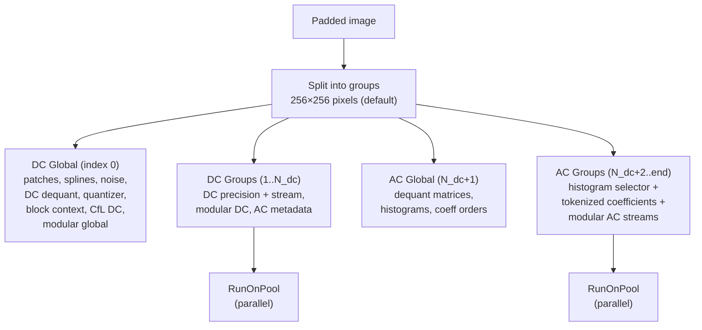

# Group Encoding



Images are divided into independent groups for parallel encoding and decoding.
Each group is encoded into a separate bitstream section with its own byte
alignment.

Source: `enc_frame.cc`, `enc_group.cc`, `frame_dimensions.h`, `toc.h`

## Group Structure

**VarDCT mode** (default `group_size_shift = 1`):
- Group size: 256×256 pixels (32×32 blocks)
- DC group: 8×8 groups worth of DC = 2048×2048 pixels of DC
- Group count: `ceil(width/256) × ceil(height/256)`

**Modular mode**: Group size varies (128-1024) based on `group_size_shift`.

## TOC Section Layout

For a frame with `num_groups > 1` or `num_passes > 1`:

| Index | Section |
|-------|---------|
| 0 | DC Global |
| 1 .. num_dc_groups | DC Groups |
| num_dc_groups + 1 | AC Global |
| num_dc_groups + 2 .. end | AC Groups: pass 0 group 0, ..., pass P-1 group N-1 |

**Small image optimization**: 1 group + 1 pass = all sections in a single TOC entry.

AC group index formula:
```
AcGroupIndex(pass, group, num_groups, num_dc_groups) =
    2 + num_dc_groups + pass × num_groups + group
```

## EncodeGroups Pipeline

`EncodeGroups` (`enc_frame.cc:1299`) allocates one `BitWriter` per TOC entry:

### Phase 1: DC Global (serial)

- Patch dictionary encoding
- Spline encoding
- Noise parameters (8 × 10-bit values)
- DC dequant matrices
- Global DC info: quantizer params, block context map, CfL DC correlation
- Modular global info and global stream

### Phase 2: DC Groups (parallel via RunOnPool)

Per DC group:
- VarDCT DC precision bits + modular DC stream
- Modular DC group stream
- AC metadata: quant field + EPF sharpness + AC strategy

### Phase 3: AC Global (serial)

- `EncodeGlobalACInfo()`: dequant matrices, num_histograms
- Per-pass coefficient orders + ANS histograms
- `BuildAndEncodeHistograms()` for histogram clustering

### Phase 4: AC Groups (parallel via RunOnPool)

Per group, per pass:
```
// Write histogram selector (log2(num_histograms) bits)
writer->Write(histo_selector_bits, histogram_idx);
// Write entropy-coded tokens
WriteTokens(ac_tokens[group_idx], codes, context_offset, writer);
```

Each BitWriter is zero-padded to byte boundary after encoding.

## Parallelization Points

| Phase | Granularity | Pool Label |
|-------|------------|------------|
| DC coefficient computation | Per DC group | "Compute DC coeffs" |
| Coefficient computation | Per AC group | "Compute coeffs" |
| Tokenization | Per AC group | "TokenizeGroup" |
| DC group encoding | Per DC group | "EncodeDCGroup" |
| AC group encoding | Per AC group | "EncodeGroupCoefficients" |
| Heuristics tile processing | 64×64 tiles | "Enc Heuristics" |

All pool tasks use `RunOnPool(pool, 0, count, init_fn, work_fn, label)` where
`init_fn` allocates per-thread scratch and `work_fn` processes one unit.

## Histogram Management

In non-streaming mode: `num_histograms = 1` — a single set of ANS histograms
for all groups.

In streaming mode: `num_histograms = num_dc_groups` — separate histograms per
spatial region, since AC Global is written last and needs per-region statistics.

Context offset per group: `histogram_idx × NumACContexts`, allowing different
histograms for different spatial regions when `num_histograms > 1`.
