# LfFrame (DC Frame)

```mermaid
flowchart TD
    subgraph "progressive_dc = 1"
        FULL["Full-resolution VarDCT frame"] --> DC["Extract DC coefficients<br/>1 per 8×8 block"]
        DC --> LF["Encode as LfFrame<br/>modular, distance × 0.02"]
        LF --> MAIN["Main frame<br/>kUseDcFrame flag, encodes AC only"]
    end
    subgraph "progressive_dc = 2"
        FULL2["Full frame"] --> DC2["Extract DC"]
        DC2 --> LF2["LfFrame level 2<br/>VarDCT, distance × 0.1"]
        LF2 --> DC3["Extract DC of DC"]
        DC3 --> LF3["LfFrame level 1<br/>modular, distance × 0.02"]
        LF3 --> MAIN2["Main frame<br/>references level 2 DC"]
    end
    subgraph "Decoder"
        DEC_LF["Decode LfFrame(s)"] --> STORE["Store in dc_frames[level]"]
        STORE --> DEC_MAIN["Decode main frame<br/>uses stored DC"]
        DEC_MAIN --> RECON["Combine DC + AC<br/>→ full image"]
    end
```



An LfFrame (`frame_type = kDCFrame`) encodes the DC and low-frequency
coefficients of a VarDCT image as a separate, smaller frame. The decoder
processes the LfFrame first, making DC data available before the main frame's
AC coefficients arrive. This enables progressive rendering and can improve
compression by encoding the slowly-varying DC signal with a specialized path.

Source: `frame_header.h`, `enc_frame.cc`, `enc_cache.cc`, `passes_state.cc`,
`dec_frame.cc`

## Frame Types

```cpp
enum FrameType {
    kRegularFrame    = 0,
    kDCFrame         = 1,   // ← LfFrame
    kReferenceOnly   = 2,
    kSkipProgressive = 3,
};
```

Serialized as 2 bits: `Val(0), Val(1), Val(2), Val(3)`.

## DC Level and Downsampling

Each LfFrame has a `dc_level` (1–4) indicating its position in the pyramid:

```
dc_level 1:  8× downsampling    (2^3)     — 1/64 pixel count
dc_level 2:  64× downsampling   (2^6)     — 1/4096 pixel count
dc_level 3:  512× downsampling  (2^9)
dc_level 4:  4096× downsampling (2^12)
```

The frame dimensions are:
```cpp
// frame_header.h:473
xsize = DivCeil(full_xsize, 1 << (3 * dc_level));
ysize = DivCeil(full_ysize, 1 << (3 * dc_level));
```

## When LfFrame Is Used

LfFrame encoding is controlled by `CompressParams::progressive_dc`:

- `-1` (default): converted to 0 (disabled)
- `0`: disabled — DC encoded inline with AC
- `1+`: LfFrame enabled, up to this many DC levels

**Requirements**:
- VarDCT mode only (`modular_mode == false`)
- No resampling
- Not a preview frame
- `dc_level + progressive_dc ≤ 4`

```cpp
// enc_frame.cc:265
if (cparams.progressive_dc > 0 && cparams.modular_mode == false) {
    flags |= FrameHeader::kUseDcFrame;
}
```

## Encoding Parameters

The LfFrame is encoded with deliberately lower quality than the main frame,
since it carries only coarse spatial information:

```cpp
// enc_cache.cc:118-149
// Always disabled for LfFrame:
cparams.dots = Off;
cparams.noise = Off;
cparams.patches = Off;
cparams.gaborish = Off;
cparams.epf = 0;
```

**Final level** (progressive_dc reaches 0):
- Switches to modular (lossless) encoding
- Distance: `max(kMinButteraugliDistance × 0.02, original_distance × 0.02)`
- Speed tier: `max(kTortoise, original_speed_tier - 1)`

**Intermediate levels** (progressive_dc > 0):
- Stays in VarDCT mode
- `max_error_mode = true` (per-block max RGB error targeting)
- Distance: `max(kMinButteraugliDistance, original_distance × 0.1)`

## Recursive Encoding

For `progressive_dc > 1`, the encoder recurses: the LfFrame at level N
extracts its own DC and encodes a level N+1 LfFrame. This creates a
pyramid:

```
progressive_dc = 2:
    Frame 1: LfFrame dc_level=2 (modular, 64× downsampled)
    Frame 2: LfFrame dc_level=1 (VarDCT, 8× downsampled)
    Frame 3: Main frame (full AC, references dc_level=1)
```

Each recursive call decrements `progressive_dc` and increments `dc_level`.

## Decoder Reconstruction

The decoder processes frames in order. When a `kDCFrame` is decoded, the
result is stored by level:

```cpp
// passes_state.cc:62-82
if (use_dc_frame) {
    shared->dc = &shared->dc_frames[frame_header.dc_level];
    ZeroFillImage(&shared->quant_dc);
} else {
    shared->dc_storage = Image3F::Create(xsize_blocks, ysize_blocks);
    shared->dc = &shared->dc_storage;
}
```

When the main frame has `kUseDcFrame` set, it reads DC from the stored
LfFrame rather than computing DC from the codestream. This means the main
frame only needs to carry AC coefficients.

**Dependency tracking**:
```cpp
// dec_frame.cc:854
if (frame_header_.flags & FrameHeader::kUseDcFrame) {
    int dc_level = frame_header_.dc_level + 1;
    result |= (16 << (dc_level - 1));  // bits 16/32/64/128
}
```

Reference bits for DC frames occupy bits 4–7, separate from the regular
reference frame slots (bits 0–3).

## LfFrame Constraints

DC frames cannot:
- Be cropped or have non-default origin
- Use blending modes
- Be referenced by patches
- Save to reference frame slots (implicit save to DC storage)

Frames that reference an LfFrame cannot have non-default sizes.

## Compression Benefit

Separate DC frames improve compression through:

1. **Entropy isolation**: DC is slowly-varying and benefits from different
   coding parameters than high-frequency AC coefficients
2. **Modular encoding**: The final DC level uses modular (lossless) encoding,
   which handles smooth signals more efficiently than VarDCT
3. **Progressive display**: Decoders can render a low-resolution preview from
   the LfFrame before the full-resolution AC data arrives
4. **Bitstream ordering**: DC frames appear first in the file, enabling
   progressive rendering in streaming decoders

## Constants

```
kUseDcFrame flag:      0x20 (bit 5 of frame_header.flags)
Max dc_level:          4
DC storage bits:       16 << (dc_level - 1) = {16, 32, 64, 128}
Distance scaling:      0.02 (final level), 0.1 (intermediate)
```
