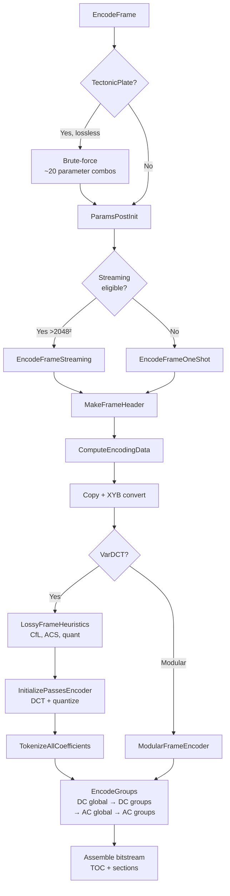
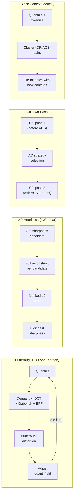

# Pipeline Overview



The JPEG XL encoder pipeline transforms input pixels into a compressed
bitstream through a sequence of phases: parameter setup, color conversion,
perceptual optimization, transform coding, entropy coding, and bitstream
assembly. Every phase is gated by the speed tier, which controls the
quality-vs-speed tradeoff.

Source: `enc_frame.cc`, `enc_frame.h`, `enc_heuristics.cc`, `enc_cache.cc`,
`enc_group.cc`

## Entry Point

```cpp
Status EncodeFrame(JxlMemoryManager*, const CompressParams&,
                   const FrameInfo&, const CodecMetadata*,
                   JxlEncoderChunkedFrameAdapter& frame_data,
                   const JxlCmsInterface&, ThreadPool*,
                   JxlEncoderOutputProcessorWrapper*, AuxOut*);
```

## Phase 0: Parameter Initialization

1. **TectonicPlate** (lossy): downgrade to Glacier. Lossless: brute-force
   search over ~20 parameter combinations (palette sizes, group sizes,
   predictors, WP modes) in parallel, picking the smallest output.
2. **Lightning**: downgrade to Thunder.
3. **ParamsPostInit**: Clamp `butteraugli_distance ≥ kMinButteraugliDistance`,
   auto-select 2× resampling at distance ≥ 10.
4. **Validation**: JPEG-specific overrides (disable gaborish, EPF, force VarDCT).

## Phase 1: Streaming vs One-Shot

```cpp
if (CanDoStreamingEncoding(cparams, frame_info, *metadata, frame_data))
    return EncodeFrameStreaming(...);
else
    return EncodeFrameOneShot(...);
```

Streaming requires: image > 2048×2048, not JPEG, no progressive, no resampling,
no lossy palette, compatible color transform.

## Phase 2: Frame Header

`MakeFrameHeader` (`enc_frame.cc:319`) sets:
- Encoding mode (VarDCT vs Modular)
- Group size shift (modular: varies by image size)
- Frame flags (noise, patches)
- Loop filter (Gaborish, EPF iterations)
- Progressive passes
- Color transform, chroma subsampling

## Phase 3: Input Processing

`ComputeEncodingData` (`enc_frame.cc:1470`):
1. Copy input pixels from chunked adapter
2. Color transform to XYB (if applicable)
3. Optionally preserve linear RGB for butteraugli RD loop (speed ≤ Kitten)
4. Simplify invisible pixels (alpha=0 → smooth neighbors)
5. Pad to 8×8 block multiple
6. Chromacity adjustments (distance-based x_qm_scale 3-6)
7. Noise estimation
8. Downsampling (if resampling > 1)

## Phase 4: VarDCT Encoding

See [VarDCT Path](vardct-path.md) for the full heuristics pipeline.

## Phase 5: Modular Encoding

See [Modular Overview](../modular/modular-overview.md) for the transform and
prediction pipeline.

## Phase 6: Bitstream Assembly

See [Group Encoding](group-encoding.md) and
[Bitstream Assembly](bitstream-assembly.md).

## Feedback Loops

The encoder's quality depends heavily on feedback loops that verify encoding
decisions against actual decoder output. These are the most expensive — and
most impactful — parts of the pipeline.



| Loop | Speed Gate | Iterations | What It Verifies |
|------|-----------|------------|------------------|
| **Butteraugli RD** | ≤ Kitten | 2–5 | Quantization field matches perceptual target |
| **AR sharpness** | ≤ Wombat | 1 per candidate (2-3 candidates) | EPF settings minimize reconstruction error |
| **CfL two-pass** | Pass 1: ≤ Squirrel, Pass 2: ≤ Hare | 2 total | CfL correlations account for actual block sizes |
| **Block context** | < Falcon | 1 | Entropy contexts match actual QF/ACS distribution |

Without these loops, the encoder relies entirely on feed-forward heuristics
(masking models, cost estimates). The butteraugli RD loop alone accounts for
most of the quality difference between Squirrel (3) and Kitten (2) speed tiers.

## Speed Tier Feature Map

```
TectonicPlate (−1): Brute-force parameter search (lossless only)
Glacier (0):        Global MA tree, all modular features
Tortoise (1):       +FindBestQuantizationHQ (5 butteraugli iters)
Kitten (2):         +FindBestQuantization (3 iters), +linear image for RD
Squirrel (3):       DEFAULT. +splines, +patches, +dots, +full context
                    clustering, +pixel chromacity, +CfL pass 1, +error diffusion
Wombat (4):         +AR heuristics (EPF sharpness optimization)
Hare (5):           +Gaborish, +initial quant field, +CfL pass 2,
                    +quant adjustment. −butteraugli RD loop
Cheetah (6):        +context clustering, +coeff reordering
Falcon (7):         −block entropy model, −DC smoothing. Fixed tree (WP)
Thunder (8):        Fastest VarDCT. Fixed tree (Gradient)
Lightning (9):      Handled externally, = Thunder internally
```

## Distance Thresholds

| Constant | Value | Effect |
|----------|-------|--------|
| `kMinButteraugliDistance` | 0.05 | Minimum quality distance |
| Gaborish off threshold | 0.5 | Disable at high quality |
| EPF iteration thresholds | 0.7, 1.5, 4.0 | 1/2/3 EPF stages |
| Auto 2× resampling | 10.0 | Switch to 2× downsampling |
| `kMinButteraugliForNoise` | 99.0 | Noise effectively always off |
| `kMinButteraugliForDots` | 3.0 | Dot detection threshold |
