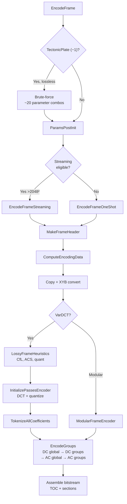

# Pipeline Overview



The JPEG XL encoder pipeline transforms input pixels into a compressed
bitstream through a sequence of phases: parameter setup, color conversion,
perceptual optimization, transform coding, entropy coding, and bitstream
assembly. Every phase is gated by the speed tier, which controls the
quality-vs-speed tradeoff.

Source: `enc_frame.cc`, `enc_frame.h`, `enc_heuristics.cc`, `enc_cache.cc`,
`enc_group.cc`

## Entry Point

```cpp
Status EncodeFrame(JxlMemoryManager*, const CompressParams&,
                   const FrameInfo&, const CodecMetadata*,
                   JxlEncoderChunkedFrameAdapter& frame_data,
                   const JxlCmsInterface&, ThreadPool*,
                   JxlEncoderOutputProcessorWrapper*, AuxOut*);
```

## Phase 0: Parameter Initialization

1. **TectonicPlate (−1)** (lossy): downgrade to Glacier (0). Lossless: brute-force
   search over ~20 parameter combinations (palette sizes, group sizes,
   predictors, WP modes) in parallel, picking the smallest output.
2. **Lightning (9)**: downgrade to Thunder (8).
3. **ParamsPostInit**: Clamp `butteraugli_distance ≥ kMinButteraugliDistance`,
   auto-select 2× resampling at distance ≥ 10.
4. **Validation**: JPEG-specific overrides (disable gaborish, EPF, force VarDCT).

## Phase 1: Streaming vs One-Shot

```cpp
if (CanDoStreamingEncoding(cparams, frame_info, *metadata, frame_data))
    return EncodeFrameStreaming(...);
else
    return EncodeFrameOneShot(...);
```

Streaming requires: image > 2048×2048, not JPEG, no progressive, no resampling,
no lossy palette, compatible color transform.

## Phase 2: Frame Header

`MakeFrameHeader` (`enc_frame.cc:319`) sets:
- Encoding mode (VarDCT vs Modular)
- Group size shift (modular: varies by image size)
- Frame flags (noise, patches)
- Loop filter (Gaborish, EPF iterations)
- Progressive passes
- Color transform, chroma subsampling

## Phase 3: Input Processing

`ComputeEncodingData` (`enc_frame.cc:1470`):
1. Copy input pixels from chunked adapter
2. Color transform to XYB (if applicable)
3. Optionally preserve linear RGB for butteraugli RD loop (speed ≤ Kitten (2))
4. Simplify invisible pixels (alpha=0 → smooth neighbors)
5. Pad to 8×8 block multiple
6. Chromacity adjustments (distance-based x_qm_scale 3-6)
7. Noise estimation
8. Downsampling (if resampling > 1)

## Phase 4: VarDCT Encoding

See [VarDCT Path](vardct-path.md) for the full heuristics pipeline.

## Phase 5: Modular Encoding

See [Modular Overview](../modular/modular-overview.md) for the transform and
prediction pipeline.

## Phase 6: Bitstream Assembly

See [Group Encoding](group-encoding.md) and
[Bitstream Assembly](bitstream-assembly.md).

## Feedback Loops (VarDCT Lossy Only)

The VarDCT lossy encoder's quality depends heavily on feedback loops that
verify encoding decisions against actual decoder output. **These loops only
exist in the VarDCT path** — modular mode (lossless and near-lossless) uses
a single forward pass with no encode-decode-compare cycles.

The fundamental pattern: encode pixels → decode back to pixels → measure
perceptual error → adjust parameters → repeat. This is expensive (each
iteration does a near-complete encode + decode), but it's the only way to
know what the decoder will actually produce.

```mermaid
graph LR
    subgraph "VarDCT Lossy Only"
        subgraph "Butteraugli RD Loop (≤Kitten (2))"
            A1["Quantize"] --> A2["Dequant + IDCT<br/>+ Gaborish + EPF"]
            A2 --> A3["Butteraugli<br/>distortion"]
            A3 --> A4["Adjust<br/>quant_field"]
            A4 -->|"2-5 iters"| A1
        end

        subgraph "AR Heuristics (≤Wombat (4))"
            B1["Set sharpness<br/>candidate"] --> B2["Full reconstruct<br/>per candidate"]
            B2 --> B3["Masked L2<br/>error"]
            B3 --> B4["Pick best<br/>sharpness"]
        end

        subgraph "CfL Two-Pass (≤Hare (5))"
            C1["CfL pass 1<br/>(before ACS)"] --> C2["AC strategy<br/>selection"]
            C2 --> C3["CfL pass 2<br/>(with ACS + quant)"]
        end

        subgraph "Block Context Model (<Falcon (7))"
            D1["Quantize +<br/>tokenize"] --> D2["Cluster (QF, ACS)<br/>pairs"]
            D2 --> D3["Re-tokenize with<br/>new contexts"]
        end
    end
```



| Loop | Mode | Speed Gate | Iterations | What It Verifies |
|------|------|-----------|------------|------------------|
| **Butteraugli RD** | VarDCT lossy | ≤ Kitten (2) | 2–5 | Quantization field matches perceptual target |
| **AR sharpness** | VarDCT lossy | ≤ Wombat (4) | 1 per candidate (2-3) | EPF settings minimize reconstruction error |
| **CfL two-pass** | VarDCT lossy | Pass 1 ≤ Squirrel (3), Pass 2 ≤ Hare (5) | 2 total | CfL correlations account for actual block sizes |
| **Block context** | VarDCT lossy | < Falcon (7) | 1 | Entropy contexts match actual QF/ACS distribution |
| **MA tree learning** | Modular (both lossy+lossless) | < Falcon (7) | 1 | Prediction tree splits minimize entropy |
| **RCT search** | Modular lossless | ≤ Hare (5) | up to 19 candidates | Color transform minimizes coded size |
| **TectonicPlate brute-force** | Modular lossless | TectonicPlate (−1) only | ~20 combos | Full parameter sweep (palette, group size, predictor) |

**VarDCT lossy** has the deepest feedback: the butteraugli RD loop does
full perceptual evaluation per iteration, which is why Kitten (2) is
dramatically better than Squirrel (3) at the same bitrate.

**Modular mode** feedback is lighter: MA tree learning evaluates splits
against entropy cost, and RCT/TectonicPlate search evaluates compressed
size. No perceptual model is involved — modular targets bit-exact
reconstruction (lossless) or simple MSE (lossy modular).

## Speed Tier Feature Map

Speed tiers gate features differently depending on encoding mode. The
VarDCT path (lossy photographic) has the most speed-dependent behavior.
Modular mode (lossless, near-lossless, non-photographic) is simpler.

### VarDCT Lossy (default for photographic images)

```
TectonicPlate (−1): Downgraded to Glacier (0) for VarDCT lossy
Glacier (0):        All VarDCT features enabled
Tortoise (1):       +FindBestQuantizationHQ (5 butteraugli iters)
Kitten (2):         +FindBestQuantization (3 iters), +linear image for RD
Squirrel (3):       DEFAULT. +splines, +patches, +dots, +full context
                    clustering, +pixel chromacity, +CfL pass 1, +error diffusion
Wombat (4):         +AR heuristics (EPF sharpness optimization)
Hare (5):           +Gaborish, +initial quant field (butteraugli masking),
                    +CfL pass 2, +quant adjustment. −butteraugli RD loop
Cheetah (6):        +context clustering, +coeff reordering
Falcon (7):         −block entropy model, −DC smoothing. Fixed tree (WP)
Thunder (8):        Fastest VarDCT. Fixed tree (Gradient)
Lightning (9):      Handled externally, = Thunder (8) internally
```

### Modular (lossless, near-lossless, non-photographic)

```
TectonicPlate (−1): Brute-force search (~20 parameter combos, lossless only)
Glacier (0):        Global MA tree, full RCT search, squeeze, palette
Tortoise (1):       Full MA tree learning, all 16+ properties
Kitten (2):         Reduced MA properties, full RCT search
Squirrel (3):       DEFAULT. Palette + RCT evaluated by EstimateCost
Wombat (4):         (same as Squirrel for modular)
Hare (5):           Reduced RCT search (6 candidates)
Cheetah (6):        Minimal RCT search, reduced MA tree
Falcon (7):         Fixed tree (WP predictor), no custom RCT
Thunder (8):        Fixed tree (Gradient predictor), no transforms
```

No butteraugli, no CfL, no EPF, no Gaborish in modular mode — those are
all VarDCT-specific. Modular optimization targets compressed size directly.

## Distance Thresholds

| Constant | Value | Effect |
|----------|-------|--------|
| `kMinButteraugliDistance` | 0.05 | Minimum quality distance |
| Gaborish off threshold | 0.5 | Disable at high quality |
| EPF iteration thresholds | 0.7, 1.5, 4.0 | 1/2/3 EPF stages |
| Auto 2× resampling | 10.0 | Switch to 2× downsampling |
| `kMinButteraugliForNoise` | 99.0 | Noise effectively always off |
| `kMinButteraugliForDots` | 3.0 | Dot detection threshold |
