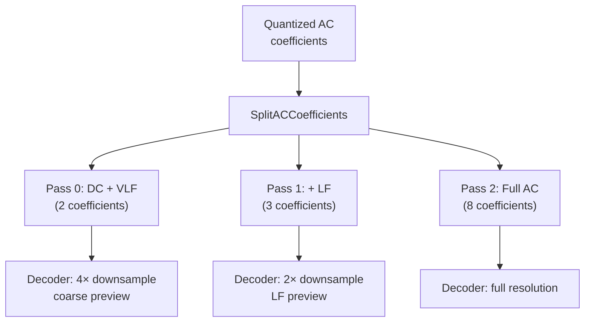

# Progressive Encoding



Progressive encoding splits AC coefficients across multiple passes, allowing
decoders to render increasingly detailed previews as data arrives. JPEG XL
supports both frequency-based progressive (keeping more coefficients per pass)
and quality-based progressive (refining quantization).

Source: `enc_progressive_split.h`, `enc_progressive_split.cc`, `enc_frame.cc`

## Pass Definitions

Each pass specifies:
```cpp
struct PassDefinition {
    size_t num_coefficients;  // 1-8, side of coefficient square per 8×8 block
    size_t shift;             // right-shift for lossy rounding
    size_t suitable_for_downsampling_of_at_least;  // decoder hint
};
```

## Built-in Modes

### Frequency Progressive (3 passes)

```
Pass 0: num_coefficients=2, shift=0, downsample≥4
Pass 1: num_coefficients=3, shift=0, downsample≥2
Pass 2: num_coefficients=8, shift=0, downsample≥0
```

Pass 0 carries only the 2×2 lowest-frequency coefficients per 8×8 block
(DC + 3 LF). Pass 1 adds the 3×3 region. Pass 2 carries the remaining
high-frequency coefficients.

### Quality Progressive (2 passes)

```
Pass 0: num_coefficients=8, shift=1, downsample≥2
Pass 1: num_coefficients=8, shift=0, downsample≥0
```

Pass 0 carries all coefficients but right-shifted by 1 bit (coarser
quantization). Pass 1 carries the refinement bits. This provides a
lower-quality full-resolution preview followed by quality refinement.

### Default (1 pass)

All coefficients, no shift. Non-progressive.

## Coefficient Splitting

`SplitACCoefficients` (`enc_progressive_split.cc:21`) assigns each coefficient
to its pass:

```
For each pass:
    For each (y,x) in coefficient grid:
        Skip if already covered by earlier pass with smaller num_coefficients
        Subtract contribution of previous pass (if previous had shift > 0)
        Apply shift: output[pass][pos] = shift_right_round0(v, shift)
```

The `shift_right_round0` function rounds toward zero (adds correction for
negative values before right-shifting).

After a pass with `shift == 0`, all coefficients up to `num_coefficients` are
fully committed.

## Progressive DC

Separate from progressive passes, `progressive_dc` (0-2) encodes DC
coefficients as independent frames:

1. DC level 1: DC of the image at 1/8 resolution
2. DC level 2: DC of DC level 1 at 1/64 resolution

Each DC frame is encoded recursively via `EncodeFrame` at reduced quality.
Level 0 (smallest) uses modular mode at Tortoise speed.

The frame header flags `kUseDcFrame` when progressive DC data is present.

## Passes Header

`ProgressiveSplitter::InitPasses()` populates the `Passes` struct:

```cpp
struct Passes : public Fields {
    uint32_t num_passes;           // ≤ kMaxNumPasses (11)
    uint32_t downsample[kMaxNumPasses];  // downsample factor per bracket
    uint32_t last_pass[kMaxNumPasses];   // last pass per bracket
    uint32_t shift[kMaxNumPasses];       // bit-shift per pass (0 for last)
};
```

The `downsample` and `last_pass` arrays tell the decoder which passes are
sufficient for a given downsampling factor, enabling early termination.

## Coefficient Order Per Pass

Each pass can have its own coefficient scan order, computed by
`ComputeAllCoeffOrders`:

```cpp
for (size_t i = 0; i < num_passes; i++) {
    ComputeCoeffOrder(speed_tier, coeffs[i], ac_strategy, frame_dim,
                      used_orders[i], used_acs, ...);
}
```

Orders from earlier passes are locked — only the current pass's coefficients
are re-ordered.
