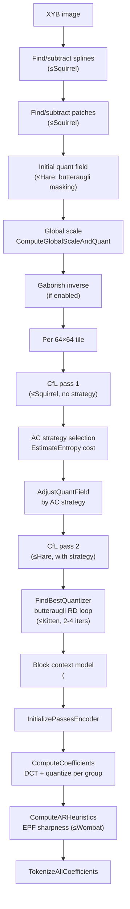

# VarDCT Path



The VarDCT path is the lossy photographic encoding pipeline. It operates in
XYB color space with variable-size DCT transforms, perceptual quantization,
and chroma-from-luma correlation.

Source: `enc_heuristics.cc`, `enc_cache.cc`, `enc_group.cc`,
`enc_adaptive_quantization.cc`

## Heuristics Pipeline

`LossyFrameHeuristics` (`enc_heuristics.cc`) is the core decision engine.
Its internal dependency graph:

```
XYB → initial quant field
XYB → Gaborished XYB
Gaborished XYB → CfL1
initial quant field, Gaborished XYB, CfL1 → AC strategy
initial quant field, ACS, Gaborished XYB → EPF control
initial quant field → adjusted quant field
adjusted quant field, ACS → raw quant field
raw quant field, ACS, Gaborished XYB → CfL2
```

### Step 1: Feature Detection (speed ≤ Squirrel)

- **Spline detection**: `FindSplines` on opsin (currently unimplemented)
- **Patch detection**: `FindBestPatchDictionary`, subtract patches from opsin

### Step 2: Initial Quant Field

- **Speed > Hare**: Flat field `q = 0.79 / distance`
- **Speed ≤ Hare**: `InitialQuantField` with butteraugli masking — the full
  [adaptive quantization](../perceptual/adaptive-quantization.md) pipeline
  producing `quant_field`, `quant_masking`, `quant_masking1x1`

### Step 3: Global Scale

`quantizer.ComputeGlobalScaleAndQuant(quant_dc, q, 0)` — establishes the
global quantization scale from the initial quant field. See
[Quantization](../transforms/quantization.md).

### Step 4: Gaborish Inverse

If Gaborish is enabled (speed ≤ Hare, VarDCT, distance > 0.5), apply the
5×5 pre-sharpening filter. See [Gaborish](../perceptual/gaborish.md).

### Step 5: Per-Tile Processing (64×64 tiles, parallel)

For each tile:

**a. CfL pass 1** (speed ≤ Squirrel): Compute color-from-luma map with
`use_dct8 = true` (before AC strategy is known). See
[CfL](../features/chroma-from-luma.md).

**b. AC Strategy selection**: `acs_heuristics.ProcessRect` chooses block sizes
using the [EstimateEntropy](../transforms/ac-strategy.md) cost function.

**c. Quant field adjustment**: `AdjustQuantField` modifies the initial quant
based on AC strategy decisions.

**d. CfL pass 2** (speed ≤ Hare): Recompute CfL with actual AC strategy and
quantization field. Uses `fast = true` at Wombat speed, `fast = false` at
Hare and slower.

### Step 6: Quantizer Refinement (speed ≤ Kitten)

`FindBestQuantizer` runs the butteraugli RD loop:

| Speed | Iterations |
|-------|-----------|
| Tortoise or slower | 5 total |
| Kitten | 3 total |
| Squirrel+ | 0 (no RD loop) |

Each iteration: encode → decode → compute butteraugli distortion → adjust
quant field where distortion exceeds/undershoots target. See
[Adaptive Quantization](../perceptual/adaptive-quantization.md).

### Step 7: Block Context Model (speed < Falcon)

`FindBestBlockEntropyModel` clusters (QF value, AC strategy) pairs into
entropy contexts:
- 2-9 luma clusters
- 1-5 chroma clusters
- Needs `(1 << 10) × distance` blocks to justify custom model
- For `decoding_speed_tier ≥ 1`: simplified 2-context model

## Coefficient Computation

`InitializePassesEncoder` → `ComputeCoefficients` (per group, parallel):

1. **Forward DCT** (`TransformFromPixels`) for all 3 channels
2. **Extract DC** from lowest frequencies
3. **Roundtrip-quantize Y**: quantize with `QuantizeBlockAC`, dequantize with
   bias adjustment. At speed ≤ Hare: `AdjustQuantBlockAC` adapts per-block
   quantization for flat blocks and high-frequency patterns.
4. **Unapply CfL**: subtract Y contribution from X and B channels
5. **Quantize X and B** channels
6. **Split coefficients** across progressive passes via `SplitACCoefficients`

### AdjustQuantBlockAC (speed ≤ Hare)

Per-block AC quantization refinement:
- Analyzes non-zero coefficient counts in high-frequency quadrants
- Increases quant for blocks with too few non-zeros (reduces blockiness)
- Increases quant for blocks with high-frequency border energy (reduces ringing)
- Reduces quant in high-activity areas (preserves texture)
- Adjusts dead-zone thresholds per quadrant

## AR Heuristics (speed ≤ Wombat)

`ComputeARHeuristics` optimizes per-block EPF sharpness values (0-7):

1. Define candidates: `{0, 2, 7}` for distance ≤ 4.5, or `{0, 4}` higher
2. Full reconstruct per candidate → per-block masked L2 error vs original
3. Pick lowest-error candidate, bias toward 0 (`kFavorNoSmoothing = 0.99`)
4. Second pass: refine using context-dependent entropy cost

## Post-Heuristics

1. **AC metadata**: Store AC strategy and quant field in modular streams
2. **Coefficient orders**: `ComputeAllCoeffOrders` per pass
3. **Histograms**: Set `num_histograms = 1` (non-streaming)
4. **Tokenization**: `TokenizeAllCoefficients` (per group, parallel)
