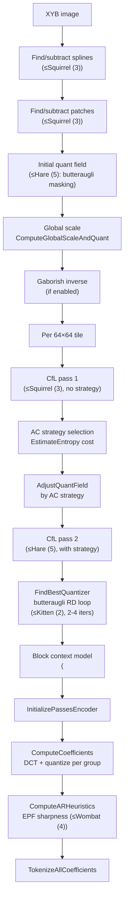
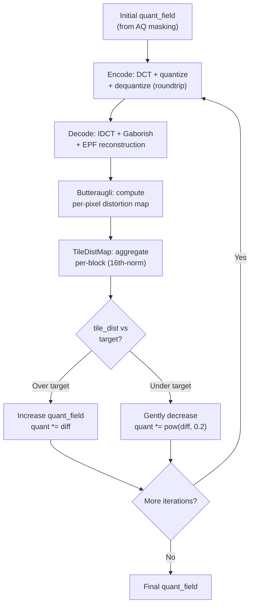
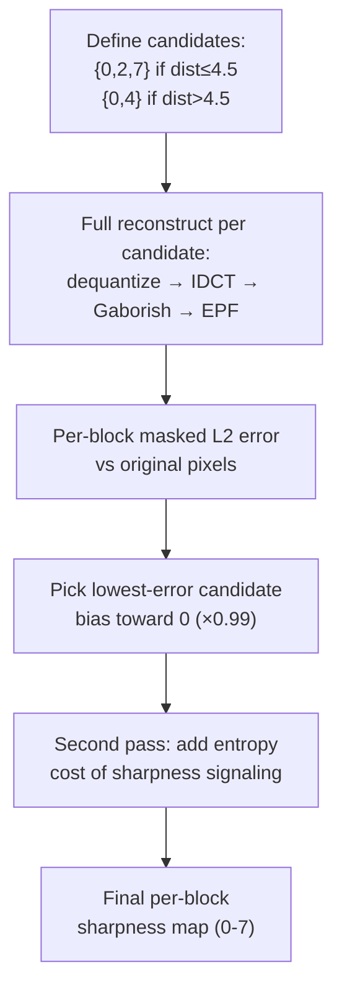

# VarDCT Path



The VarDCT path is the **lossy photographic** encoding pipeline — it is NOT
used for lossless encoding or modular mode. It operates in XYB color space
with variable-size DCT transforms, perceptual quantization, and
chroma-from-luma correlation. This is the default path when
`butteraugli_distance > 0` and `modular_mode = false`.

All feedback loops, perceptual models (butteraugli, adaptive quantization),
and decoder-in-the-loop optimization described below are VarDCT-specific.
For the modular (lossless/near-lossless) path, see
[Modular Overview](../modular/modular-overview.md).

Source: `enc_heuristics.cc`, `enc_cache.cc`, `enc_group.cc`,
`enc_adaptive_quantization.cc`

## Heuristics Pipeline

`LossyFrameHeuristics` (`enc_heuristics.cc`) is the core decision engine.
Its internal dependency graph:

```
XYB → initial quant field
XYB → Gaborished XYB
Gaborished XYB → CfL1
initial quant field, Gaborished XYB, CfL1 → AC strategy
initial quant field, ACS, Gaborished XYB → EPF control
initial quant field → adjusted quant field
adjusted quant field, ACS → raw quant field
raw quant field, ACS, Gaborished XYB → CfL2
```

### Step 1: Feature Detection (speed ≤ Squirrel (3))

- **Spline detection**: `FindSplines` on opsin (currently unimplemented)
- **Patch detection**: `FindBestPatchDictionary`, subtract patches from opsin

### Step 2: Initial Quant Field

- **Speed > Hare (5)**: Flat field `q = 0.79 / distance`
- **Speed ≤ Hare (5)**: `InitialQuantField` with butteraugli masking — the full
  [adaptive quantization](../perceptual/adaptive-quantization.md) pipeline
  producing `quant_field`, `quant_masking`, `quant_masking1x1`

### Step 3: Global Scale

`quantizer.ComputeGlobalScaleAndQuant(quant_dc, q, 0)` — establishes the
global quantization scale from the initial quant field. See
[Quantization](../transforms/quantization.md).

### Step 4: Gaborish Inverse

If Gaborish is enabled (speed ≤ Hare (5), VarDCT, distance > 0.5), apply the
5×5 pre-sharpening filter. See [Gaborish](../perceptual/gaborish.md).

### Step 5: Per-Tile Processing (64×64 tiles, parallel)

For each tile:

**a. CfL pass 1** (speed ≤ Squirrel (3)): Compute color-from-luma map with
`use_dct8 = true` (before AC strategy is known). See
[CfL](../features/chroma-from-luma.md).

**b. AC Strategy selection**: `acs_heuristics.ProcessRect` chooses block sizes
using the [EstimateEntropy](../transforms/ac-strategy.md) cost function.

**c. Quant field adjustment**: `AdjustQuantField` modifies the initial quant
based on AC strategy decisions.

**d. CfL pass 2** (speed ≤ Hare (5)): Recompute CfL with actual AC strategy and
quantization field. Uses `fast = true` at Wombat (4) speed, `fast = false` at
Hare (5) and slower.

### Step 6: Quantizer Refinement (speed ≤ Kitten (2))

`FindBestQuantizer` runs the butteraugli RD loop — the encoder's central
feedback mechanism where it actually measures what the decoder will produce
and adjusts accordingly:



| Speed | Iterations | Notes |
|-------|-----------|-------|
| Tortoise (1) or slower | 5 total | Also uses `FindBestQuantizationHQ` with max-error targeting |
| Kitten (2) | 3 total | Standard RD loop |
| Squirrel (3)+ | 0 | No RD loop — initial AQ map used as-is |

This is the single largest quality gap between fast and slow encoding. Without
the feedback loop, the encoder is guessing quantization from masking heuristics
alone. With it, the encoder verifies every decision against the actual
perceptual model.

**Per-iteration behavior changes:**
- **Iterations 0–1**: Increase quant aggressively where distortion exceeds
  target, decrease gently (exponent 0.2) where under target. Iteration 1
  clamps: `quant = max(quant, 0.4*quant + 0.6*initial)` to prevent oscillation.
- **Iterations 2+**: Only increase quant where distortion exceeds target. No
  quality improvement — just fix remaining hot spots.

See [Adaptive Quantization](../perceptual/adaptive-quantization.md) for the
full TileDistMap aggregation and per-iteration formulas.

### Step 7: Block Context Model (speed < Falcon (7))

`FindBestBlockEntropyModel` clusters (QF value, AC strategy) pairs into
entropy contexts:
- 2-9 luma clusters
- 1-5 chroma clusters
- Needs `(1 << 10) × distance` blocks to justify custom model
- For `decoding_speed_tier ≥ 1`: simplified 2-context model

## Coefficient Computation

`InitializePassesEncoder` → `ComputeCoefficients` (per group, parallel):

1. **Forward DCT** (`TransformFromPixels`) for all 3 channels
2. **Extract DC** from lowest frequencies
3. **Roundtrip-quantize Y**: quantize with `QuantizeBlockAC`, dequantize with
   bias adjustment. At speed ≤ Hare (5): `AdjustQuantBlockAC` adapts per-block
   quantization for flat blocks and high-frequency patterns.
4. **Unapply CfL**: subtract Y contribution from X and B channels
5. **Quantize X and B** channels
6. **Split coefficients** across progressive passes via `SplitACCoefficients`

### AdjustQuantBlockAC (speed ≤ Hare (5))

Per-block AC quantization refinement:
- Analyzes non-zero coefficient counts in high-frequency quadrants
- Increases quant for blocks with too few non-zeros (reduces blockiness)
- Increases quant for blocks with high-frequency border energy (reduces ringing)
- Reduces quant in high-activity areas (preserves texture)
- Adjusts dead-zone thresholds per quadrant

## AR Heuristics Feedback Loop (speed ≤ Wombat (4))

`ComputeARHeuristics` is another encode-decode-compare feedback loop, this
time optimizing per-block EPF sharpness values (0-7):



This loop runs once per candidate set (not iteratively), but it does a full
reconstruction for each candidate — making it expensive at 2-3 full decodes
per image. The bias toward sharpness=0 (`kFavorNoSmoothing = 0.99`)
means EPF smoothing is only applied when it measurably reduces error.

## Post-Heuristics

1. **AC metadata**: Store AC strategy and quant field in modular streams
2. **Coefficient orders**: `ComputeAllCoeffOrders` per pass
3. **Histograms**: Set `num_histograms = 1` (non-streaming)
4. **Tokenization**: `TokenizeAllCoefficients` (per group, parallel)
