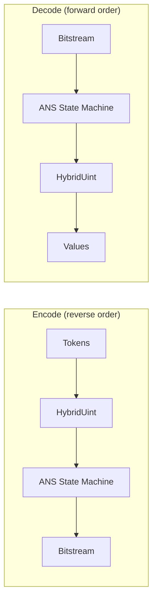

# ANS Entropy Coding — Theory

Asymmetric Numeral Systems (ANS) is the entropy coding method used by JPEG XL for
most compressed data. It achieves near-optimal compression (approaching Shannon
entropy) with O(1) encode and decode operations per symbol, using a table of size
4096.

JPEG XL also supports prefix (Huffman) coding as a fallback for small streams and
fast modes.



## Core Constants

| Constant | Value | Meaning |
|----------|-------|---------|
| `ANS_LOG_TAB_SIZE` | 12 | Log2 of probability table size |
| `ANS_TAB_SIZE` | 4096 | Total probability mass (all frequencies sum to this) |
| `ANS_TAB_MASK` | 4095 | Bitmask for table indexing |
| `ANS_MAX_ALPHABET_SIZE` | 256 | Maximum symbols for ANS coding |
| `PREFIX_MAX_ALPHABET_SIZE` | 4096 | Maximum symbols for Huffman coding |
| `PREFIX_MAX_BITS` | 15 | Maximum Huffman code length |
| `ANS_SIGNATURE` | 0x13 | Initial state value / integrity check |

## How rANS Works

ANS encodes a symbol by mapping the current state `s` to a new state `s'` based on
the symbol's frequency:

**Encoding** (given symbol with frequency `freq` and cumulative offset `offset`):
```
s' = (s / freq) * TAB_SIZE + offset + (s % freq)
```

**Decoding** (given state `s`):
```
res = s & TAB_MASK                    // bottom 12 bits
symbol, offset, freq = Lookup(res)    // alias table lookup
s' = freq * (s >> LOG_TAB_SIZE) + offset
```

**Normalization**: When the state grows too large (encode) or too small (decode),
16 bits are emitted/consumed to keep the state in range [2^16, 2^32).

**Key property**: ANS is a stack — encoding processes symbols in reverse order,
decoding reads them forward. This means the encoder must buffer all tokens before
writing.

## The Alias Table

The alias table enables O(1) symbol lookup from any position in [0, 4096). Each
entry maps to at most two symbols:

```cpp
struct Entry {
    uint8_t cutoff;           // boundary within entry
    uint8_t right_value;      // symbol for positions >= cutoff
    uint16_t freq0;           // frequency of left symbol
    uint16_t offsets1;        // offset for right symbol
    uint16_t freq1_xor_freq0; // branchless: freq0 ^ freq1
};
```

**Lookup** for value `v`:
```
i = v >> log_entry_size          // which entry
pos = v & entry_size_minus_1     // position within entry
greater = (pos >= cutoff)

symbol = greater ? right_value : i
offset = (greater ? offsets1 : 0) + pos
freq   = freq0 ^ (greater ? freq1_xor_freq0 : 0)
```

The XOR trick enables branchless frequency selection — on x86 this compiles to
CMOV instructions.

## Alias Table Construction (Robin Hood Method)

`InitAliasTable()` (`ans_common.cc:42-146`) distributes symbol frequencies across
table entries:

1. Each entry covers `entry_size = TAB_SIZE >> log_alpha_size` positions
2. Symbols with frequency > `entry_size` are "overfull"; < `entry_size` are "underfull"
3. Robin Hood redistribution: repeatedly pair an overfull symbol with an underfull
   entry, transferring excess probability until all entries are balanced
4. Each entry ends up with at most 2 symbols, selected by the `cutoff` threshold

**Single-symbol optimization**: If any symbol has frequency = `ANS_TAB_SIZE`, all
entries point to that symbol with `cutoff=0`.

## Histogram Serialization Format

Three variants, selected by initial flag bits:

### Small Code (bit 0 = 1)
For 1 or 2 symbols. Encodes symbol indices via VarLenUint8 and (for 2 symbols)
the first symbol's count in 12 bits.

### Flat Histogram (bits 0-1 = 01)
Uniform distribution. Encodes only `alphabet_size`; counts are implicitly
`TAB_SIZE / alphabet_size` with remainder distributed to the first symbols.

### General Histogram (bits 0-1 = 00)
Full histogram with configurable precision:

1. Elias-gamma coding of `shift` parameter (controls precision/size tradeoff)
2. VarLenUint8 for `alphabet_size - 3`
3. Per-symbol: Huffman-coded bit-width (`logcount`), with RLE for runs ≥ 5
4. The symbol with the largest count is the "omit position" — its count is
   inferred as `TAB_SIZE - sum(others)`
5. Per symbol with `logcount > 1`: extra precision bits determined by
   `GetPopulationCountPrecision(logcount, shift)`

### Precision Control

```
GetPopulationCountPrecision(logcount, shift):
    r = min(logcount, shift - (ANS_LOG_TAB_SIZE - logcount) / 2)
    return max(r, 0)
```

Higher `shift` → more precision bits per count → better compression but larger header.

## ANS vs Huffman Decision

```
use_prefix_code = force_huffman
                  || total_tokens < 100
                  || clustering == kFastest
                  || all histograms degenerate (entropy < 1e-5)
```

ANS is preferred for larger streams. Huffman is used for small streams, fast modes,
and degenerate distributions where ANS's 32-bit state overhead isn't justified.
