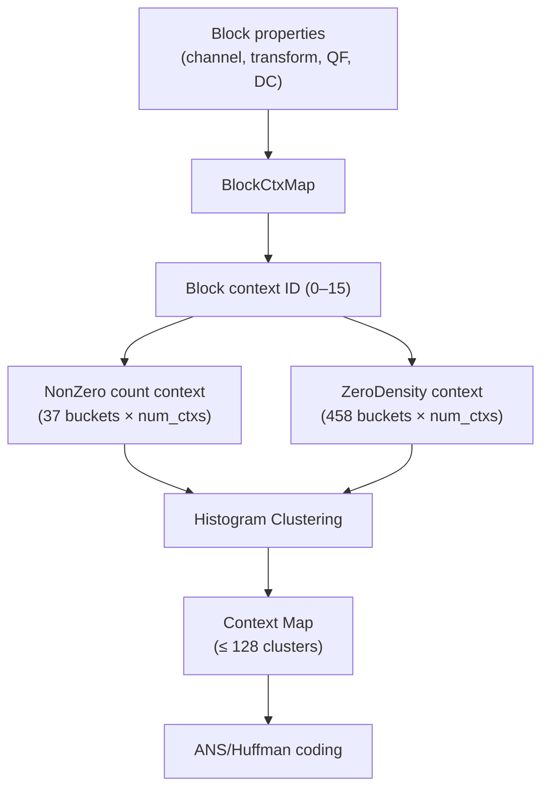

# Context Modeling

Context modeling assigns each symbol to one of many possible probability distributions
based on local signal characteristics. Better context selection → more accurate
probability estimates → better compression.

## Block Context Map

The `BlockCtxMap` maps (channel, transform order, quantization field, DC value)
to a context ID for AC coefficient coding:

```
idx = channel_idx * kNumOrders + transform_order
idx = idx * (qf_thresholds + 1) + qf_bucket
idx = idx * num_dc_ctxs + dc_bucket
context = ctx_map[idx]
```

### Default Context Map

39 entries = 3 channels × 13 transform orders, mapping to 15 distinct contexts:

```
Y channel:  0  1  2  2  3  3  4  5  6  6  6  6  6
X channel:  7  8  9  9 10 11 12 13 14 14 14 14 14
B channel:  7  8  9  9 10 11 12 13 14 14 14 14 14
```

X and B channels share the same mapping. Large transforms (orders 9–12, corresponding
to 64×64+) are grouped into a single context (6 for Y, 14 for X/B).

### QF and DC Thresholds

- DC thresholds: up to 15 per channel, creating bucket boundaries on DC coefficient values
- QF thresholds: up to 15, creating bucket boundaries on the quantization field value
- Maximum: `num_dc_ctxs * (qf_thresholds + 1) ≤ 64`, `num_ctxs ≤ 16`

### Signaling

1 bit: `is_default`. If true (matches `kDefaultCtxMap`), done. Otherwise:
per-channel DC threshold counts (4 bits each) + values, QF threshold count (4 bits) +
values, then the context map via `EncodeContextMap`.

## AC Coefficient Context

For each AC coefficient in scan order, the context depends on:
1. **Position** `k` in the scan (1–63), mapped to 31 frequency buckets via
   `kCoeffFreqContext[64]`
2. **Remaining nonzeros** in the block, mapped to 8 nonzero buckets via
   `kCoeffNumNonzeroContext[64]`
3. **Previous coefficient** nonzero flag (0 or 1)

```
context = (kCoeffNumNonzeroContext[nz_left] + kCoeffFreqContext[k]) * 2 + prev
```

Total: `kZeroDensityContextCount = 458` contexts per block context.

### Pre-Clustering Tables

The 458 contexts are a pre-clustered reduction from the theoretical `64 × 63 / 2 ≈ 2016`
(k, nz_left) combinations. The clustering groups similar positions:

- `kCoeffFreqContext`: positions 1–15 get individual buckets, 16+ are grouped by 2s and 4s
- `kCoeffNumNonzeroContext`: 1 gets its own bucket, then groups of {2}, {3-4}, {5-8},
  {9-12}, {13-20}, {21-32}, {33-63}

## Nonzero Count Context

For the nonzero count of each block (how many AC coefficients are nonzero):

```
if non_zeros >= 64: non_zeros = 64
if non_zeros < 8:   ctx = non_zeros           // 8 individual buckets
else:               ctx = 4 + non_zeros / 2   // grouped (8→8, 10→9, ..., 64→36)

return ctx * num_ctxs + block_ctx
```

Total nonzero buckets: `kNonZeroBuckets = 37`.

## Total Context Count

Per block context map configuration:

```
total_contexts = num_ctxs × (kNonZeroBuckets + kZeroDensityContextCount)
               = num_ctxs × (37 + 458)
               = num_ctxs × 495
```

With the default 15 context IDs: 7425 total contexts, which are then reduced by
histogram clustering to ≤ 128 actual probability distributions.

## DC Prediction Context

DC coefficients use `PredictFromTopAndLeft`:

```
predicted = left + top - top_left    // MED predictor
context depends on |actual - predicted| and sign
```

## The Full Context Pipeline


