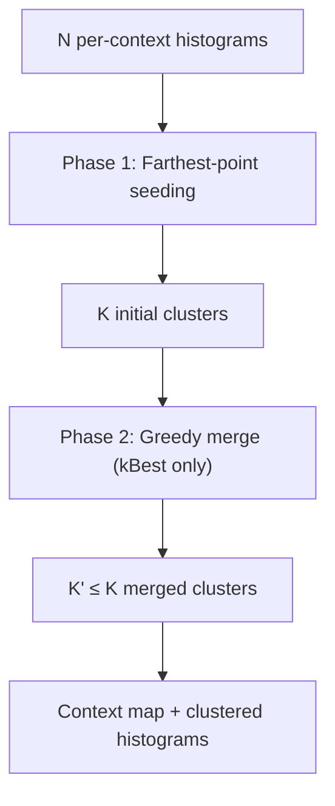

# Histogram Clustering

The encoder generates many per-context histograms but transmitting each one separately
would waste header bits. Histogram clustering merges similar distributions, replacing
N input histograms with K clustered ones (K ≤ 128) and a context map that assigns
each original context to a cluster.



## Source Files

| File | Lines | Purpose |
|------|-------|---------|
| `enc_cluster.cc` | 372 | Two-phase clustering with SIMD distance computation |
| `enc_context_map.cc` | 175 | Three-way encoding of context maps |
| `dec_context_map.cc` | 97 | Context map decoding with optional inverse MTF |

## Distance Metrics

### Jensen-Shannon Distance (symmetric)

The primary merge-cost metric. Measures the coding cost increase from merging two
histograms:

```
D(a, b) = H(a+b) - H(a) - H(b)
```

where `H` is Shannon entropy. Always ≥ 0 (merging never decreases entropy).
Computed with SIMD: 8 × int32 counts per iteration via Highway.

### KL Divergence (asymmetric)

Cost of encoding data distributed as `actual` using code designed for `coding`:

```
KL(actual || coding) = -H(actual) + Σ actual[i] * (-log2(coding[i] / coding_total))
```

Used only for assigning inputs to pre-existing (fixed) cluster centers that cannot
be modified. Returns infinity if `coding[i] = 0` but `actual[i] ≠ 0`.

### ANS Population Cost

More accurate than Shannon entropy — accounts for actual ANS table normalization,
rounding of fractional probabilities, and header overhead. Used in `kBest` clustering
mode via `Histogram::ANSPopulationCost()`.

## Phase 1: Fast Cluster Seeding

A greedy farthest-point algorithm (variant of k-means++ initialization):

1. Find the largest histogram by total count → first seed
2. Repeat until `num_clusters == max_histograms` or `max_distance < 48.0`:
   - Add the input with maximum distance to its nearest existing center
   - Update distances for all unassigned inputs
3. Assign all remaining inputs to their nearest cluster
4. Merge each assigned input into its cluster's histogram

The threshold `kMinDistanceForDistinct = 48.0` (Jensen-Shannon bits) prevents
creating clusters that are nearly identical.

## Phase 2: Greedy Merge Refinement (kBest only)

A priority-queue merge that reduces cluster count by combining similar histograms:

1. Compute `ANSPopulationCost` for each cluster
2. For all pairs (i, j): if `cost(merged) < cost(i) + cost(j)`, enqueue merge
3. Pop best merge, validate versions, execute merge, recompute costs
4. Repeat until no beneficial merges remain

**Version tracking**: Each cluster has a version number. A queued pair `(i, j, v)` is
valid only if `v == max(version[i], version[j])`. Stale entries are skipped when popped.

## Speed Tier Configuration

| Speed Tier | Clustering | Max Clusters | Metric |
|------------|-----------|--------------|--------|
| > Falcon (7) | `kFastest` | 4 | Jensen-Shannon |
| Falcon (7)–Squirrel (3) | `kFast` | 128 | Jensen-Shannon |
| ≤ Tortoise (1) | `kBest` | 128 | ANS Population Cost + merge |

## Context Map Encoding

Three strategies, cheapest wins:

### Trivial (1 histogram)
3 bits: `1, 00`

### Simple Fixed-Width
`3 + ceil(log2(N)) * map_size` bits. Only if `ceil(log2(N)) < 4` (≤ 8 histograms).

### ANS-Coded
Both raw and Move-to-Front transformed versions are tried:

- **MTF transform**: Each entry is replaced by its position in a most-recently-used
  list. Exploits locality — if adjacent contexts often map to the same cluster,
  MTF produces small values that compress well.

Signaling: bit 0 = is_simple. If simple: bits 1–2 = entry_bits, then entries.
If ANS: bit 1 = use_mtf, then ANS-coded stream.
