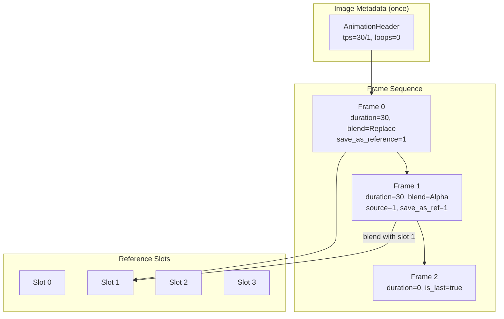

# Animation & Multi-Frame



JPEG XL supports multi-frame images for animation, layered compositing, and
incremental updates. Each frame carries its own duration, blending mode, and
spatial position. Four reference frame slots enable complex compositing without
re-encoding unchanged content.

Source: [`headers.h`](https://github.com/libjxl/libjxl/blob/main/lib/jxl/headers.h), [`headers.cc`](https://github.com/libjxl/libjxl/blob/main/lib/jxl/headers.cc), [`frame_header.h`](https://github.com/libjxl/libjxl/blob/main/lib/jxl/frame_header.h), [`frame_header.cc`](https://github.com/libjxl/libjxl/blob/main/lib/jxl/frame_header.cc),
[`enc_frame.h`](https://github.com/libjxl/libjxl/blob/main/lib/jxl/enc_frame.h), [`enc_frame.cc`](https://github.com/libjxl/libjxl/blob/main/lib/jxl/enc_frame.cc)

## AnimationHeader

Stored once in `ImageMetadata`, applies to all frames:

```
tps_numerator:    uint32   (default 10)
tps_denominator:  uint32   (default 1)
num_loops:        uint32   (default 0 = infinite)
have_timecodes:   bool     (default false)
```

Frame duration in seconds = `frame.duration × tps_denominator / tps_numerator`.

**Serialization** uses compact encoding for common values:
- `tps_numerator`: `Val(100), Val(1000), BitsOffset(10, 1), BitsOffset(30, 1)`
- `tps_denominator`: `Val(1), Val(1001), BitsOffset(8, 1), BitsOffset(10, 1)`
- `num_loops`: `Val(0), Bits(3), Bits(16), Bits(32)`

NTSC framerate (29.97 fps) encodes as `30000/1001` — both values have cheap
2-bit representations.

Source: [`headers.h:77-90`](https://github.com/libjxl/libjxl/blob/main/lib/jxl/headers.h#L77-L90), [`headers.cc:184-196`](https://github.com/libjxl/libjxl/blob/main/lib/jxl/headers.cc#L184-L196)

## Per-Frame Fields

Each frame header contains animation-specific fields when
`metadata.have_animation` is true:

```
AnimationFrame {
    duration: uint32    // display ticks (0 = instantaneous)
    timecode: uint32    // SMPTE 0xHHMMSSFF (if have_timecodes)
}
```

Duration encoding: `Val(0), Val(1), Bits(8), Bits(32)`. Most frames need ≤ 256
ticks (1 byte). Timecodes, when enabled, are always 32 bits.

## Frame Types

```cpp
enum FrameType {
    kRegularFrame    = 0,  // Displayable, blendable, croppable
    kDCFrame         = 1,  // DC preview only — cannot animate
    kReferenceOnly   = 2,  // Patch source — cannot display
    kSkipProgressive = 3,  // Like Regular, no progressive rendering
};
```

Only `kRegularFrame` and `kSkipProgressive` participate in animation.
`kDCFrame` and `kReferenceOnly` are structural and cannot carry duration.

## Blend Modes

Each frame specifies how it composites with a reference frame:

| Mode | Value | Formula |
|------|-------|---------|
| `kReplace` | 0 | `pixel = new` |
| `kAdd` | 1 | `pixel = old + new` |
| `kBlend` | 2 | Alpha compositing (see below) |
| `kAlphaWeightedAdd` | 3 | `pixel = old + alpha × new` |
| `kMul` | 4 | `pixel = old × new` |

**kBlend** (alpha compositing):
- Alpha: `alpha = old_alpha + new_alpha × (1 - old_alpha)`
- Color (premultiplied): `color = (1 - new_alpha) × old + new`
- Color (straight): `color = ((1 - new_alpha) × old × old_alpha + new_alpha × new) / alpha`

Encoding: `Val(0), Val(1), Val(2), BitsOffset(2, 3)` — Replace costs 0 bits
(most common).

Source: [`frame_header.h:181-210`](https://github.com/libjxl/libjxl/blob/main/lib/jxl/frame_header.h#L181-L210)

## BlendingInfo

```
BlendingInfo {
    mode:          BlendMode
    alpha_channel: uint32    // which extra channel (if alpha-using mode)
    clamp:         bool      // clamp to [0, 1] after blending
    source:        uint32    // reference frame slot (0-3)
}
```

**Conditional serialization**: `alpha_channel` only when mode uses alpha AND
extra channels exist. `source` only when mode ≠ Replace or frame is partial.
Each extra channel can have its own `BlendingInfo` (different blend mode for
alpha vs color).

## Reference Frame Slots

Four slots (0–3) store decoded frames for later blending:

```
save_as_reference: uint32  // 0-3, which slot to save into
```

**Rules**:
- `save_as_reference = 0` with `duration > 0`: frame is not referenceable
  (display-only, slot 0 is "don't save")
- `save_as_reference = 1-3`: explicit slot assignment
- Last frame (`is_last = true`): never saved regardless of slot
- DC frames: implicitly saved in separate DC storage, no slot assignment

**Encoder convention**: Slot 1 is typically used for animation (frame-to-frame
blending). Slot 3 is reserved for internally-generated frames. Slots 0 and 2
are available for layered compositing.

Source: [`frame_header.h:425-428`](https://github.com/libjxl/libjxl/blob/main/lib/jxl/frame_header.h#L425-L428), [`dec_frame.cc:803-813`](https://github.com/libjxl/libjxl/blob/main/lib/jxl/dec_frame.cc#L803-L813)

## Frame Cropping

Frames can cover a sub-rectangle of the full canvas for efficient partial
updates:

```
custom_size_or_origin: bool
frame_size:            (width, height)    // can differ from canvas
frame_origin:          (x0, y0)           // signed, can be negative
```

A partial frame is detected when size differs from canvas or origin ≠ (0, 0).
Partial frames force `source` to be serialized in blending info (must specify
which reference slot contains the full-canvas backdrop).

Signed origin allows frames to extend beyond the canvas boundary — useful for
motion compensation where content slides into view.

## Encoding Flow

For a simple animation at 30 fps with 3 frames:

**Once** (ImageMetadata):
- `have_animation = true`
- `tps_numerator = 30`, `tps_denominator = 1`
- `num_loops = 0` (infinite)

**Frame 0** (background):
- `frame_type = kRegularFrame`
- `duration = 30` (1 second)
- `blend_mode = kReplace`
- `save_as_reference = 1`

**Frame 1** (overlay):
- `duration = 30`
- `blend_mode = kBlend`, `source = 1`
- `alpha_channel = 0`
- `save_as_reference = 1` (overwrites slot 1 with composited result)

**Frame 2** (final):
- `duration = 0`, `is_last = true`
- Not saved (last frame)

## Speed Considerations

Animation frames share the same `CompressParams` but can differ in:
- Frame type and blending
- Spatial crop (partial updates)
- Reference slot management

The encoder does not perform inter-frame motion estimation — each frame is
encoded independently. Partial frame cropping combined with blending provides
the mechanism for efficient delta updates without full-frame re-encoding.
