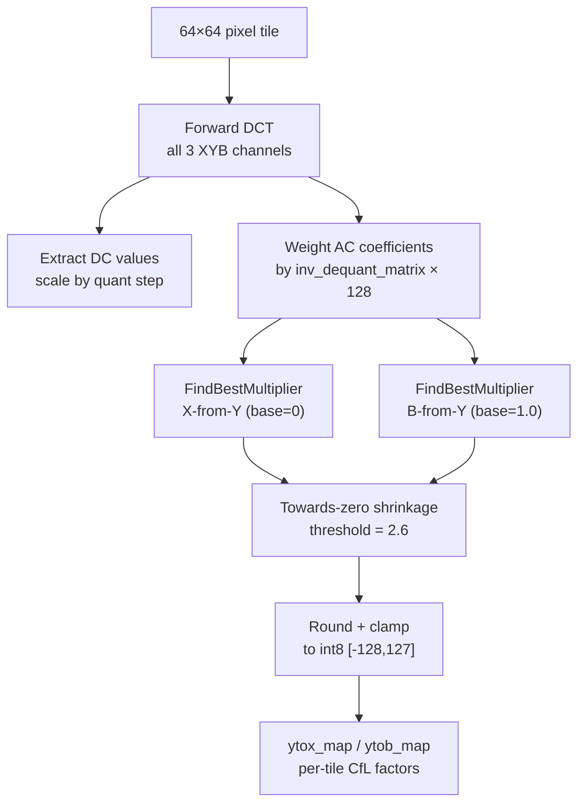

# Chroma-from-Luma (CfL)



Chroma-from-Luma removes chroma-luma correlation by predicting the X and B
channels from the Y channel using a per-tile linear model. The encoder
optimizes the prediction factor for each 64×64 tile using a smoothed cost
function with Newton's method.

Source: `chroma_from_luma.h`, `chroma_from_luma.cc`, `enc_chroma_from_luma.h`,
`enc_chroma_from_luma.cc`

## The CfL Model

```
residual_x = X − Y × factor_x
residual_b = B − Y × factor_b
```

where:
```
factor_x = base_correlation_x + x_factor / color_factor
factor_b = base_correlation_b + b_factor / color_factor
```

With defaults (`base_correlation_x = 0`, `base_correlation_b = 1.0`,
`color_factor = 84`): a `ytob_map` value of 0 means factor_b = 1.0, and each
integer step adjusts by 1/84 ≈ 0.0119. The per-tile factors are int8_t values
in [−128, 127], giving a factor range of approximately ±1.52 relative to the
base.

## Key Constants

| Constant | Value | Purpose |
|----------|-------|---------|
| `kColorTileDim` | 64 pixels | CfL tile size |
| `kDefaultColorFactor` | 84 | Factor denominator |
| `kYToBRatio` | 1.0 | B-from-Y base correlation |
| `kStrangeMultiplier` | 128 | Quantization weighting scale |
| `kDistanceMultiplierAC` | 1e-9 | L2 regularizer weight |
| `CFLFunction::kCoeff` | 1/3 | Cost function coefficient |
| `CFLFunction::kThres` | 100.0 | Outlier rejection threshold |

## Per-Tile Processing

`ComputeTile` processes each 64×64 tile:

1. **Forward DCT** all three XYB channels for each block in the tile
2. **Extract DC values**, scale by quantizer DC step
3. **Zero out LLF coefficients** (handled separately from AC optimization)
4. **Weight AC coefficients**: multiply each coefficient by
   `quantizer_scale × 128 × raw_quant × inv_dequant_matrix` — weighting by
   perceptual importance
5. **Accumulate** weighted Y×qm and chroma×qm arrays
6. **FindBestMultiplier** separately for X (base=0) and B (base=1.0)

## Cost Function (CFLFunction)

```
f(x) = (1/3) × Σᵢ [ (|aᵢ×x + bᵢ| + 1)² − 1 ] + distance_mul × x² × num
```

where:
- `aᵢ = values_m[i] / 84` (weighted luma coefficient)
- `bᵢ = base × values_m[i] − values_s[i]` (base prediction minus actual chroma)
- The `(|v|+1)² − 1` form is a smoothed absolute-value penalty, differentiable
  at zero and growing quadratically
- The `distance_mul × x² × num` term is L2 regularization biasing toward x=0
- Terms where `|aᵢ×x + bᵢ| ≥ kThres(100)` are excluded (outlier rejection)

The `Compute` method returns the **first derivative** f'(x):

```
f'(x) = 2 × distance_mul × num × x + (2/3) × Σᵢ [ aᵢ × (|vᵢ| + 1) × sign(vᵢ) ]
```

It also computes f'(x+eps) and f'(x−eps) for numerical second derivative
estimation.

## Newton Optimization (Slow Path)

When `fast = false`, up to 20 Newton iterations with numerically-estimated
second derivatives:

```
eps = 100
for each iteration:
    f'(x) = CFLFunction::Compute(x, eps, &f'(x+eps), &f'(x-eps))
    f''(x) ≈ (f'(x+eps) − f'(x-eps)) / (2×eps)
    step = f'(x) / (f''(x) + 0.85)
    x -= clamp(step, -20, 20)
    if |step| < 3e-3: break
```

The large epsilon (100) is deliberate — the cost function has many
near-discontinuities from the absolute value and threshold cutoff, so a wide
window averages out derivative noise. The stabilizer 0.85 prevents division by
near-zero second derivative.

## Fast Path

When `fast = true`, a closed-form least-squares solution ignoring the smoothed
absolute value:

```
minimize Σᵢ (aᵢ×x + bᵢ)² + distance_mul × x² × num / 2

x = −Σ(aᵢ×bᵢ) / (Σ(aᵢ²) + num × distance_mul × 0.5)
```

Simple linear regression with L2 regularization.

## Towards-Zero Shrinkage

After optimization, the result is soft-thresholded with `towards_zero = 2.6`:

```
if x ≥ 2.6:    x -= 2.6
elif x ≤ -2.6: x += 2.6
else:           x = 0
```

This reduces red-green oscillations in high-frequency regions where the CfL
model is noisy. The source comments note that a variance-adaptive approach
would give ~1% more compression density.

## Speed Tier Dispatch

| Speed | CfL Behavior |
|-------|-------------|
| ≤ Squirrel (3) | Two passes: first without AC strategy (seed), second with |
| Hare (5) | One pass with AC strategy and quant, `fast = true` |
| Wombat (4) | One pass with AC strategy and quant, `fast = true` |
| ≥ Cheetah (6) | No per-tile CfL; map stays all-zeros (global base only) |

At speed ≤ Squirrel (3), CfL is computed twice: once with `use_dct8 = true` (before
block size decisions) to provide an initial CfL map for AC strategy selection,
then again with actual AC strategy and quantization field.

## DC CfL Encoding

Global CfL parameters are written by `ColorCorrelationEncodeDC`:
- If all defaults: 1 bit (flag)
- Otherwise: flag + color_factor (U32Coder) + base_correlation_x (float16) +
  base_correlation_b (float16) + ytox_dc (uint8) + ytob_dc (uint8)

The `color_factor` uses a custom distribution: `Val(84), Val(256),
BitsOffset(8,2), BitsOffset(16,258)` — biased toward the default value 84.
