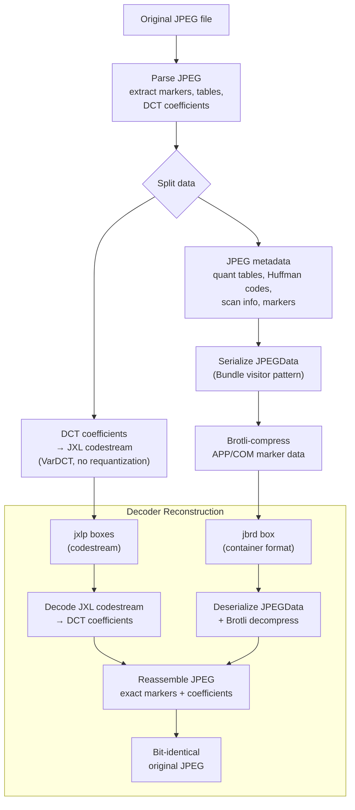

# JPEG Re-encoding



JPEG XL can losslessly recompress JPEG files — the original JPEG is
recoverable bit-for-bit from the JXL file. The DCT coefficients go into the
JXL codestream (benefiting from JXL's superior entropy coding), while JPEG
structural metadata goes into a `jbrd` (JPEG Bitstream Reconstruction Data)
sidecar box.

Source: [`jpeg/jpeg_data.h`](https://github.com/libjxl/libjxl/blob/main/lib/jxl/jpeg/jpeg_data.h), [`jpeg/enc_jpeg_data.cc`](https://github.com/libjxl/libjxl/blob/main/lib/jxl/jpeg/enc_jpeg_data.cc), [`jpeg/enc_jpeg_data_reader.cc`](https://github.com/libjxl/libjxl/blob/main/lib/jxl/jpeg/enc_jpeg_data_reader.cc),
[`jpeg/dec_jpeg_data.cc`](https://github.com/libjxl/libjxl/blob/main/lib/jxl/jpeg/dec_jpeg_data.cc), [`jpeg/dec_jpeg_data_writer.cc`](https://github.com/libjxl/libjxl/blob/main/lib/jxl/jpeg/dec_jpeg_data_writer.cc), [`decode_to_jpeg.h`](https://github.com/libjxl/libjxl/blob/main/lib/jxl/decode_to_jpeg.h)

## JPEGData Structure

The encoder parses the JPEG into a structured representation:

```cpp
struct JPEGData {
    int width, height;
    std::vector<JPEGComponent> components;     // Y, Cb, Cr (+ sampling factors)
    std::vector<JPEGQuantTable> quant;         // DQT marker data (64 values each)
    std::vector<JPEGHuffmanCode> huffman_code; // DHT marker data (up to 4 DC + 4 AC)
    std::vector<JPEGScanInfo> scan_info;       // SOS marker data per scan

    std::vector<std::vector<uint8_t>> app_data;  // APP markers
    std::vector<std::vector<uint8_t>> com_data;  // COM markers
    std::vector<uint8_t> marker_order;            // sequence of all markers
    std::vector<std::vector<uint8_t>> inter_marker_data;  // bytes between markers
    std::vector<uint8_t> tail_data;               // bytes after EOI

    uint16_t restart_interval;                    // DRI marker value
    std::vector<uint8_t> padding_bits;            // final MCU padding
};
```

### Scan Info (Bit-Exact Fields)

Each `JPEGScanInfo` contains standard JPEG scan parameters plus fields for
bit-exact reconstruction:

- `Ss`, `Se`: spectral selection (for progressive JPEG)
- `Ah`, `Al`: successive approximation
- `reset_points`: block indices where Huffman state resets (restart markers)
- `extra_zero_runs`: locations of optional `0xF0` run-length symbols that
  don't affect decoded values but must be preserved

## What Goes Where

| Data | Location | Purpose |
|------|----------|---------|
| DCT coefficients | JXL codestream (`jxlp`/`jxlc`) | Image content |
| Quantization tables | `jbrd` box | Reconstruct DQT markers |
| Huffman codes | `jbrd` box | Reconstruct DHT markers |
| Scan parameters | `jbrd` box | Reconstruct SOS markers |
| APP/COM markers | `jbrd` box (Brotli-compressed) | Reconstruct metadata |
| Restart interval | `jbrd` box | Reconstruct DRI marker |
| Reset points | `jbrd` box (delta-encoded) | Huffman flush positions |
| Extra zero runs | `jbrd` box | Bit-exact entropy stream |
| Padding bits | `jbrd` box | Final MCU byte alignment |
| Marker order | `jbrd` box | Exact marker sequence |
| Exif data | Separate `Exif` container box | Shared with non-JPEG path |
| XMP data | Separate `xml` container box | Shared with non-JPEG path |

## Encoding Pipeline

### Step 1: Parse JPEG

```cpp
// jpeg/enc_jpeg_data_reader.cc
StatusOr<std::unique_ptr<JPEGData>> ParseJPG(
    JxlMemoryManager* memory_manager, Bytes bytes);
```

Full JPEG parse: extracts all markers, quantization tables, Huffman codes,
scan data, and DCT coefficients block-by-block. Records marker order and any
non-standard inter-marker data.

### Step 2: Coefficient Mapping

JPEG DCT coefficients are used directly in the JXL VarDCT path:

- Coefficients are **not requantized** — the JPEG already performed lossy
  quantization, and recompression must be lossless
- JPEG uses fixed 8×8 DCT; JXL encodes these as DCT8×8 strategy blocks
- DC coefficients enter the DC coding path (gradient predictor)
- AC coefficients enter the AC entropy coding path
- Chroma subsampling factors from JPEG are mapped to JXL's subsampling fields

For chroma-from-luma, the encoder can optionally apply CfL decorrelation
(`force_cfl_jpeg_recompression`) to improve compression.

### Step 3: Serialize JBRD

```cpp
// jpeg/enc_jpeg_data.cc:285-361
void EncodeJPEGData(JPEGData* jpeg_data, std::vector<uint8_t>* output,
                    const CompressParams& cparams);
```

Structural metadata is serialized using the `Bundle::Write()` visitor pattern
(same serialization framework as frame headers). APP/COM marker data and
inter-marker bytes are Brotli-compressed.

**Brotli effort**: `11 - speed_tier` (higher effort at slower speeds).

### Step 4: Container Assembly

The JXL file uses `jxlp` (partial codestream) boxes so the `jbrd` box can
appear between codestream segments:

```
[signature] [ftyp] [jxlp #0: headers + frame] [jbrd] [jxlp #1: continued]
```

```cpp
// encode.cc:867
if (store_jpeg_metadata && !jpeg_metadata.empty()) {
    AppendBoxWithContents(MakeBoxType("jbrd"), jpeg_metadata);
}
```

## Decoder Reconstruction

The decoder rebuilds the exact original JPEG through a state machine:

```cpp
// decode_to_jpeg.h:35
class JxlToJpegDecoder {
    void StartBox(bool box_until_eof, size_t contents_size);
    JxlDecoderStatus Process(const uint8_t** next_in, size_t* avail_in);
    jpeg::JPEGData* GetJpegData();
    JxlDecoderStatus WriteOutput(const jpeg::JPEGData& jpeg_data);
};
```

### Reconstruction Steps

1. **Decompress JBRD**: Brotli-decode marker data, deserialize `JPEGData`
   via `Bundle::Read()`
2. **Decode JXL codestream**: Standard VarDCT decode → DCT coefficients
3. **Inject metadata**: Insert Exif from `Exif` box, XMP from `xml` box
   into the `JPEGData` APP marker list
4. **Reassemble JPEG bitstream**:
   - SOI marker (`0xFF 0xD8`)
   - DQT markers from `JPEGData.quant`
   - DHT markers from `JPEGData.huffman_code`
   - SOF marker with frame dimensions and sampling factors
   - SOS markers for each scan, with entropy-coded coefficients
   - RST markers at `reset_points` block indices
   - APP/COM markers in recorded `marker_order`
   - EOI marker (`0xFF 0xD9`) + `tail_data`

### Bit-Exact Details

The writer handles JPEG byte-stuffing (`0x00` after every `0xFF` in entropy
data), pads the final MCU with the recorded `padding_bits`, and inserts
`extra_zero_runs` at their recorded positions. The result is byte-identical
to the original JPEG.

Source: [`jpeg/dec_jpeg_data_writer.cc:321-400`](https://github.com/libjxl/libjxl/blob/main/lib/jxl/jpeg/dec_jpeg_data_writer.cc#L321-L400)

## Speed Tier Gating

JPEG recompression is not gated by speed tier — if the user requests it and
the input is valid JPEG, JBRD is always generated. Only the Brotli compression
effort varies:

| Speed Tier | Brotli Effort |
|------------|---------------|
| Lightning (9) | 2 |
| Hare (5) | 6 |
| Kitten (2) | 9 |
| Tortoise (1) | 10 |

## Limits

```cpp
constexpr int kMaxComponents = 4;
constexpr int kMaxQuantTables = 4;
constexpr int kMaxHuffmanTables = 4;        // 4 DC + 4 AC
constexpr int kMaxDHTMarkers = 512;
constexpr int kMaxDimPixels = 65535;
constexpr size_t kMaxMarkerOrder = 16384;
constexpr size_t kMaxTailData = 4260096;    // ~4.2 MB after EOI
```

## Compression Benefit

JXL entropy coding (ANS with context modeling, histogram clustering) typically
achieves 15–25% smaller files than JPEG's Huffman coding on the same DCT
coefficients. The JBRD overhead is small (typically < 1% of the original JPEG
size) since it contains only structural metadata, not pixel data.
