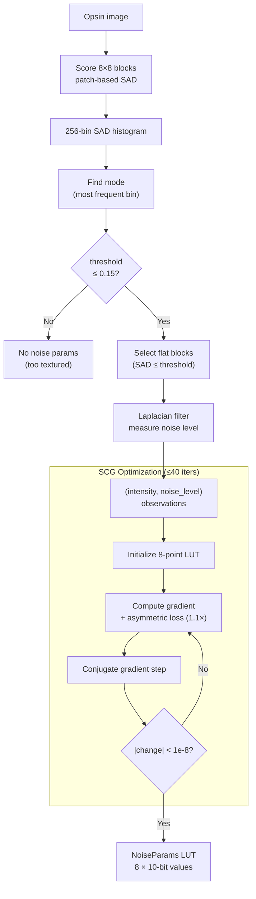

# Noise Synthesis



Noise synthesis estimates the film/photon noise characteristics of the source
image, encodes them as an 8-point intensity-to-noise lookup table, and
re-synthesizes matching noise at the decoder. This preserves the perceived
texture of the original without wasting bits encoding actual noise.

Source: `noise.h`, `enc_noise.h`, `enc_noise.cc`, `enc_optimize.h`

## NoiseParams

An 8-point LUT mapping intensity to noise strength:
```
lut: std::array<float, 8>    // kNumNoisePoints = 8
```

Encoded as 8 × 10-bit unsigned integers: `round(value × kNoisePrecision)`,
where `kNoisePrecision = 1024`. Total: 80 bits.

## Estimation Pipeline

### Step 1: SAD Scoring

For each 8×8 block, compute SAD between every 3×4 sub-patch and a center 3×4
reference patch. The input signal is `0.5×(X+Y)` from the opsin
representation. Sort all sub-patch SADs, take the mean of the lower half
(ROAD-like robust estimator). Lower score = flatter block.

### Step 2: Threshold Detection

Build a 256-bin histogram of SAD scores. The mode (most frequent bin) is the
representative "flat" value. Threshold = `mode / 256`.

If threshold > 0.15 (strong texture) or ≤ 0.0: abandon noise estimation,
return no parameters.

### Step 3: Noise Level Measurement

For each block where SAD ≤ threshold (flat blocks):

**Mean intensity**: Average of `0.5×(X+Y)` over the 8×8 block.

**Noise level**: Apply a 3×3 Laplacian-like filter:
```
[-0.25, -1.0, -0.25]
[-1.0,   5.0, -1.0 ]
[-0.25, -1.0, -0.25]
```

The mean absolute filtered value over the block is the noise level. Boundary
pixels use reflection.

### Step 4: Curve Fitting

The 8-point LUT is fitted using Scaled Conjugate Gradient optimization
(Moller 1993):

```
loss = Σ_observations [ asym × (F(intensity) − noise_level)² ]
     + kReg × num_obs × Σᵢ [ (w[i] − w[i+1])² ]
```

where:
- `asym = 1.0` if undershoot (F(x) < noise_level), `1.1` if overshoot
- The regularization term (`kReg = 0.005`) penalizes differences between
  adjacent LUT entries, encouraging smoothness
- `F(intensity)` linearly interpolates between the two nearest LUT entries
  using `IndexAndFrac` (scaled by `(kNumNoisePoints − 2) / 1.0 = 6`)

**Optimization**: 40 max iterations, precision 1e-8. Initialized with all LUT
entries set to the mean observed noise level.

After optimization: LUT values multiplied by `quality_coef × 1.4`, clamped to
[0, kNoiseLutMax ≈ 0.9995]. If final loss per observation exceeds `kMaxError`
(1e-3), the model is abandoned (all entries cleared).

## Activation

Noise synthesis is effectively never auto-enabled: `kMinButteraugliForNoise = 99.0`.
It is only activated via:
- `cparams.photon_noise_iso` — simulated photon noise model
- Manual noise parameters via API

When active, noise is signaled in the frame header flags (`kNoise`) and
added during decoding via the render pipeline's noise stage.
