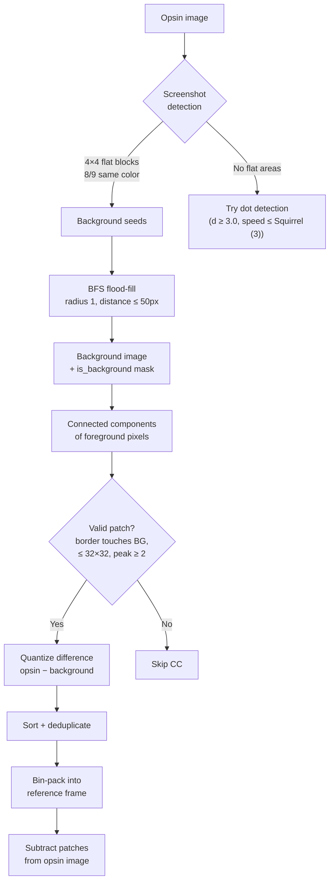

# Patch Dictionary

Patches handle screenshot-like images with sharp foreground elements (text,
icons) on flat backgrounds. The encoder detects these elements, encodes them
as a dictionary of reusable patterns in a reference frame, and subtracts them
from the main image before VarDCT encoding.

Source: `dec_patch_dictionary.h`, `enc_patch_dictionary.h`,
`enc_patch_dictionary.cc`

## Screenshot Detection

The encoder looks for 4×4 pixel blocks where all 16 pixels have the same color
AND at least 8 of 9 surrounding 4×4 blocks share that color. These "flat
areas" indicate screenshot content.

If no flat areas found and patches not explicitly forced, the encoder tries
**dot dictionary** detection instead (enabled at speed ≤ Squirrel (3),
distance ≥ 3.0).

## Patch Extraction

### Background Flood-Fill

Starting from screenshot-detected seed pixels, BFS with radius 1 propagates to
"similar" neighbors (weighted color distance ≤ 0.8). Manhattan distance limit
of 50 pixels from the source. Builds a `background` image and `is_background`
mask.

### Connected Components

For each non-background pixel, find its 8-connected component. Skip CCs where:
- No border pixel touches the background
- Border pixels are not all similar (threshold 0.03)
- Bounding box exceeds 32×32 (`kMaxPatchSize`)

### Patch Quantization

For each valid CC, store `opsin − background_color` quantized to int8 via
channel-specific dequant factors:

**XYB mode:**
- `kChannelDequant = {0.01615, 0.08875, 0.1922}`
- `kChannelWeights = {30.0, 3.0, 1.0}`

**Non-XYB mode:**
- `kChannelDequant = {20/255, 22/255, 20/255}`
- `kChannelWeights = {0.017×255, 0.02×255, 0.017×255}`

Skip patches where max quantized absolute value < 2 (`kMinPeak`).

### Deduplication

Sort patches, merge duplicates. Remove patches appearing fewer than 2 times
(`kMinPatchOccurrences`). Remove all patches if the largest is smaller than
20 pixels (`kMinMaxPatchSize`).

## Reference Frame Construction

Patches are bin-packed into a reference frame using first-fit:
- Initial dimensions: `max(largest_patch, sqrt(total_pixels))`
- Grow by factor 1.05 + 1 pixel until all patches fit
- The reference frame is encoded as a separate modular-mode frame
  (reference ID 3, `kPatchFrameReferenceId`) with Gradient predictor

## Patch Subtraction

Before main encoding, `SubtractFrom` removes patch contributions:
- **kAdd mode**: `opsin[pixel] -= reference[pixel]`
- **kReplace mode**: `opsin[pixel] = 0`

## Blending Modes

`PatchBlendMode` supports: kNone, kReplace, kAdd, kMul, kBlendAbove/Below,
kAlphaWeightedAddAbove/Below. The encoder currently only produces **kAdd**
patches for text-like features.

## Encoding

Patches are entropy-coded using ANS with dedicated contexts for:
- Number of reference patches, reference frame ID
- Reference position (x0, y0), patch size
- Occurrence count and positions (delta-coded after first)
- Blending mode, alpha channel selection, clamping flag

## Activation

Patches are detected at speed ≤ Squirrel (3) in non-streaming VarDCT mode. The
frame header `kPatches` flag is set when patches are present.

Dot dictionary is mutually exclusive with patches — patches take priority.
