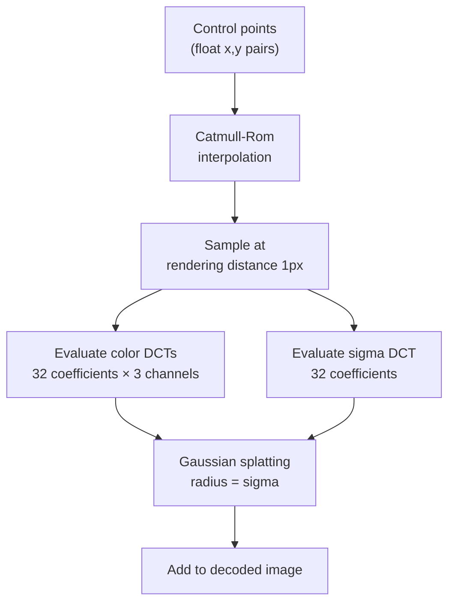

# Splines

Splines encode smooth parametric curves with Gaussian cross-sections. Each
spline carries a color profile (in XYB) and width parameter along its length,
encoded as 32-coefficient DCTs. The decoder renders splines by splatting
Gaussian blobs along the curve.

Source: `splines.h`, `enc_splines.h`, `enc_splines.cc`

## Key Types

### Spline (Unquantized)

- `control_points` — vector of (x,y) float points
- `color_dct[3]` — three 32-entry DCT coefficient arrays for X, Y, B color
- `sigma_dct` — 32-entry DCT for Gaussian splat width

### QuantizedSpline

Integer-quantized for bitstream encoding:
- `control_points_` — (int64_t, int64_t) pairs, **double-delta encoded**
  (delta of deltas between consecutive points)
- `color_dct_[3][32]` — integer DCT coefficients
- `sigma_dct_[32]` — integer sigma DCT coefficients

### SplineSegment (Rendering Unit)

Pre-computed for one row of a Gaussian splat:
- `center_x, center_y` — position on the spline
- `maximum_distance` — rendering radius
- `inv_sigma` — 1/σ for the Gaussian
- `color[3]` — XYB color at this point

## Quantization Adjustment

A global `quantization_adjustment` modifies rendering precision:
- Positive: multiply weights by `(1 + adj/8)`
- Negative: divide weights by `(1 − adj/8)`

## Rendering

Splines are rendered by:
1. Evaluating the Catmull-Rom spline through control points
2. Sampling at `kDesiredRenderingDistance = 1.0` pixel intervals
3. At each sample: evaluate color DCTs and sigma DCT
4. Splatting each sample as a normalized Gaussian with the evaluated sigma
5. Applying CfL correlation (y_to_x, y_to_b) during dequantization

## Encoding

When splines are present, the bitstream contains:

1. Number of splines minus 1 (`kNumSplinesContext`)
2. Starting points, delta-encoded (`kStartingPositionContext`)
3. Quantization adjustment, signed (`kQuantizationAdjustmentContext`)
4. Per spline:
   - Number of control points (`kNumControlPointsContext`)
   - Control point deltas as signed pairs (`kControlPointsContext`)
   - 3 × 32 color DCT coefficients, signed (`kDCTContext`)
   - 32 sigma DCT coefficients, signed (`kDCTContext`)

All values entropy-coded with ANS using 6 contexts (`kNumSplineContexts`).

## Automatic Detection

**`FindSplines` is currently unimplemented** — it returns an empty `Splines`
object. The encoder never automatically detects splines from image content.
Splines can only be injected programmatically through the API.

Detection is gated on speed ≤ Squirrel in non-streaming mode, but since the
function returns empty, the gate is effectively a no-op.
