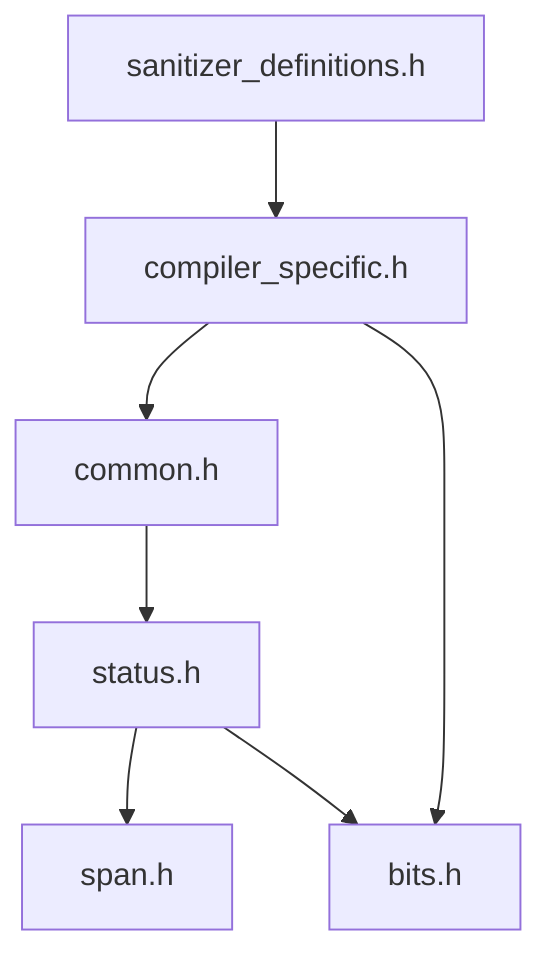

# Base Primitives

These six header files form the absolute foundation of libjxl. Every module in the
encoder, decoder, and tooling depends on them. `status.h` alone is included by
268 files.



## Source Files

| File | Lines | Purpose |
|------|-------|---------|
| `base/compiler_specific.h` | 218 | Compiler detection, portable attributes (`JXL_INLINE`, `JXL_RESTRICT`, etc.) |
| `base/sanitizer_definitions.h` | 44 | ASan/MSan/TSan detection flags |
| `base/common.h` | 170 | Constants (`kBitsPerByte`, `kPi`), arithmetic helpers, `uninitialized_vector` |
| `base/status.h` | 388 | Error handling: `StatusCode`, `Status`, `StatusOr<T>`, all error macros |
| `base/span.h` | 84 | `Span<T>` non-owning view, `Bytes` alias |
| `base/bits.h` | 148 | Bit manipulation intrinsics: CLZ, CTZ, `FloorLog2Nonzero`, `CeilLog2Nonzero` |

## Error Handling: Status and StatusOr

libjxl uses a unified error handling system built on `Status` — a 4-byte type that
acts like `bool` but carries error severity information.

### StatusCode

```cpp
enum class StatusCode : int32_t {
    kNotEnoughBytes = -1,  // Non-fatal: streaming decoder can retry
    kOk = 0,              // Success
    kGenericError = 1,    // Fatal
    kUnsupported = 2,     // Fatal
};
```

Negative values are non-fatal (streaming can retry with more data). Positive values
are fatal (unrecoverable). Zero is success.

### Status

```cpp
class JXL_MUST_USE_RESULT Status {
    StatusCode code_;
    // Implicit conversion from bool: true → kOk, false → kGenericError
    // Implicit conversion to bool: true iff code_ == kOk
    // IsFatalError(): true for positive codes (kGenericError, kUnsupported)
};
```

The `[[nodiscard]]` attribute ensures callers can't silently drop a `Status`.

### StatusOr\<T\>

A discriminated union: either holds a `T` (success) or a `StatusCode` (error).
Uses a `union` with a `char placeholder_` to avoid default-constructing `T` in the
error path. Move-only; copy is deleted.

```cpp
StatusOr<Widget> MakeWidget();

Status UseWidget() {
    Widget w;
    JXL_ASSIGN_OR_RETURN(w, MakeWidget());
    // w is now valid
    return true;
}
```

### Error Propagation Macros

The primary mechanism is `JXL_RETURN_IF_ERROR`:

```cpp
Status DoSomething() {
    JXL_RETURN_IF_ERROR(SubStep1());  // early return on error
    JXL_RETURN_IF_ERROR(SubStep2());
    return true;
}
```

The macro evaluates the expression exactly once, checks for error, and early-returns
the same `Status` (preserving the error code). Debug builds print file:line and the
expression text.

| Macro | Behavior |
|-------|----------|
| `JXL_RETURN_IF_ERROR(expr)` | Evaluates `expr`, returns on error with debug info |
| `JXL_QUIET_RETURN_IF_ERROR(expr)` | Same, but no debug message (used in `fields.h`) |
| `JXL_ASSIGN_OR_RETURN(lhs, statusor)` | Extracts value or propagates error |
| `JXL_FAILURE(fmt, ...)` | Returns `Status(kGenericError)` with debug message |
| `JXL_UNSUPPORTED(fmt, ...)` | Returns `Status(kUnsupported)` |
| `JXL_NOT_ENOUGH_BYTES(fmt, ...)` | Returns `Status(kNotEnoughBytes)` |

### Debug vs Release Behavior

| Construct | Debug | Release |
|-----------|-------|---------|
| `JXL_DASSERT(cond)` | Abort with message | No-op |
| `JXL_ENSURE(cond)` | Abort with message | Return `JXL_FAILURE(...)` |
| `JXL_FAILURE(...)` | Print to stderr | Silent (unless `JXL_DEBUG_ON_ALL_ERROR`) |
| `JXL_CRASH_ON_ERROR` | `Abort()` on any fatal | N/A (debug only) |

`Abort()` prints a stack trace (via sanitizer API if available), then calls
`__builtin_trap()` (GCC/Clang) or `__debugbreak()` (MSVC).

## Constants

```cpp
// common.h
constexpr size_t kBitsPerByte = 8;
constexpr double kPi = 3.14159265358979323846264338327950288;
constexpr double kInvLog2e = 0.6931471805599453;  // ln(2), converts log2 → ln
constexpr float kDefaultIntensityTarget = 255;     // nits (cd/m^2)
```

## Arithmetic Helpers

All in `common.h`:

| Function | Formula | Notes |
|----------|---------|-------|
| `DivCeil(a, b)` | `(a + b - 1) / b` | Integer ceiling division |
| `RoundUpTo(x, align)` | `DivCeil(x, align) * align` | Any alignment (not just power-of-2) |
| `RoundUpBitsToByteMultiple(bits)` | `(bits + 7) & ~7` | Round bit count to byte boundary |
| `RoundUpToBlockDim(dim)` | `(dim + 7) & ~7` | Round dimension to 8-pixel block |
| `Clamp1(val, lo, hi)` | Branchless ternary | `JXL_INLINE` |
| `SafeAdd(a, b, &sum)` | `sum = a + b` | Returns false on overflow |

## Bit Manipulation

`bits.h` provides portable CLZ/CTZ intrinsics that dispatch at compile time between
32-bit and 64-bit paths using `SizeTag<sizeof(T)>`:

| Function | Meaning | Notes |
|----------|---------|-------|
| `Num0BitsAboveMS1Bit_Nonzero(x)` | CLZ (count leading zeros) | UB for x == 0 |
| `Num0BitsBelowLS1Bit_Nonzero(x)` | CTZ (count trailing zeros) | UB for x == 0 |
| `FloorLog2Nonzero(x)` | Bit position of highest set bit | `(sizeof(T)*8-1) ^ CLZ(x)` |
| `CeilLog2Nonzero(x)` | Ceiling of log2 | Floor + 1 if not power-of-2 |

GCC/Clang use `__builtin_clz`/`__builtin_ctz`. MSVC uses `_BitScanReverse`/`_BitScanForward`.
On 32-bit MSVC without 64-bit scan intrinsics, 64-bit values are split into two
32-bit halves.

## Span\<T\>

A lightweight non-owning array view (16 bytes on 64-bit):

```cpp
template <typename T>
class Span {
    T* ptr_;
    size_t len_;
    // remove_prefix(n): advances ptr, returns Status (error if n > size)
    // AppendTo(vector): dst.insert(dst.end(), begin(), end())
};
using Bytes = Span<const uint8_t>;
```

Has `reinterpret_cast` constructors guarded by `static_assert(sizeof(U) == sizeof(T))`
for safe byte-level reinterpretation between same-sized types.

## UninitializedAllocator

Skips zero-initialization for trivially copyable types, saving significant time for
large buffer allocations (image planes):

```cpp
template <typename T>
struct UninitializedAllocator : std::allocator<T> {
    static_assert(std::is_trivially_copyable<T>::value, ...);
    void construct(U*, Args&&...) {}  // no-op
    void destroy(U*) {}               // no-op
};

template <typename T>
using uninitialized_vector = std::vector<T, UninitializedAllocator<T>>;
```

## Compiler Portability

`compiler_specific.h` provides portable attribute macros:

| Macro | GCC/Clang | MSVC |
|-------|-----------|------|
| `JXL_INLINE` | `inline __attribute__((always_inline))` | `__forceinline` |
| `JXL_NOINLINE` | `__attribute__((noinline))` | `__declspec(noinline)` |
| `JXL_RESTRICT` | `__restrict__` | `__restrict` |
| `JXL_LIKELY(expr)` | `__builtin_expect(!!(expr), 1)` | `(expr)` |
| `JXL_UNLIKELY(expr)` | `__builtin_expect(!!(expr), 0)` | `(expr)` |
| `JXL_MUST_USE_RESULT` | `[[nodiscard]]` | `[[nodiscard]]` (C++17) |

Compiler version detection: `JXL_COMPILER_GCC`, `JXL_COMPILER_CLANG`,
`JXL_COMPILER_MSVC` — with special handling for Clang (which pretends to be GCC).

Sanitizer detection: `JXL_ADDRESS_SANITIZER`, `JXL_MEMORY_SANITIZER`,
`JXL_THREAD_SANITIZER` (0 or 1). Under sanitizers, `JXL_MAYBE_INLINE` degrades
to `JXL_MAYBE_UNUSED` instead of `JXL_INLINE`.
