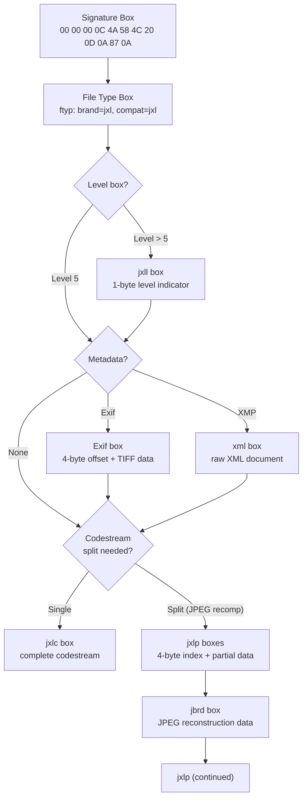

# Container Format



A JPEG XL file is either a **bare codestream** (starting with `0xFF 0x0A`) or a
**container** wrapping the codestream with metadata boxes. The container uses
ISOBMFF (ISO Base Media File Format) box structure with big-endian encoding.

Source: [`encode.cc`](https://github.com/libjxl/libjxl/blob/main/lib/jxl/encode.cc), [`encode_internal.h`](https://github.com/libjxl/libjxl/blob/main/lib/jxl/encode_internal.h), [`decode.cc`](https://github.com/libjxl/libjxl/blob/main/lib/jxl/decode.cc), [`box_content_decoder.cc`](https://github.com/libjxl/libjxl/blob/main/lib/jxl/box_content_decoder.cc)

## When Container Is Required

A bare codestream suffices for simple images. Container format is required when:
- Metadata (Exif, XMP) is present
- JPEG reconstruction data (`jbrd`) is needed
- Codestream level > 5
- Multiple partial codestream boxes are used
- Frame index for random access is needed

```cpp
// encode_internal.h:662
bool MustUseContainer() const {
    return use_container || (codestream_level != 5 && codestream_level != -1) ||
           store_jpeg_metadata || use_boxes;
}
```

## Signature Detection

The decoder identifies the format by reading the first bytes:

| Bytes | Format |
|-------|--------|
| `FF 0A` | Bare codestream |
| `00 00 00 0C 4A 58 4C 20 0D 0A 87 0A` | Container |

The 12-byte container signature contains `CR LF 0x87 LF` — similar to PNG's
line-ending corruption detector.

## Box Structure

Every box has an 8-byte header:

```
[4 bytes: size (big-endian u32)] [4 bytes: type (ASCII)]
[optional: 8 bytes extended size if size field == 1]
[content bytes]
```

**Size rules**:
- Size includes the header itself (minimum 8)
- Size = 1: extended 64-bit size follows (16-byte header total)
- Size = 0: box extends to end of file (unbounded)

```cpp
// encode.cc:362
size_t WriteBoxHeader(const BoxType& type, size_t size,
                      bool unbounded, bool force_large_box, uint8_t* output) {
    // Large box threshold: content > 0xFFFFFFFF - 8
    if (box_size >= kLargeBoxContentSizeThreshold || force_large_box) {
        large_size = true;  // 16-byte header
    }
}
```

## Container Header

The first 32 bytes are fixed for all JPEG XL container files:

```
Offset  Hex                          Meaning
0x00    00 00 00 0C                  Signature box size (12 bytes)
0x04    4A 58 4C 20                  Type: "JXL "
0x08    0D 0A 87 0A                  Signature payload
0x0C    00 00 00 14                  File type box size (20 bytes)
0x10    66 74 79 70                  Type: "ftyp"
0x14    6A 78 6C 20                  Major brand: "jxl "
0x18    00 00 00 00                  Minor version: 0
0x1C    6A 78 6C 20                  Compatible brand: "jxl "
```

```cpp
// encode_internal.h:145
constexpr std::array<unsigned char, 32> kContainerHeader = {
    0, 0, 0, 0xc, 'J', 'X', 'L', ' ', 0xd, 0xa, 0x87, 0xa,
    0, 0, 0, 0x14, 'f', 't', 'y', 'p',
    'j', 'x', 'l', ' ', 0, 0, 0, 0, 'j', 'x', 'l', ' '};
```

## Box Types

### `jxlc` — Complete Codestream

Contains the entire JPEG XL codestream (starting with `0xFF 0x0A`). At most one
per file. Cannot coexist with `jxlp` boxes.

### `jxlp` — Partial Codestream

Splits the codestream across multiple boxes. Each `jxlp` box has a 4-byte
big-endian index prefix before the codestream data:

```
Bits 31:    1 = last box in sequence, 0 = more follow
Bits 0-30:  Sequence number (0-indexed)
```

```cpp
// encode.cc:454
void WriteJxlpBoxCounter(uint32_t counter, bool last, uint8_t* buffer) {
    if (last) counter |= 0x80000000;
    for (size_t i = 0; i < 4; i++) {
        buffer[i] = counter >> (8 * (3 - i)) & 0xff;
    }
}
```

Used for JPEG recompression where `jbrd` must appear between codestream segments.

### `Exif` — EXIF Metadata

Contains EXIF data with a 4-byte TIFF header offset prefix (typically
`00 00 00 00`). The offset indicates the start of the TIFF header within the
box content. Byte order within the TIFF data follows the TIFF header's
endianness marker (`II` or `MM`).

### `xml\x20` — XMP Metadata

Contains raw XMP XML. The box type is `xml` followed by a space (0x20). No
header prefix — the XML document starts immediately.

### `jbrd` — JPEG Reconstruction Data

Contains compressed JPEG metadata for bit-exact reconstruction of the original
JPEG file from a JXL-recompressed version. See the
[JPEG Re-encoding](../features/jpeg-reencoding.md) chapter.

### `jxll` — Codestream Level

Single byte indicating the JXL codestream level. Only present when level > 5.

```
00 00 00 09 6A 78 6C 6C [level]
```

### `jxli` — Frame Index

Provides random-access offsets for keyframes in animations:

```
NF:   Varint    — number of indexed frames
TNUM: u32       — tick numerator
TDEN: u32       — tick denominator
Per frame:
    OFFi: Varint — byte offset from previous frame (codestream bytes)
    Ti:   Varint — duration in ticks
    Fi:   Varint — frames until next indexed frame
```

### `brob` — Brotli-Compressed Box

Wraps another box type's data with Brotli compression. Has a 4-byte prefix
that the decoder skips before decompressing. The original box type is stored
separately (the decoder knows what was compressed).

```cpp
// box_content_decoder.cc:48
if (brob_decode_) {
    next_in += 4;   // skip 4-byte prefix
    BrotliDecoderDecompressStream(brotli_dec, ...);
}
```

## Box Ordering Rules

1. **Signature box** — must be first (bytes 0–11)
2. **File type box** (`ftyp`) — must be second (bytes 12–31)
3. **Level box** (`jxll`) — if present, should appear early
4. **Metadata and codestream boxes** — any order after `ftyp`

Once a `jxlp` box appears, all subsequent codestream data must use `jxlp` —
`jxlc` and `jxlp` cannot be mixed.

```cpp
// decode.cc:1800
if (box_count == 2 && memcmp(box_type, "ftyp", 4) != 0) {
    return JXL_INPUT_ERROR("the second box must be the ftyp box");
}
```
