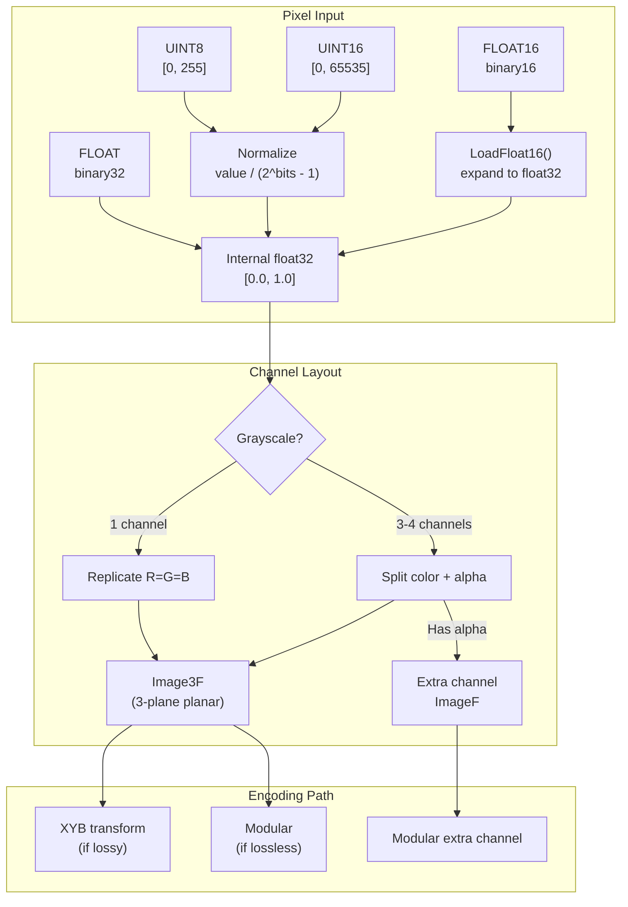

# Input Formats & Extra Channels



The encoder accepts pixels in multiple data types and channel layouts.
Internally, all pixel data is converted to planar float32 for processing.

Source: `enc_external_image.cc`, `image_metadata.h`, `codestream_header.h`

## Pixel Data Types

| JxlDataType | Size | Range | Normalization |
|-------------|------|-------|---------------|
| `JXL_TYPE_UINT8` | 1 byte | [0, 255] | `value / 255.0` |
| `JXL_TYPE_UINT16` | 2 bytes | [0, 65535] | `value / 65535.0` |
| `JXL_TYPE_FLOAT16` | 2 bytes | ±6.1e-5 to ±65504 | Direct conversion |
| `JXL_TYPE_FLOAT` | 4 bytes | Full float32 | Direct |

**Normalization formula** (integer types):
```
scale = 1.0 / ((1ull << bits_per_sample) - 1)
float_value = raw_value * scale
```

The `bits_per_sample` can differ from the data type width. A 12-bit image
stored in UINT16 uses `scale = 1.0 / 4095`, not `1.0 / 65535`. This is
controlled by `JxlBitDepthType`:

- `JXL_BIT_DEPTH_FROM_PIXEL_FORMAT`: use full data type range (default)
- `JXL_BIT_DEPTH_FROM_CODESTREAM`: use `bits_per_sample` from metadata

## Float16 Conversion

Binary16 (half-precision IEEE 754) is expanded to float32 losslessly:

```
sign:     1 bit   (bit 15)
exponent: 5 bits  (bits 14-10), bias 15
mantissa: 10 bits (bits 9-0)

Subnormal (exponent == 0):
    value = (1.0/16384) × (mantissa/1024)

Normalized (exponent ∈ [1, 30]):
    biased_exp32 = biased_exp16 + 112   // shift from bias 15 to 127
    mantissa32 = mantissa16 << 13       // 10 to 23 bits
```

Source: `base/float.h:22-43`

## Endianness

The pixel format specifies byte order via `JxlEndianness`:

```cpp
const bool little_endian =
    (format.endianness == JXL_LITTLE_ENDIAN) ||
    (format.endianness == JXL_NATIVE_ENDIAN && IsLittleEndian());
```

Applies to UINT16, FLOAT16, and FLOAT data types. UINT8 is unaffected.

## Buffer Layout

Pixels are **interleaved** (RGBRGB... or RGBARGBA...), not planar:

```
channel c of pixel (x, y) =
    buffer[y × stride + x × bytes_per_pixel + c × bytes_per_channel]
```

Stride must be at least `width × bytes_per_pixel`. Rows may include
alignment padding beyond the pixel data.

## Grayscale

A grayscale image has `num_color_channels = 1` and `ColorSpace::kGray`.
Internally, the single channel is replicated to all three planes:

```cpp
// enc_external_image.cc:117
if (color_channels == 1) {
    CopyImageTo(color.Plane(0), &color.Plane(1));
    CopyImageTo(color.Plane(0), &color.Plane(2));
}
```

This allows the standard 3-channel VarDCT and modular pipelines to process
grayscale without special-casing. For XYB encoding, the replicated R=G=B
produces near-zero X and B channels (the opponent-color signals vanish when
all cone responses are equal).

**Frame header**: Grayscale frames map all three JPEG components to the Y plane:

```cpp
// frame_header.h:67
if (is_gray) return {{0, 0, 0}};  // all components → Y
```

No chroma subsampling is applied. YCbCr transform is not applicable.

## Extra Channels

Extra channels carry per-pixel data beyond the color channels (alpha, depth,
spot color, etc.). Each channel has independent bit depth and optional
downsampling.

### Types

```cpp
enum ExtraChannel : uint32_t {
    kAlpha = 0,          // Transparency
    kDepth = 1,          // Depth map
    kSpotColor = 2,      // Printer spot color (4 floats: linear RGBA)
    kSelectionMask = 3,  // Selection mask
    kBlack = 4,          // CMYK black
    kCFA = 5,            // Bayer color filter array
    kThermal = 6,        // Thermal imaging
    // 7-14: Reserved
    kUnknown = 15,       // Unknown (decoder warns)
    kOptional = 16,      // Unknown (decoder ignores silently)
};
```

### ExtraChannelInfo

Each extra channel is described in `ImageMetadata`:

```
type:              ExtraChannel enum
bit_depth:         BitDepth (integer 1-32, or float 16/24/32)
dim_shift:         0-3 (channel is 2^dim_shift × downsampled)
name:              UTF-8 string (optional)
alpha_associated:  bool (premultiplied alpha, if kAlpha)
spot_color[4]:     float (linear RGBA, if kSpotColor)
cfa_channel:       uint32 (Bayer index, if kCFA)
```

**Downsampling**: `dim_shift = 1` stores the channel at half resolution in each
dimension. Maximum `1 << dim_shift ≤ 8`.

### Bit Depth

```
BitDepth {
    floating_point_sample: bool
    bits_per_sample:       1-32 (int) or 16/24/32 (float)
    exponent_bits_per_sample: 2-8 (float only)
}
```

Common integer depths (8, 10, 12) have cheap 1-2 bit encodings. Others use a
6-bit field offset by 1.

### Alpha Handling

Alpha is the most common extra channel. In the encoder input:

- **4-channel input** (RGBA): channel 3 is alpha
- **2-channel input** (gray + alpha): channel 1 is alpha
- **3-channel input** with alpha expected: filled with 1.0 (opaque)

```cpp
// enc_external_image.cc:125
if (has_alpha && ib->HasAlpha()) {
    ConvertFromExternalNoSizeCheck(..., format.num_channels - 1, ..., &alpha);
} else if (!has_alpha && ib->HasAlpha()) {
    FillImage(1.0f, &alpha);  // synthesize opaque alpha
}
```

### Lossy + Alpha Encoding

For lossy VarDCT images with alpha:

- **Color channels**: encoded via VarDCT (DCT + quantization)
- **Alpha channel**: encoded via modular path (lossless by default)

The two paths are combined in the same frame. Alpha quality can be controlled
independently (e.g., higher compression for alpha in screenshots where alpha
is mostly 0 or 1).

### Premultiplied Alpha

When `alpha_associated = true`, color values are premultiplied:
`stored_color = original_color × alpha`. The decoder must divide by alpha
to recover the original. This affects blending computations for animation
frames using `BlendMode::kBlend`.
