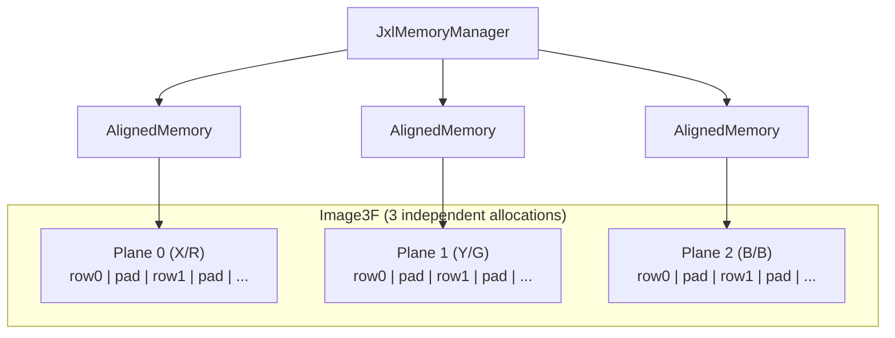

# Memory Model

libjxl stores images in **planar** format: each color channel is a separate, independently
allocated memory region with cache-line-aligned rows and carefully padded strides.
The design prioritizes SIMD-friendly access patterns and avoids cache set conflicts
between planes.



## Source Files

| File | Lines | Purpose |
|------|-------|---------|
| `image.h` | 332 | `Plane<T>`, `Image3<T>`, type aliases |
| `image.cc` | 108 | `PlaneBase` constructor, `Allocate()`, MSAN padding init |
| `memory_manager_internal.h` | 203 | `AlignedMemory`, `kAlignment`, `BytesPerRow()` |
| `memory_manager_internal.cc` | 157 | `BytesPerRow()`, rotation group logic |
| `image_ops.h` | 274 | `CopyImageTo()`, `FillImage()`, `ZeroFillImage()`, etc. |
| `base/rect.h` | 186 | `Rect` — rectangular sub-region accessor |
| `simd_util.cc` | 72 | `MaxVectorSize()` — runtime SIMD width query |

## Plane\<T\> — Single-Channel Image

The fundamental image type. Stores `xsize * ysize` pixels of type `T` with
aligned, padded rows.

```cpp
template <typename ComponentType>
class Plane : public detail::PlaneBase {
    // Allowed T sizes: 1, 2, 4, 8 bytes (static_assert)
    static StatusOr<Plane> Create(JxlMemoryManager*, size_t xsize, size_t ysize);
    T* Row(size_t y);           // aligned row pointer
    ptrdiff_t PixelsPerRow();   // bytes_per_row / sizeof(T)
};

// Common aliases
using ImageF = Plane<float>;     // primary image type throughout libjxl
using ImageB = Plane<uint8_t>;
using ImageI = Plane<int32_t>;
using ImageU = Plane<uint16_t>;
```

Copy is explicitly deleted ("to avoid inadvertent copies, which can be very expensive").
Use `CopyImageTo()` from `image_ops.h` instead. Move is supported.

## Image3\<T\> — Three-Channel Image

Three independently allocated `Plane<T>` objects:

```cpp
template <typename ComponentType>
class Image3 {
    PlaneT planes_[3];  // three separate allocations
    // PlaneRow(c, y): uses planes_[0].bytes_per_row() for ALL planes (optimization)
};

using Image3F = Image3<float>;   // primary 3-channel type (XYB, linear RGB)
```

`PlaneRow(c, y)` computes the row offset once using plane 0's stride and reuses it
for any channel — an optimization that assumes all three planes have identical strides
(guaranteed by construction since they share the same `xsize` and `sizeof(T)`).

## Alignment Constants

```cpp
// memory_manager_internal.h
static constexpr size_t kAlignment = 2 * 64;              // 128 bytes
static constexpr size_t kNumAlignmentGroups = 16;          // rotation groups
static constexpr size_t kAlias = kNumAlignmentGroups * kAlignment;  // 2048 bytes
```

- **`kAlignment = 128`**: Two cache lines. Rationale: "To avoid RFOs, match L2 fill
  size (pairs of lines)."
- **`kAlias = 2048`**: The minimum stride multiple that triggers cache set conflicts
  on x86 store-to-load forwarding (lower 11 address bits).

Row pointers are annotated as `JXL_ASSUME_ALIGNED(ptr, 64)` — a conservative hint
(actual alignment is 128+).

## Row Stride Computation

`BytesPerRow(xsize, sizeof_t)` computes the row stride with three layers of padding:

```
1. valid_bytes = xsize * sizeof_t
2. SIMD padding: valid_bytes += vec_size - sizeof_t
   (allows unaligned SIMD load starting at the last valid pixel)
3. align = max(vec_size, kAlignment)
   bytes_per_row = RoundUpTo(valid_bytes, align)
4. Avoid2K: if bytes_per_row % 2048 == 0, add one `align` unit
```

**Concrete example** — `ImageF` with xsize=100, AVX2 (`vec_size=32`):

```
valid_bytes = 100 * 4 = 400
+ SIMD padding: 400 + 32 - 4 = 428
align = max(32, 128) = 128
bytes_per_row = RoundUpTo(428, 128) = 512
512 % 2048 != 0 → no Avoid2K adjustment
Final: 512 bytes per row (128 float slots for 100 valid pixels)
```

`MaxVectorSize()` returns the runtime SIMD vector width via Highway dynamic dispatch:
`Lanes(HWY_FULL(float)) * sizeof(float)`. Returns 0 (scalar), 16 (SSE), 32 (AVX2),
or 64 (AVX-512).

## The Avoid2K Problem

The CPU's store buffer checks only the lower 11 bits of addresses for store-to-load
forwarding. If consecutive rows have identical lower 11 bits (stride is a multiple
of 2048), reading from row N while row N-1's writes are still in the store buffer
triggers a false dependency stall.

The `BytesPerRow()` function detects this and adds one alignment unit of padding
to break the collision.

## Allocation Rotation

Each `AlignedMemory` allocation gets a different offset within the 2 KiB alias window:

```cpp
// memory_manager_internal.cc
static std::atomic<uint32_t> next_group{0};
group = next_group.fetch_add(1, relaxed) & (kNumAlignmentGroups - 1);  // 0..15
offset = kAlignment * group;  // 0, 128, 256, ..., 1920

address = allocation + pre_padding;
aligned_address = (address & ~(kAlias - 1)) + offset;
if (aligned_address < address) aligned_address += kAlias;
```

This rotation distributes consecutive allocations (like the 3 planes of an `Image3`)
across 16 cache set groups, preventing inter-plane cache conflicts.

## AlignedMemory

Three-pointer design:

```cpp
class AlignedMemory {
    void* allocation_;          // raw pointer from alloc() — passed to free()
    JxlMemoryManager* memory_manager_;
    void* address_;             // aligned, rotated pointer — what users see
};
```

`allocation_` is what the allocator returned. `address_` is the aligned, rotated
pointer offset within that allocation. The gap accommodates alignment headroom
(`kAlias` = 2048 bytes extra allocated) and optional pre-padding.

Move semantics: the source's `memory_manager_` is set to `nullptr` to prevent
double-free.

## Rect — Sub-Region Access

```cpp
template <typename T>
class RectT {
    T x0_, y0_;
    size_t xsize_, ysize_;
    // Row(image, y) → image->Row(y + y0_) + x0_
};
using Rect = RectT<size_t>;
```

**Important**: `Rect::Row()` adds `x0_` to the row pointer, so sub-region pointers
are generally NOT 64-byte aligned. Only full-row pointers from `Plane::Row()` carry
the alignment guarantee.

## Thread Pool

```cpp
class ThreadPool {
    const JxlParallelRunner runner_;
    void* const runner_opaque_;
    // Run(begin, end, init_func, data_func, caller)
};
```

If `runner_` is NULL, runs sequentially on the calling thread. Error propagation
uses `std::atomic<uint32_t> has_error_`. The `RunCallState` inner class adapts
C++ lambdas to the C function pointer callbacks that `JxlParallelRunner` expects.

```cpp
// Usage
RunOnPool(pool, 0, num_groups, ThreadPool::NoInit,
    [&](uint32_t group, size_t thread) {
        EncodeGroup(group, thread);
        return true;
    }, "EncodeGroups");
```

## Image Operations

From `image_ops.h`:

| Function | Description |
|----------|-------------|
| `CopyImageTo(src, dst)` | Row-by-row `memcpy` of `xsize * sizeof(T)` |
| `ZeroFillImage(plane)` | Row-by-row `memset(row, 0, ...)` |
| `FillImage(value, plane)` | Per-pixel fill |
| `ScaleImage(lambda, plane)` | In-place multiply |
| `LinComb(a, img1, b, img2)` | Linear combination → new plane |
| `ShrinkTo(xsize, ysize)` | Reduce reported dimensions without realloc |

`ShrinkTo` allows pre-allocating with padding, then reporting actual valid dimensions.
Does NOT recompute `bytes_per_row_`. Can "un-shrink" up to the original dimensions.

## PaddedBytes

A growable byte buffer backing `BitWriter`, with +8 bytes of padding for safe
64-bit unaligned stores:

```cpp
class PaddedBytes {
    size_t size_, capacity_;
    AlignedMemory data_;
    // reserve(): allocates new_capacity + 8, minimum 64, growth 1.5x
    // BoundsCheck: <= (not <) is safe due to padding
};
```

See [Bit I/O](bit-io.md) for how `BitWriter` exploits the padding guarantee.
