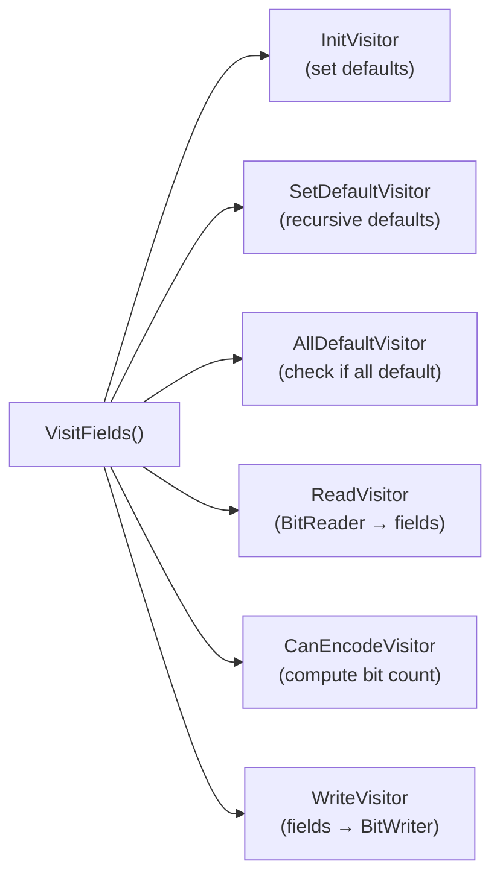
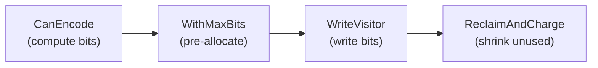

# Serialization

libjxl uses a Visitor pattern for all header serialization. Every serializable struct
implements a single `VisitFields(Visitor*)` method that defines its complete schema —
field order, types, default values, conditional fields, and nesting. Six different
Visitor subclasses reinterpret this one function as initialization, validation,
reading, writing, or size computation.



## Source Files

| File | Lines | Purpose |
|------|-------|---------|
| `field_encodings.h` | 134 | `Fields` base class, `U32Distr`, `U32Enc`, `Val()`, `Bits()`, `BitsOffset()` |
| `fields.h` | 369 | `Visitor` base, `VisitorBase`, `Bundle` namespace, coder declarations |
| `fields.cc` | 595 | `InitVisitor`, `SetDefaultVisitor`, `AllDefaultVisitor`, `ReadVisitor`, `CanEncodeVisitor` |
| `enc_fields.cc` | 253 | `WriteVisitor`, all `*Coder::Write` functions |
| `headers.h/cc` | 300 | `SizeHeader`, `PreviewHeader`, `AnimationHeader` |
| `image_metadata.h/cc` | 917 | `BitDepth`, `ExtraChannelInfo`, `ToneMapping`, `ImageMetadata` |
| `frame_header.h/cc` | 1023 | `FrameHeader`, `BlendingInfo`, `Passes`, `LoopFilter` |

## The Visitor Pattern

Every serializable struct inherits from `Fields` and implements `VisitFields`:

```cpp
Status MyStruct::VisitFields(Visitor* visitor) {
    // 1. AllDefault shortcut — entire struct can be 1 bit
    if (visitor->AllDefault(*this, &all_default)) {
        visitor->SetDefault(this);
        return true;
    }

    // 2. Visit fields in order
    JXL_QUIET_RETURN_IF_ERROR(visitor->Bool(false, &my_bool));
    JXL_QUIET_RETURN_IF_ERROR(visitor->U32(Val(0), Val(1), Bits(4), Bits(8),
                                           0, &my_u32));

    // 3. Conditional fields
    if (visitor->Conditional(my_bool)) {
        JXL_QUIET_RETURN_IF_ERROR(visitor->F16(1.0f, &my_float));
    }

    // 4. Nested bundles
    JXL_RETURN_IF_ERROR(visitor->VisitNested(&nested_bundle));

    // 5. Extensions
    JXL_QUIET_RETURN_IF_ERROR(visitor->BeginExtensions(&extensions));
    return visitor->EndExtensions();
}
```

### The Six Visitors

| Visitor | Purpose | Key behavior |
|---------|---------|-------------|
| `InitVisitor` | Set all fields to defaults | `Conditional()` always returns true; all branches visited |
| `SetDefaultVisitor` | Recursive default init | Like Init but recurses into nested bundles |
| `AllDefaultVisitor` | Check if all fields are default | Compares each field to default via `&=` |
| `ReadVisitor` | Deserialize from BitReader | `AllDefault` → `SetDefault` shortcut |
| `CanEncodeVisitor` | Compute exact bit count | Accumulates `encoded_bits_` without writing |
| `WriteVisitor` | Serialize to BitWriter | Takes pre-computed `extension_bits` |

### The AllDefault Shortcut

The most important serialization optimization. If every field equals its default,
the entire bundle is encoded as a single `1` bit.

- **Writing**: `CanEncodeVisitor` calls `Bundle::AllDefault()` to check. If true,
  only 1 bit is written. Otherwise, `0` + all fields.
- **Reading**: `ReadVisitor` reads 1 bit. If `1`, calls `SetDefault()` and returns
  immediately. If `0`, reads all fields normally.

This is how a default `FrameHeader` (the common case) becomes just 1 bit in the
bitstream.

## Encoding Primitives

### U32 — Variable-Length 32-bit

The most distinctive encoding in JPEG XL. A 2-bit selector chooses among four
distributions:

```
Selector 00 → distribution 0
Selector 01 → distribution 1
Selector 10 → distribution 2
Selector 11 → distribution 3
```

Each distribution is either:
- **`Val(v)`**: Direct value, no extra bits. Total: 2 bits.
- **`BitsOffset(n, offset)`**: Read `n` extra bits, add `offset`. Total: 2 + n bits.
- **`Bits(n)`**: Shorthand for `BitsOffset(n, 0)`.

**Example** — Image dimensions: `BitsOffset(9,1)|BitsOffset(13,1)|BitsOffset(18,1)|BitsOffset(30,1)`
- `00` + 9 bits: 1–512
- `01` + 13 bits: 1–8192
- `10` + 18 bits: 1–262144
- `11` + 30 bits: 1–1073741824

**Example** — Pass count: `Val(1)|Val(2)|Val(3)|BitsOffset(3,4)`
- `00`: 1, `01`: 2, `10`: 3, `11` + 3 bits: 4–11

Encoding selects the distribution with fewest total bits. Direct matches always win
at 2 bits.

### U64 — Variable-Length 64-bit

2-bit selector plus optional varint continuation:

| Selector | Payload | Range | Total bits |
|----------|---------|-------|------------|
| `00` | none | 0 | 2 |
| `01` | 4 bits | 1–16 | 6 |
| `10` | 8 bits | 17–272 | 10 |
| `11` | 12 bits + varint | 273–2^64-1 | 14+ |

Maximum encoded bits: 73 (2 + 12 + 6×9 + 5).

### F16 — Half Precision Float

Always exactly 16 bits (IEEE 754 binary16). NaN and Infinity are rejected.
Subnormals are supported. Range: approximately ±65504.

### Enum Encoding

All enums use: `Val(0)|Val(1)|BitsOffset(4,2)|BitsOffset(6,18)`
- `00` → 0, `01` → 1, `10` + 4 bits → 2–17, `11` + 6 bits → 18–81

After decoding, `EnumValid()` checks the value against a per-type bitmask.

### Bool

Encoded as `Bits(1)` — a single bit.

## Conditional Fields

`Conditional()` does NOT use if/else — both branches must use complementary conditions:

```cpp
if (visitor->Conditional(some_flag)) {
    visitor->Bits(8, 0, &field_a);
}
if (visitor->Conditional(!some_flag)) {
    visitor->Bits(16, 0, &field_b);
}
```

An `else` would prevent `InitVisitor` (which returns `true` for all conditions)
from initializing `field_b`.

## nonserialized Fields

Many structs carry `nonserialized_*` fields that are NOT in the bitstream. They
provide context for conditional encoding:

- `FrameHeader::nonserialized_metadata` → pointer to `CodecMetadata`
- `FrameHeader::nonserialized_is_preview` → is this the preview frame?
- `BlendingInfo::nonserialized_num_extra_channels` → controls alpha_channel field
- `LoopFilter::nonserialized_is_modular` → gates VarDCT-only EPF parameters

These must be set correctly before calling `Bundle::Read` or `Bundle::Write`.

## Extension Mechanism

Forward compatibility via `BeginExtensions`/`EndExtensions`:

**Writing**: `BeginExtensions` writes the `extensions` u64, then per-extension bit counts.

**Reading**: An old decoder reads extension sizes, reads known extensions, then
`EndExtensions` skips any remaining unknown bits.

**Backward**: A new decoder reading an old bitstream sees `extensions == 0` and skips
the entire region.

## Key Headers

### FrameHeader (`frame_header.h:330`)

| Field | Type | Default | Condition |
|-------|------|---------|-----------|
| `frame_type` | Enum | kRegularFrame | always |
| `encoding` | Bool (is_modular) | false (VarDCT) | always |
| `flags` | U64 | 0 | always |
| `color_transform` | Enum | kXYB (if xyb) | !xyb_encoded |
| `upsampling` | U32: `Val(1)\|Val(2)\|Val(4)\|Val(8)` | 1 | !dc_frame |
| `x_qm_scale` | Bits(3) | 3 | VarDCT + XYB |
| `b_qm_scale` | Bits(3) | 2 | VarDCT + XYB |
| `passes` | Nested | (1 pass) | !kReferenceOnly |
| `loop_filter` | Nested | (gab+epf) | always |

### ImageMetadata (`image_metadata.h:201`)

| Field | Type | Default | Notes |
|-------|------|---------|-------|
| `bit_depth` | Nested | 8-bit integer | always |
| `num_extra_channels` | U32 | 0 | `Val(0)\|Val(1)\|BitsOffset(4,2)\|BitsOffset(12,1)` |
| `xyb_encoded` | Bool | true | always |
| `color_encoding` | Nested | — | always |
| `intensity_target` | F16 | 255.0 | if extra_fields |

### LoopFilter (`loop_filter.h:20`)

| Field | Type | Default | Notes |
|-------|------|---------|-------|
| `gab` | Bool | true | Gaborish convolution |
| `epf_iters` | Bits(2) | 2 | Edge-preserving filter: 0=off, 1–3 |
| `gab_custom` | Bool | false | Custom Gaborish weights |
| Gab weights | 6 × F16 | — | if gab_custom |
| EPF params | F16 | — | sharpness, weights, sigma |

## Serialization Flow

### Writing



1. `Bundle::CanEncode()` traverses `VisitFields` to compute exact `total_bits`
   and `extension_bits`
2. `writer->WithMaxBits(total_bits)` pre-allocates the buffer
3. `WriteVisitor` traverses `VisitFields` again, writing each field
4. `Allotment::ReclaimAndCharge()` returns unused bytes to the buffer

Every write does **two full traversals** — one to count, one to write. This is
negligible for headers but matters for deeply nested structures.

### Reading

1. `ReadVisitor` reads the `all_default` bit
2. If `1`: call `SetDefault()`, return (entire header was 1 bit)
3. If `0`: read each field in order, respecting `Conditional()` branches
4. `BeginExtensions`: read per-extension bit counts
5. `EndExtensions`: skip any remaining unknown extension bits

### Codestream Header Structure

Written by `WriteCodestreamHeaders()`:

```
1. Signature: 0xFF 0x0A (16 bits)
2. SizeHeader (image dimensions)
3. ImageMetadata (bit depth, color, extra channels, orientation, animation)
4. CustomTransformData (opsin inverse matrix, upsampling weights)
--- per frame: ---
5. FrameHeader (frame type, encoding, flags, passes, blending, loop filter)
```
