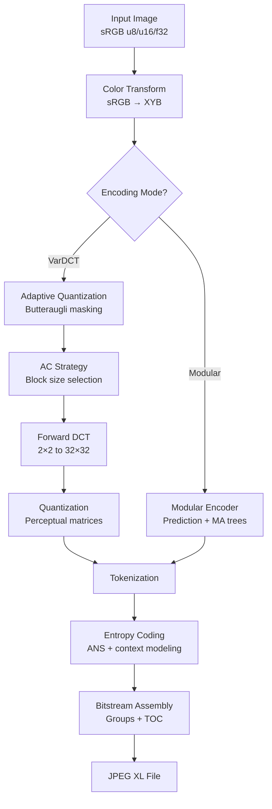

# libjxl Encoder Internals

This book documents the internals of the libjxl JPEG XL encoder — the reference implementation of the JPEG XL standard (ISO/IEC 18181). It covers every major subsystem from low-level primitives through the complete encoding pipeline, with particular focus on the cost functions, decision trees, and heuristics that drive encoding decisions.

## Who This Is For

Engineers who need to understand how the libjxl encoder actually works: what decisions it makes, what math drives those decisions, and where in the source code to find each piece. This is not a tutorial on using the library — it's a map of its internals.

## How to Read This Book

The book is organized bottom-up. Each section builds on the previous:

1. **Foundations** — Core data types, memory layout, serialization, bit I/O
2. **Entropy Coding** — ANS compression, histogram clustering, LZ77
3. **Color Science** — XYB color space, transfer functions, ICC profiles
4. **Transforms & Quantization** — DCT variants, block size selection, quantization matrices
5. **Perceptual Models** — Butteraugli distance, adaptive quantization masking
6. **Modular Coding** — Lossless/near-lossless path with prediction trees
7. **Features** — Patches, splines, noise synthesis, chroma-from-luma
8. **Encoder Pipeline** — How all the pieces fit together, frame encoding flow
9. **Architecture** — SIMD abstraction, render pipeline, threading

## Conventions

- **Source references** use `file.cc:123` format pointing to the libjxl source tree
- **Cost functions** and **decision trees** are called out explicitly — these are the core of encoder intelligence
- **Constants** are copied verbatim from source with their variable names
- **Mermaid diagrams** show data flow and decision logic
- All claims are verified against the source code at the commit this book was built from

## The Encoder at 10,000 Feet

The encoder's job is to find the representation that minimizes perceptual distortion (measured by butteraugli) at a given bit budget. Every major decision — block sizes, quantization levels, coding modes — is driven by cost functions that estimate rate-distortion tradeoffs.
