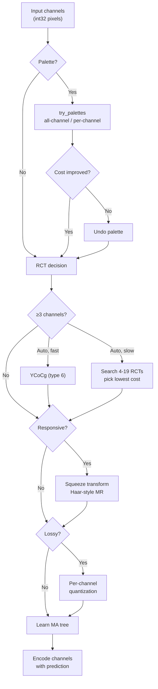

# Modular Encoding Overview



The modular subsystem is JPEG XL's integer coding path. It encodes
multichannel images using reversible transforms (palette, color transform,
multiresolution decomposition) followed by entropy-coded prediction residuals
driven by a learned decision tree. In VarDCT mode it handles DC coefficients,
AC metadata, and quantization tables; in full modular mode it encodes the
entire frame.

Source: `modular/modular_image.h`, `modular/options.h`,
`modular/transform/transform.h`, `modular/encoding/enc_encoding.h`,
`enc_modular.cc`

## When Modular vs VarDCT

The frame header's `encoding` field selects between `kVarDCT` and `kModular`.

**Full modular mode** is used when:
- Lossless encoding is requested
- `cparams.modular_mode` is explicitly set
- Low-effort lossy with squeeze + quantization

**VarDCT mode** still uses modular for:
- DC coefficients
- AC metadata (quantization field, AC strategy, EPF sharpness)
- Quantization weight tables
- Extra channels (alpha, depth, etc.)

## Core Types

### Channel

A single integer-valued plane (`Plane<int32_t>`):
- `w, h` — logical dimensions
- `hshift, vshift` — subsampling factors (`w ≈ image.w >> hshift`)
- `component` — which original component this derived from

### Image

The modular image container:
- `channel` — all channels (meta-channels first, then image channels)
- `transform` — transforms applied (decoder reverses in order)
- `nb_meta_channels` — palette/delta channels prepended by transforms
- `w, h, bitdepth` — image-level metadata

### Transform

Three transform types (`TransformId`):
- **kRCT (0)**: Reversible Color Transform — 42 configurations
- **kPalette (1)**: Indexed color — explicit, implicit, lossy
- **kSqueeze (2)**: Haar-like multiresolution decomposition

Each is a serializable `Fields` struct carrying parameters like `rct_type`,
`nb_colors`, `squeezes` parameters.

## Transform Pipeline

Transforms are applied in this order during encoding (decoder reverses):

1. **Palette** (global) — RGBA→index, per-channel compact
2. **RCT** (global color transform) — YCoCg or best-of-N search
3. **Squeeze** (multiresolution) — only when `responsive` is set
4. **Quantization** (lossy only) — per-channel after squeeze
5. **Per-group transforms** — local palette, per-group RCT search

See the individual chapters for details on each transform:
- [RCT](rct.md) — Reversible Color Transform
- [Squeeze](squeeze.md) — Haar-like spatial decorrelation
- [Palette](palette.md) — Indexed color for small palettes
- [Prediction Trees](prediction-trees.md) — MA tree context prediction

## Encoding Flow

```
ModularGenericCompress(image, opts, writer)
  │
  ├─ Write GroupHeader (transforms, WP header)
  │
  ├─ Build tree:
  │    if kLearn: LearnTree → GatherTreeData + ComputeBestTree
  │    else: PredefinedTree (fixed for DC, AC metadata, etc.)
  │
  ├─ TokenizeTree → encode tree with ANS (6 contexts)
  │
  ├─ ModularCompress(image, tree, tokens)
  │    for each channel:
  │      EncodeModularChannelMAANS()
  │        Fast paths: WP-only LUT, single Gradient leaf, single Zero leaf
  │        General path: MA tree lookup per pixel
  │        Emit Token(context, PackSigned(residual / multiplier))
  │
  ├─ BuildAndEncodeHistograms() for data tokens
  └─ WriteTokens()
```

## Speed Tier Effects

| Feature | Speed Tier |
|---------|-----------|
| Variable predictor (per-pixel via tree) | ≤ Glacier (0) |
| Best-of-19 RCT search | ≤ Tortoise (1) |
| WP mode search (5 modes) | ≤ Tortoise (1) |
| Learned MA tree | ≤ Cheetah (6) |
| Per-group RCT search (4-9 types) | ≤ Hare (5) |
| Fixed tree (Weighted predictor) | Falcon (7) |
| Fixed tree (Gradient predictor) | Thunder (8)+ |

## Key Constants

| Constant | Value | Purpose |
|----------|-------|---------|
| `kMaxTreeSize` | 2²² (4M nodes) | Max MA tree nodes |
| `kNumTreeContexts` | 6 | ANS contexts for tree serialization |
| `kNumNonrefProperties` | 16 | 2 static + 13 spatial + 1 WP |
| `kPropRangeFast` | 8192 | LUT range for fast WP/gradient paths |
| `squeeze_quality_factor` | 0.35 | Base lossy quantization factor |
