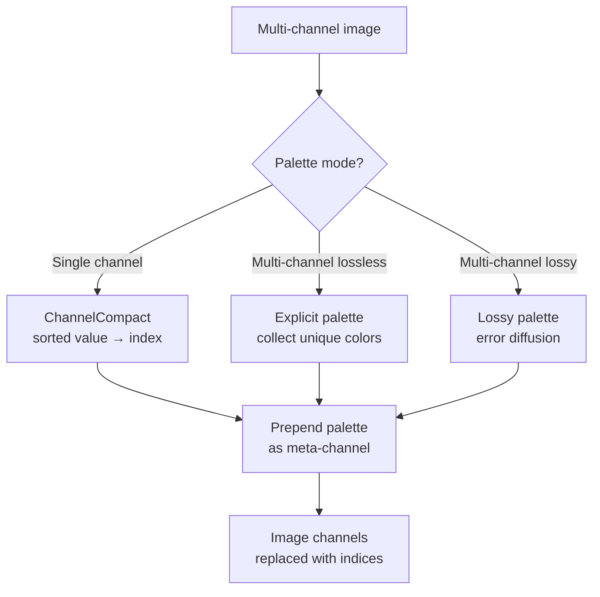

# Palette Transform



The palette transform maps pixel values to indices in a lookup table. Three
distinct modes handle different scenarios: single-channel compaction,
multi-channel explicit palettes for lossless, and lossy palettes with error
diffusion and implicit color quantization.

Source: `modular/transform/enc_palette.h`, `modular/transform/enc_palette.cc`,
`modular/transform/palette.h`

## Single-Channel Palette (ChannelCompact)

When `num_c == 1`: counts distinct values, builds a sorted lookup table, and
replaces pixel values with palette indices.

Falls back to `std::set` when the value range exceeds `kMaxPaletteLookupTableSize`
(65536). Sets the predictor to Zero (indices are best coded directly).

Max colors: `min(nb_pixels/16, channel_colors_percent/100 × value_range)`.

## Multi-Channel Explicit Palette (Lossless)

Scans all pixels to collect unique color tuples. If the distinct count exceeds
`nb_colors`, the transform is rejected.

When `ordered = true`, colors are sorted by luminance: common colors first,
then rare colors from bright to dark.

The palette is prepended as a meta-channel with dimensions
`(nb_colors, nb_component_channels)` and shifts set to −1. The original image
channels are replaced with a single index channel.

Colors that also appear in the implicit palette are tracked to avoid redundancy.

## Lossy Palette

A two-pass approach for lossy quantization:

### Pass 1: Color Analysis

Identifies:
- **Frequent colors**: those forming a cross pattern with frequency > 1% of pixels
- **Frequent deltas**: bucketed by distance, weighted by frequency, top 128 kept
  if weighted frequency > 17

### Pass 2: Index Assignment

For each pixel, evaluates all candidates:
- All explicit palette entries
- All delta entries (added to predictions from prior pixels)
- Implicit palette quantization (both low and high quality cubes)

Uses error diffusion with a 14-tap kernel and 3-row buffer, with
direction-aware cancellation for serpentine scanning.

### Index Penalty Structure

Penalties bias selection toward cheaper (lower-index) options:

| Index Type | Penalty | Notes |
|-----------|---------|-------|
| Index −1 | −124 | Strongly preferred ("repeat" / "transparent") |
| Negative index | −2 × index | Implicit palette entries |
| Delta entry | 250 | Expensive to signal |
| Explicit palette | 150 | Moderate |
| Small-cube implicit | 70 | Cheap quantization |
| Large-cube implicit | 256 | Coarser quantization |

Color distance function weights: R=3, G=5, B=2, with brightness-adaptive
adjustments.

### Implicit Palette

The implicit palette provides quantized colors without explicit storage:

```
kLargeCube = 5    // 5³ = 125 entries (high quality)
kSmallCube = 4    // 4³ = 64 entries (low quality)
kImplicitPaletteSize = 64 + 125 = 189 entries
```

Negative indices encode implicit palette entries. The minimum implicit index
is `−(2 × 72 − 1) = −143`.

## Palette Heuristics

`try_palettes` in `enc_modular.cc` uses `EstimateCost()` (Shannon entropy with
Gradient predictor, 34 contexts) to evaluate palette benefit.

**All-channel palette max colors:**
```
min(cost_before × 0.0005 + nb_pixels/128 + 128, |palette_colors|)
```

At speed ≤ Squirrel (3), transforms are evaluated by comparing estimated cost
before and after. If cost increases, the transform is undone. At faster tiers,
transforms are applied unconditionally.

**Decision order:**
1. All-channel palette (RGBA → index)
2. All-minus-one palette (RGB with separate alpha) — if all-channel fails
   and channels > 3
3. Single-channel compact — per channel
