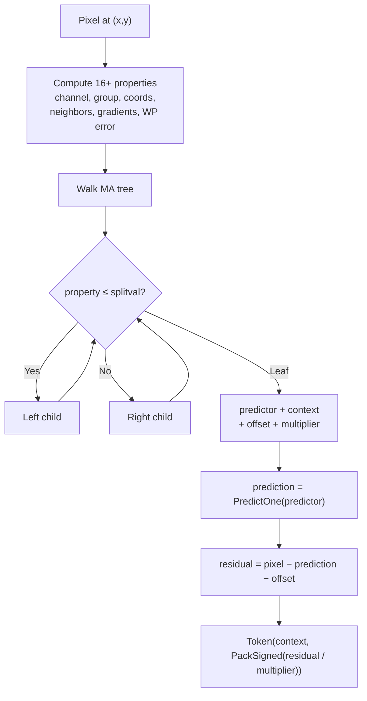

# MA Tree Context Prediction



The MA (meta-adaptive) tree is the core of modular entropy coding. It replaces
fixed context models with a learned decision tree that selects per-pixel: which
predictor to use, which ANS context for the residual, and optional
quantization parameters.

Source: [`modular/encoding/context_predict.h`](https://github.com/libjxl/libjxl/blob/main/lib/jxl/modular/encoding/context_predict.h), [`modular/encoding/dec_ma.h`](https://github.com/libjxl/libjxl/blob/main/lib/jxl/modular/encoding/dec_ma.h),
[`modular/encoding/enc_ma.h`](https://github.com/libjxl/libjxl/blob/main/lib/jxl/modular/encoding/enc_ma.h), [`modular/encoding/enc_ma.cc`](https://github.com/libjxl/libjxl/blob/main/lib/jxl/modular/encoding/enc_ma.cc)

## Properties

Each pixel has 16+ available properties for tree decisions:

| Index | Property | Type |
|-------|----------|------|
| 0 | channel_id | Static |
| 1 | group_id | Static |
| 2 | y coordinate | Spatial |
| 3 | x coordinate | Spatial |
| 4 | \|N\| (abs top) | Spatial |
| 5 | \|W\| (abs left) | Spatial |
| 6 | N (signed top) | Spatial |
| 7 | W (signed left) | Spatial |
| 8 | W − prev_row_gradient | Spatial |
| 9 | W + N − NW | Spatial (gradient) |
| 10 | W − NW | Spatial |
| 11 | NW − N | Spatial |
| 12 | N − NE | Spatial |
| 13 | N − NN | Spatial |
| 14 | W − WW | Spatial |
| 15 | WP error | Weighted predictor |
| 16+ | Reference channel properties | Per-channel (×4) |

Properties 0-1 are static (known before scanning). Properties 2-15 are
computed from the causal neighborhood of the current pixel. Properties 16+
provide cross-channel prediction using already-decoded reference channels.

## Predictors

16 predictor values (14 decoder-side, 2 encoder-only):

| Value | Name | Formula |
|-------|------|---------|
| 0 | Zero | 0 |
| 1 | Left | W |
| 2 | Top | N |
| 3 | Average0 | (W + N) / 2 |
| 4 | Select | JPEG-LS MED variant |
| 5 | Gradient | ClampedGradient(W, N, NW) |
| 6 | Weighted | 4-predictor self-correcting average |
| 7 | TopRight | NE |
| 8 | TopLeft | NW |
| 9 | LeftLeft | WW |
| 10 | Average1 | (W + NW) / 2 |
| 11 | Average2 | (NW + N) / 2 |
| 12 | Average3 | (N + NE) / 2 |
| 13 | Average4 | (6N − 2NN + 7W + WW + NE2 + 3NE + 8) / 16 |
| 14 | Best | Encoder-only: best of Gradient and Weighted |
| 15 | Variable | Encoder-only: per-pixel optimal via tree |

The **Weighted predictor** (6) maintains running error statistics for four
sub-predictors (N, W, NE, gradient) and computes a weighted average where
weights adapt based on recent prediction accuracy.

## Tree Structure

Each tree node (`PropertyDecisionNode`):
- `property` — which property to test (−1 = leaf)
- `splitval` — threshold for `property ≤ splitval`
- `lchild, rchild` — child indices
- `predictor` — used at leaf nodes
- `predictor_offset` — added to prediction at leaf
- `multiplier` — residual divisor at leaf (for lossy quantization)

The `FlatDecisionNode` / `FlatTree` is an optimized decode-time
representation that packs a node and its two children together, reducing
branch mispredictions. The `TRAVERSE_THE_TREE` macro walks two levels per
iteration.

## Tree Learning

`FindBestSplit` ([`enc_ma.cc`](https://github.com/libjxl/libjxl/blob/main/lib/jxl/modular/encoding/enc_ma.cc)) uses greedy top-down splitting:

1. For each candidate node, try all properties and all split values
2. Compute entropy cost (Shannon entropy + extra bits) for left/right halves
3. Pick the split that minimizes total cost below a threshold
4. Penalty for changing predictors: `800 / (100 + threshold)` — discourages
   predictor switches when sample count is low

### Splitting Threshold

```
threshold = 75 + 14 × speed_tier + 10 × decoding_speed_tier
```

Scaled by sample fraction: `threshold × (pixel_fraction × 0.9 + 0.1)`.
Higher = fewer splits = simpler tree = faster decode.

### Property Budget by Speed

| Speed | Properties | Max Quantization Values |
|-------|-----------|----------------------|
| Hare (5) | 4 | 24 |
| Wombat (4) | 5 | 32 |
| Squirrel (3) | 7 | 48 |
| Kitten (2) | 10 | 96 |
| Tortoise (1) | All 16 | 256 |

### Sample Collection

`GatherTreeData` subsamples pixels with Xorshift128+ PRNG:
- Fraction controlled by `nb_repeats` (default 0.5), minimum 1024 pixels
- Samples deduplicated with hash table, counted by frequency
- Properties pre-quantized to at most `max_property_values` distinct values

## Predefined Trees

For non-learned tree kinds:

| Kind | Structure | Use |
|------|----------|-----|
| kTrivialTreeNoPredictor | Single Zero leaf | All-zero data |
| kJpegTranscodeACMeta | Single Zero leaf | JPEG AC metadata |
| kFalconACMeta | Single Left leaf | Fast AC metadata |
| kACMeta | 27-node tree on channel/y/left/top | Default AC metadata |
| kWPFixedDC | Binary tree on WP property, 33 cutoffs | DC at Falcon (7) speed |
| kGradientFixedDC | Binary tree on gradient, 33 cutoffs | DC at Thunder (8) speed |

Fixed trees are reduced for small images: when `log2(pixels) < 14`, a minimum
gap of `8 × (14 − log_px)` is enforced between cutoff indices.

## Predictor Selection by Mode

| Condition | Predictor |
|-----------|-----------|
| Lossless + not responsive + ≤ Glacier (0) | Variable (per-pixel via tree) |
| Responsive or lossy_palette | Zero |
| Lossy + not responsive | Gradient |
| Lossless + speed < Falcon (7) | Best (Gradient or Weighted) |
| Falcon (7) | Weighted |
| Thunder (8)+ | Gradient |

## Fast Paths

`EncodeModularChannelMAANS` has several optimized paths:

- **WP-only LUT**: When the tree uses only the Weighted predictor and property
  values fall within `kPropRangeFast` (8192), a lookup table replaces tree
  traversal
- **Single Gradient leaf**: One context, Gradient predictor — no tree walk
- **Single Zero leaf**: All residuals are raw pixel values
- **Power-of-2 multiplier**: Lossy quantization via bit-shift instead of divide

The general path walks the MA tree for every pixel, which is the most flexible
but slowest.
