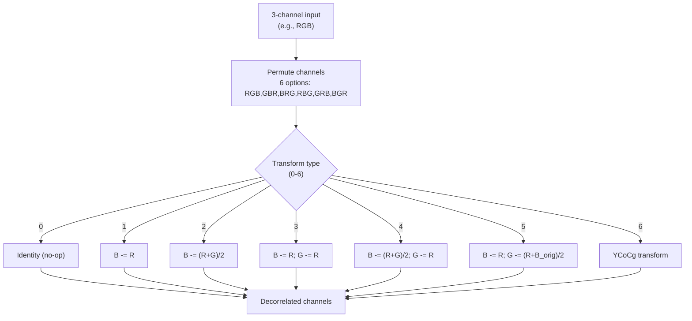

# Reversible Color Transform (RCT)



The Reversible Color Transform decorrelates color channels using lossless
integer arithmetic. There are 42 configurations: 6 channel permutations × 7
transforms.

Source: `modular/transform/enc_rct.h`, `modular/transform/enc_rct.cc`,
`modular/transform/transform.h`

## Configuration Space

The RCT type is encoded as `rct_type = permutation × 7 + transform`.

### Permutations (of 3 input channels)

| Index | Order | Typical use |
|-------|-------|-------------|
| 0 | RGB | Standard |
| 1 | GBR | Green-first decorrelation |
| 2 | BRG | Blue-first |
| 3 | RBG | Swap G↔B |
| 4 | GRB | Swap R↔G |
| 5 | BGR | Reverse |

### Transforms (applied after permutation)

| Index | Operation | Decorrelation |
|-------|-----------|--------------|
| 0 | Identity | None |
| 1 | Second −= First | Simple difference |
| 2 | Second −= (First + Third) / 2 | Median reference |
| 3 | Second −= First; Third −= First | Two-channel subtract |
| 4 | Second −= (First + Third) / 2; Third −= First | Combined |
| 5 | Second −= First; Third −= (First + Second_orig) / 2 | Cross-channel |
| 6 | YCoCg | Luma-chroma decomposition |

### YCoCg (Type 6)

The most commonly used RCT for lossy encoding:

```
Forward:
    Co = R − B
    tmp = B + (Co >> 1)
    Cg = G − tmp
    Y  = tmp + (Cg >> 1)
    output: Y, Co, Cg

Inverse:
    tmp = Y − (Cg >> 1)
    G   = Cg + tmp
    B   = tmp − (Co >> 1)
    R   = Co + B
```

The right-shift division is integer truncation (toward negative infinity).
This is exactly reversible.

## Encoder Selection

### Fast/Lossy Mode

YCoCg (type 6) is applied unconditionally when `colorspace < 0` (auto) and
the mode is lossy or fast.

### Slow Lossless Mode (Per-Group Search)

For lossless at speed ≤ Hare (5) with auto colorspace, the encoder searches RCT
types by estimating cost with `EstimateCost()` — a Shannon entropy estimate
using the Gradient predictor with 34 contexts:

| Speed | Types Tried |
|-------|------------|
| Hare (5) | 4 |
| Wombat (4) | 5 |
| Squirrel (3) | 7 |
| Kitten (2) | 9 |
| Tortoise (1) | 19 |

Search order (by expected usefulness):
```
{0, 6, 5, 10, 26, 40, 12, 19, 8, 4, 9, 15, 16, 17, 32, 33, 2, 1, 3}
```

Identity (0) and YCoCg (6) are always tried first. The lowest-cost RCT is
applied per group, meaning different spatial regions can use different color
transforms.

## Implementation

The forward RCT uses Highway SIMD for vectorized row processing. Each
permutation reorders the channel pointers, then the transform is applied
element-wise using SIMD integer arithmetic (addition, subtraction,
arithmetic right-shift).

The transform is applied to `begin_c` through `begin_c + num_c - 1` channels
in the modular `Image`. For a standard 3-channel color image: `begin_c = 0`,
`num_c = 3`.
