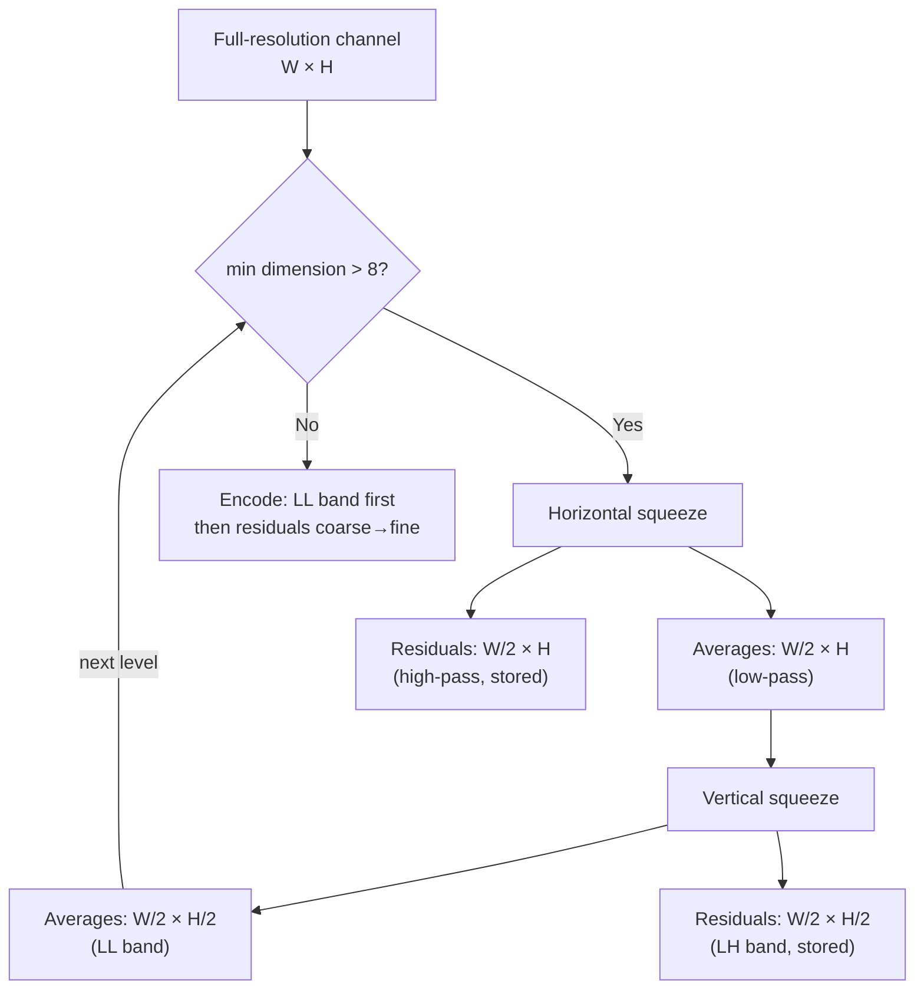

# Squeeze (Haar-Style Multiresolution)



Squeeze implements a modified Haar wavelet decomposition with a
smoothness-aware tendency correction. It decomposes each channel into
progressive resolution levels, enabling coarse-to-fine decoding and
decorrelating spatial redundancy.

Source: [`modular/transform/enc_squeeze.h`](https://github.com/libjxl/libjxl/blob/main/lib/jxl/modular/transform/enc_squeeze.h), [`modular/transform/enc_squeeze.cc`](https://github.com/libjxl/libjxl/blob/main/lib/jxl/modular/transform/enc_squeeze.cc),
[`modular/transform/squeeze.cc`](https://github.com/libjxl/libjxl/blob/main/lib/jxl/modular/transform/squeeze.cc), [`modular/transform/squeeze_params.h`](https://github.com/libjxl/libjxl/blob/main/lib/jxl/modular/transform/squeeze_params.h)

## Horizontal Squeeze

For each pair of pixels at positions (2x, 2x+1):

```
avg = AVERAGE(A, B)                    // ceiling-biased: (A + B + 1) >> 1
diff = A − B
tendency = SmoothTendency(left_neighbor, avg, next_avg)
residual = diff − tendency
```

The `SmoothTendency()` function applies a cubic interpolation correction to
remove predictable low-frequency content from the difference signal. It
ensures monotonicity constraints to avoid overshooting — if the three points
(left, center, right) don't form a monotonic or concave sequence, the tendency
is forced toward zero.

The channel is split in-place: the left half stores averages, the right half
stores residuals.

## Vertical Squeeze

Same algorithm applied vertically. For each pair of rows at positions
(2y, 2y+1), the same AVERAGE/diff/tendency computation produces a low-pass
row and a residual row.

## Default Parameters

`DefaultSqueezeParameters` generates the squeeze script automatically:

1. **Chroma squeeze first**: If ≥ 3 channels share the same dimensions,
   squeeze channels 1-2 (chroma) horizontally then vertically. This yields a
   4:2:0-like structure for progressive preview decoding.

2. **All channels together**: Alternating horizontal and vertical squeezes
   until the smallest dimension ≤ 8 pixels.

3. **Tall image correction**: If height > width, add an extra vertical squeeze
   first to balance the aspect ratio.

The `in_place` flag controls residual placement:
- `in_place = false` (chroma squeeze): residual channels are appended
- `in_place = true` (all-channel squeeze): residuals inserted adjacent

## Lossy Quantization

When `responsive` mode is active with lossy quality, squeeze residuals are
quantized per-channel after the decomposition:

```
squeeze_quality_factor = 0.35     // base factor
squeeze_luma_factor    = 1.1      // luma quality bias
```

Quality tables differ for luma, chroma, and XYB channels. The quantization
step is derived from `cparams.butteraugli_distance` and the channel's
resolution level — coarser levels get larger quantization steps.

## Activation

Squeeze is applied when:
- `cparams.responsive == true` AND
- There are spare bits: `max_bitdepth + 2 < level_max_bitdepth`

The `responsive` flag defaults to:
- Off (0) for lossless mode
- On (1) for lossy mode

If a squeeze step would reduce a channel to zero dimensions, the squeeze
script is truncated at that point.
