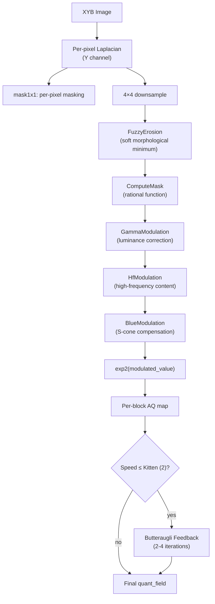
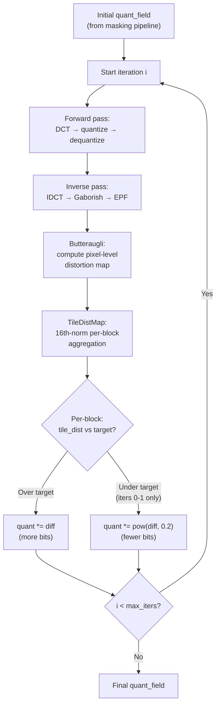

# Adaptive Quantization



The adaptive quantization system computes a per-block quantization map that
allocates more bits to perceptually sensitive areas (smooth gradients, dark
regions, blue-dominant content) and fewer bits to areas where the eye is less
sensitive (high-frequency textures, bright highlights). It is one of the
primary drivers of compression efficiency.

Source: [`enc_adaptive_quantization.cc`](https://github.com/libjxl/libjxl/blob/main/lib/jxl/enc_adaptive_quantization.cc) (1292 lines), [`enc_adaptive_quantization.h`](https://github.com/libjxl/libjxl/blob/main/lib/jxl/enc_adaptive_quantization.h)

## The Masking Pipeline

All modulations operate in log-space (as exponents), then `2^x` converts to a
multiplicative quantization field. This means additive adjustments in the
pipeline translate to multiplicative changes in quantization.

### Step 1: Laplacian and Per-Pixel Masking

For each Y-channel pixel, compute a local gradient measure:

```
base = average of 4 neighbors
gammac = RatioOfDerivativesOfCubicRootToSimpleGamma(pixel + 0.019)
diff = |gammac × (pixel - base)|
mask1x1[x,y] = 1.0 / (log1p(diff) + 0.01)
```

The `gammac` factor bridges XYB's cubic root (γ=3.0) to butteraugli's perceptual
γ≈2.6. The magic offset 0.019 was empirically tuned to match the derivative ratio
between the two gamma curves.

### Step 2: 4×4 Downsample to Block Level

Same Laplacian but squared, clamped to 0.2, then `MaskingSqrt`:

```
kMul      = 211.67e8
kLogOffset = 27.506
MaskingSqrt(v) = 0.25 × sqrt(v × sqrt(kMul) + kLogOffset)
```

The square root compression maps the wide dynamic range of gradient magnitudes
into a more uniform range suitable for the subsequent masking steps.

### Step 3: Fuzzy Erosion

A soft morphological erosion on the 2× downsampled mask. In each 3×3 neighborhood,
find the 4 smallest values and compute a weighted sum:

```
kMulBase = {0.125, 0.1, 0.09, 0.06}
kMulAdd  = {0.0, -0.1, -0.09, -0.06}     // quality-dependent
kTotal   = 0.2996

weights[i] = kMulBase[i] + kMulAdd[i] × quality_factor
output = sum(weights[i] × sorted_mins[i]) / kTotal
```

The erosion prevents over-masking at texture boundaries — it pulls the mask
toward the local minimum, ensuring that a smooth region adjacent to texture
doesn't get treated as textured.

### Step 4: ComputeMask (Rational Function)

Converts raw AQ values to masking exponents:

```
kBase    = -0.7647
kMul0    = 0.8006
kMul2    = 17.350
kMul3    = 6.794
kMul4    = 9.471
kOffset2 = 302.60
kOffset3 = 3.718
kOffset4 = 0.25 × kOffset3

v1 = max(out_val × kMul0, 1e-3)
mask = kBase + kMul4/(v1² + kOffset4) + kMul2/(v1 + kOffset2) + kMul3/(v1² + kOffset3)
```

This rational function has several terms with different scales:
- `kMul4/(v1² + kOffset4)` dominates at small v1 (smooth areas → high masking)
- `kMul3/(v1² + kOffset3)` contributes at medium v1
- `kMul2/(v1 + kOffset2)` provides a slow linear-denominator decay at large v1
- `kBase = -0.7647` sets the asymptotic floor

The result: smooth areas get high masking values (allocate more bits), textured
areas get low values (allocate fewer bits).

### Step 5: GammaModulation (Luminance-Dependent)

For each 8×8 block, compute the average derivative ratio across the LMS-like channels:

```
kBias = 0.16
for each pixel:
    r = (xyb_y + kBias) - xyb_x     // L-like cone signal
    g = (xyb_y + kBias) + xyb_x     // M-like cone signal
    overall_ratio += RatioOfDerivatives(r) + RatioOfDerivatives(g)

overall_ratio *= 0.5 / 64    // average over block and channels
kGamma = 0.1006
out_val += kGamma × log2(overall_ratio)
```

This adjusts for the eye's varying contrast sensitivity with luminance. Dark
areas get boosted (the derivative ratio is larger in darks due to the cubic
root response), receiving more bits.

### Step 6: HfModulation (High-Frequency Content)

Measures local pixel variation using 4-connected differences:

```
valmin_y = 0.0206     // clamp threshold
kMul_y   = -0.38      // negative = HF content REDUCES quantization
kOffset  = 0.42

for each pixel in block:
    sum_y += min(valmin_y, |pixel - right_neighbor|)
    sum_y += min(valmin_y, |pixel - bottom_neighbor|)

out_val += kMul_y × sum_y + kOffset
```

The negative `kMul_y` means textured blocks get a negative exponent adjustment
→ larger quantization step → fewer bits. This is classic visual masking:
existing detail hides quantization noise.

### Step 7: BlueModulation (S-Cone Compensation)

Increases precision where blue content dominates:

```
kLimit    = 0.01047
kOffset   = 0.00320
kMul      = 0.9059
kMaxLimit = 15.463

for each pixel:
    p_y_effective = p_y + kOffset + |p_x|
    if p_b > p_y_effective:
        sum += min(p_b - p_y_effective, kLimit)

// Anti-saturation: fully blue block gets NO boost
if sum >= 32 × kLimit:
    sum = 64 × kLimit - sum

out_val += kMul × min(sum, kMaxLimit × kLimit)
```

When M and L cones are inactive (dark, saturated blue), S cones become the
dominant spatial vision mechanism. The boost allocates more bits to preserve
spatial detail visible only through the S-cone pathway. The anti-saturation
check prevents wasting bits on uniformly saturated blue.

### Step 8: Final Assembly

```
base_level = 0.48 × scale
kDampenRampStart = 2.0
kDampenRampEnd   = 14.0

dampen = clamp(1.0 - (target - 2.0) / 12.0, 0.0, 1.0)

mul = scale × dampen
add = (1.0 - dampen) × base_level

aq_map[block] = exp2(out_val × 1.4427) × mul + add
```

At high quality (target < 2.0): `dampen = 1.0`, full spatial adaptation.
At low quality (target > 14.0): `dampen = 0.0`, flat `base_level` everywhere
(spatial adaptation wasted on heavily quantized images).

## Butteraugli Feedback Loop (FindBestQuantization)

For speed ≤ Kitten (2), the initial AQ map is refined through iterative
encode-decode-compare cycles. This is the encoder's most important quality
mechanism — it closes the loop between the perceptual model and actual
encoder output.



```
Default: 2 iterations (kDefaultButteraugliIters)
Tortoise (1): 4 iterations (kMaxButteraugliIters)
```

### Per-Iteration Logic

**Iterations 0–1** (`kPow = 0.2`):

For each AC-strategy-aligned tile:
```
if tile_dist > target:
    quant_field *= diff           // increase quant (more bits)
    if unchanged after rounding: quant_field += quantizer.Scale()
elif tile_dist ≤ target:
    quant_field *= pow(diff, 0.2) // gently decrease quant (fewer bits)
```

**Iteration 1** (kOriginalComparisonRound): clamp to prevent oscillation:
```
quant = max(quant, 0.4 × quant + 0.6 × initial_quant)
```

**Iterations 2+** (`kPow = 0.0`): only increase quant where distortion
exceeds target. No quality improvement — just fix remaining hot spots.

### TileDistMap: Per-Block Distortion

Aggregates butteraugli pixel scores using a 16th-norm:

```
kBorderMul = 0.98
kCornerMul = 0.70
kTileNorm  = 1.2

for each pixel in tile + margin:
    xmul = border/corner weighting
    dist_norm += xmul × pixel_diff^16
    pixels += xmul

tile_dist = 1.2 × (dist_norm / pixels)^(1/16)
```

The 16th-norm strongly weights the worst pixels without collapsing to a pure
max. Corner/border weighting slightly de-emphasizes tile edges.

## Quality Mode Dispatch

```
if max_error_mode:
    → FindBestQuantizationMaxError (per-block max error targeting)
elif linear image available AND speed ≤ Kitten (2):
    → FindBestQuantization (butteraugli iterative loop)
else:
    → no refinement (initial quant field used as-is)
```

Speed tiers Hare (5) and above skip the butteraugli feedback loop entirely,
relying on the initial AQ map alone. This is the single largest quality gap
between fast and slow encoding speeds.
