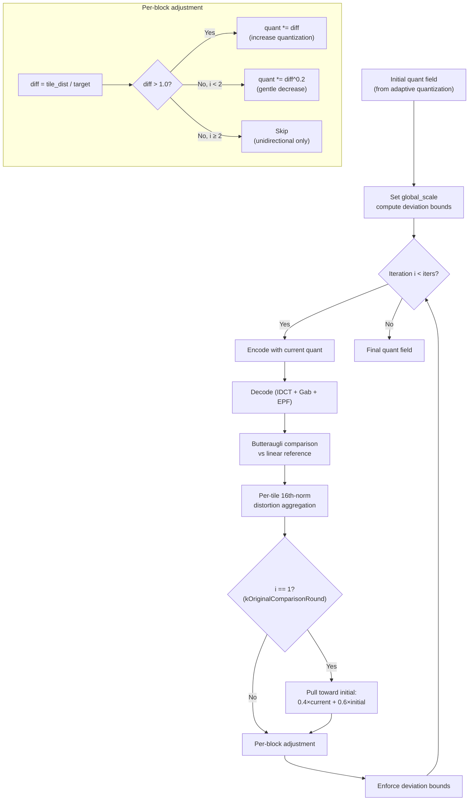

# Butteraugli Feedback Loop



The butteraugli feedback loop iteratively refines the quantization field by
encoding, decoding, measuring perceptual distortion with butteraugli, and
adjusting. This is the highest-quality path in the encoder, producing per-block
quantization that closely matches the target perceptual distance.

Source: `enc_adaptive_quantization.cc:929-1115`

## Speed Tier Gating

| Speed Tier | Iterations | Loop Active |
|------------|-----------|-------------|
| Tortoise (1) | 4 | Yes |
| Kitten (2) | 2 | Yes |
| Squirrel (3)+ | 0 | No |

```cpp
// enc_adaptive_quantization.cc:1282
if (linear && cparams.speed_tier <= SpeedTier::kKitten) {
    FindBestQuantization(...);
}
```

At Hare (5) and faster, the initial adaptive quantization field is used
directly with no iterative refinement.

## FindBestQuantization

```cpp
Status FindBestQuantization(
    const FrameHeader& frame_header,
    const Image3F& linear,         // reference linear RGB image
    const Image3F& opsin,          // current XYB
    ImageF& quant_field,           // per-block quantization (modified)
    PassesEncoderState* enc_state,
    const JxlCmsInterface& cms,
    ThreadPool* pool,
    AuxOut* aux_out);
```

### Initialization

**Deviation bounds** prevent the quant field from diverging during iteration:

```
initial_qf_ratio = qf_max / qf_min
qf_max_deviation_low = sqrt(250 / ratio)
asymmetry = min(2, qf_max_deviation_low)
qf_lower = qf_min / (asymmetry × qf_max_deviation_low)
qf_higher = qf_max × (qf_max_deviation_low / asymmetry)
```

These allow up to 250× dynamic range across blocks while preventing runaway
values.

### Encode-Decode-Compare

Each iteration performs a full encode-decode roundtrip:

```cpp
quantizer.SetQuantField(initial_quant_dc, quant_field, &raw_quant_field);
ImageBundle dec_linear = RoundtripImage(frame_header, opsin, enc_state, ...);
comparator.CompareWith(dec_linear, &diffmap, &score);
```

`RoundtripImage` encodes all groups, then decodes with the full
reconstruction pipeline (dequantization → CfL → IDCT → Gaborish → EPF).

## Tile Distortion Aggregation

The per-pixel butteraugli diffmap is aggregated into per-block tile
distortion:

```
tile_dist = kTileNorm × (dist_norm / pixels)^(1/16)
```

| Constant | Value | Purpose |
|----------|-------|---------|
| `kTileNorm` | 1.2 | Empirical tile weighting |
| `kBorderMul` | 0.98 | Border pixel de-emphasis |
| `kCornerMul` | 0.70 | Corner pixel de-emphasis |

The **16th-norm** strongly weights the worst pixels in each tile without
collapsing to a pure maximum. Borders and corners are de-emphasized to avoid
edge artifacts dominating the score.

Tiles are aligned to AC strategy blocks — a DCT32×32 block produces a single
tile covering 32×32 pixels.

Source: `enc_adaptive_quantization.cc:768-833`

## Per-Iteration Adjustment

### Iterations 0–1: Bidirectional (`kPow = 0.2`)

```
diff = tile_dist / butteraugli_target

if diff > 1.0:
    quant *= diff                  // proportional increase
else:
    quant *= diff^0.2              // dampened decrease
```

The 0.2 exponent means decreases are heavily dampened: a 20% quality surplus
(`diff = 0.8`) only reduces quantization by 4.4% (`0.8^0.2 ≈ 0.956`). This
asymmetry preserves quality — it's much harder to decrease quantization
(allocate fewer bits) than to increase it.

After adjustment, the encoder verifies the raw quant value actually changed
(at least ±1 in integer quant space). If not, it bumps by one quantum step.

### Iteration 1: Clamp Toward Initial (`kOriginalComparisonRound = 1`)

After the first refinement iteration, a stabilization pass pulls the quant
field back toward the initial estimate:

```
clamped = 0.4 × current + 0.6 × initial
if current < clamped: current = clamped
```

This prevents the second half of iterations from oscillating far from the
well-calibrated initial field.

### Iterations 2+: Unidirectional (`kPow = 0.0`)

```
if diff > 1.0:
    quant *= diff    // fix remaining hot spots
else:
    skip             // never decrease
```

Later iterations only increase quantization where distortion still exceeds the
target. Converged blocks are left alone. This monotonic behavior ensures
convergence.

### Bounds Enforcement

After every adjustment:
```
quant = clamp(quant, qf_lower, qf_higher)
```

## Constants

```cpp
constexpr int kDefaultButteraugliIters = 2;   // Kitten
constexpr int kMaxButteraugliIters = 4;       // Tortoise
constexpr int kOriginalComparisonRound = 1;

double kPow[8]    = {0.2, 0.2, 0.0, 0.0, 0.0, 0.0, 0.0, 0.0};
double kPowMod[8] = {0.0, 0.0, 0.0, 0.0, 0.0, 0.0, 0.0, 0.0};
double kInitMul = 0.6;   // stabilization blend weight
```

## Max-Error Mode

An alternative feedback loop used for LfFrame encoding (DC frames at
intermediate levels):

```cpp
// enc_adaptive_quantization.cc:1117
FindBestQuantizationMaxError(...)
```

Instead of butteraugli distance, this targets per-block maximum RGB error:

```
max_error = max(|opsin - decoded|) / threshold
qf_mul = clamp(max_error, 0.5, 1.0)
quant_field *= qf_mul
```

Runs for up to `kMaxButteraugliIters` iterations. The feedback multiplier is
clamped to [0.5, 1.0] for stability.

## Relationship to Adaptive Quantization

The butteraugli loop refines the output of `InitialQuantField()` (documented
in [Adaptive Quantization](adaptive-quantization.md)). The initial field
provides a good starting point from masking-based heuristics. The loop then
calibrates it against actual decoded output.

Without the loop (Hare and faster), the initial field is used directly. The
quality gap between loop-on and loop-off is typically 5–15% in butteraugli
score at the same file size.
