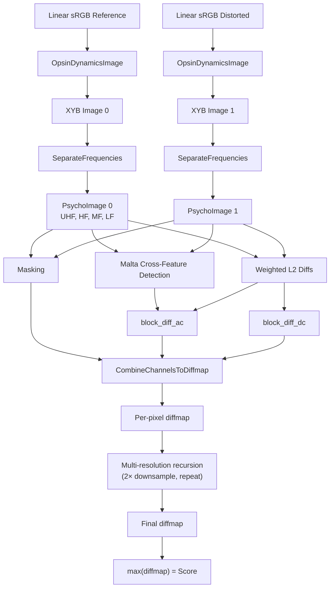

# Butteraugli



Butteraugli is a psychovisual image similarity metric designed by Jyrki
Alakuijala. It decomposes images into frequency bands in a perceptually-motivated
color space, applies visual masking, detects structured errors via oriented
cross-feature detectors (Malta), and aggregates into a single distance score.
It is the quality metric that drives all of JPEG XL's encoding decisions.

Source: `butteraugli/butteraugli.cc` (~2200 lines), `butteraugli/butteraugli.h`

## Pipeline Overview

### Step 1: Opsin Dynamics (RGB → XYB)

NOT the same as the encoder's XYB transform. Butteraugli uses its own opsin
model with local adaptation:

1. **Pre-blur** input RGB with σ=1.2 Gaussian
2. **Opsin absorbance**: 3×3+bias matrix on blurred image (different coefficients
   from the encoder)
3. **Gamma**: `19.245 × ln(v + 9.971) - 23.16` — a log-based function with HDR
   headroom, NOT a power law
4. **Sensitivity**: divide gamma output by the pre-mixed opsin values (local
   adaptation model)
5. **Apply to original**: multiply opsin absorbance of UNBLURRED pixels by
   sensitivity from blurred version
6. **XYB formation**: `X = ch0 - ch1, Y = ch0 + ch1, B = ch2`

The sensitivity step models retinal adaptation — the blur represents the spatial
extent over which the retina adjusts its gain.

### Step 2: Frequency Decomposition

Three successive blur-and-subtract passes:

```
XYB → Blur(σ=7.156) → LF  (converted to "vals" space)
    → remainder      → MF_raw → Blur(σ=3.225) → MF
                              → remainder      → HF_raw → Blur(σ=1.564) → HF
                                                        → remainder      → UHF
```

**Blue excluded from HF/UHF**: only X and Y channels are tracked at high
frequencies, reflecting the sparse S-cone distribution in the retina.

**Range modifications** applied during separation:

| Band | X channel | Y channel |
|------|-----------|-----------|
| MF | Dead zone ±0.29 | Amplify near zero ±0.1 |
| HF | Dead zone ±1.5 | Soft-clamp ±28.47, ×2.155, amplify ±0.132 |
| UHF | Dead zone ±0.04 | Soft-clamp ±5.19, ×2.693 |

After HF separation, `SuppressXByY()` reduces HF X where HF Y has high
activity (chrominance detail invisible in luminance-active regions):

```
suppress = 46.0
s = 0.653
scaler = s + (1-s) × suppress / (Y² + suppress)
```

### Step 3: Masking

`MaskPsychoImage()` builds a single-channel mask from HF/UHF activity:

```
activity = sqrt((2.5 × (uhf_x + hf_x))² + (0.4 × uhf_y + 0.4 × hf_y)²)
```

Then: sqrt-compress → blur (σ=2.7) → fuzzy erosion (step=3, weighted 3-smallest)

The mask determines per-pixel error visibility. Smooth regions get HIGH mask
multipliers (errors visible). Textured regions get LOW multipliers (errors masked).

#### MaskY (AC masking)

```
offset = 0.8296
scaler = 0.4519
mul    = 2.549
c = mul / (scaler × delta + offset)
result = (kGlobalScale × (1 + c))²
```

#### MaskDcY (DC masking)

```
offset = 0.2003
scaler = 3.874
mul    = 0.5051
```

Both return squared multipliers. Higher activity → smaller multiplier → errors hidden.

### Step 4: Difference Accumulation

Three categories:

**DC/LF**: weighted L2 per channel:
```
wmul[6..8] = {29.24, 0.845, 0.704}    // X, Y, B weights for LF
block_diff_dc[c] = wmul[6+c] × (lf0[c] - lf1[c])²
```

**AC via Malta** (cross-feature detector): 6 calls covering MF/HF/UHF × X/Y.
Malta runs 16 oriented line kernels across the difference image, accumulating
sum-of-squares of kernel responses. This detects *structured* errors — a
coherent line of errors produces response proportional to line length squared.

**AC via L2**: weighted per-channel L2 of MF bands and asymmetric HF L2.

### L2 Diff Weights

```
wmul[0] = 400.0     // HF X (asymmetric)
wmul[1] = 1.508     // HF Y (asymmetric)
wmul[3] = 2150.0    // MF X
wmul[4] = 10.62     // MF Y
wmul[5] = 16.22     // MF B
```

HF X weight is 265× the HF Y weight — the red-green opponent channel is
extremely sensitive at high frequencies.

### HF Asymmetry

The `hf_asymmetry` parameter (default 1.0) scales weights differently for
"new artifact" vs "blurred" comparisons:

```
UHF Malta:  w_add = w × hf_asymmetry    w_remove = w / hf_asymmetry
HF Malta:   w_add = w × sqrt(hf_asym)   w_remove = w / sqrt(hf_asym)
```

With `hf_asymmetry > 1.0`, new artifacts are penalized more than blurring.

### Step 5: Combine to Diffmap

For each pixel:
1. Look up mask value
2. Compute `MaskY(val)` for AC and `MaskDcY(val)` for DC
3. Apply xmul to channel 0
4. Sum: `diffmap = sqrt(dc_total + ac_total)`

### Step 6: Multi-Resolution Recursion

`ButteraugliComparator::Make()` recursively creates sub-resolution comparators
(2× downsample) until a dimension drops below 8.

During `Diffmap()`:
```
result *= 0.85
result += 0.5 × subresult    // upsampled from half resolution
```

The recursion extends sensitivity to errors at scales larger than the σ=7.16
LF blur can resolve. For a 4096×4096 image, the comparator creates ~9 levels.

## Score Aggregation

**Max score** (default): `max(diffmap)` — the headline butteraugli score.
Extremely sensitive to single-pixel outliers.

**P-norm** (p=3 in `butteraugli_main`):

```
v  = mean(d³)^(1/3)
v += mean(d⁶)^(1/6)
v += mean(d¹²)^(1/12)
v /= 3
```

Three terms at different powers provide a smooth approximation of the max norm
that still accounts for the spatial extent of errors. The higher-order terms
(d⁶, d¹²) emphasize outliers progressively more.

## Key Constants

| Constant | Value | Purpose |
|----------|-------|---------|
| `kGlobalScale` | 0.07092 | Master scale (1/14.1) |
| σ LF | 7.156 | LF/MF separation |
| σ HF | 3.225 | MF/HF separation |
| σ UHF | 1.564 | HF/UHF separation |
| σ opsin blur | 1.2 | Adaptation pre-blur |
| Gamma function | `19.245 × ln(v + 9.971) - 23.16` | Perceptual nonlinearity |
| `intensity_target` | 80 nits | Default SDR display |
| Mask blur radius | 2.7 | Mask spatial extent |
| `kMaskToErrorMul` | 10.0 | Mask-difference weight |

## Malta Cross-Feature Detector

Malta is NOT a simple pixel-difference metric. It runs 16 oriented line kernels:
- **MaltaTag** (UHF): 9 samples per line, stride 1
- **MaltaTagLF** (HF/MF): 5 samples per line, stride 2

Each kernel sums samples along horizontal, vertical, diagonal, and intermediate
angles. The squared sum of all 16 kernel responses is accumulated per pixel.

Malta weights per band:

| Band | Y weight | Y norm | X weight | X norm |
|------|----------|--------|----------|--------|
| UHF | 1.100 | 71.78 | 173.5 | 5.0 |
| HF | 18.72 | 4,498,534 | 6,924 | 8,051 |
| MF | 37.08 | 130,262,060 | 8,247 | 1,009,003 |

## Relationship to the Encoder

Butteraugli scores drive:
- **AQ masking**: smooth areas get high butteraugli sensitivity → more bits
- **FindBestQuantization**: iterative encode-decode-compare loop adjusts quant_field
  to minimize butteraugli score
- **AC strategy**: cost function includes butteraugli-weighted distortion
- **All multiplier tuning**: encoder constants were optimized against butteraugli

The XYB color space, the opsin absorbance matrix, and the cube-root gamma were
co-designed with butteraugli. This tight coupling is JPEG XL's key architectural
advantage — the codec and the quality metric share the same perceptual model.
